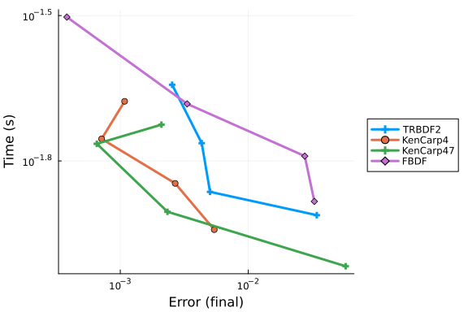

```julia
using OrdinaryDiffEq, DiffEqDevTools, Sundials, ParameterizedFunctions, Plots,
      ODEInterfaceDiffEq, LSODA, SparseArrays, LinearSolve,
      LinearAlgebra, IncompleteLU, AlgebraicMultigrid, Symbolics, ModelingToolkit
gr()

const N = 8

xyd_brusselator = range(0,stop=1,length=N)
brusselator_f(x, y, t) = (((x-0.3)^2 + (y-0.6)^2) <= 0.1^2) * (t >= 1.1) * 5.
limit(a, N) = a == N+1 ? 1 : a == 0 ? N : a
function brusselator_2d_loop(du, u, p, t)
  A, B, alpha, dx = p
  alpha = alpha/dx^2
  @inbounds for I in CartesianIndices((N, N))
    i, j = Tuple(I)
    x, y = xyd_brusselator[I[1]], xyd_brusselator[I[2]]
    ip1, im1, jp1, jm1 = limit(i+1, N), limit(i-1, N), limit(j+1, N), limit(j-1, N)
    du[i,j,1] = alpha*(u[im1,j,1] + u[ip1,j,1] + u[i,jp1,1] + u[i,jm1,1] - 4u[i,j,1]) +
                B + u[i,j,1]^2*u[i,j,2] - (A + 1)*u[i,j,1] + brusselator_f(x, y, t)
    du[i,j,2] = alpha*(u[im1,j,2] + u[ip1,j,2] + u[i,jp1,2] + u[i,jm1,2] - 4u[i,j,2]) +
                A*u[i,j,1] - u[i,j,1]^2*u[i,j,2]
    end
end
p = (3.4, 1., 10., step(xyd_brusselator))

input = rand(N,N,2)
output = similar(input)
sparsity_pattern = Symbolics.jacobian_sparsity(brusselator_2d_loop,output,input,p,0.0)
jac_sparsity = Float64.(sparse(sparsity_pattern))
f = ODEFunction{true, SciMLBase.FullSpecialize}(brusselator_2d_loop;jac_prototype=jac_sparsity)
function init_brusselator_2d(xyd)
  N = length(xyd)
  u = zeros(N, N, 2)
  for I in CartesianIndices((N, N))
    x = xyd[I[1]]
    y = xyd[I[2]]
    u[I,1] = 22*(y*(1-y))^(3/2)
    u[I,2] = 27*(x*(1-x))^(3/2)
  end
  u
end
u0 = init_brusselator_2d(xyd_brusselator)
prob = ODEProblem(f,u0,(0.,11.5),p);
```


```julia
prob_mtk = ODEProblem(modelingtoolkitize(prob),[],(0.0,11.5),jac=true,sparse=true);
```


Also comparing with MethodOfLines.jl:
```julia
using MethodOfLines, DomainSets
@parameters x y t
@variables u(..) v(..)
Dt = Differential(t)
Dx = Differential(x)
Dy = Differential(y)
Dxx = Differential(x)^2
Dyy = Differential(y)^2

∇²(u) = Dxx(u) + Dyy(u)

brusselator_f(x, y, t) = (((x-0.3)^2 + (y-0.6)^2) <= 0.1^2) * (t >= 1.1) * 5.

x_min = y_min = t_min = 0.0
x_max = y_max = 1.0
t_max = 11.5

α = 10.

u0_mol(x,y,t) = 22(y*(1-y))^(3/2)
v0_mol(x,y,t) = 27(x*(1-x))^(3/2)

eq = [Dt(u(x,y,t)) ~ 1. + v(x,y,t)*u(x,y,t)^2 - 4.4*u(x,y,t) + α*∇²(u(x,y,t)) + brusselator_f(x, y, t),
      Dt(v(x,y,t)) ~ 3.4*u(x,y,t) - v(x,y,t)*u(x,y,t)^2 + α*∇²(v(x,y,t))]

domains = [x ∈ Interval(x_min, x_max),
          y ∈ Interval(y_min, y_max),
          t ∈ Interval(t_min, t_max)]

bcs = [u(x,y,0) ~ u0_mol(x,y,0),
      u(0,y,t) ~ u(1,y,t),
      u(x,0,t) ~ u(x,1,t),

      v(x,y,0) ~ v0_mol(x,y,0),
      v(0,y,t) ~ v(1,y,t),
      v(x,0,t) ~ v(x,1,t)]

@named pdesys = PDESystem(eq,bcs,domains,[x,y,t],[u(x,y,t),v(x,y,t)])

# Method of lines discretization

dx = 1/N
dy = 1/N

order = 2

discretization = MOLFiniteDifference([x=>dx, y=>dy], t; approx_order = order, jac = true, sparse = true, wrap = Val(false))

# Convert the PDE system into an ODE problem
prob_mol = discretize(pdesys,discretization)
```

```
ODEProblem with uType Vector{Float64} and tType Float64. In-place: true
timespan: (0.0, 11.5)
u0: 128-element Vector{Float64}:
 0.7957923865311465
 0.7957923865311465
 0.7957923865311465
 0.7957923865311465
 0.7957923865311465
 0.7957923865311465
 0.7957923865311465
 0.7957923865311465
 1.7861773953054048
 1.7861773953054048
 ⋮
 0.0
 0.9766542925609525
 2.1921268033293604
 3.063590342214851
 3.3750000000000004
 3.063590342214851
 2.1921268033293604
 0.9766542925609525
 0.0
```


```julia
using Base.Experimental: Const, @aliasscope
macro vp(expr)
  nodes = (Symbol("llvm.loop.vectorize.predicate.enable"), 1)
  if expr.head != :for
    error("Syntax error: loopinfo needs a for loop")
  end
  push!(expr.args[2].args, Expr(:loopinfo, nodes))
  return esc(expr)
end

struct Brusselator2DLoop <: Function
  N::Int
  s::Float64
end
function (b::Brusselator2DLoop)(du, unc, p, t)
  N = b.N
  s = b.s
  A, B, alpha, dx = p
  alpha = alpha/abs2(dx)
  u = Base.Experimental.Const(unc)
  Base.Experimental.@aliasscope begin
  @inbounds @fastmath begin
    b = ((abs2(-0.3) + abs2(-0.6)) <= abs2(0.1)) * (t >= 1.1) * 5.0
    du1 = alpha*(u[N,1,1] + u[2,1,1] + u[1,2,1] + u[1,N,1] - 4u[1,1,1]) +
      B + abs2(u[1,1,1])*u[1,1,2] - (A + 1)*u[1,1,1] + b
    du2 = alpha*(u[N,1,2] + u[2,1,2] + u[1,2,2] + u[1,N,2] - 4u[1,1,2]) +
      A*u[1,1,1] - abs2(u[1,1,1])*u[1,1,2]
    du[1,1,1] = du1
    du[1,1,2] = du2
    @vp for i = 2:N-1
      x = (i-1)*s
      ip1 = i+1
      im1 = i-1
      b = ((abs2(x-0.3) + abs2(-0.6)) <= abs2(0.1)) * (t >= 1.1) * 5.0
      du1 = alpha*(u[im1,1,1] + u[ip1,1,1] + u[i,2,1] + u[i,N,1] - 4u[i,1,1]) +
        B + abs2(u[i,1,1])*u[i,1,2] - (A + 1)*u[i,1,1] + b
      du2 = alpha*(u[im1,1,2] + u[ip1,1,2] + u[i,2,2] + u[i,N,2] - 4u[i,1,2]) +
        A*u[i,1,1] - abs2(u[i,1,1])*u[i,1,2]
      du[i,1,1] = du1
      du[i,1,2] = du2
    end
    b = ((abs2(0.7) + abs2(-0.6)) <= abs2(0.1)) * (t >= 1.1) * 5.0
    du1 = alpha*(u[N-1,1,1] + u[1,1,1] + u[N,2,1] + u[N,N,1] - 4u[N,1,1]) +
      B + abs2(u[N,1,1])*u[N,1,2] - (A + 1)*u[N,1,1] + b
    du2 = alpha*(u[N-1,1,2] + u[1,1,2] + u[N,2,2] + u[N,N,2] - 4u[N,1,2]) +
      A*u[N,1,1] - abs2(u[N,1,1])*u[N,1,2]
    du[N,1,1] = du1
    du[N,1,2] = du2
    for j = 2:N-1
      y = (j-1)*s
      jp1 = j+1
      jm1 = j-1
      b0 = ((abs2(-0.3) + abs2(y-0.6)) <= abs2(0.1)) * (t >= 1.1) * 5.0
      du[1,j,1] = alpha*(u[N,j,1] + u[2,j,1] + u[1,jp1,1] + u[1,jm1,1] - 4u[1,j,1]) +
        B + abs2(u[1,j,1])*u[1,j,2] - (A + 1)*u[1,j,1] + b0
      du[1,j,2] = alpha*(u[N,j,2] + u[2,j,2] + u[1,jp1,2] + u[1,jm1,2] - 4u[1,j,2]) +
        A*u[1,j,1] - abs2(u[1,j,1])*u[1,j,2]
      @vp for i = 2:N-1
        x = (i-1)*s
        b = ((abs2(x-0.3) + abs2(y-0.6)) <= abs2(0.1)) * (t >= 1.1) * 5.0
        du1 = alpha*(u[i-1,j,1] + u[i+1,j,1] + u[i,jp1,1] + u[i,jm1,1] - 4u[i,j,1]) +
          B + abs2(u[i,j,1])*u[i,j,2] - (A + 1)*u[i,j,1] + b
        du2 = alpha*(u[i-1,j,2] + u[i+1,j,2] + u[i,jp1,2] + u[i,jm1,2] - 4u[i,j,2]) +
          A*u[i,j,1] - abs2(u[i,j,1])*u[i,j,2]
        du[i,j,1] = du1
        du[i,j,2] = du2
      end
      bN = ((abs2(0.7) + abs2(y-0.6)) <= abs2(0.1)) * (t >= 1.1) * 5.0
      du[N,j,1] = alpha*(u[N-1,j,1] + u[1,j,1] + u[N,jp1,1] + u[N,jm1,1] - 4u[N,j,1]) +
        B + abs2(u[N,j,1])*u[N,j,2] - (A + 1)*u[N,j,1] + bN
      du[N,j,2] = alpha*(u[N-1,j,2] + u[1,j,2] + u[N,jp1,2] + u[N,jm1,2] - 4u[N,j,2]) +
        A*u[N,j,1] - abs2(u[N,j,1])*u[N,j,2]
    end
    b = ((abs2(-0.3) + abs2(0.4)) <= abs2(0.1)) * (t >= 1.1) * 5.0
    du1 = alpha*(u[N,N,1] + u[2,N,1] + u[1,1,1] + u[1,N-1,1] - 4u[1,N,1]) +
      B + abs2(u[1,N,1])*u[1,N,2] - (A + 1)*u[1,N,1] + b
    du2 = alpha*(u[N,N,2] + u[2,N,2] + u[1,1,2] + u[1,N-1,2] - 4u[1,N,2]) +
      A*u[1,N,1] - abs2(u[1,N,1])*u[1,N,2]
    du[1,N,1] = du1
    du[1,N,2] = du2
    @vp for i = 2:N-1
      x = (i-1)*s
      ip1 = i+1
      im1 = i-1
      b = ((abs2(x-0.3) + abs2(0.4)) <= abs2(0.1)) * (t >= 1.1) * 5.0
      du1 = alpha*(u[im1,N,1] + u[ip1,N,1] + u[i,1,1] + u[i,N-1,1] - 4u[i,N,1]) +
        B + abs2(u[i,N,1])*u[i,N,2] - (A + 1)*u[i,N,1] + b
      du2 = alpha*(u[im1,N,2] + u[ip1,N,2] + u[i,1,2] + u[i,N-1,2] - 4u[i,N,2]) +
        A*u[i,N,1] - abs2(u[i,N,1])*u[i,N,2]
      du[i,N,1] = du1
      du[i,N,2] = du2
    end
    b = ((abs2(0.7) + abs2(0.4)) <= abs2(0.1)) * (t >= 1.1) * 5.0
    du1 = alpha*(u[N-1,N,1] + u[1,N,1] + u[N,1,1] + u[N,N-1,1] - 4u[N,N,1]) +
      B + abs2(u[N,N,1])*u[N,N,2] - (A + 1)*u[N,N,1] + b
    du2 = alpha*(u[N-1,N,2] + u[1,N,2] + u[N,1,2] + u[N,N-1,2] - 4u[N,N,2]) +
      A*u[N,N,1] - abs2(u[N,N,1])*u[N,N,2]
    du[N,N,1] = du1
    du[N,N,2] = du2
  end
  end
end

function fast_bruss(N)
  xyd_brusselator = range(0,stop=1,length=N)
  brusselator_2d_loop = Brusselator2DLoop(N,Float64(step(xyd_brusselator)))
  p = (3.4, 1., 10., step(xyd_brusselator))

  input = rand(N,N,2)
  output = similar(input)
  sparsity_pattern = Symbolics.jacobian_sparsity(brusselator_2d_loop,output,input,p,0.0)
  jac_sparsity = Float64.(sparse(sparsity_pattern))
  f =  ODEFunction(brusselator_2d_loop;jac_prototype=jac_sparsity)
  u0 = zeros(N, N, 2)
  @inbounds for I in CartesianIndices((N, N))
    x = xyd_brusselator[I[1]]
    y = xyd_brusselator[I[2]]
    u0[I,1] = 22*(y*(1-y))^(3/2)
    u0[I,2] = 27*(x*(1-x))^(3/2)
  end
  return ODEProblem(f,u0,(0.,11.5),p)
end

fastprob = fast_bruss(N)
```

```
ODEProblem with uType Array{Float64, 3} and tType Float64. In-place: true
timespan: (0.0, 11.5)
u0: 8×8×2 Array{Float64, 3}:
[:, :, 1] =
 0.0  0.942661  2.02828  2.66625  2.66625  2.02828  0.942661  0.0
 0.0  0.942661  2.02828  2.66625  2.66625  2.02828  0.942661  0.0
 0.0  0.942661  2.02828  2.66625  2.66625  2.02828  0.942661  0.0
 0.0  0.942661  2.02828  2.66625  2.66625  2.02828  0.942661  0.0
 0.0  0.942661  2.02828  2.66625  2.66625  2.02828  0.942661  0.0
 0.0  0.942661  2.02828  2.66625  2.66625  2.02828  0.942661  0.0
 0.0  0.942661  2.02828  2.66625  2.66625  2.02828  0.942661  0.0
 0.0  0.942661  2.02828  2.66625  2.66625  2.02828  0.942661  0.0

[:, :, 2] =
 0.0      0.0      0.0      0.0      0.0      0.0      0.0      0.0
 1.1569   1.1569   1.1569   1.1569   1.1569   1.1569   1.1569   1.1569
 2.48926  2.48926  2.48926  2.48926  2.48926  2.48926  2.48926  2.48926
 3.27221  3.27221  3.27221  3.27221  3.27221  3.27221  3.27221  3.27221
 3.27221  3.27221  3.27221  3.27221  3.27221  3.27221  3.27221  3.27221
 2.48926  2.48926  2.48926  2.48926  2.48926  2.48926  2.48926  2.48926
 1.1569   1.1569   1.1569   1.1569   1.1569   1.1569   1.1569   1.1569
 0.0      0.0      0.0      0.0      0.0      0.0      0.0      0.0
```


```julia
sol = solve(prob,CVODE_BDF(),abstol=1/10^14,reltol=1/10^14)
sol2 = solve(prob_mtk,CVODE_BDF(linear_solver = :KLU),abstol=1/10^14,reltol=1/10^14)
sol3 = solve(prob_mol,CVODE_BDF(linear_solver = :KLU),abstol=1/10^14,reltol=1/10^14,wrap=Val(false))
```

```
retcode: Success
Interpolation: 3rd order Hermite
t: 7058-element Vector{Float64}:
  0.0
  1.4238870862469186e-15
  1.4240294749555432e-11
  1.5662900337424728e-10
  2.9901771199893913e-10
  5.160801980854372e-10
  8.725711860953478e-10
  1.4781897810489466e-9
  2.51967504413236e-9
  4.3190349273923755e-9
  ⋮
 11.495034258836297
 11.49566414069192
 11.496294022547543
 11.496923904403166
 11.49755378625879
 11.498183668114413
 11.498813549970036
 11.499443431825659
 11.5
u: 7058-element Vector{Vector{Float64}}:
 [0.7957923865311465, 0.7957923865311465, 0.7957923865311465, 0.79579238653
11465, 0.7957923865311465, 0.7957923865311465, 0.7957923865311465, 0.795792
3865311465, 1.7861773953054048, 1.7861773953054048  …  0.9766542925609525, 
0.0, 0.9766542925609525, 2.1921268033293604, 3.063590342214851, 3.375000000
0000004, 3.063590342214851, 2.1921268033293604, 0.9766542925609525, 0.0]
 [0.7957923865313211, 0.7957923865313222, 0.795792386531323, 0.795792386531
3233, 0.795792386531323, 0.7957923865313222, 0.7957923865313211, 0.79579238
65313202, 1.786177395305144, 1.7861773953051494  …  0.9766542925611731, 1.7
838787595843077e-12, 0.9766542925611701, 2.192126803329047, 3.0635903422143
41, 3.374999999999433, 3.063590342214341, 2.192126803329047, 0.976654292561
1701, 1.7800261566757713e-12]
 [0.7957923882778083, 0.7957923882887697, 0.7957923882966287, 0.79579238829
94371, 0.7957923882966287, 0.7957923882887697, 0.7957923882778083, 0.795792
3882690007, 1.7861773926974722, 1.7861773927526943  …  0.9766542947672135, 
1.784057118969317e-8, 0.9766542947374913, 2.1921268001941354, 3.06359033711
06386, 3.374999994323757, 3.0635903371106386, 2.1921268001941354, 0.9766542
947374913, 1.780204130956131e-8]
 [0.7957924057426853, 0.7957924058632492, 0.7957924059496904, 0.79579240598
05794, 0.7957924059496904, 0.7957924058632492, 0.7957924057426853, 0.795792
4056458101, 1.786177366620756, 1.7861773672281442  …  0.9766543168276247, 1
.9622842530506594e-7, 0.9766543165007099, 2.1921267688450223, 3.06359028607
36164, 3.3749999375669977, 3.0635902860736164, 2.1921267688450223, 0.976654
3165007099, 1.958046352534055e-7]
 [0.795792423207569, 0.7957924234377355, 0.7957924236027589, 0.795792423661
7286, 0.7957924236027589, 0.7957924234377355, 0.795792423207569, 0.79579242
30226263, 1.7861773405440422, 1.7861773417035964  …  0.9766543388880443, 3.
7461625409515877e-7, 0.976654338263937, 2.192126737495912, 3.06359023503659
56, 3.3749998808102393, 3.0635902350365956, 2.192126737495912, 0.9766543382
63937, 3.7380720401031756e-7]
 [0.7957924498316827, 0.7957924502289312, 0.7957924505137483, 0.79579245061
55252, 0.7957924505137483, 0.7957924502289312, 0.7957924498316827, 0.795792
4495124866, 1.7861773007917632, 1.7861773027930594  …  0.9766543725177618, 
6.465570444976398e-7, 0.9766543714406037, 2.1921266897062024, 3.06359015723
39215, 3.37499979428819, 3.0635901572339215, 2.1921266897062024, 0.97665437
14406037, 6.451606904075848e-7]
 [0.7957924935576397, 0.7957924942292942, 0.7957924947108537, 0.79579249488
29347, 0.7957924947108537, 0.7957924942292942, 0.7957924935576397, 0.795792
4930179535, 1.7861772355049108, 1.7861772388886357  …  0.9766544277493294, 
1.0931768718679892e-6, 0.9766544259281076, 2.192126611219138, 3.06359002945
52747, 3.374999652189341, 3.0635900294552747, 2.192126611219138, 0.97665442
59281076, 1.0908159641160703e-6]
 [0.7957925678408408, 0.7957925689786658, 0.795792569794458, 0.795792570085
974, 0.795792569794458, 0.7957925689786658, 0.7957925678408408, 0.795792566
926579, 1.7861771245934988, 1.7861771303257377  …  0.9766545215786646, 1.85
19088897016981e-6, 0.9766545184934047, 2.1921264778827814, 3.06358981238073
37, 3.374999410787167, 3.0635898123807337, 2.1921264778827814, 0.9766545184
934047, 1.8479093687522618e-6]
 [0.7957926955863498, 0.7957926975258514, 0.7957926989164262, 0.79579269941
33356, 0.7957926989164262, 0.7957926975258514, 0.7957926955863498, 0.795792
6940279282, 1.7861769338587072, 1.7861769436296948  …  0.9766546829378283, 
3.156702851283092e-6, 0.976654677678802, 2.192126248583729, 3.0635894390766
407, 3.3749989956467137, 3.0635894390766407, 2.192126248583729, 0.976654677
678802, 3.1498854057747573e-6]
 [0.7957929162914895, 0.7957929196160402, 0.7957929219996618, 0.79579292285
14277, 0.7957929219996618, 0.7957929196160402, 0.7957929162914895, 0.795792
913620162, 1.7861766043291283, 1.7861766210777996  …  0.976654961717037, 5.
410973990586748e-6, 0.9766549527024415, 2.1921258524272815, 3.0635887941244
233, 3.3749982784143575, 3.0635887941244233, 2.1921258524272815, 0.97665495
27024415, 5.39928807487042e-6]
 ⋮
 [4.0716328651693905, 4.071768992641344, 4.071768992641344, 4.0716328651693
91, 4.071459969213215, 4.0713473763507935, 4.071347376350793, 4.07145996921
3215, 4.07177572494443, 4.0719610018862085  …  1.1890018247482068, 1.188996
168113879, 1.1889969270810201, 1.1889920788155983, 1.1889920788155983, 1.18
89969270810203, 1.1890033215364242, 1.1890076075409157, 1.1890076075409157,
 1.1890033215364242]
 [4.073478368004728, 4.073614477923243, 4.073614477923243, 4.07347836800472
9, 4.073305495763276, 4.073192919054872, 4.073192919054871, 4.0733054957632
76, 4.073621212600412, 4.073806469040222  …  1.185319007631608, 1.185313374
9547249, 1.1853141307512087, 1.1853093030550812, 1.1853093030550812, 1.1853
141307512087, 1.1853204980294438, 1.18532476579347, 1.18532476579347, 1.185
3204980294438]
 [4.075291589396856, 4.075427681867663, 4.075427681867663, 4.07529158939685
7, 4.0751187407271825, 4.07500618007537, 4.075006180075369, 4.0751187407271
825, 4.075434418904289, 4.075619654965385  …  1.1816673197453849, 1.1816617
108820875, 1.181662463526797, 1.1816576562763224, 1.1816576562763224, 1.181
662463526797, 1.1816688037913925, 1.1816730534247948, 1.1816730534247948, 1
.1816688037913923]
 [4.077072684753918, 4.077208759882924, 4.077208759882925, 4.07707268475391
9, 4.0768998595128405, 4.07678731482003, 4.07678731482003, 4.07689985951284
1, 4.077215499264363, 4.077400715070207  …  1.1780466259659175, 1.178041040
7720987, 1.1780417902839517, 1.1780370033552776, 1.1780370033552774, 1.1780
417902839517, 1.178048103698714, 1.1780523353115189, 1.178052335311519, 1.1
78048103698714]
 [4.0788218109318075, 4.07895786882508, 4.078957868825081, 4.07882181093180
75, 4.078649008975931, 4.078536480144389, 4.078536480144389, 4.078649008975
931, 4.0789646105366675, 4.079149806210912  …  1.1744567896234828, 1.174451
2279548134, 1.1744519743527586, 1.1744472076218433, 1.174447207621843, 1.17
44519743527588, 1.1744582610817424, 1.1744624747841415, 1.1744624747841417,
 1.1744582610817424]
 [4.080539126185812, 4.0806751669495585, 4.0806751669495585, 4.080539126185
811, 4.080366347371552, 4.080253834303419, 4.080253834303419, 4.08036634737
1552, 4.080681910976616, 4.08086708664308  …  1.170897672549713, 1.17089213
4261667, 1.170892877564682, 1.1708881309073156, 1.1708881309073156, 1.17089
2877564682, 1.1708991377721607, 1.1709033336744914, 1.1709033336744916, 1.1
708991377721607]
 [4.082224790122648, 4.082360813863198, 4.082360813863197, 4.08222479012264
7, 4.082052034306258, 4.0819395369035645, 4.0819395369035645, 4.08205203430
6258, 4.0823675601910345, 4.08255271597368  …  1.1673691351246946, 1.167363
6200725737, 1.1673643602996606, 1.167359633591488, 1.1673596335914878, 1.16
73643602996606, 1.167370594150098, 1.1673747723628254, 1.1673747723628254, 
1.1673705941500983]
 [4.083878963652906, 4.08401497047669, 4.08401497047669, 4.083878963652907,
 4.083706230690502, 4.083593748855182, 4.083593748855182, 4.083706230690502
, 4.0840217190906065, 4.08420685511352  …  1.163871036323689, 1.16386554436
2648, 1.16386628153283, 1.1638615746493712, 1.163861574649371, 1.1638662815
3283, 1.1638724891908534, 1.1638766498245499, 1.1638766498245499, 1.1638724
891908536]
 [4.085314527237441, 4.085450519202087, 4.085450519202087, 4.08531452723744
2, 4.085141814349152, 4.085029346187607, 4.085029346187607, 4.0851418143491
52, 4.085457269823762, 4.085642388490181  …  1.160805307551737, 1.160799835
8735048, 1.160800570358429, 1.1607958808885572, 1.1607958808885572, 1.16080
0570358429, 1.1608067550097545, 1.1608109002025806, 1.1608109002025806, 1.1
608067550097545]
```


```julia
test_sol = [sol,sol2,sol,sol3]
probs = [prob,prob_mtk,fastprob,prob_mol];
```


```julia
plot(sol,vars = 1)
```


```julia
plot(sol,vars = 10)
```


## Setup Preconditioners

### OrdinaryDiffEq

```julia
function incompletelu(W,du,u,p,t,newW,Plprev,Prprev,solverdata)
  if newW === nothing || newW
    Pl = ilu(convert(AbstractMatrix,W), τ = 50.0)
  else
    Pl = Plprev
  end
  Pl,nothing
end

function algebraicmultigrid(W,du,u,p,t,newW,Plprev,Prprev,solverdata)
  if newW === nothing || newW
    Pl = aspreconditioner(ruge_stuben(convert(AbstractMatrix,W)))
  else
    Pl = Plprev
  end
  Pl,nothing
end
```

```
algebraicmultigrid (generic function with 1 method)
```


### Sundials

```julia
const jaccache = prob_mtk.f.jac(prob.u0,prob.p,0.0)
const W = I - 1.0*jaccache

prectmp = ilu(W, τ = 50.0)
const preccache = Ref(prectmp)

function psetupilu(p, t, u, du, jok, jcurPtr, gamma)
  if !jok
    prob_mtk.f.jac(jaccache,u,p,t)
    jcurPtr[] = true

    # W = I - gamma*J
    @. W = -gamma*jaccache
    idxs = diagind(W)
    @. @view(W[idxs]) = @view(W[idxs]) + 1

    # Build preconditioner on W
    preccache[] = ilu(W, τ = 5.0)
  end
end

function precilu(z,r,p,t,y,fy,gamma,delta,lr)
  ldiv!(z,preccache[],r)
end

prectmp2 = aspreconditioner(ruge_stuben(W, presmoother = AlgebraicMultigrid.Jacobi(rand(size(W,1))), postsmoother = AlgebraicMultigrid.Jacobi(rand(size(W,1)))))
const preccache2 = Ref(prectmp2)
function psetupamg(p, t, u, du, jok, jcurPtr, gamma)
  if !jok
    prob_mtk.f.jac(jaccache,u,p,t)
    jcurPtr[] = true

    # W = I - gamma*J
    @. W = -gamma*jaccache
    idxs = diagind(W)
    @. @view(W[idxs]) = @view(W[idxs]) + 1

    # Build preconditioner on W
    preccache2[] = aspreconditioner(ruge_stuben(W, presmoother = AlgebraicMultigrid.Jacobi(rand(size(W,1))), postsmoother = AlgebraicMultigrid.Jacobi(rand(size(W,1)))))
  end
end

function precamg(z,r,p,t,y,fy,gamma,delta,lr)
  ldiv!(z,preccache2[],r)
end
```

```
precamg (generic function with 1 method)
```


## Compare Problem Implementations

```julia
abstols = 1.0 ./ 10.0 .^ (5:8)
reltols = 1.0 ./ 10.0 .^ (1:4);
setups = [

          Dict(:alg => KenCarp47(linsolve=KLUFactorization())),
          Dict(:alg => KenCarp47(linsolve=KLUFactorization()), :prob_choice => 2),
          Dict(:alg => KenCarp47(linsolve=KLUFactorization()), :prob_choice => 3),
          Dict(:alg => KenCarp47(linsolve=KLUFactorization()), :prob_choice => 4),
          Dict(:alg => KenCarp47(linsolve=KrylovJL_GMRES())),
          Dict(:alg => KenCarp47(linsolve=KrylovJL_GMRES()), :prob_choice => 2),
          Dict(:alg => KenCarp47(linsolve=KrylovJL_GMRES()), :prob_choice => 3),
          Dict(:alg => KenCarp47(linsolve=KrylovJL_GMRES()), :prob_choice => 4),]
names = ["KenCarp47 KLU","KenCarp47 KLU MTK","KenCarp47 KLU FastBruss", "KenCarp47 KLU MOL",
         "KenCarp47 GMRES", "KenCarp47 GMRES MTK", "KenCarp47 GMRES FastBruss", "KenCarp47 GMRES MOL"];

wp = WorkPrecisionSet(probs,abstols,reltols,setups;names = names,
                      save_everystep=false,appxsol=test_sol,maxiters=Int(1e5),numruns=10,wrap=Val(false))
plot(wp)
```


## High Tolerances

This is the speed when you just want the answer.
```julia
abstols = 1.0 ./ 10.0 .^ (5:8)
reltols = 1.0 ./ 10.0 .^ (1:4);
setups = [
    		  Dict(:alg=>CVODE_BDF(linear_solver = :KLU), :prob_choice => 2),
		      Dict(:alg=>CVODE_BDF(linear_solver = :GMRES)),
          Dict(:alg=>CVODE_BDF(linear_solver = :GMRES), :prob_choice => 2),
          Dict(:alg=>CVODE_BDF(linear_solver=:GMRES,prec=precilu,psetup=psetupilu,prec_side=1)),
          Dict(:alg=>CVODE_BDF(linear_solver=:GMRES,prec=precamg,psetup=psetupamg,prec_side=1)),
          Dict(:alg=>CVODE_BDF(linear_solver=:GMRES,prec=precilu,psetup=psetupilu,prec_side=1), :prob_choice => 2),
          Dict(:alg=>CVODE_BDF(linear_solver=:GMRES,prec=precamg,psetup=psetupamg,prec_side=1), :prob_choice => 2),
          ]
names = ["CVODE MTK KLU","CVODE GMRES","CVODE MTK GMRES", "CVODE iLU GMRES", "CVODE AMG GMRES", "CVODE iLU MTK GMRES", "CVODE AMG MTK GMRES"];
wp = WorkPrecisionSet(probs,abstols,reltols,setups;names=names,
                      save_everystep=false,appxsol=test_sol,maxiters=Int(1e5),numruns=10)
plot(wp)
```


```julia
setups = [
          Dict(:alg=>KenCarp47(linsolve=KLUFactorization())),
          Dict(:alg=>KenCarp47(linsolve=KLUFactorization()), :prob_choice => 2),
          Dict(:alg=>KenCarp47(linsolve=UMFPACKFactorization())),
          Dict(:alg=>KenCarp47(linsolve=UMFPACKFactorization()), :prob_choice => 2),
          Dict(:alg=>KenCarp47(linsolve=KrylovJL_GMRES())),
          Dict(:alg=>KenCarp47(linsolve=KrylovJL_GMRES()), :prob_choice => 2),
          Dict(:alg=>KenCarp47(linsolve=KrylovJL_GMRES(),precs=incompletelu,concrete_jac=true)),
          Dict(:alg=>KenCarp47(linsolve=KrylovJL_GMRES(),precs=incompletelu,concrete_jac=true), :prob_choice => 2),
          Dict(:alg=>KenCarp47(linsolve=KrylovJL_GMRES(),precs=algebraicmultigrid,concrete_jac=true)),
          Dict(:alg=>KenCarp47(linsolve=KrylovJL_GMRES(),precs=algebraicmultigrid,concrete_jac=true), :prob_choice => 2),

          ]
names = ["KenCarp47 KLU","KenCarp47 KLU MTK","KenCarp47 UMFPACK", "KenCarp47 UMFPACK MTK", "KenCarp47 GMRES",
        "KenCarp47 GMRES MTK", "KenCarp47 iLU GMRES", "KenCarp47 iLU GMRES MTK", "KenCarp47 AMG GMRES",
        "KenCarp47 AMG GMRES MTK"];
wp = WorkPrecisionSet(probs,abstols,reltols,setups;names = names,
                      save_everystep=false,appxsol=test_sol,maxiters=Int(1e5),numruns=10)
plot(wp)
```


```julia
setups = [
          Dict(:alg=>TRBDF2()),
          Dict(:alg=>KenCarp4()),
          Dict(:alg=>KenCarp47()),
    		  # Dict(:alg=>QNDF()), # bad
          Dict(:alg=>FBDF()),
          ]
wp = WorkPrecisionSet(probs,abstols,reltols,setups;
                      save_everystep=false,appxsol=test_sol,maxiters=Int(1e5),numruns=10)
plot(wp)
```



```julia
setups = [
          Dict(:alg=>KenCarp47(linsolve=KLUFactorization()), :prob_choice => 2),
          Dict(:alg=>KenCarp47(linsolve=KrylovJL_GMRES()), :prob_choice => 2),
          Dict(:alg=>FBDF(linsolve=KLUFactorization()), :prob_choice => 2),
          Dict(:alg=>FBDF(linsolve=KrylovJL_GMRES()), :prob_choice => 2),
          Dict(:alg=>CVODE_BDF(linear_solver = :KLU), :prob_choice => 2),
          Dict(:alg=>CVODE_BDF(linear_solver=:GMRES,prec=precilu,psetup=psetupilu,prec_side=1), :prob_choice => 2),
          ]
names = ["KenCarp47 KLU MTK", "KenCarp47 GMRES MTK",
         "FBDF KLU MTK", "FBDF GMRES MTK",
         "CVODE MTK KLU", "CVODE iLU MTK GMRES"
];
wp = WorkPrecisionSet(probs,abstols,reltols,setups;names = names,
                      save_everystep=false,appxsol=test_sol,maxiters=Int(1e5),numruns=10)
plot(wp)
```


### Low Tolerances

This is the speed at lower tolerances, measuring what's good when accuracy is needed.

```julia
abstols = 1.0 ./ 10.0 .^ (7:12)
reltols = 1.0 ./ 10.0 .^ (4:9)

setups = [
    		  Dict(:alg=>CVODE_BDF(linear_solver = :KLU), :prob_choice => 2),
		      Dict(:alg=>CVODE_BDF(linear_solver = :GMRES)),
          Dict(:alg=>CVODE_BDF(linear_solver = :GMRES), :prob_choice => 2),
          Dict(:alg=>CVODE_BDF(linear_solver=:GMRES,prec=precilu,psetup=psetupilu,prec_side=1)),
          Dict(:alg=>CVODE_BDF(linear_solver=:GMRES,prec=precamg,psetup=psetupamg,prec_side=1)),
          Dict(:alg=>CVODE_BDF(linear_solver=:GMRES,prec=precilu,psetup=psetupilu,prec_side=1), :prob_choice => 2),
          Dict(:alg=>CVODE_BDF(linear_solver=:GMRES,prec=precamg,psetup=psetupamg,prec_side=1), :prob_choice => 2),
          ]
names = ["CVODE MTK KLU","CVODE GMRES","CVODE MTK GMRES", "CVODE iLU GMRES", "CVODE AMG GMRES", "CVODE iLU MTK GMRES", "CVODE AMG MTK GMRES"];
wp = WorkPrecisionSet(probs,abstols,reltols,setups;names = names,
                      save_everystep=false,appxsol=test_sol,maxiters=Int(1e5),numruns=10)
plot(wp)
```


```julia
setups = [
          Dict(:alg=>KenCarp47(linsolve=KLUFactorization()), :prob_choice => 2),
          Dict(:alg=>KenCarp47(linsolve=KrylovJL_GMRES()), :prob_choice => 2),
          Dict(:alg=>FBDF(linsolve=KLUFactorization()), :prob_choice => 2),
          Dict(:alg=>FBDF(linsolve=KrylovJL_GMRES()), :prob_choice => 2),
          Dict(:alg=>Rodas5P(linsolve=KrylovJL_GMRES()), :prob_choice => 2),
          Dict(:alg=>CVODE_BDF(linear_solver = :KLU), :prob_choice => 2),
          Dict(:alg=>CVODE_BDF(linear_solver=:GMRES,prec=precilu,psetup=psetupilu,prec_side=1), :prob_choice => 2),
          ]
names = ["KenCarp47 KLU MTK", "KenCarp47 GMRES MTK",
         "FBDF KLU MTK", "FBDF GMRES MTK",
         "Rodas5P GMRES MTK",
         "CVODE MTK KLU", "CVODE iLU MTK GMRES"
];
wp = WorkPrecisionSet(probs,abstols,reltols,setups;names = names,
                      save_everystep=false,appxsol=test_sol,maxiters=Int(1e5),numruns=10)
plot(wp)
```


## Appendix

These benchmarks are a part of the SciMLBenchmarks.jl repository, found at: [https://github.com/SciML/SciMLBenchmarks.jl](https://github.com/SciML/SciMLBenchmarks.jl). For more information on high-performance scientific machine learning, check out the SciML Open Source Software Organization [https://sciml.ai](https://sciml.ai).

To locally run this benchmark, do the following commands:

```
using SciMLBenchmarks
SciMLBenchmarks.weave_file("benchmarks/StiffODE","Bruss.jmd")
```

Computer Information:

```
Julia Version 1.8.3
Commit 0434deb161e (2022-11-14 20:14 UTC)
Platform Info:
  OS: Linux (x86_64-linux-gnu)
  CPU: 128 × AMD EPYC 7502 32-Core Processor
  WORD_SIZE: 64
  LIBM: libopenlibm
  LLVM: libLLVM-13.0.1 (ORCJIT, znver2)
  Threads: 128 on 128 virtual cores
Environment:
  JULIA_CPU_THREADS = 128
  JULIA_DEPOT_PATH = /cache/julia-buildkite-plugin/depots/5b300254-1738-4989-ae0a-f4d2d937f953

```

Package Information:

```
Status `/cache/build/exclusive-amdci3-0/julialang/scimlbenchmarks-dot-jl/benchmarks/StiffODE/Project.toml`
  [2169fc97] AlgebraicMultigrid v0.5.1
  [6e4b80f9] BenchmarkTools v1.3.2
  [f3b72e0c] DiffEqDevTools v2.32.1
⌅ [5b8099bc] DomainSets v0.5.14
  [5a33fad7] GeometricIntegratorsDiffEq v0.2.5
  [40713840] IncompleteLU v0.2.1
  [7f56f5a3] LSODA v0.7.1
⌃ [7ed4a6bd] LinearSolve v1.29.0
⌃ [94925ecb] MethodOfLines v0.6.2
⌃ [961ee093] ModelingToolkit v8.35.0
  [c030b06c] ODE v2.15.0
⌃ [09606e27] ODEInterfaceDiffEq v3.11.0
⌃ [1dea7af3] OrdinaryDiffEq v6.33.0
  [65888b18] ParameterizedFunctions v5.15.0
⌃ [91a5bcdd] Plots v1.36.4
  [132c30aa] ProfileSVG v0.2.1
  [31c91b34] SciMLBenchmarks v0.1.1
  [684fba80] SparsityDetection v0.3.4
⌃ [90137ffa] StaticArrays v1.5.10
⌃ [c3572dad] Sundials v4.11.0
  [0c5d862f] Symbolics v4.13.0
  [a759f4b9] TimerOutputs v0.5.22
  [37e2e46d] LinearAlgebra
  [2f01184e] SparseArrays
Info Packages marked with ⌃ and ⌅ have new versions available, but those with ⌅ are restricted by compatibility constraints from upgrading. To see why use `status --outdated`
```

And the full manifest:

```
Status `/cache/build/exclusive-amdci3-0/julialang/scimlbenchmarks-dot-jl/benchmarks/StiffODE/Manifest.toml`
  [a4c015fc] ANSIColoredPrinters v0.0.1
  [c3fe647b] AbstractAlgebra v0.27.7
  [621f4979] AbstractFFTs v1.2.1
⌅ [1520ce14] AbstractTrees v0.3.4
  [79e6a3ab] Adapt v3.4.0
  [2169fc97] AlgebraicMultigrid v0.5.1
  [4c88cf16] Aqua v0.5.5
  [dce04be8] ArgCheck v2.3.0
  [ec485272] ArnoldiMethod v0.2.0
  [4fba245c] ArrayInterface v6.0.24
  [30b0a656] ArrayInterfaceCore v0.1.26
  [6ba088a2] ArrayInterfaceGPUArrays v0.2.2
  [015c0d05] ArrayInterfaceOffsetArrays v0.1.7
  [b0d46f97] ArrayInterfaceStaticArrays v0.1.5
  [dd5226c6] ArrayInterfaceStaticArraysCore v0.1.3
⌃ [4c555306] ArrayLayouts v0.8.14
  [15f4f7f2] AutoHashEquals v0.2.0
  [13072b0f] AxisAlgorithms v1.0.1
⌃ [aae01518] BandedMatrices v0.17.8
  [198e06fe] BangBang v0.3.37
  [9718e550] Baselet v0.1.1
  [6e4b80f9] BenchmarkTools v1.3.2
  [e2ed5e7c] Bijections v0.1.4
  [9e28174c] BinDeps v1.0.2
  [d1d4a3ce] BitFlags v0.1.7
  [62783981] BitTwiddlingConvenienceFunctions v0.1.5
⌃ [8e7c35d0] BlockArrays v0.16.21
  [fa961155] CEnum v0.4.2
  [2a0fbf3d] CPUSummary v0.1.30
  [00ebfdb7] CSTParser v3.3.6
  [49dc2e85] Calculus v0.5.1
  [7057c7e9] Cassette v0.3.11
  [d360d2e6] ChainRulesCore v1.15.6
  [9e997f8a] ChangesOfVariables v0.1.4
  [fb6a15b2] CloseOpenIntervals v0.1.11
  [944b1d66] CodecZlib v0.7.0
⌃ [35d6a980] ColorSchemes v3.19.0
  [3da002f7] ColorTypes v0.11.4
  [c3611d14] ColorVectorSpace v0.9.9
  [5ae59095] Colors v0.12.8
  [861a8166] Combinatorics v1.0.2
  [a80b9123] CommonMark v0.8.7
  [38540f10] CommonSolve v0.2.3
  [bbf7d656] CommonSubexpressions v0.3.0
  [a09551c4] CompactBasisFunctions v0.2.5
⌃ [34da2185] Compat v4.4.0
  [b152e2b5] CompositeTypes v0.1.3
  [a33af91c] CompositionsBase v0.1.1
  [8f4d0f93] Conda v1.7.0
  [187b0558] ConstructionBase v1.4.1
⌃ [7ae1f121] ContinuumArrays v0.11.0
  [d38c429a] Contour v0.6.2
  [adafc99b] CpuId v0.3.1
  [a8cc5b0e] Crayons v4.1.1
⌃ [717857b8] DSP v0.7.7
  [9a962f9c] DataAPI v1.13.0
  [864edb3b] DataStructures v0.18.13
  [e2d170a0] DataValueInterfaces v1.0.0
  [55939f99] DecFP v1.3.1
  [244e2a9f] DefineSingletons v0.1.2
  [b429d917] DensityInterface v0.4.0
⌃ [2b5f629d] DiffEqBase v6.108.0
  [459566f4] DiffEqCallbacks v2.24.3
  [f3b72e0c] DiffEqDevTools v2.32.1
  [77a26b50] DiffEqNoiseProcess v5.14.2
  [163ba53b] DiffResults v1.1.0
  [b552c78f] DiffRules v1.12.2
  [b4f34e82] Distances v0.10.7
  [31c24e10] Distributions v0.25.79
⌅ [ffbed154] DocStringExtensions v0.8.6
  [e30172f5] Documenter v0.27.23
⌅ [5b8099bc] DomainSets v0.5.14
  [fa6b7ba4] DualNumbers v0.6.8
  [7c1d4256] DynamicPolynomials v0.4.5
⌃ [4e289a0a] EnumX v1.0.3
  [d4d017d3] ExponentialUtilities v1.22.0
  [e2ba6199] ExprTools v0.1.8
  [c87230d0] FFMPEG v0.4.1
  [7a1cc6ca] FFTW v1.5.0
  [7034ab61] FastBroadcast v0.2.3
  [9aa1b823] FastClosures v0.3.2
  [442a2c76] FastGaussQuadrature v0.5.0
⌃ [29a986be] FastLapackInterface v1.2.7
  [057dd010] FastTransforms v0.14.8
  [5789e2e9] FileIO v1.16.0
⌃ [1a297f60] FillArrays v0.13.5
  [6a86dc24] FiniteDiff v2.17.0
  [53c48c17] FixedPointNumbers v0.8.4
⌅ [08572546] FlameGraphs v0.2.10
  [59287772] Formatting v0.4.2
  [f6369f11] ForwardDiff v0.10.33
  [069b7b12] FunctionWrappers v1.1.3
  [77dc65aa] FunctionWrappersWrappers v0.1.1
  [46192b85] GPUArraysCore v0.1.2
  [28b8d3ca] GR v0.71.1
  [a8297547] GenericFFT v0.1.1
⌃ [14197337] GenericLinearAlgebra v0.3.4
  [c145ed77] GenericSchur v0.5.3
⌅ [9a0b12b7] GeometricBase v0.2.6
⌅ [c85262ba] GeometricEquations v0.2.1
⌅ [dcce2d33] GeometricIntegrators v0.9.2
  [5a33fad7] GeometricIntegratorsDiffEq v0.2.5
  [d7ba0133] Git v1.2.1
  [c27321d9] Glob v1.3.0
  [86223c79] Graphs v1.7.4
  [42e2da0e] Grisu v1.0.2
  [0b43b601] Groebner v0.2.11
  [d5909c97] GroupsCore v0.4.0
  [f67ccb44] HDF5 v0.16.12
  [cd3eb016] HTTP v1.5.5
⌅ [eafb193a] Highlights v0.4.5
  [3e5b6fbb] HostCPUFeatures v0.1.13
  [34004b35] HypergeometricFunctions v0.3.11
  [7073ff75] IJulia v1.23.3
  [b5f81e59] IOCapture v0.2.2
  [615f187c] IfElse v0.1.1
  [40713840] IncompleteLU v0.2.1
  [9b13fd28] IndirectArrays v1.0.0
⌃ [4858937d] InfiniteArrays v0.12.8
  [e1ba4f0e] Infinities v0.1.6
  [d25df0c9] Inflate v0.1.3
  [83e8ac13] IniFile v0.5.1
  [22cec73e] InitialValues v0.3.1
  [18e54dd8] IntegerMathUtils v0.1.0
  [a98d9a8b] Interpolations v0.14.6
⌃ [8197267c] IntervalSets v0.7.3
  [3587e190] InverseFunctions v0.1.8
  [92d709cd] IrrationalConstants v0.1.1
  [c8e1da08] IterTools v1.4.0
  [42fd0dbc] IterativeSolvers v0.9.2
  [82899510] IteratorInterfaceExtensions v1.0.0
  [1019f520] JLFzf v0.1.5
  [692b3bcd] JLLWrappers v1.4.1
  [682c06a0] JSON v0.21.3
⌃ [98e50ef6] JuliaFormatter v1.0.15
  [ccbc3e58] JumpProcesses v9.2.3
  [ef3ab10e] KLU v0.4.0
⌅ [ba0b0d4f] Krylov v0.8.4
  [0b1a1467] KrylovKit v0.6.0
  [7f56f5a3] LSODA v0.7.1
  [b964fa9f] LaTeXStrings v1.3.0
  [2ee39098] LabelledArrays v1.12.5
  [984bce1d] LambertW v0.4.5
  [23fbe1c1] Latexify v0.15.17
  [10f19ff3] LayoutPointers v0.1.12
⌃ [5078a376] LazyArrays v0.22.12
⌅ [1d6d02ad] LeftChildRightSiblingTrees v0.1.3
  [d3d80556] LineSearches v7.2.0
⌃ [7ed4a6bd] LinearSolve v1.29.0
  [2ab3a3ac] LogExpFunctions v0.3.19
  [e6f89c97] LoggingExtras v1.0.0
  [bdcacae8] LoopVectorization v0.12.141
  [1914dd2f] MacroTools v0.5.10
  [d125e4d3] ManualMemory v0.1.8
  [a3b82374] MatrixFactorizations v0.9.3
  [739be429] MbedTLS v1.1.7
  [442fdcdd] Measures v0.3.2
  [e9d8d322] Metatheory v1.3.5
⌃ [94925ecb] MethodOfLines v0.6.2
  [128add7d] MicroCollections v0.1.3
  [e1d29d7a] Missings v1.0.2
⌃ [961ee093] ModelingToolkit v8.35.0
  [46d2c3a1] MuladdMacro v0.2.4
  [102ac46a] MultivariatePolynomials v0.4.6
  [ffc61752] Mustache v1.0.14
  [d8a4904e] MutableArithmetics v1.1.0
  [d41bc354] NLSolversBase v7.8.3
  [2774e3e8] NLsolve v4.5.1
  [77ba4419] NaNMath v1.0.1
  [c030b06c] ODE v2.15.0
  [54ca160b] ODEInterface v0.5.0
⌃ [09606e27] ODEInterfaceDiffEq v3.11.0
  [6fe1bfb0] OffsetArrays v1.12.8
  [4d8831e6] OpenSSL v1.3.2
  [429524aa] Optim v1.7.4
  [bac558e1] OrderedCollections v1.4.1
⌃ [1dea7af3] OrdinaryDiffEq v6.33.0
  [90014a1f] PDMats v0.11.16
  [65888b18] ParameterizedFunctions v5.15.0
  [d96e819e] Parameters v0.12.3
  [69de0a69] Parsers v2.5.1
  [b98c9c47] Pipe v1.3.0
  [ccf2f8ad] PlotThemes v3.1.0
⌃ [995b91a9] PlotUtils v1.3.1
⌃ [91a5bcdd] Plots v1.36.4
  [e409e4f3] PoissonRandom v0.4.3
  [f517fe37] Polyester v0.6.18
  [1d0040c9] PolyesterWeave v0.1.11
  [f27b6e38] Polynomials v3.2.0
  [85a6dd25] PositiveFactorizations v0.2.4
⌃ [d236fae5] PreallocationTools v0.4.4
  [21216c6a] Preferences v1.3.0
⌃ [08abe8d2] PrettyTables v2.2.1
  [27ebfcd6] Primes v0.5.3
  [132c30aa] ProfileSVG v0.2.1
  [92933f4c] ProgressMeter v1.7.2
  [1fd47b50] QuadGK v2.6.0
  [a08977f5] QuadratureRules v0.1.4
⌃ [c4ea9172] QuasiArrays v0.9.3
  [74087812] Random123 v1.6.0
  [fb686558] RandomExtensions v0.4.3
  [e6cf234a] RandomNumbers v1.5.3
  [c84ed2f1] Ratios v0.4.3
⌃ [3cdcf5f2] RecipesBase v1.3.1
  [01d81517] RecipesPipeline v0.6.11
⌃ [731186ca] RecursiveArrayTools v2.32.2
⌃ [f2c3362d] RecursiveFactorization v0.2.12
  [189a3867] Reexport v1.2.2
  [42d2dcc6] Referenceables v0.1.2
  [05181044] RelocatableFolders v1.0.0
  [ae029012] Requires v1.3.0
  [ae5879a3] ResettableStacks v1.1.1
  [79098fc4] Rmath v0.7.0
⌃ [47965b36] RootedTrees v2.15.1
⌅ [fb486d5c] RungeKutta v0.4.1
  [7e49a35a] RuntimeGeneratedFunctions v0.5.5
  [3cdde19b] SIMDDualNumbers v0.1.1
  [94e857df] SIMDTypes v0.1.0
  [476501e8] SLEEFPirates v0.6.37
⌃ [0bca4576] SciMLBase v1.73.2
  [31c91b34] SciMLBenchmarks v0.1.1
  [6c6a2e73] Scratch v1.1.1
  [efcf1570] Setfield v1.1.1
  [992d4aef] Showoff v1.0.3
  [777ac1f9] SimpleBufferStream v1.1.0
⌃ [727e6d20] SimpleNonlinearSolve v0.1.2
  [36b790f5] SimpleSolvers v0.2.0
  [699a6c99] SimpleTraits v0.9.4
  [66db9d55] SnoopPrecompile v1.0.1
  [b85f4697] SoftGlobalScope v1.1.0
  [a2af1166] SortingAlgorithms v1.1.0
⌃ [47a9eef4] SparseDiffTools v1.29.0
  [684fba80] SparsityDetection v0.3.4
⌅ [276daf66] SpecialFunctions v1.8.7
  [171d559e] SplittablesBase v0.1.15
⌃ [aedffcd0] Static v0.8.2
⌃ [90137ffa] StaticArrays v1.5.10
  [1e83bf80] StaticArraysCore v1.4.0
  [82ae8749] StatsAPI v1.5.0
  [2913bbd2] StatsBase v0.33.21
⌃ [4c63d2b9] StatsFuns v1.0.1
⌅ [7792a7ef] StrideArraysCore v0.3.17
  [69024149] StringEncodings v0.3.5
  [892a3eda] StringManipulation v0.3.0
⌃ [c3572dad] Sundials v4.11.0
  [d1185830] SymbolicUtils v0.19.11
  [0c5d862f] Symbolics v4.13.0
  [3783bdb8] TableTraits v1.0.1
  [bd369af6] Tables v1.10.0
  [62fd8b95] TensorCore v0.1.1
⌅ [8ea1fca8] TermInterface v0.2.3
  [8290d209] ThreadingUtilities v0.5.0
  [ac1d9e8a] ThreadsX v0.1.11
  [a759f4b9] TimerOutputs v0.5.22
  [c751599d] ToeplitzMatrices v0.7.1
  [0796e94c] Tokenize v0.5.24
⌃ [3bb67fe8] TranscodingStreams v0.9.9
⌃ [28d57a85] Transducers v0.4.74
  [a2a6695c] TreeViews v0.3.0
  [d5829a12] TriangularSolve v0.1.15
  [410a4b4d] Tricks v0.1.6
  [30578b45] URIParser v0.4.1
  [5c2747f8] URIs v1.4.1
  [3a884ed6] UnPack v1.0.2
  [1cfade01] UnicodeFun v0.4.1
⌃ [1986cc42] Unitful v1.12.1
  [41fe7b60] Unzip v0.2.0
  [3d5dd08c] VectorizationBase v0.21.56
  [81def892] VersionParsing v1.3.0
  [19fa3120] VertexSafeGraphs v0.2.0
⌃ [44d3d7a6] Weave v0.10.9
  [efce3f68] WoodburyMatrices v0.5.5
  [ddb6d928] YAML v0.4.8
  [c2297ded] ZMQ v1.2.2
  [700de1a5] ZygoteRules v0.2.2
  [6e34b625] Bzip2_jll v1.0.8+0
  [83423d85] Cairo_jll v1.16.1+1
  [47200ebd] DecFP_jll v2.0.3+1
  [2e619515] Expat_jll v2.4.8+0
  [b22a6f82] FFMPEG_jll v4.4.2+2
  [f5851436] FFTW_jll v3.3.10+0
  [34b6f7d7] FastTransforms_jll v0.6.2+0
  [a3f928ae] Fontconfig_jll v2.13.93+0
  [d7e528f0] FreeType2_jll v2.10.4+0
  [559328eb] FriBidi_jll v1.0.10+0
  [0656b61e] GLFW_jll v3.3.8+0
  [d2c73de3] GR_jll v0.71.1+0
  [78b55507] Gettext_jll v0.21.0+0
  [f8c6e375] Git_jll v2.34.1+0
  [7746bdde] Glib_jll v2.74.0+1
  [3b182d85] Graphite2_jll v1.3.14+0
  [0234f1f7] HDF5_jll v1.12.2+2
  [2e76f6c2] HarfBuzz_jll v2.8.1+1
  [1d5cc7b8] IntelOpenMP_jll v2018.0.3+2
  [aacddb02] JpegTurbo_jll v2.1.2+0
  [c1c5ebd0] LAME_jll v3.100.1+0
  [88015f11] LERC_jll v3.0.0+1
  [1d63c593] LLVMOpenMP_jll v15.0.4+0
  [aae0fff6] LSODA_jll v0.1.1+0
  [dd4b983a] LZO_jll v2.10.1+0
⌅ [e9f186c6] Libffi_jll v3.2.2+1
  [d4300ac3] Libgcrypt_jll v1.8.7+0
⌃ [7e76a0d4] Libglvnd_jll v1.3.0+3
  [7add5ba3] Libgpg_error_jll v1.42.0+0
  [94ce4f54] Libiconv_jll v1.16.1+1
  [4b2f31a3] Libmount_jll v2.35.0+0
  [89763e89] Libtiff_jll v4.4.0+0
  [38a345b3] Libuuid_jll v2.36.0+0
  [856f044c] MKL_jll v2022.2.0+0
  [c771fb93] ODEInterface_jll v0.0.1+0
  [e7412a2a] Ogg_jll v1.3.5+1
  [458c3c95] OpenSSL_jll v1.1.19+0
  [efe28fd5] OpenSpecFun_jll v0.5.5+0
  [91d4177d] Opus_jll v1.3.2+0
  [30392449] Pixman_jll v0.40.1+0
  [ea2cea3b] Qt5Base_jll v5.15.3+2
  [f50d1b31] Rmath_jll v0.3.0+0
  [fb77eaff] Sundials_jll v5.2.1+0
  [a2964d1f] Wayland_jll v1.19.0+0
  [2381bf8a] Wayland_protocols_jll v1.25.0+0
  [02c8fc9c] XML2_jll v2.9.14+0
  [aed1982a] XSLT_jll v1.1.34+0
  [4f6342f7] Xorg_libX11_jll v1.6.9+4
  [0c0b7dd1] Xorg_libXau_jll v1.0.9+4
  [935fb764] Xorg_libXcursor_jll v1.2.0+4
  [a3789734] Xorg_libXdmcp_jll v1.1.3+4
  [1082639a] Xorg_libXext_jll v1.3.4+4
  [d091e8ba] Xorg_libXfixes_jll v5.0.3+4
  [a51aa0fd] Xorg_libXi_jll v1.7.10+4
  [d1454406] Xorg_libXinerama_jll v1.1.4+4
  [ec84b674] Xorg_libXrandr_jll v1.5.2+4
  [ea2f1a96] Xorg_libXrender_jll v0.9.10+4
  [14d82f49] Xorg_libpthread_stubs_jll v0.1.0+3
  [c7cfdc94] Xorg_libxcb_jll v1.13.0+3
  [cc61e674] Xorg_libxkbfile_jll v1.1.0+4
  [12413925] Xorg_xcb_util_image_jll v0.4.0+1
  [2def613f] Xorg_xcb_util_jll v0.4.0+1
  [975044d2] Xorg_xcb_util_keysyms_jll v0.4.0+1
  [0d47668e] Xorg_xcb_util_renderutil_jll v0.3.9+1
  [c22f9ab0] Xorg_xcb_util_wm_jll v0.4.1+1
  [35661453] Xorg_xkbcomp_jll v1.4.2+4
  [33bec58e] Xorg_xkeyboard_config_jll v2.27.0+4
  [c5fb5394] Xorg_xtrans_jll v1.4.0+3
  [8f1865be] ZeroMQ_jll v4.3.4+0
  [3161d3a3] Zstd_jll v1.5.2+0
⌅ [214eeab7] fzf_jll v0.29.0+0
  [a4ae2306] libaom_jll v3.4.0+0
  [0ac62f75] libass_jll v0.15.1+0
  [f638f0a6] libfdk_aac_jll v2.0.2+0
  [b53b4c65] libpng_jll v1.6.38+0
  [a9144af2] libsodium_jll v1.0.20+0
  [f27f6e37] libvorbis_jll v1.3.7+1
  [1270edf5] x264_jll v2021.5.5+0
  [dfaa095f] x265_jll v3.5.0+0
  [d8fb68d0] xkbcommon_jll v1.4.1+0
  [0dad84c5] ArgTools v1.1.1
  [56f22d72] Artifacts
  [2a0f44e3] Base64
  [ade2ca70] Dates
  [8bb1440f] DelimitedFiles
  [8ba89e20] Distributed
  [f43a241f] Downloads v1.6.0
  [7b1f6079] FileWatching
  [9fa8497b] Future
  [b77e0a4c] InteractiveUtils
  [4af54fe1] LazyArtifacts
  [b27032c2] LibCURL v0.6.3
  [76f85450] LibGit2
  [8f399da3] Libdl
  [37e2e46d] LinearAlgebra
  [56ddb016] Logging
  [d6f4376e] Markdown
  [a63ad114] Mmap
  [ca575930] NetworkOptions v1.2.0
  [44cfe95a] Pkg v1.8.0
  [de0858da] Printf
  [9abbd945] Profile
  [3fa0cd96] REPL
  [9a3f8284] Random
  [ea8e919c] SHA v0.7.0
  [9e88b42a] Serialization
  [1a1011a3] SharedArrays
  [6462fe0b] Sockets
  [2f01184e] SparseArrays
  [10745b16] Statistics
  [4607b0f0] SuiteSparse
  [fa267f1f] TOML v1.0.0
  [a4e569a6] Tar v1.10.1
  [8dfed614] Test
  [cf7118a7] UUIDs
  [4ec0a83e] Unicode
  [e66e0078] CompilerSupportLibraries_jll v0.5.2+0
  [781609d7] GMP_jll v6.2.1+2
  [deac9b47] LibCURL_jll v7.84.0+0
  [29816b5a] LibSSH2_jll v1.10.2+0
  [3a97d323] MPFR_jll v4.1.1+1
  [c8ffd9c3] MbedTLS_jll v2.28.0+0
  [14a3606d] MozillaCACerts_jll v2022.2.1
  [4536629a] OpenBLAS_jll v0.3.20+0
  [05823500] OpenLibm_jll v0.8.1+0
  [efcefdf7] PCRE2_jll v10.40.0+0
  [bea87d4a] SuiteSparse_jll v5.10.1+0
  [83775a58] Zlib_jll v1.2.12+3
  [8e850b90] libblastrampoline_jll v5.1.1+0
  [8e850ede] nghttp2_jll v1.48.0+0
  [3f19e933] p7zip_jll v17.4.0+0
Info Packages marked with ⌃ and ⌅ have new versions available, but those with ⌅ are restricted by compatibility constraints from upgrading. To see why use `status --outdated -m`
```

