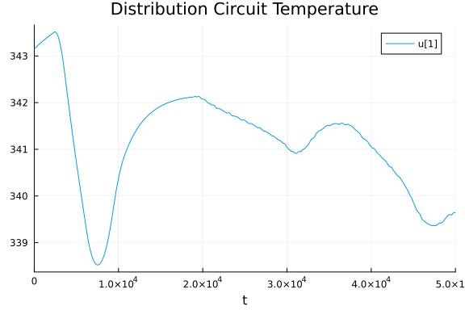
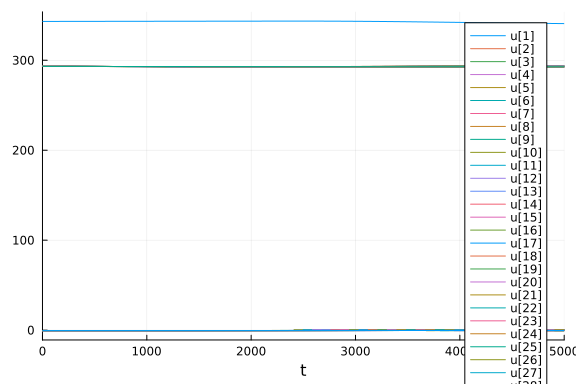
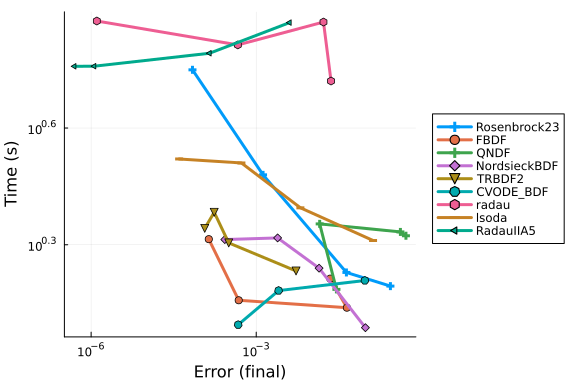
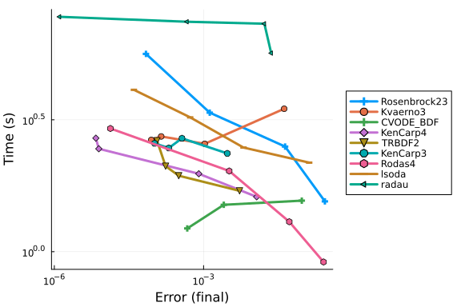
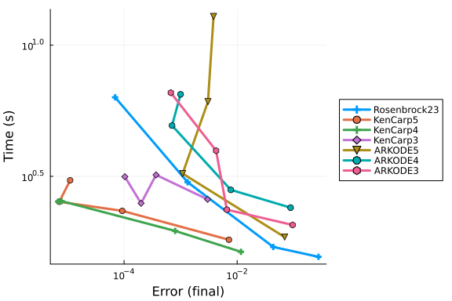
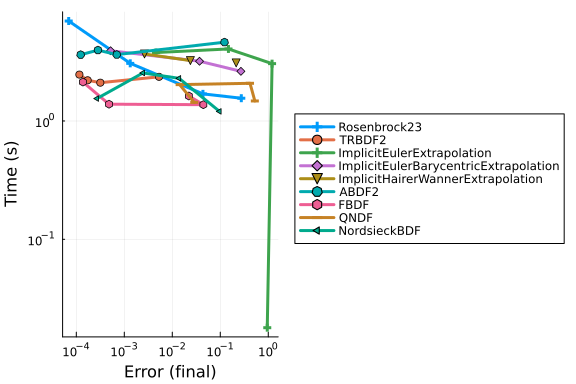
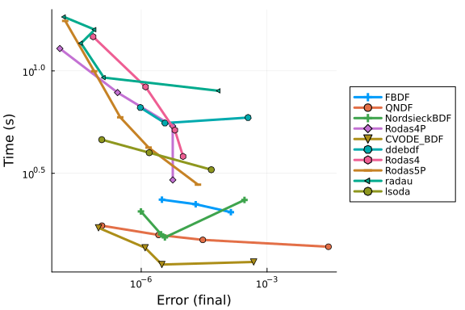
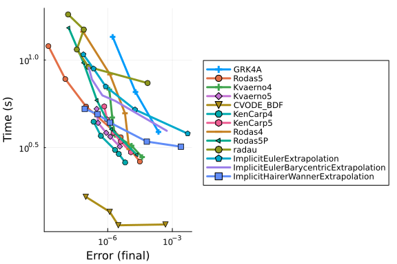
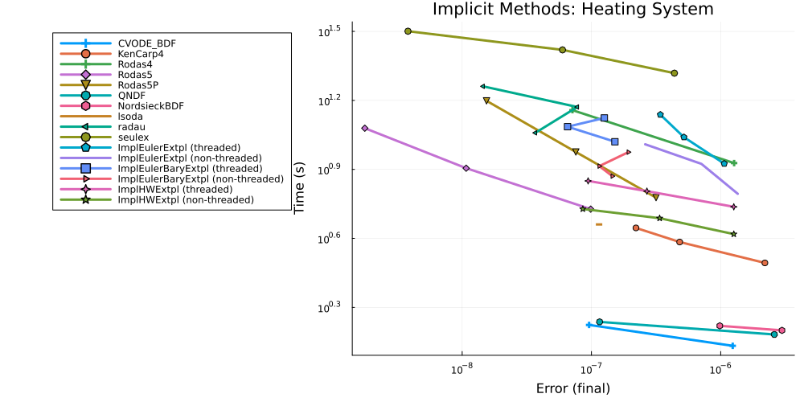

# Heating System

This benchmark tests a heating system model with temperature control and hysteresis behavior. The system models a distribution circuit with multiple heated units, each having its own temperature controller with hysteretic behavior. The system exhibits stiffness due to the different time scales of the heat transfer processes and the rapid switching behavior of the controllers.

The model consists of:
- N heated units with individual temperature controllers
- A distribution circuit that supplies heat to all units
- External temperature variations (daily cycle)
- Hysteretic control logic for each heating unit
- Saturation functions for control outputs

This represents a realistic engineering system with multiple time scales, making it a good test for stiff ODE solvers.

```julia
using OrdinaryDiffEq, DiffEqDevTools, Sundials, Plots, ODEInterfaceDiffEq, LSODA, LinearSolve
using OrdinaryDiffEqBDF, OrdinaryDiffEqExtrapolation, OrdinaryDiffEqFIRK, OrdinaryDiffEqRosenbrock, OrdinaryDiffEqSDIRK
using OrdinaryDiffEqCore, Polyester
using SciMLLogging
using PreallocationTools
gr()
using LinearAlgebra, RecursiveFactorization

# System parameters
const N = 40  # Number of heated units

# Physical parameters
const Cu = N == 1 ? [2e7] : (ones(N) .+ range(0,1.348,length=N))*1e7  # Heat capacity of heated units
const Cd = 2e6*N  # Heat capacity of distribution circuit
const Gh = 200    # Thermal conductance of heating elements
const Gu = 150    # Thermal conductance of heated units to the atmosphere
const Qmax = N*3000  # Maximum power output of heat generation unit
const Teps = 0.5     # Threshold of heated unit temperature controllers
const Td0 = 343.15   # Set point of distribution circuit temperature
const Tu0 = 293.15   # Heated unit temperature set point
const Kp = Qmax/4    # Proportional gain of heat generation unit temperature controller
const a = 50         # Gain of the hysteresis function
const b = 15         # Slope of the saturation function at the origin

# Helper functions for parameter and variable organization
function set_up_params(p)
    Cu   = @view p[1:N]
    Cd   = p[N+1]
    Gh   = p[N+2]
    Gu   = p[N+3]
    Qmax = p[N+4]
    Teps = p[N+5]
    Td0  = p[N+6]
    Tu0  = p[N+7]
    Kp   = p[N+8]
    a    = p[N+9]
    b    = p[N+10]

    Cu, Cd, Gh, Gu, Qmax, Teps, Td0, Tu0, Kp, a, b
end

function set_up_vars(u)
    Td = u[1]
    Tu = @view u[2:N+1]
    x  = @view u[N+2:2N+1]

    Td, Tu, x
end

function combine_vars!(du, dTd, dTu, dx)
    du[1] = dTd
    du[2:N+1] .= dTu[1:N]
    du[N+2:2N+1] .= dx[1:N]

    nothing
end

# Hysteresis function for temperature controllers
hist(x, p, e = 1) = -(x + 0.5)*(x - 0.5) * x * 1/(0.0474)*e + p

# Saturation function for control outputs
sat(x, xmin, xmax) = tanh(2*(x-xmin)/(xmax-xmin)-1) * (xmax-xmin)/2 + (xmax+xmin)/2

# Main ODE function for the heating system
function heating(du, u, (p, _Qh, _Que), t)
    (Td, Tu, x) = set_up_vars(u)
    (dTd, dTu, dx) = set_up_vars(du)
    (Cu, Cd, Gh, Gu, Qmax, Teps, Td0, Tu0, Kp, a, b) = set_up_params(p)
    Qh = PreallocationTools.get_tmp(_Qh, du)
    Que = PreallocationTools.get_tmp(_Que, du)

    # External temperature with daily variation
    Text = 278.15 + 8*sin(2π*t/86400)

    # Heat transfer from distribution to units (with control)
    @inbounds for i in 1:length(Qh)
        Qh[i] = Gh * (Td - Tu[i]) * (sat(b * x[i], -0.5, 0.5) + 0.5)
    end

    # Heat loss from units to environment
    @inbounds for i in 1:length(Que)
        Que[i] = Gu * (Tu[i] - Text)
    end

    # Heat input to distribution circuit (with saturation)
    Qd = sat(Kp*(Td0 - Td), 0, Qmax)

    # Temperature dynamics
    dTd = (Qd - sum(Qh))/Cd
    @inbounds for i in 1:length(dTu)
        dTu[i] = (Qh[i] - Que[i]) / Cu[i]
    end

    # Controller states (hysteretic behavior)
    @inbounds for i in 1:length(dx)
        dx[i] = a * hist(x[i], Tu0 - Tu[i], Teps)
    end

    combine_vars!(du, dTd, dTu, dx)
end

# Initial conditions and parameters
u0 = [Td0, fill(Tu0, N)..., fill(-0.5, N)...]
Qh0 = DiffCache(zeros(N))
Que0 = DiffCache(zeros(N))
p = [Cu..., Cd, Gh, Gu, Qmax, Teps, Td0, Tu0, Kp, a, b]
tspan = (0., 50_000.)

# Pin BLAS to one thread for the whole file.
#
# This system is 81 dense states, so every solver step is an 81x81 factorization - far too
# small for multithreaded BLAS to pay for itself, and large enough to trigger it. The CI
# runners set JULIA_NUM_THREADS=auto, which is 128 on the amdci* EPYC boxes, and nothing in
# this file pinned BLAS until the multithreading section near the end. The whole-folder job
# on amdci3-1 (run 31719785340) entered this file's first WorkPrecisionSet at 10:10:49 on
# 2026-08-14 and had still not left it 119.35 h later when GitHub cancelled the job at its
# 5-day limit - while every individual solver call in that chunk returns in seconds when
# measured on a quiet machine (rodas 8.3 s, radau 10.9-21.5 s, lsoda 4.2 s; the chunk as a
# whole probes at 702 s). Thread oversubscription is the one environment difference we can
# name and control, so pin it up front.
LinearAlgebra.BLAS.set_num_threads(1)

# Problem setup
prob = ODEProblem(heating, u0, tspan, (p, Qh0, Que0))

# Reference solution using a robust stiff solver
sol = solve(prob, Rodas5P(), abstol=1e-12, reltol=1e-12)
test_sol = TestSolution(sol)
abstols = 1.0 ./ 10.0 .^ (4:11)
reltols = 1.0 ./ 10.0 .^ (1:8);
```


```julia
plot(sol, vars=1, title="Distribution Circuit Temperature")
```

```
Ptmux;_Gi=1719413160,f=100,a=q,U=1;iVBORw0KGgoAAAANSUhEUgAAAAEAAAABCAYAA
AAfFcSJAAAABmJLR0QA/wD/AP+gvaeTAAAAC0lEQVQImWNgAAIAAAUAAWJVMogAAAAASUVORK5C
YII=\\Ptmux;_Gi=1719413160,f=100,a=q;iVBORw0KGgoAAAANSUhEUgAAAAEAAAAB
CAYAAAAfFcSJAAAABmJLR0QA/wD/AP+gvaeTAAAAC0lEQVQImWNgAAIAAAUAAWJVMogAAAAASUV
ORK5CYII=\\Ptmux;]1337;Capabilities\\
```




```julia
plot(sol, tspan=(0.0, 5000.0))
```




## High Tolerances

This is the speed when you just want the answer.

The legacy ODEInterface `rodas()` is omitted because its single-method sweep did not
complete in one hour. The native Rodas methods remain in the comparisons below.

```julia
abstols = 1.0 ./ 10.0 .^ (5:8)
reltols = 1.0 ./ 10.0 .^ (1:4);
setups = [Dict(:alg=>Rosenbrock23()),
          Dict(:alg=>FBDF()),
          Dict(:alg=>QNDF()),
          Dict(:alg=>NordsieckBDF()),
          Dict(:alg=>TRBDF2()),
          Dict(:alg=>CVODE_BDF()),
          Dict(:alg=>radau()),
          Dict(:alg=>lsoda()),
          Dict(:alg=>RadauIIA5()),
          ]
wp = WorkPrecisionSet(prob,abstols,reltols,setups;verbose=SciMLLogging.None(),
                      save_everystep=false,appxsol=test_sol,maxiters=Int(1e5),numruns=10)
plot(wp)
```



```julia
setups = [Dict(:alg=>Rosenbrock23()),
          Dict(:alg=>Kvaerno3()),
          Dict(:alg=>CVODE_BDF()),
          Dict(:alg=>KenCarp4()),
          Dict(:alg=>TRBDF2()),
          Dict(:alg=>KenCarp3()),
          Dict(:alg=>Rodas4()),
          Dict(:alg=>lsoda()),
          Dict(:alg=>radau())]
wp = WorkPrecisionSet(prob,abstols,reltols,setups; verbose=SciMLLogging.None(),
                      save_everystep=false,appxsol=test_sol,maxiters=Int(1e5),numruns=10)
plot(wp)
```



```julia
setups = [Dict(:alg=>Rosenbrock23()),
          Dict(:alg=>KenCarp5()),
          Dict(:alg=>KenCarp4()),
          Dict(:alg=>KenCarp3()),
          Dict(:alg=>ARKODE(order=5)),
          Dict(:alg=>ARKODE()),
          Dict(:alg=>ARKODE(order=3))]
names = ["Rosenbrock23" "KenCarp5" "KenCarp4" "KenCarp3" "ARKODE5" "ARKODE4" "ARKODE3"]
wp = WorkPrecisionSet(prob,abstols,reltols,setups; verbose=SciMLLogging.None(),
                      names=names,save_everystep=false,appxsol=test_sol,maxiters=Int(1e5),numruns=10)
plot(wp)
```



```julia
setups = [Dict(:alg=>Rosenbrock23()),
          Dict(:alg=>TRBDF2()),
          Dict(:alg=>ImplicitEulerExtrapolation()),
          Dict(:alg=>ImplicitEulerBarycentricExtrapolation()),
          Dict(:alg=>ImplicitHairerWannerExtrapolation()),
          Dict(:alg=>ABDF2()),
          Dict(:alg=>FBDF()),
          Dict(:alg=>QNDF()),
          Dict(:alg=>NordsieckBDF()),
]
wp = WorkPrecisionSet(prob,abstols,reltols,setups; verbose=SciMLLogging.None(),
                      save_everystep=false,appxsol=test_sol,maxiters=Int(1e5))
plot(wp)
```



```julia
setups = [Dict(:alg=>Rosenbrock23()),
          Dict(:alg=>TRBDF2()),
          Dict(:alg=>ImplicitEulerExtrapolation(linsolve = RFLUFactorization())),
          Dict(:alg=>ImplicitEulerBarycentricExtrapolation(linsolve = RFLUFactorization())),
          Dict(:alg=>ImplicitHairerWannerExtrapolation(linsolve = RFLUFactorization())),
          Dict(:alg=>ABDF2()),
          Dict(:alg=>FBDF()),
          Dict(:alg=>QNDF()),
          Dict(:alg=>NordsieckBDF()),
]
wp = WorkPrecisionSet(prob,abstols,reltols,setups; verbose=SciMLLogging.None(),
                      save_everystep=false,appxsol=test_sol,maxiters=Int(1e5))
plot(wp)
```


### Low Tolerances

This is the speed at lower tolerances, measuring what's good when accuracy is needed.

```julia
# The reference solution above is Rodas5P at abstol = reltol = 1e-12, so the sweep
# stops at abstol 1e-11 / reltol 1e-8; tighter points measured the reference's own
# error rather than the solver's, and were by far the most expensive in the file.
abstols = 1.0 ./ 10.0 .^ (7:11)
reltols = 1.0 ./ 10.0 .^ (4:8)

setups = [
          Dict(:alg=>FBDF()),
          Dict(:alg=>QNDF()),
          Dict(:alg=>NordsieckBDF()),
          Dict(:alg=>Rodas4P()),
          Dict(:alg=>CVODE_BDF()),
          Dict(:alg=>ddebdf()),
          Dict(:alg=>Rodas4()),
          Dict(:alg=>Rodas5P()),
          Dict(:alg=>radau()),
          Dict(:alg=>lsoda())
          ]
wp = WorkPrecisionSet(prob,abstols,reltols,setups;verbose=SciMLLogging.None(),
                      save_everystep=false,appxsol=test_sol,maxiters=Int(1e5),numruns=10)
plot(wp)
```



```julia
setups = [Dict(:alg=>GRK4A()),
          Dict(:alg=>Rodas5()),
          Dict(:alg=>Kvaerno4()),
          Dict(:alg=>Kvaerno5()),
          Dict(:alg=>CVODE_BDF()),
          Dict(:alg=>KenCarp4()),
          Dict(:alg=>KenCarp5()),
          Dict(:alg=>Rodas4()),
          Dict(:alg=>Rodas5P()),
          Dict(:alg=>radau()),
          Dict(:alg=>ImplicitEulerExtrapolation(min_order = 3)),
          Dict(:alg=>ImplicitEulerBarycentricExtrapolation()),
          Dict(:alg=>ImplicitHairerWannerExtrapolation()),
          ]
wp = WorkPrecisionSet(prob,abstols,reltols,setups; verbose=SciMLLogging.None(),
                      save_everystep=false,appxsol=test_sol,maxiters=Int(1e5),numruns=10)
plot(wp)
```




Multithreading benchmarks with Parallel Extrapolation Methods

```julia
#Setting BLAS to one thread to measure gains (already pinned at the top of the file)
LinearAlgebra.BLAS.set_num_threads(1)

# Kept inside the accuracy of the 1e-12 reference solution (see note above).
abstols = 1.0 ./ 10.0 .^ (9:11)
reltols = 1.0 ./ 10.0 .^ (6:8)

setups = [
            Dict(:alg=>CVODE_BDF()),
            Dict(:alg=>KenCarp4()),
            Dict(:alg=>Rodas4()),
            Dict(:alg=>Rodas5()),
            Dict(:alg=>Rodas5P()),
            Dict(:alg=>QNDF()),
            Dict(:alg=>NordsieckBDF()),
            Dict(:alg=>lsoda()),
            Dict(:alg=>radau()),
            Dict(:alg=>seulex()),
            Dict(:alg=>ImplicitEulerExtrapolation(min_order = 5, init_order = 3,threading = OrdinaryDiffEqCore.PolyesterThreads())),
            Dict(:alg=>ImplicitEulerExtrapolation(min_order = 5, init_order = 3,threading = false)),
            Dict(:alg=>ImplicitEulerBarycentricExtrapolation(min_order = 5, threading = OrdinaryDiffEqCore.PolyesterThreads())),
            Dict(:alg=>ImplicitEulerBarycentricExtrapolation(min_order = 5, threading = false)),
            Dict(:alg=>ImplicitHairerWannerExtrapolation(threading = OrdinaryDiffEqCore.PolyesterThreads())),
            Dict(:alg=>ImplicitHairerWannerExtrapolation(threading = false)),
            ]

solnames = ["CVODE_BDF","KenCarp4","Rodas4","Rodas5","Rodas5P","QNDF","NordsieckBDF","lsoda","radau","seulex","ImplEulerExtpl (threaded)", "ImplEulerExtpl (non-threaded)",
            "ImplEulerBaryExtpl (threaded)","ImplEulerBaryExtpl (non-threaded)","ImplHWExtpl (threaded)","ImplHWExtpl (non-threaded)"]

wp = WorkPrecisionSet(prob,abstols,reltols,setups; verbose=SciMLLogging.None(),
                    names = solnames,save_everystep=false,appxsol=test_sol,maxiters=Int(1e5),numruns=10)

plot(wp, title = "Implicit Methods: Heating System",legend=:outertopleft,size = (1000,500),
     xticks = 10.0 .^ (-15:1:1),
     yticks = 10.0 .^ (-6:0.3:5),
     bottom_margin= 5Plots.mm)
```




### Conclusion

This heating system benchmark tests stiff ODE solvers on a realistic engineering system with hysteretic control behavior, multiple time scales, and complex thermal dynamics. The switching behavior of the controllers creates challenges for adaptive time stepping algorithms.


## Appendix

These benchmarks are a part of the SciMLBenchmarks.jl repository, found at: [https://github.com/SciML/SciMLBenchmarks.jl](https://github.com/SciML/SciMLBenchmarks.jl). For more information on high-performance scientific machine learning, check out the SciML Open Source Software Organization [https://sciml.ai](https://sciml.ai).

To locally run this benchmark, do the following commands:
```
using SciMLBenchmarks
SciMLBenchmarks.weave_file("benchmarks/StiffODE","HeatingSystem_wpd.jmd")
```

Computer Information:

```
Julia Version 1.11.9
Commit 53a02c0720c (2026-02-06 00:27 UTC)
Build Info:
  Official https://julialang.org/ release
Platform Info:
  OS: Linux (x86_64-linux-gnu)
  CPU: 128 × AMD EPYC 7502 32-Core Processor
  WORD_SIZE: 64
  LLVM: libLLVM-16.0.6 (ORCJIT, znver2)
Threads: 1 default, 0 interactive, 1 GC (on 128 virtual cores)
Environment:
  JULIA_PKG_PRECOMPILE_AUTO = 0

```

Package Information:

```
Status `~/sandbox/tmp_20260825_180339_53321/stiffode-master-full/benchmarks/StiffODE/Project.toml`
  [2169fc97] AlgebraicMultigrid v2.0.1
  [6e4b80f9] BenchmarkTools v1.8.0
⌃ [f3b72e0c] DiffEqDevTools v3.4.0
⌅ [5b8099bc] DomainSets v0.7.18
⌅ [5a33fad7] GeometricIntegratorsDiffEq v1.3.3
  [40713840] IncompleteLU v0.2.1
  [7f56f5a3] LSODA v1.2.0
⌃ [7ed4a6bd] LinearSolve v5.13.0
⌅ [94925ecb] MethodOfLines v0.11.19
⌃ [961ee093] ModelingToolkit v11.39.1
⌅ [09606e27] ODEInterfaceDiffEq v4.1.0
⌃ [1dea7af3] OrdinaryDiffEq v7.7.0
⌃ [6ad6398a] OrdinaryDiffEqBDF v2.4.4
⌃ [bbf590c4] OrdinaryDiffEqCore v4.15.0
⌃ [e0540318] OrdinaryDiffEqExponentialRK v2.3.0
⌃ [becaefa8] OrdinaryDiffEqExtrapolation v2.5.0
⌃ [5960d6e9] OrdinaryDiffEqFIRK v2.8.0
⌃ [5dd0a6cf] OrdinaryDiffEqPDIRK v2.4.0
⌃ [43230ef6] OrdinaryDiffEqRosenbrock v2.7.0
⌃ [2d112036] OrdinaryDiffEqSDIRK v2.9.0
  [358294b1] OrdinaryDiffEqStabilizedRK v2.6.0
⌃ [65888b18] ParameterizedFunctions v5.26.0
  [91a5bcdd] Plots v1.41.7
  [f517fe37] Polyester v0.7.19
⌃ [d236fae5] PreallocationTools v1.6.0
  [132c30aa] ProfileSVG v0.2.2
  [f2c3362d] RecursiveFactorization v0.2.30
⌃ [31c91b34] SciMLBenchmarks v0.1.3
  [a6db7da4] SciMLLogging v2.1.0
  [90137ffa] StaticArrays v1.9.19
  [c3572dad] Sundials v6.6.0
⌃ [0c5d862f] Symbolics v7.36.0
⌅ [a759f4b9] TimerOutputs v0.5.29
  [37e2e46d] LinearAlgebra v1.11.0
  [2f01184e] SparseArrays v1.11.0
Info Packages marked with ⌃ and ⌅ have new versions available. Those with ⌃ may be upgradable, but those with ⌅ are restricted by compatibility constraints from upgrading. To see why use `status --outdated`
```

And the full manifest:

```
Status `~/sandbox/tmp_20260825_180339_53321/stiffode-master-full/benchmarks/StiffODE/Manifest.toml`
  [47edcb42] ADTypes v1.24.0
  [14f7f29c] AMD v0.5.3
  [a4c015fc] ANSIColoredPrinters v0.0.1
  [621f4979] AbstractFFTs v1.5.0
  [6e696c72] AbstractPlutoDingetjes v1.4.0
  [1520ce14] AbstractTrees v0.4.5
  [7d9f7c33] Accessors v0.1.45
  [79e6a3ab] Adapt v4.7.0
  [2169fc97] AlgebraicMultigrid v2.0.1
  [66dad0bd] AliasTables v1.1.3
  [ec485272] ArnoldiMethod v0.4.0
⌃ [4fba245c] ArrayInterface v7.30.0
  [4c555306] ArrayLayouts v1.12.2
  [13072b0f] AxisAlgorithms v1.1.0
⌃ [aae01518] BandedMatrices v1.11.0
  [6e4b80f9] BenchmarkTools v1.8.0
  [0e736298] Bessels v0.2.8
  [e2ed5e7c] Bijections v0.2.2
  [b2a6c25c] BinaryHeaps v1.1.0
⌃ [caf10ac8] BipartiteGraphs v0.1.11
  [d1d4a3ce] BitFlags v0.1.10
  [62783981] BitTwiddlingConvenienceFunctions v0.1.6
  [8e7c35d0] BlockArrays v1.10.0
⌃ [70df07ce] BracketingNonlinearSolve v1.12.5
  [fa961155] CEnum v0.5.0
  [2a0fbf3d] CPUSummary v0.2.7
  [d360d2e6] ChainRulesCore v1.26.1
  [fb6a15b2] CloseOpenIntervals v0.1.13
  [944b1d66] CodecZlib v0.7.9
  [35d6a980] ColorSchemes v3.31.0
⌅ [3da002f7] ColorTypes v0.11.5
⌃ [c3611d14] ColorVectorSpace v0.10.0
⌅ [5ae59095] Colors v0.12.11
⌅ [861a8166] Combinatorics v1.0.2
  [38540f10] CommonSolve v0.2.14
  [bbf7d656] CommonSubexpressions v0.3.1
  [f70d9fcc] CommonWorldInvalidations v1.2.0
⌅ [a09551c4] CompactBasisFunctions v0.2.15
  [34da2185] Compat v4.18.1
  [b152e2b5] CompositeTypes v0.1.4
  [a33af91c] CompositionsBase v0.1.2
  [2569d6c7] ConcreteStructs v0.2.8
  [f0e56b4a] ConcurrentUtilities v2.6.0
  [8f4d0f93] Conda v1.10.3
  [187b0558] ConstructionBase v1.6.0
⌃ [7ae1f121] ContinuumArrays v0.20.9
  [d38c429a] Contour v0.6.3
  [adafc99b] CpuId v0.3.1
  [a8cc5b0e] Crayons v4.2.0
  [717857b8] DSP v0.8.6
  [9a962f9c] DataAPI v1.16.0
  [864edb3b] DataStructures v0.19.6
  [e2d170a0] DataValueInterfaces v1.0.0
  [8bb1440f] DelimitedFiles v1.9.1
⌃ [2b5f629d] DiffEqBase v7.18.2
⌃ [459566f4] DiffEqCallbacks v4.19.2
⌃ [f3b72e0c] DiffEqDevTools v3.4.0
⌃ [77a26b50] DiffEqNoiseProcess v5.36.0
  [163ba53b] DiffResults v1.1.0
  [b552c78f] DiffRules v1.16.0
  [a0c0ee7d] DifferentiationInterface v0.7.21
  [b4f34e82] Distances v0.10.12
  [31c24e10] Distributions v0.25.131
  [ffbed154] DocStringExtensions v0.9.5
⌃ [e30172f5] Documenter v1.17.0
⌅ [5b8099bc] DomainSets v0.7.18
⌃ [7c1d4256] DynamicPolynomials v0.6.6
  [4e289a0a] EnumX v1.0.7
  [f151be2c] EnzymeCore v0.8.21
  [460bff9d] ExceptionUnwrapping v0.1.11
⌃ [d4d017d3] ExponentialUtilities v1.35.0
  [e2ba6199] ExprTools v0.1.11
  [55351af7] ExproniconLite v0.10.14
  [c87230d0] FFMPEG v0.4.5
  [7a1cc6ca] FFTW v1.10.0
  [7034ab61] FastBroadcast v1.4.0
  [9aa1b823] FastClosures v0.3.2
  [442a2c76] FastGaussQuadrature v1.3.0
  [a4df4552] FastPower v1.5.0
  [057dd010] FastTransforms v0.17.2
  [5789e2e9] FileIO v1.20.0
  [1a297f60] FillArrays v1.17.0
  [64ca27bc] FindFirstFunctions v3.2.1
  [6a86dc24] FiniteDiff v2.33.0
⌅ [53c48c17] FixedPointNumbers v0.8.6
⌃ [08572546] FlameGraphs v1.1.0
  [1fa38f19] Format v1.3.7
  [f6369f11] ForwardDiff v1.4.5
  [a85aefff] FunctionMaps v0.1.2
  [069b7b12] FunctionWrappers v1.1.3
  [77dc65aa] FunctionWrappersWrappers v1.13.0
  [46192b85] GPUArraysCore v0.2.0
⌃ [28b8d3ca] GR v0.73.26
  [a0844989] Gamma v1.2.0
  [a8297547] GenericFFT v0.1.7
  [14197337] GenericLinearAlgebra v0.4.0
  [c145ed77] GenericSchur v0.5.8
⌃ [9a0b12b7] GeometricBase v0.14.8
  [c85262ba] GeometricEquations v0.21.2
⌅ [dcce2d33] GeometricIntegrators v0.16.10
⌅ [71212ab4] GeometricIntegratorsBase v0.4.2
⌅ [5a33fad7] GeometricIntegratorsDiffEq v1.3.3
  [7843afe4] GeometricSolutions v0.6.5
  [d7ba0133] Git v1.5.0
  [86223c79] Graphs v1.14.0
  [42e2da0e] Grisu v1.0.2
⌅ [cd3eb016] HTTP v1.11.0
⌅ [eafb193a] Highlights v0.5.3
  [3e5b6fbb] HostCPUFeatures v0.1.18
  [34004b35] HypergeometricFunctions v0.3.30
  [7073ff75] IJulia v1.34.4
  [b5f81e59] IOCapture v1.0.0
  [615f187c] IfElse v0.1.1
⌃ [3263718b] ImplicitDiscreteSolve v2.2.0
  [40713840] IncompleteLU v0.2.1
  [9b13fd28] IndirectArrays v1.0.0
  [4858937d] InfiniteArrays v0.15.15
  [e1ba4f0e] Infinities v0.1.12
  [d25df0c9] Inflate v0.1.5
  [18e54dd8] IntegerMathUtils v0.1.4
  [a98d9a8b] Interpolations v0.16.3
  [8197267c] IntervalSets v0.7.14
  [3587e190] InverseFunctions v0.1.17
  [92d709cd] IrrationalConstants v0.2.6
  [c8e1da08] IterTools v1.10.0
  [82899510] IteratorInterfaceExtensions v1.0.0
  [1019f520] JLFzf v0.1.11
  [692b3bcd] JLLWrappers v1.8.0
⌅ [682c06a0] JSON v0.21.4
  [ae98c720] Jieko v0.2.1
⌃ [ccbc3e58] JumpProcesses v9.29.3
  [ba0b0d4f] Krylov v0.10.9
⌃ [2faa5264] LHLFactorization v2.2.0
  [7f56f5a3] LSODA v1.2.0
  [b964fa9f] LaTeXStrings v1.4.1
  [23fbe1c1] Latexify v0.16.12
  [10f19ff3] LayoutPointers v0.1.17
  [0e77f7df] LazilyInitializedFields v1.3.0
  [5078a376] LazyArrays v2.12.0
⌅ [1d6d02ad] LeftChildRightSiblingTrees v0.2.1
  [87fe0de2] LineSearch v0.1.16
⌃ [7ed4a6bd] LinearSolve v5.13.0
  [2ab3a3ac] LogExpFunctions v1.0.1
  [e6f89c97] LoggingExtras v1.2.0
  [bdcacae8] LoopVectorization v0.12.174
  [1914dd2f] MacroTools v0.5.16
  [d125e4d3] ManualMemory v0.1.8
  [d0879d2d] MarkdownAST v0.1.3
  [a3b82374] MatrixFactorizations v3.1.3
  [bb5d69b7] MaybeInplace v0.1.8
  [739be429] MbedTLS v1.1.10
  [442fdcdd] Measures v0.3.3
⌅ [94925ecb] MethodOfLines v0.11.19
  [e1d29d7a] Missings v1.2.0
⌃ [961ee093] ModelingToolkit v11.39.1
⌃ [7771a370] ModelingToolkitBase v1.68.0
⌃ [6bb917b9] ModelingToolkitTearing v1.20.5
  [2e0e35c7] Moshi v0.3.12
  [46d2c3a1] MuladdMacro v0.2.7
  [102ac46a] MultivariatePolynomials v0.5.19
  [ffc61752] Mustache v1.0.21
  [d8a4904e] MutableArithmetics v1.8.0
  [77ba4419] NaNMath v1.1.4
⌃ [8913a72c] NonlinearSolve v4.28.0
⌃ [be0214bd] NonlinearSolveBase v2.47.0
⌃ [5959db7a] NonlinearSolveFirstOrder v2.4.0
⌃ [9a2c21bd] NonlinearSolveQuasiNewton v1.15.1
⌃ [26075421] NonlinearSolveSpectralMethods v1.8.0
  [54ca160b] ODEInterface v0.5.2
⌅ [09606e27] ODEInterfaceDiffEq v4.1.0
  [6fe1bfb0] OffsetArrays v1.17.0
  [4d8831e6] OpenSSL v1.6.1
⌅ [bac558e1] OrderedCollections v1.8.2
⌃ [1dea7af3] OrdinaryDiffEq v7.7.0
⌃ [6ad6398a] OrdinaryDiffEqBDF v2.4.4
⌃ [bbf590c4] OrdinaryDiffEqCore v4.15.0
⌃ [50262376] OrdinaryDiffEqDefault v2.5.0
⌃ [4302a76b] OrdinaryDiffEqDifferentiation v3.10.0
⌃ [e0540318] OrdinaryDiffEqExponentialRK v2.3.0
⌃ [becaefa8] OrdinaryDiffEqExtrapolation v2.5.0
⌃ [5960d6e9] OrdinaryDiffEqFIRK v2.8.0
⌃ [127b3ac7] OrdinaryDiffEqNonlinearSolve v2.9.0
⌃ [5dd0a6cf] OrdinaryDiffEqPDIRK v2.4.0
⌃ [43230ef6] OrdinaryDiffEqRosenbrock v2.7.0
⌃ [b4bd8bb3] OrdinaryDiffEqRosenbrockTableaus v2.4.1
⌃ [2d112036] OrdinaryDiffEqSDIRK v2.9.0
  [358294b1] OrdinaryDiffEqStabilizedRK v2.6.0
⌃ [b1df2697] OrdinaryDiffEqTsit5 v2.1.3
⌃ [79d7bb75] OrdinaryDiffEqVerner v2.4.0
⌃ [a7812802] PDEBase v0.1.33
  [90014a1f] PDMats v0.11.41
⌃ [65888b18] ParameterizedFunctions v5.26.0
⌅ [d96e819e] Parameters v0.12.3
⌅ [69de0a69] Parsers v2.8.7
  [ccf2f8ad] PlotThemes v3.3.0
  [995b91a9] PlotUtils v1.4.4
  [91a5bcdd] Plots v1.41.7
  [e409e4f3] PoissonRandom v0.4.13
  [f517fe37] Polyester v0.7.19
  [1d0040c9] PolyesterWeave v0.2.2
  [f27b6e38] Polynomials v4.1.1
⌃ [d236fae5] PreallocationTools v1.6.0
⌅ [aea7be01] PrecompileTools v1.2.1
  [21216c6a] Preferences v1.5.2
  [08abe8d2] PrettyTables v3.4.8
  [27ebfcd6] Primes v0.5.7
  [132c30aa] ProfileSVG v0.2.2
  [92933f4c] ProgressMeter v1.11.0
  [43287f4e] PtrArrays v1.4.0
  [78ab2635] PureGebal v1.1.0
  [0c0d3e7f] PureKLU v1.4.1
  [1fd47b50] QuadGK v2.11.3
⌅ [a08977f5] QuadratureRules v0.1.10
⌃ [c4ea9172] QuasiArrays v0.13.8
  [c84ed2f1] Ratios v0.4.5
  [988b38a3] ReadOnlyArrays v0.2.0
  [795d4caa] ReadOnlyDicts v1.0.1
  [3cdcf5f2] RecipesBase v1.3.4
  [01d81517] RecipesPipeline v0.6.12
  [807425ed] RecurrenceRelationships v0.2.0
⌃ [731186ca] RecursiveArrayTools v4.5.0
  [f2c3362d] RecursiveFactorization v0.2.30
  [189a3867] Reexport v1.2.2
  [2792f1a3] RegistryInstances v0.1.0
  [05181044] RelocatableFolders v1.0.1
  [ae029012] Requires v1.3.1
  [ae5879a3] ResettableStacks v1.4.0
  [9fe22ead] RespecializeParams v1.3.0
  [79098fc4] Rmath v0.9.0
  [47965b36] RootedTrees v2.27.0
  [f2b01f46] Roots v3.0.7
⌅ [fb486d5c] RungeKutta v0.5.23
  [7e49a35a] RuntimeGeneratedFunctions v0.5.25
⌃ [9dfe8606] SCCNonlinearSolve v1.15.0
  [94e857df] SIMDTypes v0.1.0
  [476501e8] SLEEFPirates v0.6.46
  [1bc83da4] SafeTestsets v0.1.0
⌃ [0bca4576] SciMLBase v3.49.2
⌃ [31c91b34] SciMLBenchmarks v0.1.3
⌃ [19f34311] SciMLJacobianOperators v0.1.17
  [a6db7da4] SciMLLogging v2.1.0
⌃ [c0aeaf25] SciMLOperators v1.29.0
  [431bcebd] SciMLPublic v1.3.0
⌃ [53ae85a6] SciMLStructures v1.10.4
  [6c6a2e73] Scratch v1.3.0
  [efcf1570] Setfield v1.1.2
⌃ [992d4aef] Showoff v1.0.3
  [777ac1f9] SimpleBufferStream v1.2.0
⌃ [727e6d20] SimpleNonlinearSolve v2.14.0
⌅ [36b790f5] SimpleSolvers v0.9.2
  [699a6c99] SimpleTraits v0.9.6
  [a2af1166] SortingAlgorithms v1.2.3
  [bd59d7e1] SparseBandedMatrices v1.4.0
  [a57abbd0] SparseColumnPivotedQR v2.1.7
  [0a514795] SparseMatrixColorings v0.4.27
  [276daf66] SpecialFunctions v2.9.0
  [860ef19b] StableRNGs v1.0.4
  [0c0c59c1] StarAlgebras v0.3.0
⌃ [64909d44] StateSelection v1.11.0
  [aedffcd0] Static v1.4.6
  [0d7ed370] StaticArrayInterface v1.10.0
  [90137ffa] StaticArrays v1.9.19
  [1e83bf80] StaticArraysCore v1.4.4
⌃ [10745b16] Statistics v1.11.1
  [82ae8749] StatsAPI v1.8.0
  [2913bbd2] StatsBase v0.34.13
  [4c63d2b9] StatsFuns v2.2.1
  [7792a7ef] StrideArraysCore v0.5.9
  [69024149] StringEncodings v0.3.7
⌅ [892a3eda] StringManipulation v0.5.0
  [09ab397b] StructArrays v0.7.3
  [c3572dad] Sundials v6.6.0
  [2efcf032] SymbolicIndexingInterface v0.3.55
⌃ [19f23fe9] SymbolicLimits v1.2.0
⌅ [d1185830] SymbolicUtils v4.45.0
⌃ [0c5d862f] Symbolics v7.36.0
  [3783bdb8] TableTraits v1.0.1
  [bd369af6] Tables v1.14.0
  [ed4db957] TaskLocalValues v0.1.3
  [62fd8b95] TensorCore v0.1.1
  [8ea1fca8] TermInterface v2.0.0
  [8290d209] ThreadingUtilities v0.5.6
⌅ [a759f4b9] TimerOutputs v0.5.29
  [c751599d] ToeplitzMatrices v0.8.5
  [3bb67fe8] TranscodingStreams v0.11.3
  [d5829a12] TriangularSolve v0.2.6
  [781d530d] TruncatedStacktraces v1.4.0
  [5c2747f8] URIs v1.7.0
  [3a884ed6] UnPack v1.0.2
  [1cfade01] UnicodeFun v0.4.1
  [41fe7b60] Unzip v0.2.0
  [3d5dd08c] VectorizationBase v0.21.74
  [33b4df10] VectorizedRNG v0.2.26
  [81def892] VersionParsing v1.3.0
  [d30d5f5c] WeakCacheSets v0.1.0
  [44d3d7a6] Weave v0.10.12
  [efce3f68] WoodburyMatrices v1.1.0
  [ddb6d928] YAML v0.4.16
  [c2297ded] ZMQ v1.5.1
  [6e34b625] Bzip2_jll v1.0.9+0
  [83423d85] Cairo_jll v1.18.7+0
  [ee1fde0b] Dbus_jll v1.16.2+0
  [2702e6a9] EpollShim_jll v0.0.20230411+1
  [2e619515] Expat_jll v2.8.3+0
⌅ [b22a6f82] FFMPEG_jll v8.1.2+0
  [f5851436] FFTW_jll v3.3.12+0
  [34b6f7d7] FastTransforms_jll v0.6.4+0
  [a3f928ae] Fontconfig_jll v2.17.1+0
  [d7e528f0] FreeType2_jll v2.14.3+1
  [559328eb] FriBidi_jll v1.0.17+0
⌃ [0656b61e] GLFW_jll v3.4.1+1
⌅ [d2c73de3] GR_jll v0.73.26+0
⌅ [b0724c58] GettextRuntime_jll v0.22.4+0
  [61579ee1] Ghostscript_jll v9.55.1+0
  [020c3dae] Git_LFS_jll v3.7.1+0
  [f8c6e375] Git_jll v2.55.0+0
  [7746bdde] Glib_jll v2.88.3+0
  [3b182d85] Graphite2_jll v1.3.16+0
⌅ [2e76f6c2] HarfBuzz_jll v8.5.1+0
  [1d5cc7b8] IntelOpenMP_jll v2025.2.0+0
  [aacddb02] JpegTurbo_jll v3.2.0+1
  [c1c5ebd0] LAME_jll v3.100.3+0
  [88015f11] LERC_jll v4.1.0+0
  [1d63c593] LLVMOpenMP_jll v22.1.7+0
  [aae0fff6] LSODA_jll v0.1.2+0
⌅ [e9f186c6] Libffi_jll v3.4.7+0
  [7e76a0d4] Libglvnd_jll v1.7.1+1
  [94ce4f54] Libiconv_jll v1.18.0+0
  [4b2f31a3] Libmount_jll v2.42.0+0
  [89763e89] Libtiff_jll v4.7.3+0
  [38a345b3] Libuuid_jll v2.42.0+0
  [856f044c] MKL_jll v2025.2.0+0
  [c771fb93] ODEInterface_jll v0.0.2+0
  [e7412a2a] Ogg_jll v1.3.6+0
  [656ef2d0] OpenBLAS32_jll v0.3.34+0
  [9bd350c2] OpenSSH_jll v10.5.1+0
⌃ [458c3c95] OpenSSL_jll v3.5.7+0
  [efe28fd5] OpenSpecFun_jll v0.5.6+0
  [91d4177d] Opus_jll v1.6.1+0
⌃ [36c8627f] Pango_jll v1.58.0+0
  [30392449] Pixman_jll v0.46.4+0
  [c0090381] Qt6Base_jll v6.10.2+2
  [629bc702] Qt6Declarative_jll v6.10.2+2
  [ce943373] Qt6ShaderTools_jll v6.10.2+1
  [6de9746b] Qt6Svg_jll v6.10.2+0
  [e99dba38] Qt6Wayland_jll v6.10.2+1
  [f50d1b31] Rmath_jll v0.5.2+0
  [ca45d3f4] SuiteSparse32_jll v7.12.1+0
  [fb77eaff] Sundials_jll v7.5.0+0
  [a44049a8] Vulkan_Loader_jll v1.3.243+0
  [a2964d1f] Wayland_jll v1.24.0+0
  [ffd25f8a] XZ_jll v5.8.3+0
  [f67eecfb] Xorg_libICE_jll v1.1.2+0
  [c834827a] Xorg_libSM_jll v1.2.6+0
  [4f6342f7] Xorg_libX11_jll v1.8.13+0
  [0c0b7dd1] Xorg_libXau_jll v1.0.13+0
  [935fb764] Xorg_libXcursor_jll v1.2.4+0
  [a3789734] Xorg_libXdmcp_jll v1.1.6+0
  [1082639a] Xorg_libXext_jll v1.3.8+0
  [d091e8ba] Xorg_libXfixes_jll v6.0.2+0
  [a51aa0fd] Xorg_libXi_jll v1.8.4+0
  [d1454406] Xorg_libXinerama_jll v1.1.7+0
  [ec84b674] Xorg_libXrandr_jll v1.5.6+0
  [ea2f1a96] Xorg_libXrender_jll v0.9.12+0
  [a65dc6b1] Xorg_libpciaccess_jll v0.19.0+0
  [c7cfdc94] Xorg_libxcb_jll v1.17.1+0
  [cc61e674] Xorg_libxkbfile_jll v1.2.0+0
  [e920d4aa] Xorg_xcb_util_cursor_jll v0.1.6+0
  [12413925] Xorg_xcb_util_image_jll v0.4.1+0
  [2def613f] Xorg_xcb_util_jll v0.4.1+0
  [975044d2] Xorg_xcb_util_keysyms_jll v0.4.1+0
  [0d47668e] Xorg_xcb_util_renderutil_jll v0.3.10+0
  [c22f9ab0] Xorg_xcb_util_wm_jll v0.4.2+0
  [35661453] Xorg_xkbcomp_jll v1.4.7+0
  [33bec58e] Xorg_xkeyboard_config_jll v2.47.0+2
  [c5fb5394] Xorg_xtrans_jll v1.6.0+0
  [8f1865be] ZeroMQ_jll v4.3.6+0
  [3161d3a3] Zstd_jll v1.5.7+1
  [35ca27e7] eudev_jll v3.2.14+0
⌅ [214eeab7] fzf_jll v0.61.1+0
  [a4ae2306] libaom_jll v3.14.1+0
⌃ [0ac62f75] libass_jll v0.17.4+0
  [1183f4f0] libdecor_jll v0.2.2+0
  [8e53e030] libdrm_jll v2.4.134+0
  [2db6ffa8] libevdev_jll v1.13.4+0
  [f638f0a6] libfdk_aac_jll v2.0.4+0
  [36db933b] libinput_jll v1.28.1+0
  [b53b4c65] libpng_jll v1.6.58+0
  [a9144af2] libsodium_jll v1.0.21+0
  [9a156e7d] libva_jll v2.23.0+0
  [f27f6e37] libvorbis_jll v1.3.8+0
  [009596ad] mtdev_jll v1.1.7+0
  [1317d2d5] oneTBB_jll v2022.3.0+0
⌅ [1270edf5] x264_jll v10164.0.1+0
  [dfaa095f] x265_jll v4.1.0+0
  [d8fb68d0] xkbcommon_jll v1.13.0+0
  [0dad84c5] ArgTools v1.1.2
  [56f22d72] Artifacts v1.11.0
  [2a0f44e3] Base64 v1.11.0
  [ade2ca70] Dates v1.11.0
  [8ba89e20] Distributed v1.11.0
  [f43a241f] Downloads v1.6.0
  [7b1f6079] FileWatching v1.11.0
  [9fa8497b] Future v1.11.0
  [b77e0a4c] InteractiveUtils v1.11.0
  [4af54fe1] LazyArtifacts v1.11.0
  [b27032c2] LibCURL v0.6.4
  [76f85450] LibGit2 v1.11.0
  [8f399da3] Libdl v1.11.0
  [37e2e46d] LinearAlgebra v1.11.0
  [56ddb016] Logging v1.11.0
  [d6f4376e] Markdown v1.11.0
  [a63ad114] Mmap v1.11.0
  [ca575930] NetworkOptions v1.2.0
  [44cfe95a] Pkg v1.11.0
  [de0858da] Printf v1.11.0
  [9abbd945] Profile v1.11.0
  [3fa0cd96] REPL v1.11.0
  [9a3f8284] Random v1.11.0
  [ea8e919c] SHA v0.7.0
  [9e88b42a] Serialization v1.11.0
  [1a1011a3] SharedArrays v1.11.0
  [6462fe0b] Sockets v1.11.0
  [2f01184e] SparseArrays v1.11.0
  [f489334b] StyledStrings v1.11.0
  [4607b0f0] SuiteSparse
  [fa267f1f] TOML v1.0.3
  [a4e569a6] Tar v1.10.0
  [8dfed614] Test v1.11.0
  [cf7118a7] UUIDs v1.11.0
  [4ec0a83e] Unicode v1.11.0
  [e66e0078] CompilerSupportLibraries_jll v1.1.1+0
  [781609d7] GMP_jll v6.3.0+0
  [deac9b47] LibCURL_jll v8.6.0+0
  [e37daf67] LibGit2_jll v1.7.2+0
  [29816b5a] LibSSH2_jll v1.11.0+1
  [3a97d323] MPFR_jll v4.2.1+0
  [c8ffd9c3] MbedTLS_jll v2.28.6+0
  [14a3606d] MozillaCACerts_jll v2023.12.12
  [4536629a] OpenBLAS_jll v0.3.27+1
  [05823500] OpenLibm_jll v0.8.5+0
  [efcefdf7] PCRE2_jll v10.42.0+1
  [bea87d4a] SuiteSparse_jll v7.7.0+0
  [83775a58] Zlib_jll v1.2.13+1
  [8e850b90] libblastrampoline_jll v5.11.0+0
  [8e850ede] nghttp2_jll v1.59.0+0
  [3f19e933] p7zip_jll v17.4.0+2
Info Packages marked with ⌃ and ⌅ have new versions available. Those with ⌃ may be upgradable, but those with ⌅ are restricted by compatibility constraints from upgrading. To see why use `status --outdated -m`
```
