```julia
using OrdinaryDiffEq, ParameterizedFunctions, Plots, ODEInterfaceDiffEq, LSODA,
      DiffEqDevTools, Sundials
using LinearAlgebra, StaticArrays, RecursiveFactorization

gr() #gr(fmt=:png)

f = @ode_def Hires begin
    dy1 = -1.71*y1 + 0.43*y2 + 8.32*y3 + 0.0007
    dy2 = 1.71*y1 - 8.75*y2
    dy3 = -10.03*y3 + 0.43*y4 + 0.035*y5
    dy4 = 8.32*y2 + 1.71*y3 - 1.12*y4
    dy5 = -1.745*y5 + 0.43*y6 + 0.43*y7
    dy6 = -280.0*y6*y8 + 0.69*y4 + 1.71*y5 -
          0.43*y6 + 0.69*y7
    dy7 = 280.0*y6*y8 - 1.81*y7
    dy8 = -280.0*y6*y8 + 1.81*y7
end

u0 = zeros(8)
u0[1] = 1
u0[8] = 0.0057

prob = ODEProblem{true, SciMLBase.FullSpecialize}(f, u0, (0.0, 321.8122))
probstatic = ODEProblem{false}(f, SVector{8}(u0), (0.0, 321.8122))

sol = solve(prob, CVODE_BDF(), abstol = 1/10^14, reltol = 1/10^14)
sol2 = solve(probstatic, Rodas5P(), abstol = 1/10^14, reltol = 1/10^14)
probs = [prob, probstatic]
test_sol = [sol, sol2];

abstols = 1.0 ./ 10.0 .^ (4:11)
reltols = 1.0 ./ 10.0 .^ (1:8);
```


```julia
plot(sol)
```

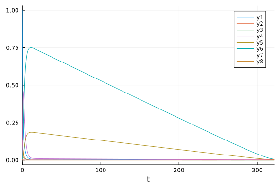

```julia
plot(sol, tspan = (0.0, 5.0))
```

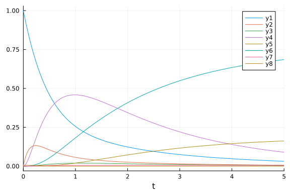


## Omissions

The following were omitted from the tests due to convergence failures. ODE.jl's
adaptivity is not able to stabilize its algorithms.
GeometricIntegrators.jl's methods used to either fail to converge at
comparable dts (or on some computers had errors due to type conversions).

```julia
#sol = solve(prob,ode23s()); println("Total ODE.jl steps: $(length(sol))")
#using GeometricIntegratorsDiffEq
#try
#    sol = solve(prob,GIRadIIA3(),dt=1/10)
#catch e
#    println(e)
#end
```


The stabilized explicit methods are not stable enough to handle this problem
well. While they don't diverge, they are really slow.

```julia
setups = [
#Dict(:alg=>ROCK2()),
#Dict(:alg=>ROCK4())
#Dict(:alg=>ESERK5())
]
```

```
Any[]
```


## High Tolerances

This is the speed when you just want the answer.

```julia
abstols = 1.0 ./ 10.0 .^ (5:8)
reltols = 1.0 ./ 10.0 .^ (1:4);
setups = [Dict(:alg=>Rosenbrock23()),
    Dict(:alg=>Rosenbrock23(), :prob_choice => 2),
    Dict(:alg=>FBDF()),
    Dict(:alg=>QNDF()),
    Dict(:alg=>TRBDF2()),
    Dict(:alg=>CVODE_BDF()),
    Dict(:alg=>rodas()),
    Dict(:alg=>radau()),
    Dict(:alg=>RadauIIA5()),
    Dict(:alg=>ROS34PW1a()),
    Dict(:alg=>lsoda())
]
wp = WorkPrecisionSet(probs, abstols, reltols, setups; verbose = false, dense = false,
    save_everystep = false, appxsol = test_sol, maxiters = Int(1e5), numruns = 10)
plot(wp)
```

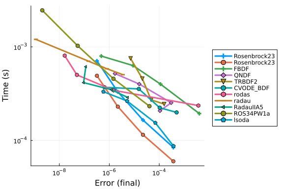

```julia
wp = WorkPrecisionSet(probs, abstols, reltols, setups; dense = false, verbose = false,
    appxsol = test_sol, maxiters = Int(1e5), error_estimate = :l2)
plot(wp)
```

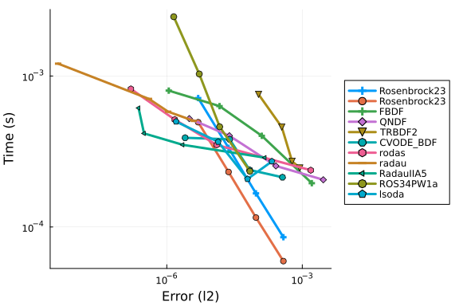

```julia
wp = WorkPrecisionSet(probs, abstols, reltols, setups; verbose = false, dense = false,
    appxsol = test_sol, maxiters = Int(1e5), error_estimate = :L2)
plot(wp)
```

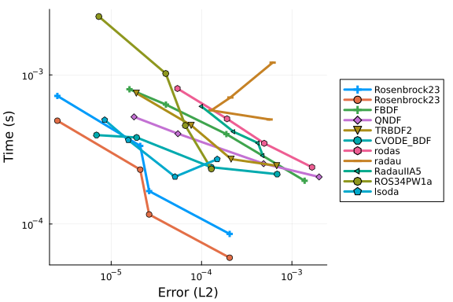

```julia
setups = [Dict(:alg=>Rosenbrock23()),
    Dict(:alg=>Rosenbrock23(), :prob_choice => 2),
    Dict(:alg=>Kvaerno3()),
    Dict(:alg=>CVODE_BDF()),
    Dict(:alg=>KenCarp4()),
    Dict(:alg=>TRBDF2()),
    Dict(:alg=>KenCarp3()),
    # Dict(:alg=>SDIRK2()), # Removed because it's bad
    Dict(:alg=>radau())]
wp = WorkPrecisionSet(probs, abstols, reltols, setups; verbose = false, dense = false,
    save_everystep = false, appxsol = test_sol, maxiters = Int(1e5))
plot(wp)
```

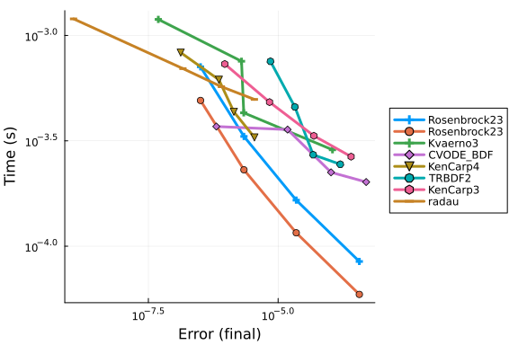

```julia
wp = WorkPrecisionSet(probs, abstols, reltols, setups; dense = false, verbose = false,
    appxsol = test_sol, maxiters = Int(1e5), error_estimate = :l2)
plot(wp)
```

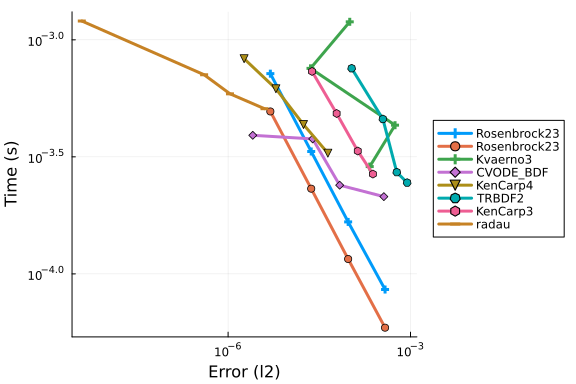

```julia
wp = WorkPrecisionSet(probs, abstols, reltols, setups; verbose = false, dense = false,
    appxsol = test_sol, maxiters = Int(1e5), error_estimate = :L2)
plot(wp)
```

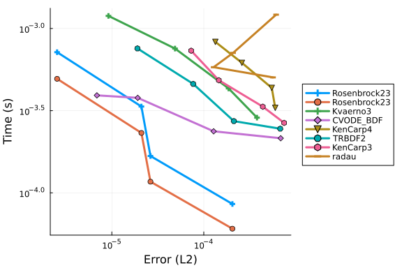

```julia
setups = [Dict(:alg=>Rosenbrock23()),
    Dict(:alg=>Rosenbrock23(), :prob_choice => 2),
    Dict(:alg=>KenCarp5()),
    Dict(:alg=>KenCarp4()),
    Dict(:alg=>KenCarp4(), :prob_choice => 2),
    Dict(:alg=>KenCarp3()),
    Dict(:alg=>ARKODE(order = 5)),
    Dict(:alg=>ARKODE()),
    Dict(:alg=>ARKODE(order = 3))]
names = ["Rosenbrock23" "Rosenbrock23 Static" "KenCarp5" "KenCarp4" "KenCarp4 Static" "KenCarp3" "ARKODE5" "ARKODE4" "ARKODE3"]
wp = WorkPrecisionSet(probs, abstols, reltols, setups; verbose = false, dense = false,
    names = names, save_everystep = false, appxsol = test_sol, maxiters = Int(1e5))
plot(wp)
```

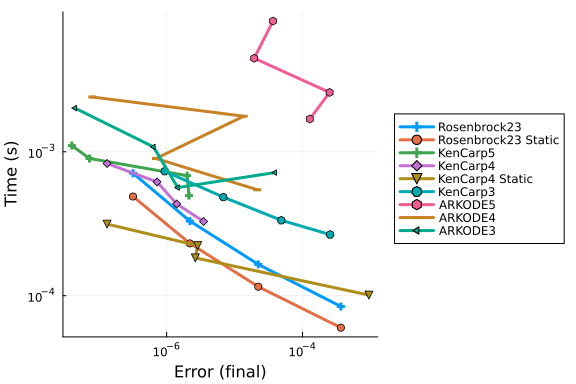

```julia
wp = WorkPrecisionSet(probs, abstols, reltols, setups; dense = false, verbose = false,
    appxsol = test_sol, maxiters = Int(1e5), error_estimate = :l2)
plot(wp)
```

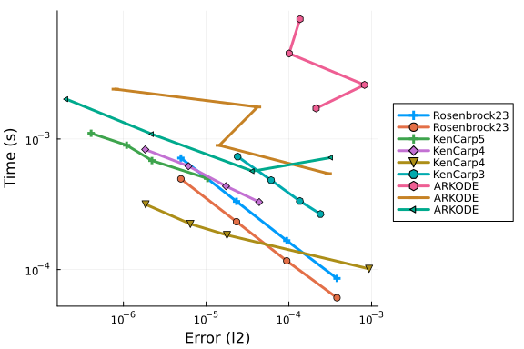

```julia
setups = [Dict(:alg=>Rosenbrock23()),
    Dict(:alg=>Rosenbrock23(), :prob_choice => 2),
    Dict(:alg=>TRBDF2()),
    Dict(:alg=>ImplicitEulerExtrapolation()),
    Dict(:alg=>ImplicitEulerBarycentricExtrapolation()),
    Dict(:alg=>ImplicitHairerWannerExtrapolation()),
    Dict(:alg=>ABDF2()),
    Dict(:alg=>FBDF()),
    Dict(:alg=>QNDF()),
    Dict(:alg=>Exprb43()),
    Dict(:alg=>Exprb32())
]
wp = WorkPrecisionSet(probs, abstols, reltols, setups; verbose = false, dense = false,
    save_everystep = false, appxsol = test_sol, maxiters = Int(1e5))
plot(wp)
```

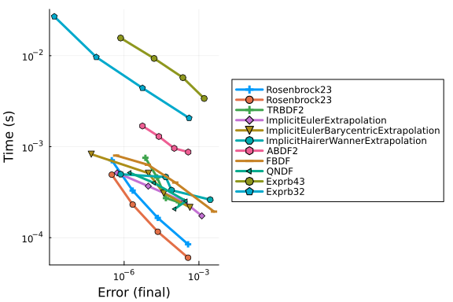


### Low Tolerances

This is the speed at lower tolerances, measuring what's good when accuracy is needed.

```julia
abstols = 1.0 ./ 10.0 .^ (7:13)
reltols = 1.0 ./ 10.0 .^ (4:10)

setups = [
    Dict(:alg=>FBDF()),
    Dict(:alg=>QNDF()),
    Dict(:alg=>Rodas4()),
    Dict(:alg=>Rodas4(), :prob_choice => 2),
    Dict(:alg=>CVODE_BDF()),
    Dict(:alg=>ddebdf()),
    Dict(:alg=>Rodas5()),
    Dict(:alg=>Rodas5P()),
    Dict(:alg=>Rodas5P(), :prob_choice => 2),
    Dict(:alg=>rodas()),
    Dict(:alg=>radau()),
    Dict(:alg=>lsoda()),
    Dict(:alg=>RadauIIA5())
]
wp = WorkPrecisionSet(probs, abstols, reltols, setups; verbose = false, dense = false,
    save_everystep = false, appxsol = test_sol, maxiters = Int(1e5))
plot(wp)
```

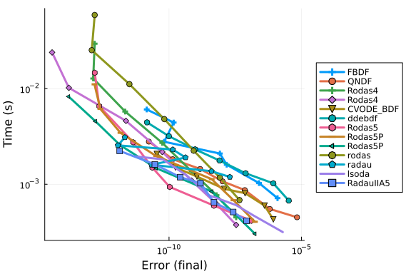

```julia
wp = WorkPrecisionSet(probs, abstols, reltols, setups; verbose = false,
    dense = false, appxsol = test_sol, maxiters = Int(1e5), error_estimate = :l2)
plot(wp)
```

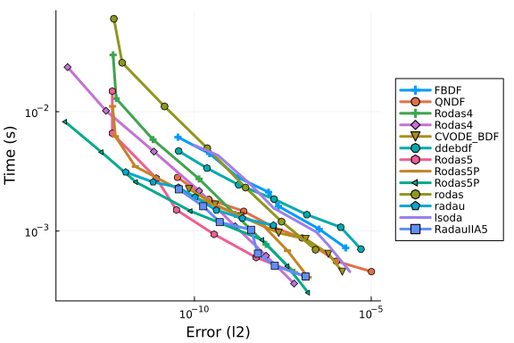

```julia
wp = WorkPrecisionSet(probs, abstols, reltols, setups; verbose = false, dense = false,
    appxsol = test_sol, maxiters = Int(1e5), error_estimate = :L2)
plot(wp)
```

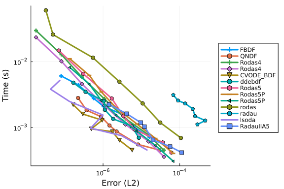

```julia
setups = [Dict(:alg=>GRK4A()),
    Dict(:alg=>Rodas5()),
    Dict(:alg=>Rodas5P()),
    Dict(:alg=>Rodas5P(), :prob_choice => 2),
    Dict(:alg=>Kvaerno5()),
    Dict(:alg=>CVODE_BDF()),
    Dict(:alg=>lsoda()),
    Dict(:alg=>KenCarp4()),
    Dict(:alg=>Rodas4()),
    Dict(:alg=>radau()),
    Dict(:alg=>ImplicitEulerExtrapolation()),
    Dict(:alg=>ImplicitEulerBarycentricExtrapolation()),
    Dict(:alg=>ImplicitHairerWannerExtrapolation())
]
wp = WorkPrecisionSet(probs, abstols, reltols, setups; verbose = false, dense = false,
    save_everystep = false, appxsol = test_sol, maxiters = Int(1e5))
plot(wp)
```

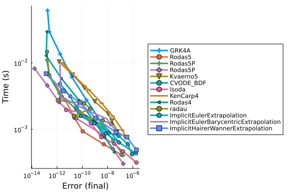

```julia
wp = WorkPrecisionSet(probs, abstols, reltols, setups; verbose = false,
    dense = false, appxsol = test_sol, maxiters = Int(1e5), error_estimate = :l2)
plot(wp)
```

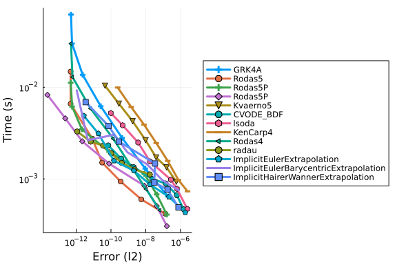

```julia
wp = WorkPrecisionSet(probs, abstols, reltols, setups; verbose = false, dense = false,
    appxsol = test_sol, maxiters = Int(1e5), error_estimate = :L2)
plot(wp)
```

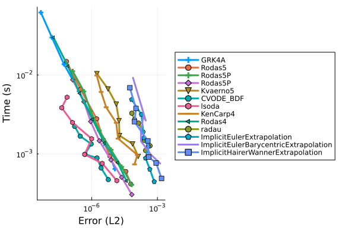

```julia
setups = [Dict(:alg=>Rodas5()),
    Dict(:alg=>Rodas5(), :prob_choice => 2),
    Dict(:alg=>KenCarp5()),
    Dict(:alg=>KenCarp4()),
    Dict(:alg=>KenCarp4(), :prob_choice => 2),
    Dict(:alg=>KenCarp3()),
    Dict(:alg=>ARKODE(order = 5)),
    Dict(:alg=>ARKODE()),
    Dict(:alg=>ARKODE(order = 3))]
names = ["Rodas5" "Rodas5 Static" "KenCarp5" "KenCarp4" "KenCarp4 Static" "KenCarp3" "ARKODE5" "ARKODE4" "ARKODE3"]
wp = WorkPrecisionSet(probs, abstols, reltols, setups; verbose = false, dense = false,
    names = names, save_everystep = false, appxsol = test_sol, maxiters = Int(1e5))
plot(wp)
```

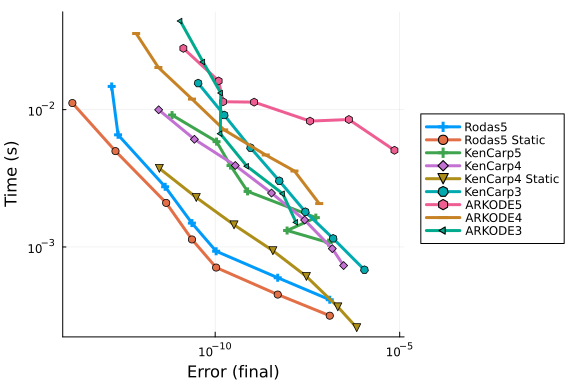

```julia
wp = WorkPrecisionSet(probs, abstols, reltols, setups; verbose = false,
    dense = false, appxsol = test_sol, maxiters = Int(1e5), error_estimate = :l2)
plot(wp)
```

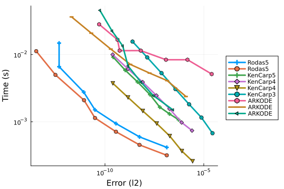


The following algorithms were removed since they failed.

```julia
#setups = [#Dict(:alg=>Hairer4()),
#Dict(:alg=>Hairer42()),
#Dict(:alg=>Rodas3()),
#Dict(:alg=>Kvaerno4()),
#Dict(:alg=>KenCarp5()),
#Dict(:alg=>Cash4())
#]
#wp = WorkPrecisionSet(probs,abstols,reltols,setups;
#                      save_everystep=false,appxsol=test_sol,maxiters=Int(1e5))
#plot(wp)
```


Multithreading with Parallel Extrapolation Methods

```julia
#Setting BLAS to one thread to measure gains
LinearAlgebra.BLAS.set_num_threads(1)

abstols = 1.0 ./ 10.0 .^ (10:12)
reltols = 1.0 ./ 10.0 .^ (7:9)

setups = [
    Dict(:alg=>CVODE_BDF()),
    Dict(:alg=>KenCarp4()),
    Dict(:alg=>Rodas4()),
    Dict(:alg=>Rodas4(), :prob_choice => 2),
    Dict(:alg=>Rodas5P()),
    Dict(:alg=>Rodas5P(), :prob_choice => 2),
    Dict(:alg=>QNDF()),
    Dict(:alg=>lsoda()),
    Dict(:alg=>radau()),
    Dict(:alg=>seulex()),
    Dict(:alg=>ImplicitEulerExtrapolation(
        min_order = 4, init_order = 7, threading = OrdinaryDiffEq.PolyesterThreads())),
    Dict(:alg=>ImplicitEulerExtrapolation(min_order = 4, init_order = 7, threading = false)),
    Dict(:alg=>ImplicitEulerBarycentricExtrapolation(
        min_order = 4, init_order = 7, threading = OrdinaryDiffEq.PolyesterThreads())),
    Dict(:alg=>ImplicitEulerBarycentricExtrapolation(min_order = 4, init_order = 7, threading = false)),
    Dict(:alg=>ImplicitHairerWannerExtrapolation(
        min_order = 3, init_order = 6, threading = OrdinaryDiffEq.PolyesterThreads())),
    Dict(:alg=>ImplicitHairerWannerExtrapolation(min_order = 3, init_order = 6, threading = false))
]

solnames = ["CVODE_BDF", "KenCarp4", "Rodas4", "Rodas4 Static", "Rodas5P",
    "Rodas5P Static", "QNDF", "lsoda", "radau", "seulex",
    "ImplEulerExtpl (threaded)", "ImplEulerExtpl (non-threaded)",
    "ImplEulerBaryExtpl (threaded)", "ImplEulerBaryExtpl (non-threaded)",
    "ImplHWExtpl (threaded)", "ImplHWExtpl (non-threaded)"]

wp = WorkPrecisionSet(probs, abstols, reltols, setups; verbose = false, dense = false,
    names = solnames, save_everystep = false, appxsol = test_sol, maxiters = Int(1e5), numruns = 10)

plot(wp, title = "Implicit Methods: HIRES", legend = :outertopleft, size = (1000, 500),
    xticks = 10.0 .^ (-15:1:1),
    yticks = 10.0 .^ (-6:0.3:5),
    bottom_margin = 5Plots.mm)
```

```
Error: UndefVarError: `PolyesterThreads` not defined
```


## Appendix

These benchmarks are a part of the SciMLBenchmarks.jl repository, found at: [https://github.com/SciML/SciMLBenchmarks.jl](https://github.com/SciML/SciMLBenchmarks.jl). For more information on high-performance scientific machine learning, check out the SciML Open Source Software Organization [https://sciml.ai](https://sciml.ai).

To locally run this benchmark, do the following commands:

```
using SciMLBenchmarks
SciMLBenchmarks.weave_file("benchmarks/StiffODE","Hires.jmd")
```

Computer Information:

```
Julia Version 1.10.11
Commit a2b11907d7b (2026-03-09 14:59 UTC)
Build Info:
  Official https://julialang.org/ release
Platform Info:
  OS: Linux (x86_64-linux-gnu)
  CPU: 128 × AMD EPYC 7502 32-Core Processor
  WORD_SIZE: 64
  LIBM: libopenlibm
  LLVM: libLLVM-15.0.7 (ORCJIT, znver2)
Threads: 1 default, 0 interactive, 1 GC (on 128 virtual cores)
Environment:
  JULIA_CPU_THREADS = 128
  JULIA_DEPOT_PATH = /cache/julia-buildkite-plugin/depots/5b300254-1738-4989-ae0a-f4d2d937f953:

```

Package Information:

```
Status `/cache/build/exclusive-amdci1-0/julialang/scimlbenchmarks-dot-jl/benchmarks/StiffODE/Project.toml`
  [2169fc97] AlgebraicMultigrid v1.2.0
  [6e4b80f9] BenchmarkTools v1.6.3
  [f3b72e0c] DiffEqDevTools v2.49.0
  [5b8099bc] DomainSets v0.7.16
  [5a33fad7] GeometricIntegratorsDiffEq v1.1.0
  [40713840] IncompleteLU v0.2.1
  [7f56f5a3] LSODA v0.7.5
⌃ [7ed4a6bd] LinearSolve v3.59.1
  [94925ecb] MethodOfLines v0.11.11
⌃ [961ee093] ModelingToolkit v11.12.0
⌃ [09606e27] ODEInterfaceDiffEq v3.15.0
  [1dea7af3] OrdinaryDiffEq v6.108.0
  [5960d6e9] OrdinaryDiffEqFIRK v1.23.0
  [65888b18] ParameterizedFunctions v5.22.0
  [91a5bcdd] Plots v1.41.6
  [132c30aa] ProfileSVG v0.2.2
  [f2c3362d] RecursiveFactorization v0.2.26
  [31c91b34] SciMLBenchmarks v0.1.3
⌃ [90137ffa] StaticArrays v1.9.17
  [c3572dad] Sundials v5.1.0
  [0c5d862f] Symbolics v7.15.3
  [a759f4b9] TimerOutputs v0.5.29
  [37e2e46d] LinearAlgebra
  [2f01184e] SparseArrays v1.10.0
Info Packages marked with ⌃ have new versions available and may be upgradable.
```

And the full manifest:

```
Status `/cache/build/exclusive-amdci1-0/julialang/scimlbenchmarks-dot-jl/benchmarks/StiffODE/Manifest.toml`
  [47edcb42] ADTypes v1.21.0
  [a4c015fc] ANSIColoredPrinters v0.0.1
  [621f4979] AbstractFFTs v1.5.0
  [6e696c72] AbstractPlutoDingetjes v1.3.2
  [1520ce14] AbstractTrees v0.4.5
  [7d9f7c33] Accessors v0.1.43
⌃ [79e6a3ab] Adapt v4.4.0
  [2169fc97] AlgebraicMultigrid v1.2.0
  [66dad0bd] AliasTables v1.1.3
  [ec485272] ArnoldiMethod v0.4.0
⌃ [4fba245c] ArrayInterface v7.22.0
  [4c555306] ArrayLayouts v1.12.2
  [13072b0f] AxisAlgorithms v1.1.0
  [aae01518] BandedMatrices v1.11.0
  [6e4b80f9] BenchmarkTools v1.6.3
  [0e736298] Bessels v0.2.8
  [e2ed5e7c] Bijections v0.2.2
  [caf10ac8] BipartiteGraphs v0.1.7
  [d1d4a3ce] BitFlags v0.1.9
  [62783981] BitTwiddlingConvenienceFunctions v0.1.6
  [8e7c35d0] BlockArrays v1.9.3
⌃ [70df07ce] BracketingNonlinearSolve v1.10.0
  [fa961155] CEnum v0.5.0
  [2a0fbf3d] CPUSummary v0.2.7
  [d360d2e6] ChainRulesCore v1.26.0
  [fb6a15b2] CloseOpenIntervals v0.1.13
  [944b1d66] CodecZlib v0.7.8
  [35d6a980] ColorSchemes v3.31.0
⌅ [3da002f7] ColorTypes v0.11.5
⌃ [c3611d14] ColorVectorSpace v0.10.0
⌅ [5ae59095] Colors v0.12.11
⌅ [861a8166] Combinatorics v1.0.2
  [38540f10] CommonSolve v0.2.6
  [bbf7d656] CommonSubexpressions v0.3.1
  [f70d9fcc] CommonWorldInvalidations v1.0.0
  [a09551c4] CompactBasisFunctions v0.2.15
  [34da2185] Compat v4.18.1
  [b152e2b5] CompositeTypes v0.1.4
  [a33af91c] CompositionsBase v0.1.2
  [2569d6c7] ConcreteStructs v0.2.3
  [f0e56b4a] ConcurrentUtilities v2.5.1
  [8f4d0f93] Conda v1.10.3
  [187b0558] ConstructionBase v1.6.0
  [7ae1f121] ContinuumArrays v0.20.4
  [d38c429a] Contour v0.6.3
  [adafc99b] CpuId v0.3.1
  [a8cc5b0e] Crayons v4.1.1
  [717857b8] DSP v0.8.4
  [9a962f9c] DataAPI v1.16.0
  [864edb3b] DataStructures v0.19.3
  [e2d170a0] DataValueInterfaces v1.0.0
  [8bb1440f] DelimitedFiles v1.9.1
⌃ [2b5f629d] DiffEqBase v6.210.0
  [459566f4] DiffEqCallbacks v4.12.0
  [f3b72e0c] DiffEqDevTools v2.49.0
  [77a26b50] DiffEqNoiseProcess v5.27.0
  [163ba53b] DiffResults v1.1.0
  [b552c78f] DiffRules v1.15.1
  [a0c0ee7d] DifferentiationInterface v0.7.16
  [b4f34e82] Distances v0.10.12
  [31c24e10] Distributions v0.25.123
  [ffbed154] DocStringExtensions v0.9.5
  [e30172f5] Documenter v1.17.0
  [5b8099bc] DomainSets v0.7.16
  [7c1d4256] DynamicPolynomials v0.6.4
  [4e289a0a] EnumX v1.0.7
  [f151be2c] EnzymeCore v0.8.18
  [460bff9d] ExceptionUnwrapping v0.1.11
  [d4d017d3] ExponentialUtilities v1.30.0
  [e2ba6199] ExprTools v0.1.10
  [55351af7] ExproniconLite v0.10.14
  [c87230d0] FFMPEG v0.4.5
  [7a1cc6ca] FFTW v1.10.0
  [7034ab61] FastBroadcast v0.3.5
  [9aa1b823] FastClosures v0.3.2
  [442a2c76] FastGaussQuadrature v1.1.0
  [a4df4552] FastPower v1.3.1
  [057dd010] FastTransforms v0.17.1
  [5789e2e9] FileIO v1.18.0
  [1a297f60] FillArrays v1.16.0
  [64ca27bc] FindFirstFunctions v1.8.0
  [6a86dc24] FiniteDiff v2.29.0
  [53c48c17] FixedPointNumbers v0.8.5
  [08572546] FlameGraphs v1.1.0
  [1fa38f19] Format v1.3.7
  [f6369f11] ForwardDiff v1.3.2
  [069b7b12] FunctionWrappers v1.1.3
  [77dc65aa] FunctionWrappersWrappers v0.1.3
  [46192b85] GPUArraysCore v0.2.0
⌃ [28b8d3ca] GR v0.73.22
  [a8297547] GenericFFT v0.1.6
  [14197337] GenericLinearAlgebra v0.3.19
  [c145ed77] GenericSchur v0.5.6
⌅ [9a0b12b7] GeometricBase v0.12.10
⌃ [c85262ba] GeometricEquations v0.20.4
  [dcce2d33] GeometricIntegrators v0.15.5
  [71212ab4] GeometricIntegratorsBase v0.1.11
  [5a33fad7] GeometricIntegratorsDiffEq v1.1.0
⌃ [7843afe4] GeometricSolutions v0.5.11
  [d7ba0133] Git v1.5.0
⌃ [86223c79] Graphs v1.13.4
  [42e2da0e] Grisu v1.0.2
⌃ [cd3eb016] HTTP v1.10.19
⌅ [eafb193a] Highlights v0.5.3
  [3e5b6fbb] HostCPUFeatures v0.1.18
  [34004b35] HypergeometricFunctions v0.3.28
  [7073ff75] IJulia v1.34.4
  [b5f81e59] IOCapture v1.0.0
  [615f187c] IfElse v0.1.1
⌃ [3263718b] ImplicitDiscreteSolve v1.7.0
  [40713840] IncompleteLU v0.2.1
  [9b13fd28] IndirectArrays v1.0.0
  [4858937d] InfiniteArrays v0.15.11
  [e1ba4f0e] Infinities v0.1.12
  [d25df0c9] Inflate v0.1.5
  [18e54dd8] IntegerMathUtils v0.1.3
  [a98d9a8b] Interpolations v0.16.2
  [8197267c] IntervalSets v0.7.13
  [3587e190] InverseFunctions v0.1.17
  [92d709cd] IrrationalConstants v0.2.6
  [c8e1da08] IterTools v1.10.0
  [82899510] IteratorInterfaceExtensions v1.0.0
  [1019f520] JLFzf v0.1.11
  [692b3bcd] JLLWrappers v1.7.1
⌅ [682c06a0] JSON v0.21.4
  [ae98c720] Jieko v0.2.1
⌃ [ccbc3e58] JumpProcesses v9.22.2
⌃ [ba0b0d4f] Krylov v0.10.5
  [7f56f5a3] LSODA v0.7.5
  [b964fa9f] LaTeXStrings v1.4.0
  [23fbe1c1] Latexify v0.16.10
  [10f19ff3] LayoutPointers v0.1.17
  [0e77f7df] LazilyInitializedFields v1.3.0
  [5078a376] LazyArrays v2.9.5
  [1d6d02ad] LeftChildRightSiblingTrees v0.2.1
  [87fe0de2] LineSearch v0.1.6
⌃ [d3d80556] LineSearches v7.5.1
⌃ [7ed4a6bd] LinearSolve v3.59.1
  [2ab3a3ac] LogExpFunctions v0.3.29
  [e6f89c97] LoggingExtras v1.2.0
  [bdcacae8] LoopVectorization v0.12.173
  [1914dd2f] MacroTools v0.5.16
  [d125e4d3] ManualMemory v0.1.8
  [d0879d2d] MarkdownAST v0.1.3
  [bb5d69b7] MaybeInplace v0.1.4
  [739be429] MbedTLS v1.1.10
  [442fdcdd] Measures v0.3.3
  [94925ecb] MethodOfLines v0.11.11
  [e1d29d7a] Missings v1.2.0
⌃ [961ee093] ModelingToolkit v11.12.0
⌃ [7771a370] ModelingToolkitBase v1.17.0
⌃ [6bb917b9] ModelingToolkitTearing v1.4.0
  [2e0e35c7] Moshi v0.3.7
  [46d2c3a1] MuladdMacro v0.2.4
⌃ [102ac46a] MultivariatePolynomials v0.5.13
  [ffc61752] Mustache v1.0.21
  [d8a4904e] MutableArithmetics v1.6.7
⌅ [d41bc354] NLSolversBase v7.10.0
  [2774e3e8] NLsolve v4.5.1
  [77ba4419] NaNMath v1.1.3
⌃ [8913a72c] NonlinearSolve v4.15.0
⌃ [be0214bd] NonlinearSolveBase v2.14.0
⌅ [5959db7a] NonlinearSolveFirstOrder v1.11.1
  [9a2c21bd] NonlinearSolveQuasiNewton v1.12.0
  [26075421] NonlinearSolveSpectralMethods v1.6.0
  [54ca160b] ODEInterface v0.5.0
⌃ [09606e27] ODEInterfaceDiffEq v3.15.0
  [6fe1bfb0] OffsetArrays v1.17.0
  [4d8831e6] OpenSSL v1.6.1
  [bac558e1] OrderedCollections v1.8.1
  [1dea7af3] OrdinaryDiffEq v6.108.0
  [89bda076] OrdinaryDiffEqAdamsBashforthMoulton v1.9.0
⌃ [6ad6398a] OrdinaryDiffEqBDF v1.21.0
⌃ [bbf590c4] OrdinaryDiffEqCore v3.10.0
⌃ [50262376] OrdinaryDiffEqDefault v1.12.0
⌃ [4302a76b] OrdinaryDiffEqDifferentiation v2.1.0
  [9286f039] OrdinaryDiffEqExplicitRK v1.9.0
  [e0540318] OrdinaryDiffEqExponentialRK v1.13.0
⌃ [becaefa8] OrdinaryDiffEqExtrapolation v1.15.0
  [5960d6e9] OrdinaryDiffEqFIRK v1.23.0
  [101fe9f7] OrdinaryDiffEqFeagin v1.8.0
  [d3585ca7] OrdinaryDiffEqFunctionMap v1.9.0
  [d28bc4f8] OrdinaryDiffEqHighOrderRK v1.9.0
  [9f002381] OrdinaryDiffEqIMEXMultistep v1.12.0
  [521117fe] OrdinaryDiffEqLinear v1.10.0
  [1344f307] OrdinaryDiffEqLowOrderRK v1.10.0
  [b0944070] OrdinaryDiffEqLowStorageRK v1.12.0
  [127b3ac7] OrdinaryDiffEqNonlinearSolve v1.23.0
  [c9986a66] OrdinaryDiffEqNordsieck v1.9.0
  [5dd0a6cf] OrdinaryDiffEqPDIRK v1.11.0
  [5b33eab2] OrdinaryDiffEqPRK v1.8.0
  [04162be5] OrdinaryDiffEqQPRK v1.8.0
  [af6ede74] OrdinaryDiffEqRKN v1.10.0
  [43230ef6] OrdinaryDiffEqRosenbrock v1.25.0
  [2d112036] OrdinaryDiffEqSDIRK v1.12.0
  [669c94d9] OrdinaryDiffEqSSPRK v1.11.0
  [e3e12d00] OrdinaryDiffEqStabilizedIRK v1.11.0
  [358294b1] OrdinaryDiffEqStabilizedRK v1.8.0
  [fa646aed] OrdinaryDiffEqSymplecticRK v1.11.0
  [b1df2697] OrdinaryDiffEqTsit5 v1.9.0
  [79d7bb75] OrdinaryDiffEqVerner v1.11.0
  [a7812802] PDEBase v0.1.21
  [90014a1f] PDMats v0.11.37
  [65888b18] ParameterizedFunctions v5.22.0
  [d96e819e] Parameters v0.12.3
  [69de0a69] Parsers v2.8.3
  [ccf2f8ad] PlotThemes v3.3.0
  [995b91a9] PlotUtils v1.4.4
  [91a5bcdd] Plots v1.41.6
  [e409e4f3] PoissonRandom v0.4.7
  [f517fe37] Polyester v0.7.19
  [1d0040c9] PolyesterWeave v0.2.2
⌃ [f27b6e38] Polynomials v4.1.0
  [d236fae5] PreallocationTools v1.1.2
⌅ [aea7be01] PrecompileTools v1.2.1
  [21216c6a] Preferences v1.5.2
  [08abe8d2] PrettyTables v3.2.3
  [27ebfcd6] Primes v0.5.7
  [132c30aa] ProfileSVG v0.2.2
  [92933f4c] ProgressMeter v1.11.0
  [43287f4e] PtrArrays v1.4.0
  [1fd47b50] QuadGK v2.11.2
  [a08977f5] QuadratureRules v0.1.6
⌃ [c4ea9172] QuasiArrays v0.13.3
  [c84ed2f1] Ratios v0.4.5
  [988b38a3] ReadOnlyArrays v0.2.0
  [795d4caa] ReadOnlyDicts v1.0.1
  [3cdcf5f2] RecipesBase v1.3.4
  [01d81517] RecipesPipeline v0.6.12
  [807425ed] RecurrenceRelationships v0.2.0
  [731186ca] RecursiveArrayTools v3.48.0
  [f2c3362d] RecursiveFactorization v0.2.26
  [189a3867] Reexport v1.2.2
  [2792f1a3] RegistryInstances v0.1.0
  [05181044] RelocatableFolders v1.0.1
  [ae029012] Requires v1.3.1
  [ae5879a3] ResettableStacks v1.2.0
  [79098fc4] Rmath v0.9.0
  [47965b36] RootedTrees v2.25.0
  [fb486d5c] RungeKutta v0.5.18
  [7e49a35a] RuntimeGeneratedFunctions v0.5.17
  [9dfe8606] SCCNonlinearSolve v1.11.0
  [94e857df] SIMDTypes v0.1.0
  [476501e8] SLEEFPirates v0.6.43
⌃ [0bca4576] SciMLBase v2.144.2
  [31c91b34] SciMLBenchmarks v0.1.3
  [19f34311] SciMLJacobianOperators v0.1.12
  [a6db7da4] SciMLLogging v1.9.1
  [c0aeaf25] SciMLOperators v1.15.1
  [431bcebd] SciMLPublic v1.0.1
  [53ae85a6] SciMLStructures v1.10.0
  [6c6a2e73] Scratch v1.3.0
  [efcf1570] Setfield v1.1.2
  [992d4aef] Showoff v1.0.3
  [777ac1f9] SimpleBufferStream v1.2.0
  [727e6d20] SimpleNonlinearSolve v2.11.0
⌃ [36b790f5] SimpleSolvers v0.7.7
  [699a6c99] SimpleTraits v0.9.5
  [a2af1166] SortingAlgorithms v1.2.2
  [bd59d7e1] SparseBandedMatrices v1.3.0
⌃ [0a514795] SparseMatrixColorings v0.4.23
  [276daf66] SpecialFunctions v2.7.1
  [860ef19b] StableRNGs v1.0.4
⌃ [64909d44] StateSelection v1.3.0
  [aedffcd0] Static v1.3.1
  [0d7ed370] StaticArrayInterface v1.9.0
⌃ [90137ffa] StaticArrays v1.9.17
  [1e83bf80] StaticArraysCore v1.4.4
  [82ae8749] StatsAPI v1.8.0
  [2913bbd2] StatsBase v0.34.10
  [4c63d2b9] StatsFuns v1.5.2
  [7792a7ef] StrideArraysCore v0.5.8
  [69024149] StringEncodings v0.3.7
  [892a3eda] StringManipulation v0.4.4
  [09ab397b] StructArrays v0.7.2
  [c3572dad] Sundials v5.1.0
  [3384d301] SymbolicCompilerPasses v0.1.2
  [2efcf032] SymbolicIndexingInterface v0.3.46
  [19f23fe9] SymbolicLimits v1.1.0
⌃ [d1185830] SymbolicUtils v4.18.5
  [0c5d862f] Symbolics v7.15.3
  [3783bdb8] TableTraits v1.0.1
  [bd369af6] Tables v1.12.1
  [ed4db957] TaskLocalValues v0.1.3
  [62fd8b95] TensorCore v0.1.1
  [8ea1fca8] TermInterface v2.0.0
  [8290d209] ThreadingUtilities v0.5.5
  [a759f4b9] TimerOutputs v0.5.29
  [c751599d] ToeplitzMatrices v0.8.5
  [3bb67fe8] TranscodingStreams v0.11.3
  [d5829a12] TriangularSolve v0.2.1
  [781d530d] TruncatedStacktraces v1.4.0
  [5c2747f8] URIs v1.6.1
  [3a884ed6] UnPack v1.0.2
  [1cfade01] UnicodeFun v0.4.1
  [41fe7b60] Unzip v0.2.0
  [3d5dd08c] VectorizationBase v0.21.72
  [33b4df10] VectorizedRNG v0.2.25
  [81def892] VersionParsing v1.3.0
  [d30d5f5c] WeakCacheSets v0.1.0
  [44d3d7a6] Weave v0.10.12
  [efce3f68] WoodburyMatrices v1.1.0
  [ddb6d928] YAML v0.4.16
  [c2297ded] ZMQ v1.5.1
  [6e34b625] Bzip2_jll v1.0.9+0
  [83423d85] Cairo_jll v1.18.5+1
  [ee1fde0b] Dbus_jll v1.16.2+0
  [2702e6a9] EpollShim_jll v0.0.20230411+1
  [2e619515] Expat_jll v2.7.3+0
⌃ [b22a6f82] FFMPEG_jll v8.0.1+0
  [f5851436] FFTW_jll v3.3.11+0
  [34b6f7d7] FastTransforms_jll v0.6.3+0
  [a3f928ae] Fontconfig_jll v2.17.1+0
  [d7e528f0] FreeType2_jll v2.13.4+0
  [559328eb] FriBidi_jll v1.0.17+0
  [0656b61e] GLFW_jll v3.4.1+0
⌅ [d2c73de3] GR_jll v0.73.22+0
  [b0724c58] GettextRuntime_jll v0.22.4+0
  [61579ee1] Ghostscript_jll v9.55.1+0
  [020c3dae] Git_LFS_jll v3.7.0+0
  [f8c6e375] Git_jll v2.53.0+0
  [7746bdde] Glib_jll v2.86.3+0
  [3b182d85] Graphite2_jll v1.3.15+0
  [2e76f6c2] HarfBuzz_jll v8.5.1+0
  [1d5cc7b8] IntelOpenMP_jll v2025.2.0+0
  [aacddb02] JpegTurbo_jll v3.1.4+0
  [c1c5ebd0] LAME_jll v3.100.3+0
  [88015f11] LERC_jll v4.0.1+0
  [1d63c593] LLVMOpenMP_jll v18.1.8+0
  [aae0fff6] LSODA_jll v0.1.2+0
  [dd4b983a] LZO_jll v2.10.3+0
⌅ [e9f186c6] Libffi_jll v3.4.7+0
  [7e76a0d4] Libglvnd_jll v1.7.1+1
  [94ce4f54] Libiconv_jll v1.18.0+0
  [4b2f31a3] Libmount_jll v2.41.3+0
  [89763e89] Libtiff_jll v4.7.2+0
  [38a345b3] Libuuid_jll v2.41.3+0
  [856f044c] MKL_jll v2025.2.0+0
  [c771fb93] ODEInterface_jll v0.0.2+0
  [e7412a2a] Ogg_jll v1.3.6+0
⌅ [656ef2d0] OpenBLAS32_jll v0.3.24+0
  [9bd350c2] OpenSSH_jll v10.2.1+0
  [458c3c95] OpenSSL_jll v3.5.5+0
  [efe28fd5] OpenSpecFun_jll v0.5.6+0
  [91d4177d] Opus_jll v1.6.1+0
  [36c8627f] Pango_jll v1.57.0+0
⌅ [30392449] Pixman_jll v0.44.2+0
⌅ [c0090381] Qt6Base_jll v6.8.2+2
⌅ [629bc702] Qt6Declarative_jll v6.8.2+1
⌅ [ce943373] Qt6ShaderTools_jll v6.8.2+1
⌃ [e99dba38] Qt6Wayland_jll v6.8.2+2
  [f50d1b31] Rmath_jll v0.5.1+0
⌅ [ca45d3f4] SuiteSparse32_jll v5.10.1+0
  [fb77eaff] Sundials_jll v7.5.0+0
  [a44049a8] Vulkan_Loader_jll v1.3.243+0
  [a2964d1f] Wayland_jll v1.24.0+0
  [ffd25f8a] XZ_jll v5.8.2+0
  [f67eecfb] Xorg_libICE_jll v1.1.2+0
  [c834827a] Xorg_libSM_jll v1.2.6+0
  [4f6342f7] Xorg_libX11_jll v1.8.13+0
  [0c0b7dd1] Xorg_libXau_jll v1.0.13+0
  [935fb764] Xorg_libXcursor_jll v1.2.4+0
  [a3789734] Xorg_libXdmcp_jll v1.1.6+0
  [1082639a] Xorg_libXext_jll v1.3.8+0
  [d091e8ba] Xorg_libXfixes_jll v6.0.2+0
  [a51aa0fd] Xorg_libXi_jll v1.8.3+0
  [d1454406] Xorg_libXinerama_jll v1.1.7+0
  [ec84b674] Xorg_libXrandr_jll v1.5.6+0
  [ea2f1a96] Xorg_libXrender_jll v0.9.12+0
  [c7cfdc94] Xorg_libxcb_jll v1.17.1+0
  [cc61e674] Xorg_libxkbfile_jll v1.2.0+0
  [e920d4aa] Xorg_xcb_util_cursor_jll v0.1.6+0
  [12413925] Xorg_xcb_util_image_jll v0.4.1+0
  [2def613f] Xorg_xcb_util_jll v0.4.1+0
  [975044d2] Xorg_xcb_util_keysyms_jll v0.4.1+0
  [0d47668e] Xorg_xcb_util_renderutil_jll v0.3.10+0
  [c22f9ab0] Xorg_xcb_util_wm_jll v0.4.2+0
  [35661453] Xorg_xkbcomp_jll v1.4.7+0
  [33bec58e] Xorg_xkeyboard_config_jll v2.44.0+0
  [c5fb5394] Xorg_xtrans_jll v1.6.0+0
  [8f1865be] ZeroMQ_jll v4.3.6+0
  [3161d3a3] Zstd_jll v1.5.7+1
  [35ca27e7] eudev_jll v3.2.14+0
  [214eeab7] fzf_jll v0.61.1+0
  [a4ae2306] libaom_jll v3.13.1+0
  [0ac62f75] libass_jll v0.17.4+0
  [1183f4f0] libdecor_jll v0.2.2+0
  [2db6ffa8] libevdev_jll v1.13.4+0
  [f638f0a6] libfdk_aac_jll v2.0.4+0
  [36db933b] libinput_jll v1.28.1+0
  [b53b4c65] libpng_jll v1.6.55+0
  [a9144af2] libsodium_jll v1.0.21+0
  [f27f6e37] libvorbis_jll v1.3.8+0
  [009596ad] mtdev_jll v1.1.7+0
  [1317d2d5] oneTBB_jll v2022.0.0+1
⌅ [1270edf5] x264_jll v10164.0.1+0
  [dfaa095f] x265_jll v4.1.0+0
  [d8fb68d0] xkbcommon_jll v1.13.0+0
  [0dad84c5] ArgTools v1.1.1
  [56f22d72] Artifacts
  [2a0f44e3] Base64
  [ade2ca70] Dates
  [8ba89e20] Distributed
  [f43a241f] Downloads v1.6.0
  [7b1f6079] FileWatching
  [9fa8497b] Future
  [b77e0a4c] InteractiveUtils
  [4af54fe1] LazyArtifacts
  [b27032c2] LibCURL v0.6.4
  [76f85450] LibGit2
  [8f399da3] Libdl
  [37e2e46d] LinearAlgebra
  [56ddb016] Logging
  [d6f4376e] Markdown
  [a63ad114] Mmap
  [ca575930] NetworkOptions v1.2.0
  [44cfe95a] Pkg v1.10.0
  [de0858da] Printf
  [9abbd945] Profile
  [3fa0cd96] REPL
  [9a3f8284] Random
  [ea8e919c] SHA v0.7.0
  [9e88b42a] Serialization
  [1a1011a3] SharedArrays
  [6462fe0b] Sockets
  [2f01184e] SparseArrays v1.10.0
  [10745b16] Statistics v1.10.0
  [4607b0f0] SuiteSparse
  [fa267f1f] TOML v1.0.3
  [a4e569a6] Tar v1.10.0
  [8dfed614] Test
  [cf7118a7] UUIDs
  [4ec0a83e] Unicode
  [e66e0078] CompilerSupportLibraries_jll v1.1.1+0
  [781609d7] GMP_jll v6.2.1+6
  [deac9b47] LibCURL_jll v8.4.0+0
  [e37daf67] LibGit2_jll v1.6.4+0
  [29816b5a] LibSSH2_jll v1.11.0+1
  [3a97d323] MPFR_jll v4.2.0+1
  [c8ffd9c3] MbedTLS_jll v2.28.2+1
  [14a3606d] MozillaCACerts_jll v2023.1.10
  [4536629a] OpenBLAS_jll v0.3.23+4
  [05823500] OpenLibm_jll v0.8.5+0
  [efcefdf7] PCRE2_jll v10.42.0+1
  [bea87d4a] SuiteSparse_jll v7.2.1+1
  [83775a58] Zlib_jll v1.2.13+1
  [8e850b90] libblastrampoline_jll v5.11.0+0
  [8e850ede] nghttp2_jll v1.52.0+1
  [3f19e933] p7zip_jll v17.4.0+2
Info Packages marked with ⌃ and ⌅ have new versions available. Those with ⌃ may be upgradable, but those with ⌅ are restricted by compatibility constraints from upgrading. To see why use `status --outdated -m`
```

