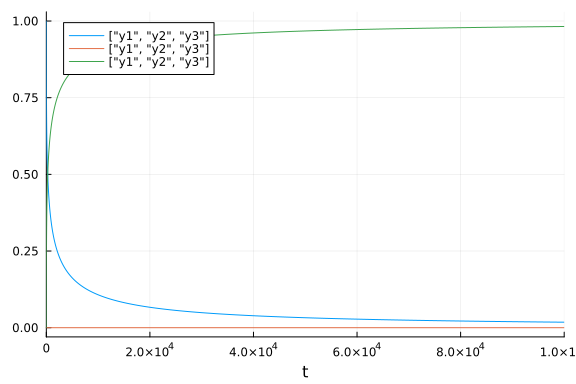
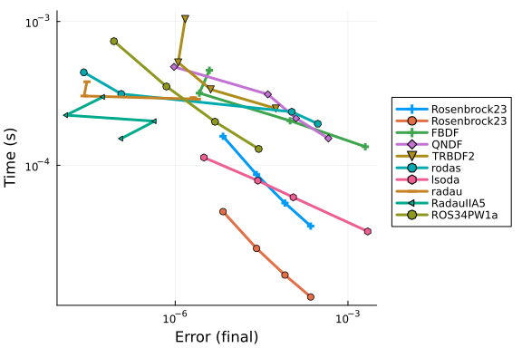
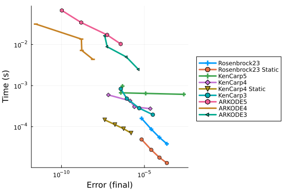
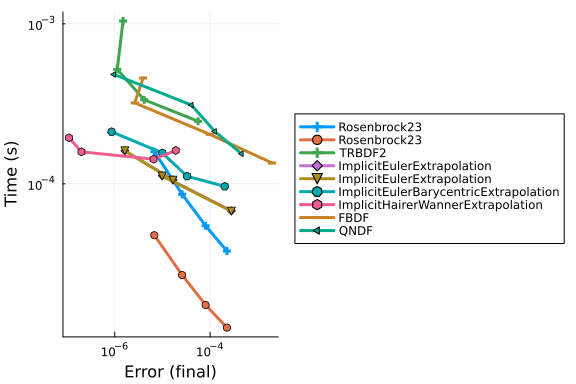
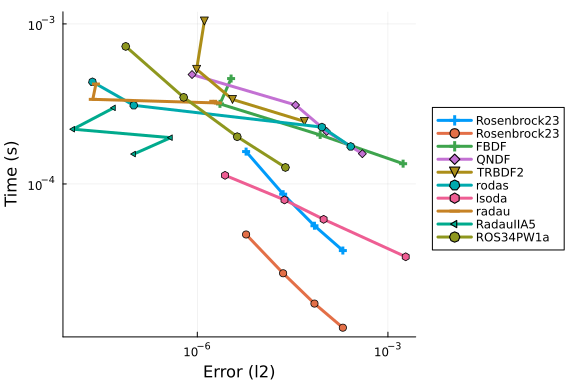
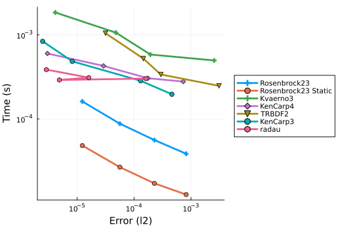
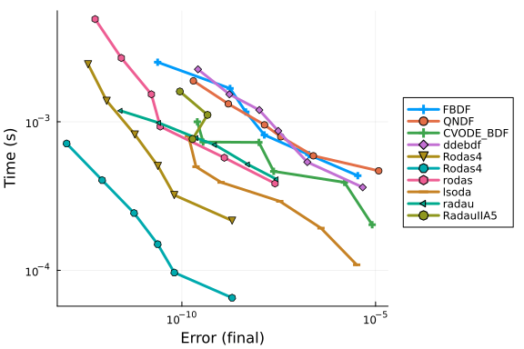
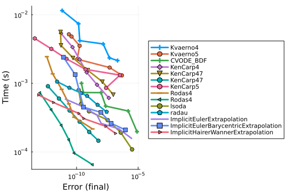
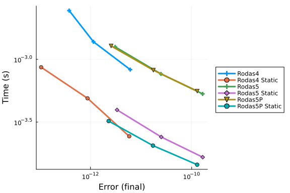

```julia
using OrdinaryDiffEq, DiffEqDevTools, Sundials, ParameterizedFunctions, Plots, ODEInterfaceDiffEq, LSODA
gr()
using LinearAlgebra, StaticArrays

rober = @ode_def begin
  dy₁ = -k₁*y₁+k₃*y₂*y₃
  dy₂ =  k₁*y₁-k₂*y₂^2-k₃*y₂*y₃
  dy₃ =  k₂*y₂^2
end k₁ k₂ k₃

prob = ODEProblem{true, SciMLBase.FullSpecialize}(rober,[1.0,0.0,0.0],(0.0,1e5),(0.04,3e7,1e4))
probstatic = ODEProblem{false}(rober,SA[1.0,0.0,0.0],(0.0,1e5),(0.04,3e7,1e4))

sol = solve(prob,CVODE_BDF(),abstol=1/10^14,reltol=1/10^14)
sol2 = solve(probstatic,Rodas5P(),abstol=1/10^14,reltol=1/10^14)
probs = [prob,probstatic]
test_sol = [sol,sol2];

abstols = 1.0 ./ 10.0 .^ (4:11)
reltols = 1.0 ./ 10.0 .^ (1:8);
```


```julia
plot(sol,labels=["y1","y2","y3"])
```




## Omissions And Tweaking

The following were omitted from the tests due to convergence failures. ODE.jl's
adaptivity is not able to stabilize its algorithms, while
GeometricIntegratorsDiffEq has not upgraded to Julia 1.0.
GeometricIntegrators.jl's methods used to be either fail to converge at
comparable dts (or on some computers errors due to type conversions).

```julia
#sol = solve(prob,ode23s()); println("Total ODE.jl steps: $(length(sol))")
#using GeometricIntegratorsDiffEq
#try
#    sol = solve(prob,GIRadIIA3(),dt=1/10)
#catch e
#    println(e)
#end
```


`ARKODE` needs a lower `nonlinear_convergence_coefficient` in order to not diverge.

```julia
#sol = solve(prob,ARKODE(nonlinear_convergence_coefficient = 1e-6),abstol=1e-5,reltol=1e-1); # Noisy, output omitted
```


```julia
sol = solve(prob,ARKODE(nonlinear_convergence_coefficient = 1e-7),abstol=1e-5,reltol=1e-1);
```


Note that `1e-7` matches the value from the Sundials manual which was required for their example to converge on this problem. The default is `1e-1`.

```julia
#sol = solve(prob,ARKODE(order=3),abstol=1e-4,reltol=1e-1); # Fails to diverge but doesn't finish
```


```julia
#sol = solve(prob,ARKODE(order=5),abstol=1e-4,reltol=1e-1); # Noisy, output omitted
```


```julia
#sol = solve(prob,ARKODE(order=5,nonlinear_convergence_coefficient = 1e-9),abstol=1e-5,reltol=1e-1); # Noisy, output omitted
```


Additionally, the ROCK methods do not perform well on this benchmark.

```julia
setups = [
          #Dict(:alg=>ROCK2())    #Unstable
          #Dict(:alg=>ROCK4())    #needs more iterations
          ]
```

```
Any[]
```


Some of the bad Rosenbrocks fail:

```julia
setups = [
  #Dict(:alg=>Hairer4()),
  #Dict(:alg=>Hairer42()),
  #Dict(:alg=>Cash4()),
]
```

```
Any[]
```


The EPIRK and exponential methods also fail:

```julia
sol = solve(prob,EXPRB53s3(),dt=2.0^(-8));
sol = solve(prob,EPIRK4s3B(),dt=2.0^(-8));
sol = solve(prob,EPIRK5P2(),dt=2.0^(-8));
```

```
Error: InexactError: trunc(Int64, Inf)
```


PDIRK44 also fails

```julia
sol = solve(prob,PDIRK44(),dt=2.0^(-8));
```


In fact, all non-adaptive methods fail on this problem.

## High Tolerances

This is the speed when you just want the answer. `ode23s` from ODE.jl was removed since it fails. Note that at high tolerances Sundials' `CVODE_BDF` fails as well so it's excluded from this test.

```julia
abstols = 1.0 ./ 10.0 .^ (5:8)
reltols = 1.0 ./ 10.0 .^ (1:4);
setups = [Dict(:alg=>Rosenbrock23()),
          Dict(:alg=>Rosenbrock23(), :prob_choice => 2),
          Dict(:alg=>FBDF()),
          Dict(:alg=>QNDF()),
          Dict(:alg=>TRBDF2()),
          Dict(:alg=>rodas()),
          Dict(:alg=>lsoda()),
          Dict(:alg=>radau()),
          Dict(:alg=>RadauIIA5()),
          Dict(:alg=>ROS34PW1a()),
          ]
gr()
wp = WorkPrecisionSet(probs,abstols,reltols,setups; verbose=false, dense=false,
                      save_everystep=false,appxsol=test_sol,maxiters=Int(1e5),numruns=10)
plot(wp)
```



```julia
setups = [Dict(:alg=>Rosenbrock23()),
          Dict(:alg=>Rosenbrock23(), :prob_choice => 2),
          Dict(:alg=>Kvaerno3()),
          Dict(:alg=>KenCarp4()),
          Dict(:alg=>TRBDF2()),
          Dict(:alg=>KenCarp3()),
          Dict(:alg=>lsoda()),
          # Dict(:alg=>SDIRK2()), # Removed because it's bad
          Dict(:alg=>radau())]
names = ["Rosenbrock23" "Rosenbrock23 Static" "Kvaerno3" "KenCarp4" "TRBDF2" "KenCarp3" "lsoda" "radau"]
wp = WorkPrecisionSet(probs,abstols,reltols,setups;names=names, verbose=false, dense=false,
                      save_everystep=false,appxsol=test_sol,maxiters=Int(1e5),numruns=10)
plot(wp)
```


```julia
setups = [Dict(:alg=>Rosenbrock23()),
          Dict(:alg=>Rosenbrock23(), :prob_choice => 2),
          Dict(:alg=>KenCarp5()),
          Dict(:alg=>KenCarp4()),
          Dict(:alg=>KenCarp4(), :prob_choice => 2),
          Dict(:alg=>KenCarp3()),
          Dict(:alg=>ARKODE(nonlinear_convergence_coefficient = 1e-9,order=5)),
          Dict(:alg=>ARKODE(nonlinear_convergence_coefficient = 1e-8)),
          Dict(:alg=>ARKODE(nonlinear_convergence_coefficient = 1e-7,order=3))
]
names = ["Rosenbrock23" "Rosenbrock23 Static" "KenCarp5" "KenCarp4" "KenCarp4 Static" "KenCarp3" "ARKODE5" "ARKODE4" "ARKODE3"]
wp = WorkPrecisionSet(probs,abstols,reltols,setups;
                      names=names, verbose=false, dense=false,
                      save_everystep=false,appxsol=test_sol,maxiters=Int(1e5),numruns=10)
plot(wp)
```



```julia
setups = [Dict(:alg=>Rosenbrock23()),
          Dict(:alg=>Rosenbrock23(), :prob_choice => 2),
          Dict(:alg=>TRBDF2()),
          Dict(:alg=>ImplicitEulerExtrapolation()),
          Dict(:alg=>ImplicitEulerExtrapolation()),
          Dict(:alg=>ImplicitEulerBarycentricExtrapolation()),
          Dict(:alg=>ImplicitHairerWannerExtrapolation()),
          #Dict(:alg=>ABDF2()), # Maxiters
          Dict(:alg=>FBDF()),
          Dict(:alg=>QNDF()),
          #Dict(:alg=>Exprb43()), #SingularException
          #Dict(:alg=>Exprb32()), #SingularException
]
wp = WorkPrecisionSet(probs,abstols,reltols,setups; verbose=false, dense=false,
                      save_everystep=false,appxsol=test_sol,maxiters=Int(1e5),numruns=10)
plot(wp)
```




### Timeseries Errors

```julia
abstols = 1.0 ./ 10.0 .^ (5:8)
reltols = 1.0 ./ 10.0 .^ (1:4);
setups = [Dict(:alg=>Rosenbrock23()),
          Dict(:alg=>Rosenbrock23(), :prob_choice => 2),
          Dict(:alg=>FBDF()),
          Dict(:alg=>QNDF()),
          Dict(:alg=>TRBDF2()),
          Dict(:alg=>rodas()),
          Dict(:alg=>lsoda()),
          Dict(:alg=>radau()),
          Dict(:alg=>RadauIIA5()),
          Dict(:alg=>ROS34PW1a()),
          ]
gr()
wp = WorkPrecisionSet(probs,abstols,reltols,setups;error_estimate=:l2, verbose=false, dense=false,
                      save_everystep=false,appxsol=test_sol,maxiters=Int(1e5),numruns=10)
plot(wp)
```



```julia
setups = [Dict(:alg=>Rosenbrock23()),
          Dict(:alg=>Rosenbrock23(), :prob_choice => 2),
          Dict(:alg=>Kvaerno3()),
          Dict(:alg=>KenCarp4()),
          Dict(:alg=>TRBDF2()),
          Dict(:alg=>KenCarp3()),
    # Dict(:alg=>SDIRK2()), # Removed because it's bad
          Dict(:alg=>radau())]
names = ["Rosenbrock23" "Rosenbrock23 Static" "Kvaerno3" "KenCarp4" "TRBDF2" "KenCarp3" "radau"]
wp = WorkPrecisionSet(probs,abstols,reltols,setups;names=names, verbose=false, dense=false,
                      appxsol=test_sol,maxiters=Int(1e5),error_estimate=:l2,numruns=10)
plot(wp)
```



```julia
setups = [Dict(:alg=>Rosenbrock23()),
          Dict(:alg=>Rosenbrock23(), :prob_choice => 2),
          Dict(:alg=>TRBDF2()),
          Dict(:alg=>ImplicitEulerExtrapolation()),
          Dict(:alg=>ImplicitEulerExtrapolation()),
          Dict(:alg=>ImplicitEulerBarycentricExtrapolation()),
          Dict(:alg=>ImplicitHairerWannerExtrapolation()),
          #Dict(:alg=>ABDF2()), # Maxiters
          Dict(:alg=>FBDF()),
          Dict(:alg=>QNDF()),
          #Dict(:alg=>Exprb43()), #SingularException
          #Dict(:alg=>Exprb32()), #SingularException
]
wp = WorkPrecisionSet(probs,abstols,reltols,setups;verbose=false,error_estimate=:l2,
                      save_everystep=false,appxsol=test_sol,maxiters=Int(1e5),numruns=10)
plot(wp)
```


### Low Tolerances

This is the speed at lower tolerances, measuring what's good when accuracy is needed.

```julia
abstols = 1.0 ./ 10.0 .^ (7:12)
reltols = 1.0 ./ 10.0 .^ (4:9)

setups = [#Dict(:alg=>Rodas5()),
          Dict(:alg=>FBDF()),
          Dict(:alg=>QNDF()),
          Dict(:alg=>CVODE_BDF()),
          Dict(:alg=>ddebdf()),
          Dict(:alg=>Rodas4()),
          Dict(:alg=>Rodas4(), :prob_choice => 2),
          #Dict(:alg=>Rodas5P()),
          Dict(:alg=>rodas()),
          Dict(:alg=>lsoda()),
          Dict(:alg=>radau()),
          Dict(:alg=>RadauIIA5()),
]
wp = WorkPrecisionSet(probs,abstols,reltols,setups; verbose=false, dense=false,
                      save_everystep=false,appxsol=test_sol,maxiters=Int(1e5),numruns=10)
plot(wp)
```



```julia
setups = [Dict(:alg=>Kvaerno4()),
          Dict(:alg=>Kvaerno5()),
          Dict(:alg=>CVODE_BDF()),
          Dict(:alg=>KenCarp4()),
          Dict(:alg=>KenCarp47()),
          Dict(:alg=>KenCarp47(), :prob_choice => 2),
          Dict(:alg=>KenCarp5()),
          Dict(:alg=>Rodas4()),
          Dict(:alg=>Rodas4(), :prob_choice => 2),
          #Dict(:alg=>Rodas5P()),
          #Dict(:alg=>Rodas5()),
          Dict(:alg=>lsoda()),
          Dict(:alg=>radau()),
          Dict(:alg=>ImplicitEulerExtrapolation()),
          Dict(:alg=>ImplicitEulerBarycentricExtrapolation()),
          Dict(:alg=>ImplicitHairerWannerExtrapolation()),
          ]
wp = WorkPrecisionSet(probs,abstols,reltols,setups; verbose=false, dense=false,
                      save_everystep=false,appxsol=test_sol,maxiters=Int(1e5),numruns=10)
plot(wp)
```



```julia
abstols = 1.0 ./ 10.0 .^ (10:12)
reltols = 1.0 ./ 10.0 .^ (7:9)

setups = [Dict(:alg=>Rodas4())
          Dict(:alg=>Rodas4(), :prob_choice => 2)
          Dict(:alg=>Rodas5())
          Dict(:alg=>Rodas5(), :prob_choice => 2)
          Dict(:alg=>Rodas5P())
          Dict(:alg=>Rodas5P(), :prob_choice => 2)]
names = ["Rodas4" "Rodas4 Static" "Rodas5" "Rodas5 Static" "Rodas5P" "Rodas5P Static"]
wp = WorkPrecisionSet(probs,abstols,reltols,setups;names=names, verbose=false, dense=false,
                      save_everystep=false,appxsol=test_sol,maxiters=Int(1e5),numruns=10)
plot(wp)
```




Multithreading benchmarks with Parallel Extrapolation Methods

```julia
#Setting BLAS to one thread to measure gains
LinearAlgebra.BLAS.set_num_threads(1)

abstols = 1.0 ./ 10.0 .^ (10:12)
reltols = 1.0 ./ 10.0 .^ (7:9)

setups = [
          Dict(:alg=>CVODE_BDF()),
          Dict(:alg=>KenCarp4()),
          Dict(:alg=>Rodas4()),
          Dict(:alg=>Rodas4(), :prob_choice => 2),
          Dict(:alg=>Rodas5P()),
          Dict(:alg=>Rodas5P(), :prob_choice => 2),
          Dict(:alg=>QNDF()),
          Dict(:alg=>lsoda()),
          Dict(:alg=>radau()),
          Dict(:alg=>seulex()),
          Dict(:alg=>ImplicitEulerExtrapolation(threading = OrdinaryDiffEq.PolyesterThreads())),
          Dict(:alg=>ImplicitEulerExtrapolation(threading = false)),
          Dict(:alg=>ImplicitEulerBarycentricExtrapolation(min_order = 4, threading = OrdinaryDiffEq.PolyesterThreads())),
          Dict(:alg=>ImplicitEulerBarycentricExtrapolation(min_order = 4, threading = false)),
          Dict(:alg=>ImplicitHairerWannerExtrapolation(threading = OrdinaryDiffEq.PolyesterThreads())),
          Dict(:alg=>ImplicitHairerWannerExtrapolation(threading = false)),
          ]

solnames = ["CVODE_BDF","KenCarp4","Rodas4","Rodas4 Static","Rodas5P","Rodas5P Static","QNDF","lsoda","radau","seulex","ImplEulerExtpl (threaded)", "ImplEulerExtpl (non-threaded)",
           "ImplEulerBaryExtpl (threaded)","ImplEulerBaryExtpl (non-threaded)","ImplHWExtpl (threaded)","ImplHWExtpl (non-threaded)"]

wp = WorkPrecisionSet(probs,abstols,reltols,setups; verbose=false, dense=false,
                      names = solnames,save_everystep=false,appxsol=test_sol,maxiters=Int(1e5),numruns=10)

plot(wp, title = "Implicit Methods: ROBER",legend=:outertopleft,size = (1000,500),
     xticks = 10.0 .^ (-15:1:1),
     yticks = 10.0 .^ (-6:0.3:5),
     bottom_margin= 5Plots.mm)
```

```
Error: UndefVarError: `PolyesterThreads` not defined
```


### Conclusion

At high tolerances, `Rosenbrock23` and `lsoda` hit the the error estimates and are fast. At lower tolerances and normal user tolerances, `Rodas4` and `Rodas5` are extremely fast. `lsoda` does quite well across both ends. When you get down to `reltol=1e-9` `radau` begins to become as efficient as `Rodas4`, and it continues to do well below that.


## Appendix

These benchmarks are a part of the SciMLBenchmarks.jl repository, found at: [https://github.com/SciML/SciMLBenchmarks.jl](https://github.com/SciML/SciMLBenchmarks.jl). For more information on high-performance scientific machine learning, check out the SciML Open Source Software Organization [https://sciml.ai](https://sciml.ai).

To locally run this benchmark, do the following commands:

```
using SciMLBenchmarks
SciMLBenchmarks.weave_file("benchmarks/StiffODE","ROBER.jmd")
```

Computer Information:

```
Julia Version 1.10.5
Commit 6f3fdf7b362 (2024-08-27 14:19 UTC)
Build Info:
  Official https://julialang.org/ release
Platform Info:
  OS: Linux (x86_64-linux-gnu)
  CPU: 128 × AMD EPYC 7502 32-Core Processor
  WORD_SIZE: 64
  LIBM: libopenlibm
  LLVM: libLLVM-15.0.7 (ORCJIT, znver2)
Threads: 1 default, 0 interactive, 1 GC (on 128 virtual cores)
Environment:
  JULIA_CPU_THREADS = 128
  JULIA_DEPOT_PATH = /cache/julia-buildkite-plugin/depots/5b300254-1738-4989-ae0a-f4d2d937f953

```

Package Information:

```
Status `/cache/build/exclusive-amdci3-0/julialang/scimlbenchmarks-dot-jl/benchmarks/StiffODE/Project.toml`
  [2169fc97] AlgebraicMultigrid v0.6.0
  [6e4b80f9] BenchmarkTools v1.5.0
  [f3b72e0c] DiffEqDevTools v2.45.0
  [5b8099bc] DomainSets v0.7.14
  [5a33fad7] GeometricIntegratorsDiffEq v0.2.5
  [40713840] IncompleteLU v0.2.1
  [7f56f5a3] LSODA v0.7.5
  [7ed4a6bd] LinearSolve v2.34.0
  [94925ecb] MethodOfLines v0.11.3
⌃ [961ee093] ModelingToolkit v9.32.0
  [09606e27] ODEInterfaceDiffEq v3.13.3
  [1dea7af3] OrdinaryDiffEq v6.89.0
  [65888b18] ParameterizedFunctions v5.17.0
  [91a5bcdd] Plots v1.40.8
  [132c30aa] ProfileSVG v0.2.2
  [31c91b34] SciMLBenchmarks v0.1.3
  [90137ffa] StaticArrays v1.9.7
  [c3572dad] Sundials v4.25.0
⌅ [0c5d862f] Symbolics v5.36.0
  [a759f4b9] TimerOutputs v0.5.24
  [37e2e46d] LinearAlgebra
  [2f01184e] SparseArrays v1.10.0
Info Packages marked with ⌃ and ⌅ have new versions available. Those with ⌃ may be upgradable, but those with ⌅ are restricted by compatibility constraints from upgrading. To see why use `status --outdated`
```

And the full manifest:

```
Status `/cache/build/exclusive-amdci3-0/julialang/scimlbenchmarks-dot-jl/benchmarks/StiffODE/Manifest.toml`
  [47edcb42] ADTypes v1.7.1
  [a4c015fc] ANSIColoredPrinters v0.0.1
  [621f4979] AbstractFFTs v1.5.0
  [1520ce14] AbstractTrees v0.4.5
⌃ [7d9f7c33] Accessors v0.1.37
  [79e6a3ab] Adapt v4.0.4
  [2169fc97] AlgebraicMultigrid v0.6.0
  [66dad0bd] AliasTables v1.1.3
⌅ [4c88cf16] Aqua v0.5.6
  [ec485272] ArnoldiMethod v0.4.0
  [4fba245c] ArrayInterface v7.16.0
  [4c555306] ArrayLayouts v1.10.3
  [13072b0f] AxisAlgorithms v1.1.0
⌃ [aae01518] BandedMatrices v1.7.4
  [6e4b80f9] BenchmarkTools v1.5.0
  [e2ed5e7c] Bijections v0.1.9
  [d1d4a3ce] BitFlags v0.1.9
  [62783981] BitTwiddlingConvenienceFunctions v0.1.6
⌃ [8e7c35d0] BlockArrays v1.1.0
  [fa961155] CEnum v0.5.0
  [2a0fbf3d] CPUSummary v0.2.6
  [00ebfdb7] CSTParser v3.4.3
  [d360d2e6] ChainRulesCore v1.24.0
  [fb6a15b2] CloseOpenIntervals v0.1.13
  [944b1d66] CodecZlib v0.7.6
  [35d6a980] ColorSchemes v3.26.0
  [3da002f7] ColorTypes v0.11.5
  [c3611d14] ColorVectorSpace v0.10.0
  [5ae59095] Colors v0.12.11
  [861a8166] Combinatorics v1.0.2
  [a80b9123] CommonMark v0.8.12
  [38540f10] CommonSolve v0.2.4
  [bbf7d656] CommonSubexpressions v0.3.1
  [f70d9fcc] CommonWorldInvalidations v1.0.0
  [a09551c4] CompactBasisFunctions v0.2.12
  [34da2185] Compat v4.16.0
  [b152e2b5] CompositeTypes v0.1.4
  [a33af91c] CompositionsBase v0.1.2
  [2569d6c7] ConcreteStructs v0.2.3
  [f0e56b4a] ConcurrentUtilities v2.4.2
  [8f4d0f93] Conda v1.10.2
⌅ [187b0558] ConstructionBase v1.5.6
  [7ae1f121] ContinuumArrays v0.18.4
  [d38c429a] Contour v0.6.3
  [adafc99b] CpuId v0.3.1
  [a8cc5b0e] Crayons v4.1.1
  [717857b8] DSP v0.7.9
  [9a962f9c] DataAPI v1.16.0
  [864edb3b] DataStructures v0.18.20
  [e2d170a0] DataValueInterfaces v1.0.0
  [55939f99] DecFP v1.3.2
  [8bb1440f] DelimitedFiles v1.9.1
⌃ [2b5f629d] DiffEqBase v6.155.0
  [459566f4] DiffEqCallbacks v3.9.1
  [f3b72e0c] DiffEqDevTools v2.45.0
  [77a26b50] DiffEqNoiseProcess v5.23.0
  [163ba53b] DiffResults v1.1.0
  [b552c78f] DiffRules v1.15.1
  [a0c0ee7d] DifferentiationInterface v0.5.17
  [b4f34e82] Distances v0.10.11
  [31c24e10] Distributions v0.25.111
  [ffbed154] DocStringExtensions v0.9.3
⌅ [e30172f5] Documenter v0.27.25
  [5b8099bc] DomainSets v0.7.14
⌅ [7c1d4256] DynamicPolynomials v0.5.7
⌅ [06fc5a27] DynamicQuantities v0.13.2
  [4e289a0a] EnumX v1.0.4
  [f151be2c] EnzymeCore v0.7.8
  [460bff9d] ExceptionUnwrapping v0.1.10
  [d4d017d3] ExponentialUtilities v1.26.1
  [e2ba6199] ExprTools v0.1.10
⌅ [6b7a57c9] Expronicon v0.8.5
  [c87230d0] FFMPEG v0.4.1
  [7a1cc6ca] FFTW v1.8.0
  [7034ab61] FastBroadcast v0.3.5
  [9aa1b823] FastClosures v0.3.2
  [442a2c76] FastGaussQuadrature v1.0.2
  [29a986be] FastLapackInterface v2.0.4
  [057dd010] FastTransforms v0.16.4
  [5789e2e9] FileIO v1.16.3
  [1a297f60] FillArrays v1.13.0
  [64ca27bc] FindFirstFunctions v1.4.1
  [6a86dc24] FiniteDiff v2.24.0
  [53c48c17] FixedPointNumbers v0.8.5
  [08572546] FlameGraphs v1.0.0
  [1fa38f19] Format v1.3.7
  [f6369f11] ForwardDiff v0.10.36
  [069b7b12] FunctionWrappers v1.1.3
  [77dc65aa] FunctionWrappersWrappers v0.1.3
  [d9f16b24] Functors v0.4.12
  [46192b85] GPUArraysCore v0.1.6
  [28b8d3ca] GR v0.73.7
  [a8297547] GenericFFT v0.1.6
⌃ [14197337] GenericLinearAlgebra v0.3.12
  [c145ed77] GenericSchur v0.5.4
⌅ [9a0b12b7] GeometricBase v0.2.6
⌅ [c85262ba] GeometricEquations v0.2.1
⌅ [dcce2d33] GeometricIntegrators v0.9.2
  [5a33fad7] GeometricIntegratorsDiffEq v0.2.5
  [d7ba0133] Git v1.3.1
  [c27321d9] Glob v1.3.1
  [86223c79] Graphs v1.11.2
  [42e2da0e] Grisu v1.0.2
⌅ [f67ccb44] HDF5 v0.16.16
  [cd3eb016] HTTP v1.10.8
  [eafb193a] Highlights v0.5.3
  [3e5b6fbb] HostCPUFeatures v0.1.17
  [34004b35] HypergeometricFunctions v0.3.24
  [7073ff75] IJulia v1.25.0
  [b5f81e59] IOCapture v0.2.5
  [615f187c] IfElse v0.1.1
  [40713840] IncompleteLU v0.2.1
  [9b13fd28] IndirectArrays v1.0.0
  [4858937d] InfiniteArrays v0.14.3
  [e1ba4f0e] Infinities v0.1.8
  [d25df0c9] Inflate v0.1.5
  [a98d9a8b] Interpolations v0.15.1
  [8197267c] IntervalSets v0.7.10
  [3587e190] InverseFunctions v0.1.16
  [92d709cd] IrrationalConstants v0.2.2
  [c8e1da08] IterTools v1.10.0
  [82899510] IteratorInterfaceExtensions v1.0.0
  [1019f520] JLFzf v0.1.8
  [692b3bcd] JLLWrappers v1.6.0
  [682c06a0] JSON v0.21.4
  [98e50ef6] JuliaFormatter v1.0.60
  [ccbc3e58] JumpProcesses v9.13.7
  [ef3ab10e] KLU v0.6.0
  [ba0b0d4f] Krylov v0.9.6
  [7f56f5a3] LSODA v0.7.5
  [b964fa9f] LaTeXStrings v1.3.1
  [2ee39098] LabelledArrays v1.16.0
  [984bce1d] LambertW v0.4.6
  [23fbe1c1] Latexify v0.16.5
  [10f19ff3] LayoutPointers v0.1.17
  [5078a376] LazyArrays v2.2.1
  [1d6d02ad] LeftChildRightSiblingTrees v0.2.0
  [d3d80556] LineSearches v7.3.0
  [7ed4a6bd] LinearSolve v2.34.0
  [2ab3a3ac] LogExpFunctions v0.3.28
  [e6f89c97] LoggingExtras v1.0.3
  [bdcacae8] LoopVectorization v0.12.171
  [d8e11817] MLStyle v0.4.17
  [3da0fdf6] MPIPreferences v0.1.11
  [1914dd2f] MacroTools v0.5.13
  [d125e4d3] ManualMemory v0.1.8
  [bb5d69b7] MaybeInplace v0.1.4
  [739be429] MbedTLS v1.1.9
  [442fdcdd] Measures v0.3.2
  [94925ecb] MethodOfLines v0.11.3
  [e1d29d7a] Missings v1.2.0
⌃ [961ee093] ModelingToolkit v9.32.0
  [46d2c3a1] MuladdMacro v0.2.4
  [102ac46a] MultivariatePolynomials v0.5.6
  [ffc61752] Mustache v1.0.20
  [d8a4904e] MutableArithmetics v1.4.6
  [d41bc354] NLSolversBase v7.8.3
  [2774e3e8] NLsolve v4.5.1
  [77ba4419] NaNMath v1.0.2
  [8913a72c] NonlinearSolve v3.14.0
  [54ca160b] ODEInterface v0.5.0
  [09606e27] ODEInterfaceDiffEq v3.13.3
  [6fe1bfb0] OffsetArrays v1.14.1
  [4d8831e6] OpenSSL v1.4.3
  [429524aa] Optim v1.9.4
  [bac558e1] OrderedCollections v1.6.3
  [1dea7af3] OrdinaryDiffEq v6.89.0
  [89bda076] OrdinaryDiffEqAdamsBashforthMoulton v1.1.0
  [6ad6398a] OrdinaryDiffEqBDF v1.1.2
  [bbf590c4] OrdinaryDiffEqCore v1.6.0
  [50262376] OrdinaryDiffEqDefault v1.1.0
  [4302a76b] OrdinaryDiffEqDifferentiation v1.1.0
  [9286f039] OrdinaryDiffEqExplicitRK v1.1.0
  [e0540318] OrdinaryDiffEqExponentialRK v1.1.0
  [becaefa8] OrdinaryDiffEqExtrapolation v1.1.0
  [5960d6e9] OrdinaryDiffEqFIRK v1.1.1
  [101fe9f7] OrdinaryDiffEqFeagin v1.1.0
  [d3585ca7] OrdinaryDiffEqFunctionMap v1.1.1
  [d28bc4f8] OrdinaryDiffEqHighOrderRK v1.1.0
  [9f002381] OrdinaryDiffEqIMEXMultistep v1.1.0
  [521117fe] OrdinaryDiffEqLinear v1.1.0
  [1344f307] OrdinaryDiffEqLowOrderRK v1.2.0
  [b0944070] OrdinaryDiffEqLowStorageRK v1.2.1
  [127b3ac7] OrdinaryDiffEqNonlinearSolve v1.2.1
  [c9986a66] OrdinaryDiffEqNordsieck v1.1.0
  [5dd0a6cf] OrdinaryDiffEqPDIRK v1.1.0
  [5b33eab2] OrdinaryDiffEqPRK v1.1.0
  [04162be5] OrdinaryDiffEqQPRK v1.1.0
  [af6ede74] OrdinaryDiffEqRKN v1.1.0
  [43230ef6] OrdinaryDiffEqRosenbrock v1.2.0
  [2d112036] OrdinaryDiffEqSDIRK v1.1.0
  [669c94d9] OrdinaryDiffEqSSPRK v1.2.0
  [e3e12d00] OrdinaryDiffEqStabilizedIRK v1.1.0
  [358294b1] OrdinaryDiffEqStabilizedRK v1.1.0
  [fa646aed] OrdinaryDiffEqSymplecticRK v1.1.0
  [b1df2697] OrdinaryDiffEqTsit5 v1.1.0
  [79d7bb75] OrdinaryDiffEqVerner v1.1.1
  [a7812802] PDEBase v0.1.14
  [90014a1f] PDMats v0.11.31
  [65ce6f38] PackageExtensionCompat v1.0.2
  [65888b18] ParameterizedFunctions v5.17.0
  [d96e819e] Parameters v0.12.3
  [69de0a69] Parsers v2.8.1
  [b98c9c47] Pipe v1.3.0
  [ccf2f8ad] PlotThemes v3.2.0
  [995b91a9] PlotUtils v1.4.1
  [91a5bcdd] Plots v1.40.8
  [e409e4f3] PoissonRandom v0.4.4
  [f517fe37] Polyester v0.7.16
  [1d0040c9] PolyesterWeave v0.2.2
⌅ [f27b6e38] Polynomials v3.2.13
  [85a6dd25] PositiveFactorizations v0.2.4
  [d236fae5] PreallocationTools v0.4.24
  [aea7be01] PrecompileTools v1.2.1
  [21216c6a] Preferences v1.4.3
  [08abe8d2] PrettyTables v2.3.2
  [132c30aa] ProfileSVG v0.2.2
  [92933f4c] ProgressMeter v1.10.2
  [43287f4e] PtrArrays v1.2.1
  [1fd47b50] QuadGK v2.11.0
  [a08977f5] QuadratureRules v0.1.6
  [c4ea9172] QuasiArrays v0.11.7
  [74087812] Random123 v1.7.0
  [e6cf234a] RandomNumbers v1.6.0
  [c84ed2f1] Ratios v0.4.5
  [3cdcf5f2] RecipesBase v1.3.4
  [01d81517] RecipesPipeline v0.6.12
  [731186ca] RecursiveArrayTools v3.27.0
  [f2c3362d] RecursiveFactorization v0.2.23
  [189a3867] Reexport v1.2.2
  [05181044] RelocatableFolders v1.0.1
  [ae029012] Requires v1.3.0
  [ae5879a3] ResettableStacks v1.1.1
⌅ [79098fc4] Rmath v0.7.1
  [47965b36] RootedTrees v2.23.1
⌅ [fb486d5c] RungeKutta v0.4.6
  [7e49a35a] RuntimeGeneratedFunctions v0.5.13
  [94e857df] SIMDTypes v0.1.0
  [476501e8] SLEEFPirates v0.6.43
⌃ [0bca4576] SciMLBase v2.53.0
  [31c91b34] SciMLBenchmarks v0.1.3
  [c0aeaf25] SciMLOperators v0.3.10
  [53ae85a6] SciMLStructures v1.5.0
  [6c6a2e73] Scratch v1.2.1
  [efcf1570] Setfield v1.1.1
  [992d4aef] Showoff v1.0.3
  [777ac1f9] SimpleBufferStream v1.1.0
⌃ [727e6d20] SimpleNonlinearSolve v1.12.0
⌅ [36b790f5] SimpleSolvers v0.2.4
  [699a6c99] SimpleTraits v0.9.4
  [ce78b400] SimpleUnPack v1.1.0
  [b85f4697] SoftGlobalScope v1.1.0
  [a2af1166] SortingAlgorithms v1.2.1
  [47a9eef4] SparseDiffTools v2.20.0
  [0a514795] SparseMatrixColorings v0.4.0
  [e56a9233] Sparspak v0.3.9
  [276daf66] SpecialFunctions v2.4.0
  [aedffcd0] Static v1.1.1
  [0d7ed370] StaticArrayInterface v1.8.0
  [90137ffa] StaticArrays v1.9.7
  [1e83bf80] StaticArraysCore v1.4.3
  [82ae8749] StatsAPI v1.7.0
  [2913bbd2] StatsBase v0.34.3
⌃ [4c63d2b9] StatsFuns v1.3.1
  [7792a7ef] StrideArraysCore v0.5.7
  [69024149] StringEncodings v0.3.7
  [892a3eda] StringManipulation v0.3.4
  [09ab397b] StructArrays v0.6.18
  [c3572dad] Sundials v4.25.0
  [2efcf032] SymbolicIndexingInterface v0.3.30
⌃ [19f23fe9] SymbolicLimits v0.2.1
⌅ [d1185830] SymbolicUtils v2.1.3
⌅ [0c5d862f] Symbolics v5.36.0
  [3783bdb8] TableTraits v1.0.1
  [bd369af6] Tables v1.12.0
  [62fd8b95] TensorCore v0.1.1
⌅ [8ea1fca8] TermInterface v0.4.1
  [8290d209] ThreadingUtilities v0.5.2
  [a759f4b9] TimerOutputs v0.5.24
  [c751599d] ToeplitzMatrices v0.8.4
  [0796e94c] Tokenize v0.5.29
  [3bb67fe8] TranscodingStreams v0.11.2
  [d5829a12] TriangularSolve v0.2.1
  [410a4b4d] Tricks v0.1.9
  [781d530d] TruncatedStacktraces v1.4.0
  [5c2747f8] URIs v1.5.1
  [3a884ed6] UnPack v1.0.2
  [1cfade01] UnicodeFun v0.4.1
  [1986cc42] Unitful v1.21.0
  [45397f5d] UnitfulLatexify v1.6.4
  [a7c27f48] Unityper v0.1.6
  [41fe7b60] Unzip v0.2.0
  [3d5dd08c] VectorizationBase v0.21.70
  [81def892] VersionParsing v1.3.0
  [19fa3120] VertexSafeGraphs v0.2.0
  [44d3d7a6] Weave v0.10.12
  [efce3f68] WoodburyMatrices v1.0.0
  [ddb6d928] YAML v0.4.12
  [c2297ded] ZMQ v1.3.0
  [6e34b625] Bzip2_jll v1.0.8+1
  [83423d85] Cairo_jll v1.18.0+2
  [ee1fde0b] Dbus_jll v1.14.10+0
  [47200ebd] DecFP_jll v2.0.3+1
  [2702e6a9] EpollShim_jll v0.0.20230411+0
  [2e619515] Expat_jll v2.6.2+0
⌅ [b22a6f82] FFMPEG_jll v4.4.4+1
  [f5851436] FFTW_jll v3.3.10+0
  [34b6f7d7] FastTransforms_jll v0.6.3+0
  [a3f928ae] Fontconfig_jll v2.13.96+0
  [d7e528f0] FreeType2_jll v2.13.2+0
  [559328eb] FriBidi_jll v1.0.14+0
  [0656b61e] GLFW_jll v3.4.0+1
  [d2c73de3] GR_jll v0.73.7+0
  [78b55507] Gettext_jll v0.21.0+0
  [f8c6e375] Git_jll v2.44.0+2
  [7746bdde] Glib_jll v2.80.2+0
  [3b182d85] Graphite2_jll v1.3.14+0
⌃ [0234f1f7] HDF5_jll v1.14.2+1
  [2e76f6c2] HarfBuzz_jll v8.3.1+0
  [e33a78d0] Hwloc_jll v2.11.1+0
  [1d5cc7b8] IntelOpenMP_jll v2024.2.1+0
  [aacddb02] JpegTurbo_jll v3.0.3+0
  [c1c5ebd0] LAME_jll v3.100.2+0
⌅ [88015f11] LERC_jll v3.0.0+1
⌃ [1d63c593] LLVMOpenMP_jll v17.0.6+0
  [aae0fff6] LSODA_jll v0.1.2+0
  [dd4b983a] LZO_jll v2.10.2+0
⌅ [e9f186c6] Libffi_jll v3.2.2+1
  [d4300ac3] Libgcrypt_jll v1.8.11+0
  [7e76a0d4] Libglvnd_jll v1.6.0+0
  [7add5ba3] Libgpg_error_jll v1.49.0+0
  [94ce4f54] Libiconv_jll v1.17.0+0
  [4b2f31a3] Libmount_jll v2.40.1+0
⌅ [89763e89] Libtiff_jll v4.5.1+1
  [38a345b3] Libuuid_jll v2.40.1+0
  [856f044c] MKL_jll v2024.2.0+0
  [7cb0a576] MPICH_jll v4.2.2+0
  [f1f71cc9] MPItrampoline_jll v5.4.0+0
  [9237b28f] MicrosoftMPI_jll v10.1.4+2
  [c771fb93] ODEInterface_jll v0.0.1+0
  [e7412a2a] Ogg_jll v1.3.5+1
  [fe0851c0] OpenMPI_jll v5.0.5+0
  [458c3c95] OpenSSL_jll v3.0.15+0
  [efe28fd5] OpenSpecFun_jll v0.5.5+0
  [91d4177d] Opus_jll v1.3.3+0
  [36c8627f] Pango_jll v1.54.1+0
  [30392449] Pixman_jll v0.43.4+0
  [c0090381] Qt6Base_jll v6.7.1+1
  [629bc702] Qt6Declarative_jll v6.7.1+2
  [ce943373] Qt6ShaderTools_jll v6.7.1+1
  [e99dba38] Qt6Wayland_jll v6.7.1+1
⌅ [f50d1b31] Rmath_jll v0.4.3+0
⌅ [fb77eaff] Sundials_jll v5.2.2+0
  [a44049a8] Vulkan_Loader_jll v1.3.243+0
  [a2964d1f] Wayland_jll v1.21.0+1
  [2381bf8a] Wayland_protocols_jll v1.31.0+0
  [02c8fc9c] XML2_jll v2.13.3+0
  [aed1982a] XSLT_jll v1.1.41+0
  [ffd25f8a] XZ_jll v5.4.6+0
  [f67eecfb] Xorg_libICE_jll v1.1.1+0
  [c834827a] Xorg_libSM_jll v1.2.4+0
  [4f6342f7] Xorg_libX11_jll v1.8.6+0
  [0c0b7dd1] Xorg_libXau_jll v1.0.11+0
  [935fb764] Xorg_libXcursor_jll v1.2.0+4
  [a3789734] Xorg_libXdmcp_jll v1.1.4+0
  [1082639a] Xorg_libXext_jll v1.3.6+0
  [d091e8ba] Xorg_libXfixes_jll v5.0.3+4
  [a51aa0fd] Xorg_libXi_jll v1.7.10+4
  [d1454406] Xorg_libXinerama_jll v1.1.4+4
  [ec84b674] Xorg_libXrandr_jll v1.5.2+4
  [ea2f1a96] Xorg_libXrender_jll v0.9.11+0
  [14d82f49] Xorg_libpthread_stubs_jll v0.1.1+0
  [c7cfdc94] Xorg_libxcb_jll v1.17.0+0
  [cc61e674] Xorg_libxkbfile_jll v1.1.2+0
  [e920d4aa] Xorg_xcb_util_cursor_jll v0.1.4+0
  [12413925] Xorg_xcb_util_image_jll v0.4.0+1
  [2def613f] Xorg_xcb_util_jll v0.4.0+1
  [975044d2] Xorg_xcb_util_keysyms_jll v0.4.0+1
  [0d47668e] Xorg_xcb_util_renderutil_jll v0.3.9+1
  [c22f9ab0] Xorg_xcb_util_wm_jll v0.4.1+1
  [35661453] Xorg_xkbcomp_jll v1.4.6+0
  [33bec58e] Xorg_xkeyboard_config_jll v2.39.0+0
  [c5fb5394] Xorg_xtrans_jll v1.5.0+0
  [8f1865be] ZeroMQ_jll v4.3.5+0
  [3161d3a3] Zstd_jll v1.5.6+0
  [35ca27e7] eudev_jll v3.2.9+0
  [214eeab7] fzf_jll v0.53.0+0
  [1a1c6b14] gperf_jll v3.1.1+0
  [477f73a3] libaec_jll v1.1.2+0
  [a4ae2306] libaom_jll v3.9.0+0
  [0ac62f75] libass_jll v0.15.2+0
  [1183f4f0] libdecor_jll v0.2.2+0
  [2db6ffa8] libevdev_jll v1.11.0+0
  [f638f0a6] libfdk_aac_jll v2.0.3+0
  [36db933b] libinput_jll v1.18.0+0
  [b53b4c65] libpng_jll v1.6.43+1
  [a9144af2] libsodium_jll v1.0.20+0
  [f27f6e37] libvorbis_jll v1.3.7+2
  [009596ad] mtdev_jll v1.1.6+0
  [1317d2d5] oneTBB_jll v2021.12.0+0
⌅ [1270edf5] x264_jll v2021.5.5+0
⌅ [dfaa095f] x265_jll v3.5.0+0
  [d8fb68d0] xkbcommon_jll v1.4.1+1
  [0dad84c5] ArgTools v1.1.1
  [56f22d72] Artifacts
  [2a0f44e3] Base64
  [ade2ca70] Dates
  [8ba89e20] Distributed
  [f43a241f] Downloads v1.6.0
  [7b1f6079] FileWatching
  [9fa8497b] Future
  [b77e0a4c] InteractiveUtils
  [4af54fe1] LazyArtifacts
  [b27032c2] LibCURL v0.6.4
  [76f85450] LibGit2
  [8f399da3] Libdl
  [37e2e46d] LinearAlgebra
  [56ddb016] Logging
  [d6f4376e] Markdown
  [a63ad114] Mmap
  [ca575930] NetworkOptions v1.2.0
  [44cfe95a] Pkg v1.10.0
  [de0858da] Printf
  [9abbd945] Profile
  [3fa0cd96] REPL
  [9a3f8284] Random
  [ea8e919c] SHA v0.7.0
  [9e88b42a] Serialization
  [1a1011a3] SharedArrays
  [6462fe0b] Sockets
  [2f01184e] SparseArrays v1.10.0
  [10745b16] Statistics v1.10.0
  [4607b0f0] SuiteSparse
  [fa267f1f] TOML v1.0.3
  [a4e569a6] Tar v1.10.0
  [8dfed614] Test
  [cf7118a7] UUIDs
  [4ec0a83e] Unicode
  [e66e0078] CompilerSupportLibraries_jll v1.1.1+0
  [781609d7] GMP_jll v6.2.1+6
  [deac9b47] LibCURL_jll v8.4.0+0
  [e37daf67] LibGit2_jll v1.6.4+0
  [29816b5a] LibSSH2_jll v1.11.0+1
  [3a97d323] MPFR_jll v4.2.0+1
  [c8ffd9c3] MbedTLS_jll v2.28.2+1
  [14a3606d] MozillaCACerts_jll v2023.1.10
  [4536629a] OpenBLAS_jll v0.3.23+4
  [05823500] OpenLibm_jll v0.8.1+2
  [efcefdf7] PCRE2_jll v10.42.0+1
  [bea87d4a] SuiteSparse_jll v7.2.1+1
  [83775a58] Zlib_jll v1.2.13+1
  [8e850b90] libblastrampoline_jll v5.8.0+1
  [8e850ede] nghttp2_jll v1.52.0+1
  [3f19e933] p7zip_jll v17.4.0+2
Info Packages marked with ⌃ and ⌅ have new versions available. Those with ⌃ may be upgradable, but those with ⌅ are restricted by compatibility constraints from upgrading. To see why use `status --outdated -m`
```

