```julia
using OrdinaryDiffEq, DiffEqDevTools, Sundials, ParameterizedFunctions, Plots, ODE, ODEInterfaceDiffEq, LSODA
gr()
using LinearAlgebra

van = @ode_def begin
  dy = μ*((1-x^2)*y - x)
  dx = 1*y
end μ

prob = ODEProblem(van,[0;2.],(0.0,6.3),1e6)
abstols = 1.0 ./ 10.0 .^ (5:9)
reltols = 1.0 ./ 10.0 .^ (2:6)

sol = solve(prob,CVODE_BDF(),abstol=1/10^14,reltol=1/10^14)
test_sol = TestSolution(sol)
```

```
retcode: Success
Interpolation: 3rd order Hermite
t: nothing
u: nothing
```


### Plot Test

```julia
plot(sol,ylim=[-4;4])
```

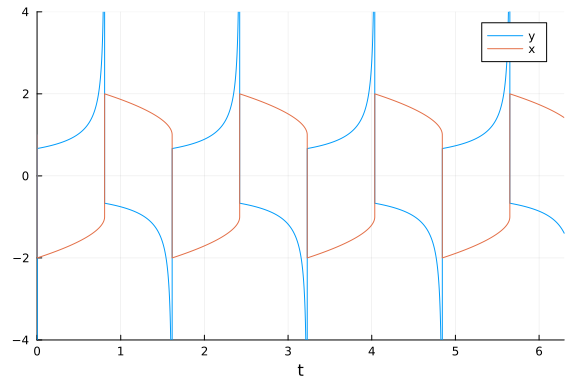

```julia
plot(sol)
```

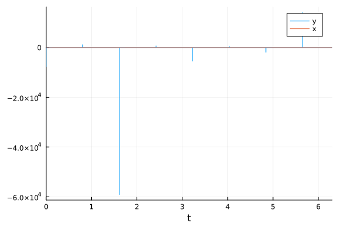


## Omissions And Tweaking

The following were omitted from the tests due to convergence failures. ODE.jl's
adaptivity is not able to stabilize its algorithms, while
GeometricIntegratorsDiffEq has not upgraded to Julia 1.0.
GeometricIntegrators.jl's methods used to be either fail to converge at
comparable dts (or on some computers errors due to type conversions).

```julia
#sol = solve(prob,ode23s()); println("Total ODE.jl steps: $(length(sol))")
#using GeometricIntegratorsDiffEq
#try
#    sol = solve(prob,GIRadIIA3(),dt=1/1000)
#catch e
#    println(e)
#end
```


`ARKODE` needs a lower `nonlinear_convergence_coefficient` in order to not diverge.

```julia
sol = solve(prob,ARKODE(),abstol=1e-4,reltol=1e-2);
```


```julia
sol = solve(prob,ARKODE(nonlinear_convergence_coefficient = 1e-6),abstol=1e-4,reltol=1e-1);
```


```julia
sol = solve(prob,ARKODE(order=3),abstol=1e-4,reltol=1e-1);
```


```julia
sol = solve(prob,ARKODE(nonlinear_convergence_coefficient = 1e-6,order=3),abstol=1e-4,reltol=1e-1);
```


```julia
sol = solve(prob,ARKODE(order=5,nonlinear_convergence_coefficient = 1e-3),abstol=1e-4,reltol=1e-1);
```


```julia
sol = solve(prob,ARKODE(order=5,nonlinear_convergence_coefficient = 1e-4),abstol=1e-4,reltol=1e-1);
```


Additionally, the ROCK methods do not perform well on this benchmark.

```julia
setups = [
          #Dict(:alg=>ROCK2())    #Unstable
          #Dict(:alg=>ROCK4())    #needs more iterations
          #Dict(:alg=>ESERK5()),
          ]
```

```
Any[]
```


Some of the bad Rosenbrocks fail:

```julia
setups = [
  #Dict(:alg=>Hairer4()),
  #Dict(:alg=>Hairer42()),
  #Dict(:alg=>Cash4()),
]
```

```
Any[]
```


The EPIRK and exponential methods also fail:

```julia
sol = solve(prob,EXPRB53s3(),dt=2.0^(-8));
sol = solve(prob,EPIRK4s3B(),dt=2.0^(-8));
sol = solve(prob,EPIRK5P2(),dt=2.0^(-8));
```

```
Error: InexactError: trunc(Int64, Inf)
```


## Low Order and High Tolerance

This tests the case where accuracy is not needed as much and quick robust solutions are necessary. Note that `ARKODE`'s convergence coefficient must be lowered to `1e-7` in order to converge.

#### Final timepoint error

This measures the efficiency to get the value at the endpoint correct.

```julia
abstols = 1.0 ./ 10.0 .^ (4:7)
reltols = 1.0 ./ 10.0 .^ (1:4)

setups = [Dict(:alg=>Rosenbrock23()),
          Dict(:alg=>QNDF()),
          Dict(:alg=>CVODE_BDF()),
          Dict(:alg=>TRBDF2()),
          Dict(:alg=>ddebdf()),
          Dict(:alg=>rodas()),
          Dict(:alg=>lsoda()),
          Dict(:alg=>radau())]
wp = WorkPrecisionSet(prob,abstols,reltols,setups;
                      save_everystep=false,appxsol=test_sol,maxiters=Int(1e5),seconds=5)
plot(wp)
```

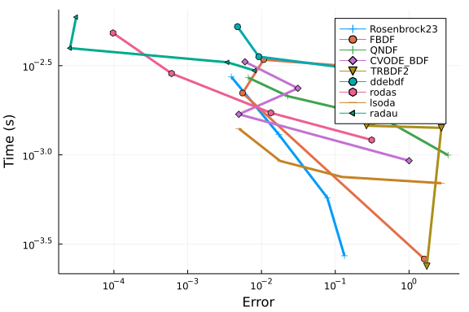

```julia
setups = [Dict(:alg=>Rosenbrock23()),
          Dict(:alg=>Rodas3()),
          Dict(:alg=>TRBDF2()),
          Dict(:alg=>rodas()),
          Dict(:alg=>lsoda()),
          Dict(:alg=>radau()),
          Dict(:alg=>RadauIIA5()),
          Dict(:alg=>ROS34PW1a()),
          ]
gr()
wp = WorkPrecisionSet(prob,abstols,reltols,setups;
                      save_everystep=false,appxsol=test_sol,maxiters=Int(1e5),numruns=10)
plot(wp)
```

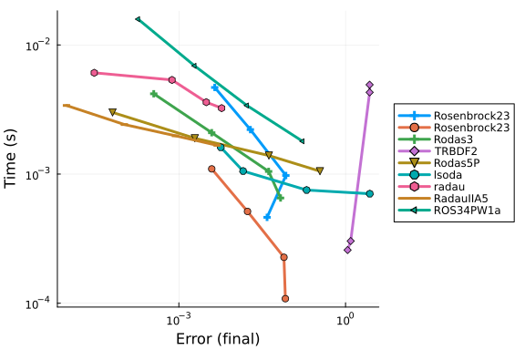

```julia
setups = [Dict(:alg=>Rosenbrock23()),
          Dict(:alg=>Kvaerno3()),
          Dict(:alg=>KenCarp4()),
          Dict(:alg=>TRBDF2()),
          Dict(:alg=>KenCarp3()),
          Dict(:alg=>ARKODE(nonlinear_convergence_coefficient = 1e-6)),
          Dict(:alg=>SDIRK2()),
          Dict(:alg=>radau())]
names = ["Rosenbrock23" "Kvaerno3" "KenCarp4" "TRBDF2" "KenCarp3" "ARKODE" "SDIRK2" "radau"]
wp = WorkPrecisionSet(prob,abstols,reltols,setups;
                      names=names,save_everystep=false,appxsol=test_sol,maxiters=Int(1e5),seconds=5)
plot(wp)
```

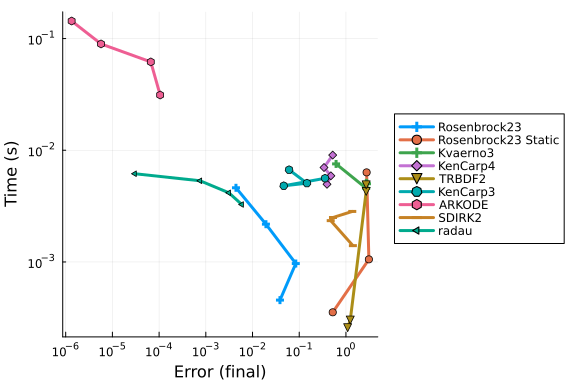

```julia
setups = [Dict(:alg=>Rosenbrock23()),
          Dict(:alg=>KenCarp5()),
          Dict(:alg=>KenCarp4()),
          Dict(:alg=>KenCarp3()),
          Dict(:alg=>ARKODE(order=5,nonlinear_convergence_coefficient = 1e-4)),
          Dict(:alg=>ARKODE(nonlinear_convergence_coefficient = 1e-6)),
          Dict(:alg=>ARKODE(nonlinear_convergence_coefficient = 1e-6,order=3))]
names = ["Rosenbrock23" "KenCarp5" "KenCarp4" "KenCarp3" "ARKODE5" "ARKODE4" "ARKODE3"]
wp = WorkPrecisionSet(prob,abstols,reltols,setups;
                      names=names,save_everystep=false,appxsol=test_sol,maxiters=Int(1e5),seconds=5)
plot(wp)
```

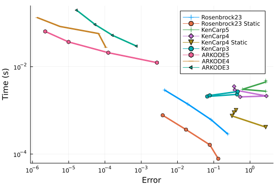

```julia
setups = [Dict(:alg=>Rosenbrock23()),
          Dict(:alg=>TRBDF2()),
          Dict(:alg=>ImplicitEulerExtrapolation()),
          #Dict(:alg=>ImplicitDeuflhardExtrapolation()), # Diverges
          #Dict(:alg=>ImplicitHairerWannerExtrapolation()), # Diverges
          Dict(:alg=>ABDF2()),
          #Dict(:alg=>QNDF()), # ???
          #Dict(:alg=>Exprb43()), # Diverges
          Dict(:alg=>Exprb32()),
]
wp = WorkPrecisionSet(prob,abstols,reltols,setups;
                      save_everystep=false,appxsol=test_sol,maxiters=Int(1e5),numruns=10)
plot(wp)
```

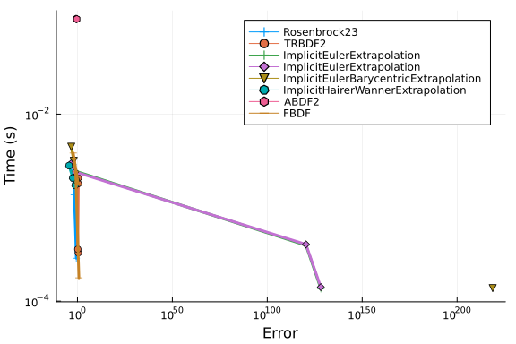


Notice that `KenCarp4` is the same overarching algorithm as `ARKODE` here (with major differences to stage predictors and adaptivity though). In this case, `KenCarp4` is more robust and more efficient than `ARKODE`. `CVODE_BDF` does quite well here, which is unusual for it on small equations. You can see that the low-order Rosenbrock methods `Rosenbrock23` and `Rodas3` dominate this test.

#### Timeseries error

Now we measure the average error of the timeseries.

```julia
abstols = 1.0 ./ 10.0 .^ (4:7)
reltols = 1.0 ./ 10.0 .^ (1:4)

setups = [Dict(:alg=>Rosenbrock23()),
          Dict(:alg=>QNDF()),
          Dict(:alg=>CVODE_BDF()),
          Dict(:alg=>TRBDF2()),
          Dict(:alg=>ddebdf()),
          Dict(:alg=>rodas()),
          Dict(:alg=>lsoda()),
          Dict(:alg=>radau())]
wp = WorkPrecisionSet(prob,abstols,reltols,setups;
                      error_estimator=:l2,appxsol=test_sol,maxiters=Int(1e5),seconds=5)
plot(wp)
```

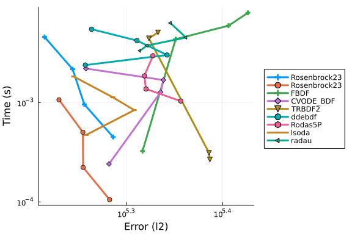

```julia
setups = [Dict(:alg=>Rosenbrock23()),
          Dict(:alg=>Rodas3()),
          Dict(:alg=>TRBDF2()),
          Dict(:alg=>rodas()),
          Dict(:alg=>lsoda()),
          Dict(:alg=>radau()),
          Dict(:alg=>RadauIIA5()),
          Dict(:alg=>ROS34PW1a()),
          ]
gr()
wp = WorkPrecisionSet(prob,abstols,reltols,setups;error_estimator=:l2,
                      save_everystep=false,appxsol=test_sol,maxiters=Int(1e5),numruns=10)
plot(wp)
```

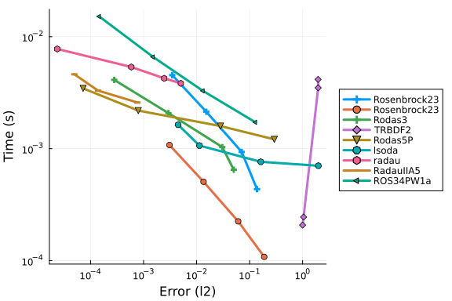

```julia
setups = [Dict(:alg=>Rosenbrock23(),:dense=>false),
          Dict(:alg=>Kvaerno3(),:dense=>false),
          Dict(:alg=>KenCarp4(),:dense=>false),
          Dict(:alg=>TRBDF2(),:dense=>false),
          Dict(:alg=>KenCarp3(),:dense=>false),
          Dict(:alg=>SDIRK2(),:dense=>false),
          Dict(:alg=>radau())]
names = ["Rosenbrock23" "Kvaerno3" "KenCarp4" "TRBDF2" "KenCarp3" "SDIRK2" "radau"]
wp = WorkPrecisionSet(prob,abstols,reltols,setups;
                      names=names,appxsol=test_sol,maxiters=Int(1e5),error_estimator=:l2,seconds=5)
plot(wp)
```

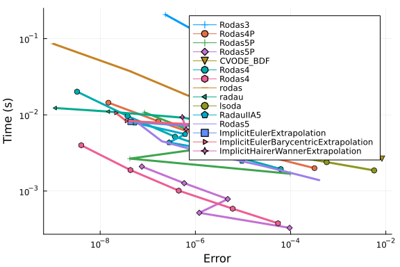

```julia
setups = [Dict(:alg=>Rosenbrock23()),
          Dict(:alg=>TRBDF2()),
          Dict(:alg=>ImplicitEulerExtrapolation()),
          #Dict(:alg=>ImplicitDeuflhardExtrapolation()), # Diverges
          #Dict(:alg=>ImplicitHairerWannerExtrapolation()), # Diverges
          Dict(:alg=>ABDF2()),
          #Dict(:alg=>QNDF()), # ???
          #Dict(:alg=>Exprb43()), # Diverges
          Dict(:alg=>Exprb32()),
]
wp = WorkPrecisionSet(prob,abstols,reltols,setups;error_estimator=:l2,
                      save_everystep=false,appxsol=test_sol,maxiters=Int(1e5),numruns=10)
plot(wp)
```

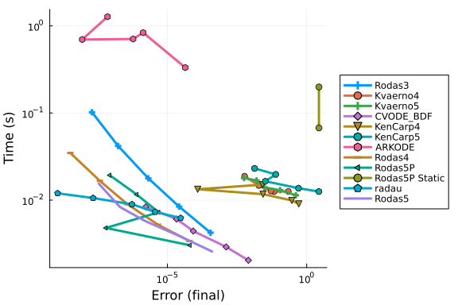


### Higher accuracy tests

Now we transition to higher accracy tests. In this domain higher order methods are stable and much more efficient.

```julia
abstols = 1.0 ./ 10.0 .^ (7:11)
reltols = 1.0 ./ 10.0 .^ (4:8)
setups = [Dict(:alg=>Rodas3()),
          Dict(:alg=>QNDF()),
          Dict(:alg=>Rodas4P()),
          Dict(:alg=>CVODE_BDF()),
          Dict(:alg=>Rodas4()),
          Dict(:alg=>rodas()),
          Dict(:alg=>radau()),
          Dict(:alg=>lsoda()),
          Dict(:alg=>RadauIIA5()),
          Dict(:alg=>Rodas5())]
wp = WorkPrecisionSet(prob,abstols,reltols,setups;
                      save_everystep=false,appxsol=test_sol,maxiters=Int(1e6),seconds=5)
plot(wp)
```


```julia
abstols = 1.0 ./ 10.0 .^ (7:11)
reltols = 1.0 ./ 10.0 .^ (4:8)
setups = [Dict(:alg=>Rodas3()),
          Dict(:alg=>Kvaerno4()),
          Dict(:alg=>Kvaerno5()),
          Dict(:alg=>CVODE_BDF()),
          Dict(:alg=>KenCarp4()),
          Dict(:alg=>KenCarp5()),
          Dict(:alg=>ARKODE()),
          Dict(:alg=>Rodas4()),
          Dict(:alg=>radau()),
          Dict(:alg=>Rodas5())]
names = ["Rodas3" "Kvaerno4" "Kvaerno5" "CVODE_BDF" "KenCarp4" "KenCarp5" "ARKODE" "Rodas4" "radau" "Rodas5"]
wp = WorkPrecisionSet(prob,abstols,reltols,setups;
                      names=names,save_everystep=false,appxsol=test_sol,maxiters=Int(1e6),seconds=5)
plot(wp)
```

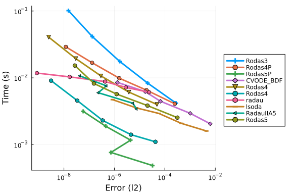

```julia
setups = [Dict(:alg=>Rodas3()),
          Dict(:alg=>CVODE_BDF()),
          Dict(:alg=>Rodas4()),
          Dict(:alg=>radau()),
          Dict(:alg=>Rodas5())]
wp = WorkPrecisionSet(prob,abstols,reltols,setups;
                      save_everystep=false,appxsol=test_sol,maxiters=Int(1e6),seconds=5)
plot(wp)
```

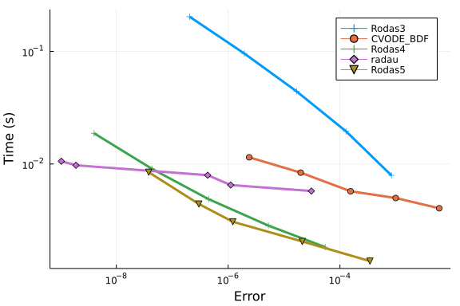


#### Timeseries Errors

```julia
abstols = 1.0 ./ 10.0 .^ (7:11)
reltols = 1.0 ./ 10.0 .^ (4:8)
setups = [Dict(:alg=>Rodas3()),
          Dict(:alg=>QNDF()),
          Dict(:alg=>Rodas4P()),
          Dict(:alg=>CVODE_BDF()),
          Dict(:alg=>Rodas4()),
          Dict(:alg=>rodas()),
          Dict(:alg=>radau()),
          Dict(:alg=>lsoda()),
          Dict(:alg=>RadauIIA5()),
          Dict(:alg=>Rodas5())]
wp = WorkPrecisionSet(prob,abstols,reltols,setups;error_estimate=:l2,
                      save_everystep=false,appxsol=test_sol,maxiters=Int(1e6),seconds=5)
plot(wp)
```

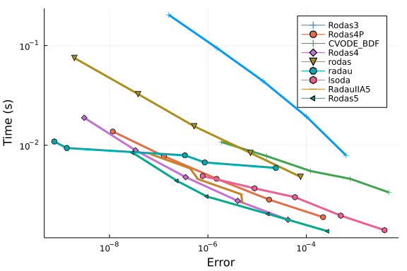

```julia
setups = [Dict(:alg=>Rodas3()),
          Dict(:alg=>Kvaerno4()),
          Dict(:alg=>Kvaerno5()),
          Dict(:alg=>CVODE_BDF()),
          Dict(:alg=>KenCarp4()),
          Dict(:alg=>KenCarp5()),
          Dict(:alg=>Rodas4()),
          Dict(:alg=>radau()),
          Dict(:alg=>Rodas5())]
names = ["Rodas3" "Kvaerno4" "Kvaerno5" "CVODE_BDF" "KenCarp4" "KenCarp5" "Rodas4" "radau" "Rodas5"]
wp = WorkPrecisionSet(prob,abstols,reltols,setups;
                      names=names,appxsol=test_sol,maxiters=Int(1e6),error_estimate=:l2,seconds=5)
plot(wp)
```

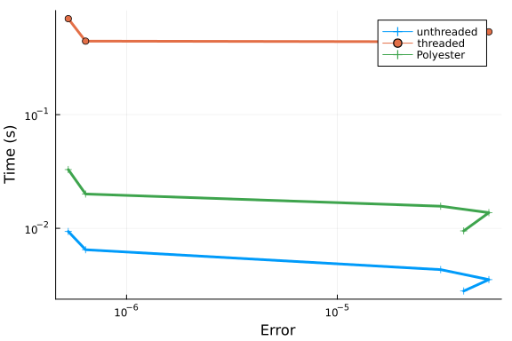

```julia
setups = [Dict(:alg=>CVODE_BDF()),
          Dict(:alg=>Rodas4()),
          Dict(:alg=>radau()),
          Dict(:alg=>Rodas5())]
wp = WorkPrecisionSet(prob,abstols,reltols,setups;
                      appxsol=test_sol,maxiters=Int(1e6),error_estimate=:l2,seconds=5)
plot(wp)
```


The timeseries test is a little odd here because of the high peaks in the VanDerPol oscillator. At a certain accuracy, the steps try to resolve those peaks and so the error becomes higher.

While the higher order order Julia-based Rodas methods (`Rodas4` and `Rodas4P`) Rosenbrock methods are not viable at higher tolerances, they dominate for a large portion of this benchmark. When the tolerance gets low enough, `radau` adaptive high order (up to order 13) takes the lead.

### Conclusion

`Rosenbrock23` and `Rodas3` do well when tolerances are higher. In most standard tolerances, `Rodas4` and `Rodas4P` do extremely well. Only when the tolerances get very low does `radau` do well. The Julia Rosenbrock methods vastly outperform their Fortran counterparts. `CVODE_BDF` is a top performer in the final timepoint errors with low accuracy, but take that with a grain of salt because the problem is periodic which means it's getting the spikes wrong but the low parts correct. `ARKODE` does poorly in these tests. `lsoda` does quite well in both low and high accuracy domains, but is never the top.


## Appendix

These benchmarks are a part of the SciMLBenchmarks.jl repository, found at: [https://github.com/SciML/SciMLBenchmarks.jl](https://github.com/SciML/SciMLBenchmarks.jl). For more information on high-performance scientific machine learning, check out the SciML Open Source Software Organization [https://sciml.ai](https://sciml.ai).

To locally run this benchmark, do the following commands:

```
using SciMLBenchmarks
SciMLBenchmarks.weave_file("benchmarks/StiffODE","VanDerPol.jmd")
```

Computer Information:

```
Julia Version 1.6.1
Commit 6aaedecc44 (2021-04-23 05:59 UTC)
Platform Info:
  OS: Linux (x86_64-pc-linux-gnu)
  CPU: AMD EPYC 7502 32-Core Processor
  WORD_SIZE: 64
  LIBM: libopenlibm
  LLVM: libLLVM-11.0.1 (ORCJIT, znver2)
Environment:
  JULIA_DEPOT_PATH = /root/.cache/julia-buildkite-plugin/depots/5b300254-1738-4989-ae0a-f4d2d937f953

```

Package Information:

```
      Status `/var/lib/buildkite-agent/builds/amdci3-julia-csail-mit-edu/julialang/scimlbenchmarks-dot-jl/benchmarks/StiffODE/Project.toml`
  [f3b72e0c] DiffEqDevTools v2.27.2
  [5a33fad7] GeometricIntegratorsDiffEq v0.2.0
  [7f56f5a3] LSODA v0.7.0
  [c030b06c] ODE v2.13.0
  [09606e27] ODEInterfaceDiffEq v3.10.0
  [1dea7af3] OrdinaryDiffEq v5.56.0
  [65888b18] ParameterizedFunctions v5.10.0
  [91a5bcdd] Plots v1.15.2
  [31c91b34] SciMLBenchmarks v0.1.0
  [c3572dad] Sundials v4.4.3
  [a759f4b9] TimerOutputs v0.5.9
  [37e2e46d] LinearAlgebra
```

And the full manifest:

```
      Status `/var/lib/buildkite-agent/builds/amdci3-julia-csail-mit-edu/julialang/scimlbenchmarks-dot-jl/benchmarks/StiffODE/Manifest.toml`
  [c3fe647b] AbstractAlgebra v0.16.0
  [621f4979] AbstractFFTs v1.0.1
  [1520ce14] AbstractTrees v0.3.4
  [79e6a3ab] Adapt v3.3.0
  [4c88cf16] Aqua v0.5.0
  [ec485272] ArnoldiMethod v0.1.0
  [4fba245c] ArrayInterface v3.1.15
  [4c555306] ArrayLayouts v0.5.4
  [9e28174c] BinDeps v1.0.2
  [b99e7846] BinaryProvider v0.5.10
  [a74b3585] Blosc v0.7.0
  [fa961155] CEnum v0.4.1
  [d360d2e6] ChainRulesCore v0.9.44
  [b630d9fa] CheapThreads v0.2.5
  [35d6a980] ColorSchemes v3.12.1
  [3da002f7] ColorTypes v0.11.0
  [5ae59095] Colors v0.12.8
  [861a8166] Combinatorics v1.0.2
  [38540f10] CommonSolve v0.2.0
  [bbf7d656] CommonSubexpressions v0.3.0
  [34da2185] Compat v3.30.0
  [8f4d0f93] Conda v1.5.2
  [187b0558] ConstructionBase v1.2.1
  [d38c429a] Contour v0.5.7
  [717857b8] DSP v0.6.10
  [9a962f9c] DataAPI v1.6.0
  [864edb3b] DataStructures v0.18.9
  [e2d170a0] DataValueInterfaces v1.0.0
  [55939f99] DecFP v1.1.0
  [2b5f629d] DiffEqBase v6.62.2
  [f3b72e0c] DiffEqDevTools v2.27.2
  [c894b116] DiffEqJump v6.14.2
  [77a26b50] DiffEqNoiseProcess v5.7.3
  [163ba53b] DiffResults v1.0.3
  [b552c78f] DiffRules v1.0.2
  [b4f34e82] Distances v0.10.3
  [31c24e10] Distributions v0.24.18
  [ffbed154] DocStringExtensions v0.8.4
  [e30172f5] Documenter v0.26.3
  [d4d017d3] ExponentialUtilities v1.8.4
  [e2ba6199] ExprTools v0.1.3
  [8f5d6c58] EzXML v1.1.0
  [c87230d0] FFMPEG v0.4.0
  [7a1cc6ca] FFTW v1.4.1
  [7034ab61] FastBroadcast v0.1.8
  [9aa1b823] FastClosures v0.3.2
  [442a2c76] FastGaussQuadrature v0.4.7
  [057dd010] FastTransforms v0.11.3
  [1a297f60] FillArrays v0.11.7
  [6a86dc24] FiniteDiff v2.8.0
  [53c48c17] FixedPointNumbers v0.8.4
  [59287772] Formatting v0.4.2
  [f6369f11] ForwardDiff v0.10.18
  [069b7b12] FunctionWrappers v1.1.2
  [28b8d3ca] GR v0.57.4
  [14197337] GenericLinearAlgebra v0.2.5
  [dcce2d33] GeometricIntegrators v0.6.2
  [5a33fad7] GeometricIntegratorsDiffEq v0.2.0
  [5c1252a2] GeometryBasics v0.3.12
  [d7ba0133] Git v1.2.1
  [42e2da0e] Grisu v1.0.2
  [f67ccb44] HDF5 v0.14.3
  [cd3eb016] HTTP v0.9.9
  [eafb193a] Highlights v0.4.5
  [0e44f5e4] Hwloc v2.0.0
  [7073ff75] IJulia v1.23.2
  [b5f81e59] IOCapture v0.1.1
  [615f187c] IfElse v0.1.0
  [d25df0c9] Inflate v0.1.2
  [83e8ac13] IniFile v0.5.0
  [d8418881] Intervals v1.5.0
  [c8e1da08] IterTools v1.3.0
  [42fd0dbc] IterativeSolvers v0.9.1
  [82899510] IteratorInterfaceExtensions v1.0.0
  [692b3bcd] JLLWrappers v1.3.0
  [682c06a0] JSON v0.21.1
  [7f56f5a3] LSODA v0.7.0
  [b964fa9f] LaTeXStrings v1.2.1
  [2ee39098] LabelledArrays v1.6.1
  [23fbe1c1] Latexify v0.15.5
  [093fc24a] LightGraphs v1.3.5
  [d3d80556] LineSearches v7.1.1
  [2ab3a3ac] LogExpFunctions v0.2.4
  [bdcacae8] LoopVectorization v0.12.23
  [1914dd2f] MacroTools v0.5.6
  [739be429] MbedTLS v1.0.3
  [442fdcdd] Measures v0.3.1
  [c03570c3] Memoize v0.4.4
  [e1d29d7a] Missings v1.0.0
  [78c3b35d] Mocking v0.7.1
  [961ee093] ModelingToolkit v5.16.0
  [46d2c3a1] MuladdMacro v0.2.2
  [ffc61752] Mustache v1.0.10
  [d41bc354] NLSolversBase v7.8.0
  [2774e3e8] NLsolve v4.5.1
  [77ba4419] NaNMath v0.3.5
  [8913a72c] NonlinearSolve v0.3.8
  [c030b06c] ODE v2.13.0
  [54ca160b] ODEInterface v0.5.0
  [09606e27] ODEInterfaceDiffEq v3.10.0
  [6fe1bfb0] OffsetArrays v1.9.0
  [429524aa] Optim v1.3.0
  [bac558e1] OrderedCollections v1.4.1
  [1dea7af3] OrdinaryDiffEq v5.56.0
  [90014a1f] PDMats v0.11.0
  [65888b18] ParameterizedFunctions v5.10.0
  [d96e819e] Parameters v0.12.2
  [69de0a69] Parsers v1.1.0
  [ccf2f8ad] PlotThemes v2.0.1
  [995b91a9] PlotUtils v1.0.10
  [91a5bcdd] Plots v1.15.2
  [e409e4f3] PoissonRandom v0.4.0
  [f517fe37] Polyester v0.3.1
  [f27b6e38] Polynomials v1.2.1
  [85a6dd25] PositiveFactorizations v0.2.4
  [21216c6a] Preferences v1.2.2
  [92933f4c] ProgressMeter v1.6.2
  [1fd47b50] QuadGK v2.4.1
  [74087812] Random123 v1.3.1
  [fb686558] RandomExtensions v0.4.3
  [e6cf234a] RandomNumbers v1.4.0
  [3cdcf5f2] RecipesBase v1.1.1
  [01d81517] RecipesPipeline v0.3.2
  [731186ca] RecursiveArrayTools v2.11.4
  [f2c3362d] RecursiveFactorization v0.1.12
  [189a3867] Reexport v0.2.0
  [ae029012] Requires v1.1.3
  [ae5879a3] ResettableStacks v1.1.0
  [79098fc4] Rmath v0.7.0
  [47965b36] RootedTrees v1.0.0
  [7e49a35a] RuntimeGeneratedFunctions v0.5.2
  [476501e8] SLEEFPirates v0.6.20
  [1bc83da4] SafeTestsets v0.0.1
  [0bca4576] SciMLBase v1.13.4
  [31c91b34] SciMLBenchmarks v0.1.0
  [6c6a2e73] Scratch v1.0.3
  [efcf1570] Setfield v0.7.0
  [992d4aef] Showoff v1.0.3
  [699a6c99] SimpleTraits v0.9.3
  [b85f4697] SoftGlobalScope v1.1.0
  [a2af1166] SortingAlgorithms v1.0.0
  [47a9eef4] SparseDiffTools v1.13.2
  [276daf66] SpecialFunctions v0.10.3
  [a25cea48] SpecialPolynomials v0.1.0
  [aedffcd0] Static v0.2.4
  [90137ffa] StaticArrays v1.2.0
  [82ae8749] StatsAPI v1.0.0
  [2913bbd2] StatsBase v0.33.8
  [4c63d2b9] StatsFuns v0.9.8
  [7792a7ef] StrideArraysCore v0.1.11
  [09ab397b] StructArrays v0.5.1
  [c3572dad] Sundials v4.4.3
  [d1185830] SymbolicUtils v0.11.2
  [0c5d862f] Symbolics v0.1.25
  [3783bdb8] TableTraits v1.0.1
  [bd369af6] Tables v1.4.2
  [8290d209] ThreadingUtilities v0.4.4
  [f269a46b] TimeZones v1.5.5
  [a759f4b9] TimerOutputs v0.5.9
  [c751599d] ToeplitzMatrices v0.6.3
  [a2a6695c] TreeViews v0.3.0
  [30578b45] URIParser v0.4.1
  [5c2747f8] URIs v1.3.0
  [3a884ed6] UnPack v1.0.2
  [1986cc42] Unitful v1.7.0
  [3d5dd08c] VectorizationBase v0.20.11
  [81def892] VersionParsing v1.2.0
  [19fa3120] VertexSafeGraphs v0.1.2
  [44d3d7a6] Weave v0.10.8
  [ddb6d928] YAML v0.4.6
  [c2297ded] ZMQ v1.2.1
  [700de1a5] ZygoteRules v0.2.1
  [0b7ba130] Blosc_jll v1.14.3+1
  [6e34b625] Bzip2_jll v1.0.6+5
  [83423d85] Cairo_jll v1.16.0+6
  [47200ebd] DecFP_jll v2.0.2+0
  [5ae413db] EarCut_jll v2.1.5+1
  [2e619515] Expat_jll v2.2.10+0
  [b22a6f82] FFMPEG_jll v4.3.1+4
  [f5851436] FFTW_jll v3.3.9+7
  [34b6f7d7] FastTransforms_jll v0.4.1+0
  [a3f928ae] Fontconfig_jll v2.13.1+14
  [d7e528f0] FreeType2_jll v2.10.1+5
  [559328eb] FriBidi_jll v1.0.5+6
  [0656b61e] GLFW_jll v3.3.4+0
  [d2c73de3] GR_jll v0.57.2+0
  [78b55507] Gettext_jll v0.20.1+7
  [f8c6e375] Git_jll v2.31.0+0
  [7746bdde] Glib_jll v2.59.0+4
  [0234f1f7] HDF5_jll v1.12.0+1
  [e33a78d0] Hwloc_jll v2.4.1+0
  [1d5cc7b8] IntelOpenMP_jll v2018.0.3+2
  [aacddb02] JpegTurbo_jll v2.0.1+3
  [c1c5ebd0] LAME_jll v3.100.0+3
  [aae0fff6] LSODA_jll v0.1.1+0
  [dd4b983a] LZO_jll v2.10.1+0
  [dd192d2f] LibVPX_jll v1.9.0+1
  [e9f186c6] Libffi_jll v3.2.2+0
  [d4300ac3] Libgcrypt_jll v1.8.7+0
  [7e76a0d4] Libglvnd_jll v1.3.0+3
  [7add5ba3] Libgpg_error_jll v1.42.0+0
  [94ce4f54] Libiconv_jll v1.16.1+0
  [4b2f31a3] Libmount_jll v2.35.0+0
  [89763e89] Libtiff_jll v4.1.0+2
  [38a345b3] Libuuid_jll v2.36.0+0
  [5ced341a] Lz4_jll v1.9.3+0
  [856f044c] MKL_jll v2021.1.1+1
  [c771fb93] ODEInterface_jll v0.0.1+0
  [e7412a2a] Ogg_jll v1.3.4+2
  [458c3c95] OpenSSL_jll v1.1.1+6
  [efe28fd5] OpenSpecFun_jll v0.5.4+0
  [91d4177d] Opus_jll v1.3.1+3
  [2f80f16e] PCRE_jll v8.44.0+0
  [30392449] Pixman_jll v0.40.1+0
  [ea2cea3b] Qt5Base_jll v5.15.2+0
  [f50d1b31] Rmath_jll v0.3.0+0
  [fb77eaff] Sundials_jll v5.2.0+1
  [a2964d1f] Wayland_jll v1.17.0+4
  [2381bf8a] Wayland_protocols_jll v1.18.0+4
  [02c8fc9c] XML2_jll v2.9.12+0
  [aed1982a] XSLT_jll v1.1.34+0
  [4f6342f7] Xorg_libX11_jll v1.6.9+4
  [0c0b7dd1] Xorg_libXau_jll v1.0.9+4
  [935fb764] Xorg_libXcursor_jll v1.2.0+4
  [a3789734] Xorg_libXdmcp_jll v1.1.3+4
  [1082639a] Xorg_libXext_jll v1.3.4+4
  [d091e8ba] Xorg_libXfixes_jll v5.0.3+4
  [a51aa0fd] Xorg_libXi_jll v1.7.10+4
  [d1454406] Xorg_libXinerama_jll v1.1.4+4
  [ec84b674] Xorg_libXrandr_jll v1.5.2+4
  [ea2f1a96] Xorg_libXrender_jll v0.9.10+4
  [14d82f49] Xorg_libpthread_stubs_jll v0.1.0+3
  [c7cfdc94] Xorg_libxcb_jll v1.13.0+3
  [cc61e674] Xorg_libxkbfile_jll v1.1.0+4
  [12413925] Xorg_xcb_util_image_jll v0.4.0+1
  [2def613f] Xorg_xcb_util_jll v0.4.0+1
  [975044d2] Xorg_xcb_util_keysyms_jll v0.4.0+1
  [0d47668e] Xorg_xcb_util_renderutil_jll v0.3.9+1
  [c22f9ab0] Xorg_xcb_util_wm_jll v0.4.1+1
  [35661453] Xorg_xkbcomp_jll v1.4.2+4
  [33bec58e] Xorg_xkeyboard_config_jll v2.27.0+4
  [c5fb5394] Xorg_xtrans_jll v1.4.0+3
  [8f1865be] ZeroMQ_jll v4.3.2+6
  [3161d3a3] Zstd_jll v1.5.0+0
  [0ac62f75] libass_jll v0.14.0+4
  [f638f0a6] libfdk_aac_jll v0.1.6+4
  [b53b4c65] libpng_jll v1.6.38+0
  [a9144af2] libsodium_jll v1.0.20+0
  [f27f6e37] libvorbis_jll v1.3.6+6
  [1270edf5] x264_jll v2020.7.14+2
  [dfaa095f] x265_jll v3.0.0+3
  [d8fb68d0] xkbcommon_jll v0.9.1+5
  [0dad84c5] ArgTools
  [56f22d72] Artifacts
  [2a0f44e3] Base64
  [ade2ca70] Dates
  [8bb1440f] DelimitedFiles
  [8ba89e20] Distributed
  [f43a241f] Downloads
  [7b1f6079] FileWatching
  [9fa8497b] Future
  [b77e0a4c] InteractiveUtils
  [4af54fe1] LazyArtifacts
  [b27032c2] LibCURL
  [76f85450] LibGit2
  [8f399da3] Libdl
  [37e2e46d] LinearAlgebra
  [56ddb016] Logging
  [d6f4376e] Markdown
  [a63ad114] Mmap
  [ca575930] NetworkOptions
  [44cfe95a] Pkg
  [de0858da] Printf
  [3fa0cd96] REPL
  [9a3f8284] Random
  [ea8e919c] SHA
  [9e88b42a] Serialization
  [1a1011a3] SharedArrays
  [6462fe0b] Sockets
  [2f01184e] SparseArrays
  [10745b16] Statistics
  [4607b0f0] SuiteSparse
  [fa267f1f] TOML
  [a4e569a6] Tar
  [8dfed614] Test
  [cf7118a7] UUIDs
  [4ec0a83e] Unicode
  [e66e0078] CompilerSupportLibraries_jll
  [781609d7] GMP_jll
  [deac9b47] LibCURL_jll
  [29816b5a] LibSSH2_jll
  [3a97d323] MPFR_jll
  [c8ffd9c3] MbedTLS_jll
  [14a3606d] MozillaCACerts_jll
  [4536629a] OpenBLAS_jll
  [efcefdf7] PCRE2_jll
  [bea87d4a] SuiteSparse_jll
  [83775a58] Zlib_jll
  [8e850ede] nghttp2_jll
  [3f19e933] p7zip_jll
```

