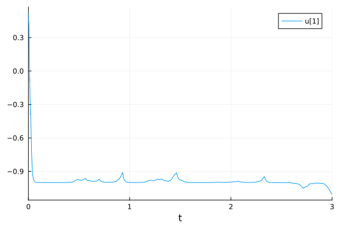
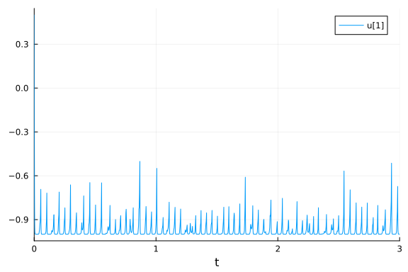
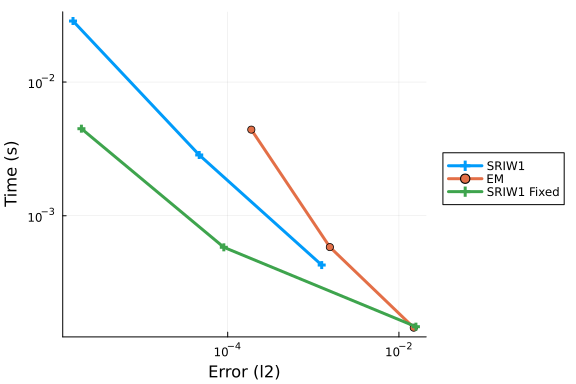
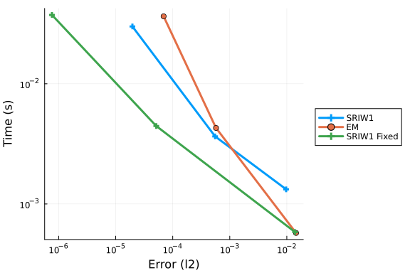

# Quadratic Stiffness

In this notebook we will explore the quadratic stiffness problem. References:

The composite Euler method for stiff stochastic
differential equations

Kevin Burrage, Tianhai Tian

And

S-ROCK: CHEBYSHEV METHODS FOR STIFF STOCHASTIC
DIFFERENTIAL EQUATIONS

ASSYR ABDULLE AND STEPHANE CIRILLI

This is a scalar SDE with two arguments. The first controls the deterministic stiffness and the later controls the diffusion stiffness.

```julia
using SDEProblemLibrary, StochasticDiffEq, DiffEqDevTools
import SDEProblemLibrary: prob_sde_stiffquadito
using Plots; gr()
const N = 10
```

```
10
```


```julia
prob = remake(prob_sde_stiffquadito,p=(50.0,1.0))
sol = solve(prob,SRIW1())
plot(sol)
```



```julia
prob = remake(prob_sde_stiffquadito,p=(500.0,1.0))
sol = solve(prob,SRIW1())
plot(sol)
```




## Top dts

Let's first determine the maximum dts which are allowed. Anything higher is mostly unstable.

### Deterministic Stiffness Mild

```julia
prob = remake(prob_sde_stiffquadito,p=(50.0,1.0))
@time sol = solve(prob,SRIW1())
@time sol = solve(prob,SRIW1(),adaptive=false,dt=0.01)
@time sol = solve(prob,ImplicitRKMil(),dt=0.005)
@time sol = solve(prob,EM(),dt=0.01);
```

```
0.000235 seconds (1.62 k allocations: 90.391 KiB)
  0.215159 seconds (236.39 k allocations: 18.846 MiB, 99.82% compilation ti
me)
  1.738450 seconds (2.86 M allocations: 203.298 MiB, 2.40% gc time, 99.97% 
compilation time)
  1.156406 seconds (1.72 M allocations: 123.481 MiB, 6.45% gc time, 99.94% 
compilation time)
```


### Deterministic Stiffness High

```julia
prob = remake(prob_sde_stiffquadito,p=(500.0,1.0))
@time sol = solve(prob,SRIW1())
@time sol = solve(prob,SRIW1(),adaptive=false,dt=0.002)
@time sol = solve(prob,ImplicitRKMil(),dt=0.001)
@time sol = solve(prob,EM(),dt=0.002);
```

```
0.001012 seconds (12.27 k allocations: 646.219 KiB)
  0.000596 seconds (9.13 k allocations: 421.641 KiB)
  0.000168 seconds (565 allocations: 28.047 KiB)
  0.000599 seconds (9.13 k allocations: 399.672 KiB)
```


### Mixed Stiffness

```julia
prob = remake(prob_sde_stiffquadito,p=(5000.0,70.0))
@time sol = solve(prob,SRIW1(),dt=0.0001)
@time sol = solve(prob,SRIW1(),adaptive=false,dt=0.00001)
@time sol = solve(prob,ImplicitRKMil(),dt=0.00001)
@time sol = solve(prob,EM(),dt=0.00001);
```

```
0.081042 seconds (68.63 k allocations: 5.905 MiB, 97.96% compilation time
)
  0.101436 seconds (1.80 M allocations: 68.980 MiB)
  0.550593 seconds (286 allocations: 39.483 MiB, 29.44% gc time)
  0.111103 seconds (1.80 M allocations: 63.752 MiB)
```


Notice that in this problem, the stiffness in the noise term still prevents the semi-implicit integrator to do well. In that case, the advantage of implicitness does not take effect, and thus explicit methods do well. When we don't care about the error, Euler-Maruyama is fastest. When there's mixed stiffness, the adaptive algorithm is unstable.

## Work-Precision Diagrams

```julia
prob = remake(prob_sde_stiffquadito,p=(50.0,1.0))

reltols = 1.0 ./ 10.0 .^ (3:5)
abstols = reltols#[0.0 for i in eachindex(reltols)]
setups = [Dict(:alg=>SRIW1()),
          Dict(:alg=>EM(),:dts=>1.0./8.0.^((1:length(reltols)) .+ 1)),
          Dict(:alg=>SRIW1(),:dts=>1.0./8.0.^((1:length(reltols)) .+ 1),:adaptive=>false)
          #Dict(:alg=>RKMil(),:dts=>1.0./8.0.^((1:length(reltols)) .+ 1),:adaptive=>false),
          ]
names = ["SRIW1","EM","SRIW1 Fixed"] #"RKMil",
wp = WorkPrecisionSet(prob,abstols,reltols,setups;numruns=N,names=names,error_estimate=:l2)
plot(wp)
```



```julia
prob = remake(prob_sde_stiffquadito,p=(500.0,1.0))

reltols = 1.0 ./ 10.0 .^ (3:5)
abstols = reltols#[0.0 for i in eachindex(reltols)]
setups = [Dict(:alg=>SRIW1()),
          Dict(:alg=>EM(),:dts=>1.0./8.0.^((1:length(reltols)) .+ 2)),
          Dict(:alg=>SRIW1(),:dts=>1.0./8.0.^((1:length(reltols)) .+ 2),:adaptive=>false)
          #Dict(:alg=>RKMil(),:dts=>1.0./8.0.^((1:length(reltols)) .+ 2),:adaptive=>false),
          ]
names = ["SRIW1","EM","SRIW1 Fixed"] #"RKMil",
wp = WorkPrecisionSet(prob,abstols,reltols,setups;numruns=N,names=names,error_estimate=:l2,print_names=true)
plot(wp)
```




## Conclusion

Noise stiffness is tough. Right now the best solution is to run an explicit integrator with a low enough dt. Adaptivity does have a cost in this case, likely due to memory management.


## Appendix

These benchmarks are a part of the SciMLBenchmarks.jl repository, found at: [https://github.com/SciML/SciMLBenchmarks.jl](https://github.com/SciML/SciMLBenchmarks.jl). For more information on high-performance scientific machine learning, check out the SciML Open Source Software Organization [https://sciml.ai](https://sciml.ai).

To locally run this benchmark, do the following commands:

```
using SciMLBenchmarks
SciMLBenchmarks.weave_file("benchmarks/StiffSDE","QuadraticStiffness.jmd")
```

Computer Information:

```
Julia Version 1.10.11
Commit a2b11907d7b (2026-03-09 14:59 UTC)
Build Info:
  Official https://julialang.org/ release
Platform Info:
  OS: Linux (x86_64-linux-gnu)
  CPU: 128 × AMD EPYC 7502 32-Core Processor
  WORD_SIZE: 64
  LIBM: libopenlibm
  LLVM: libLLVM-15.0.7 (ORCJIT, znver2)
Threads: 128 default, 0 interactive, 64 GC (on 128 virtual cores)
Environment:
  JULIA_NUM_THREADS = auto

```

Package Information:

```
Status `/julia/github-runners/amdci1-1/_work/SciMLBenchmarks.jl/SciMLBenchmarks.jl/benchmarks/StiffSDE/Project.toml`
  [f3b72e0c] DiffEqDevTools v2.51.0
  [77a26b50] DiffEqNoiseProcess v5.28.0
  [91a5bcdd] Plots v1.41.6
  [c72e72a9] SDEProblemLibrary v1.1.1
  [31c91b34] SciMLBenchmarks v0.1.3
  [789caeaf] StochasticDiffEq v6.101.0
  [37e2e46d] LinearAlgebra
  [9a3f8284] Random
  [10745b16] Statistics v1.10.0
```

And the full manifest:

```
Status `/julia/github-runners/amdci1-1/_work/SciMLBenchmarks.jl/SciMLBenchmarks.jl/benchmarks/StiffSDE/Manifest.toml`
  [47edcb42] ADTypes v1.21.0
  [7d9f7c33] Accessors v0.1.44
  [79e6a3ab] Adapt v4.5.0
  [66dad0bd] AliasTables v1.1.3
  [ec485272] ArnoldiMethod v0.4.0
  [4fba245c] ArrayInterface v7.23.0
  [d1d4a3ce] BitFlags v0.1.9
  [62783981] BitTwiddlingConvenienceFunctions v0.1.6
  [70df07ce] BracketingNonlinearSolve v1.12.0
  [2a0fbf3d] CPUSummary v0.2.7
  [fb6a15b2] CloseOpenIntervals v0.1.13
  [944b1d66] CodecZlib v0.7.8
  [35d6a980] ColorSchemes v3.31.0
  [3da002f7] ColorTypes v0.12.1
  [c3611d14] ColorVectorSpace v0.11.0
  [5ae59095] Colors v0.13.1
  [38540f10] CommonSolve v0.2.6
  [bbf7d656] CommonSubexpressions v0.3.1
  [f70d9fcc] CommonWorldInvalidations v1.0.0
  [34da2185] Compat v4.18.1
  [a33af91c] CompositionsBase v0.1.2
  [2569d6c7] ConcreteStructs v0.2.3
  [f0e56b4a] ConcurrentUtilities v2.5.1
  [8f4d0f93] Conda v1.10.3
  [187b0558] ConstructionBase v1.6.0
  [d38c429a] Contour v0.6.3
  [adafc99b] CpuId v0.3.1
  [9a962f9c] DataAPI v1.16.0
  [864edb3b] DataStructures v0.19.4
  [e2d170a0] DataValueInterfaces v1.0.0
  [8bb1440f] DelimitedFiles v1.9.1
  [2b5f629d] DiffEqBase v6.214.1
  [459566f4] DiffEqCallbacks v4.13.0
  [f3b72e0c] DiffEqDevTools v2.51.0
  [77a26b50] DiffEqNoiseProcess v5.28.0
  [163ba53b] DiffResults v1.1.0
  [b552c78f] DiffRules v1.15.1
  [a0c0ee7d] DifferentiationInterface v0.7.16
  [31c24e10] Distributions v0.25.123
  [ffbed154] DocStringExtensions v0.9.5
  [4e289a0a] EnumX v1.0.7
  [f151be2c] EnzymeCore v0.8.19
  [460bff9d] ExceptionUnwrapping v0.1.11
  [7d51a73a] ExplicitImports v1.15.0
  [e2ba6199] ExprTools v0.1.10
  [55351af7] ExproniconLite v0.10.14
  [c87230d0] FFMPEG v0.4.5
  [7034ab61] FastBroadcast v1.3.1
  [9aa1b823] FastClosures v0.3.2
  [a4df4552] FastPower v1.3.1
  [1a297f60] FillArrays v1.16.0
  [6a86dc24] FiniteDiff v2.29.0
  [53c48c17] FixedPointNumbers v0.8.5
  [1fa38f19] Format v1.3.7
  [f6369f11] ForwardDiff v1.3.3
  [069b7b12] FunctionWrappers v1.1.3
  [77dc65aa] FunctionWrappersWrappers v1.2.0
  [46192b85] GPUArraysCore v0.2.0
  [28b8d3ca] GR v0.73.24
  [d7ba0133] Git v1.5.0
  [86223c79] Graphs v1.14.0
  [42e2da0e] Grisu v1.0.2
  [cd3eb016] HTTP v1.11.0
⌅ [eafb193a] Highlights v0.5.3
  [34004b35] HypergeometricFunctions v0.3.28
  [7073ff75] IJulia v1.34.4
  [615f187c] IfElse v0.1.1
  [d25df0c9] Inflate v0.1.5
  [3587e190] InverseFunctions v0.1.17
  [92d709cd] IrrationalConstants v0.2.6
  [82899510] IteratorInterfaceExtensions v1.0.0
  [1019f520] JLFzf v0.1.11
  [692b3bcd] JLLWrappers v1.7.1
⌅ [682c06a0] JSON v0.21.4
  [ae98c720] Jieko v0.2.1
  [ccbc3e58] JumpProcesses v9.25.0
  [ba0b0d4f] Krylov v0.10.6
  [b964fa9f] LaTeXStrings v1.4.0
  [23fbe1c1] Latexify v0.16.10
  [10f19ff3] LayoutPointers v0.1.17
  [87fe0de2] LineSearch v0.1.6
  [7ed4a6bd] LinearSolve v3.72.0
  [2ab3a3ac] LogExpFunctions v0.3.29
  [e6f89c97] LoggingExtras v1.2.0
  [1914dd2f] MacroTools v0.5.16
  [d125e4d3] ManualMemory v0.1.8
  [bb5d69b7] MaybeInplace v0.1.4
  [739be429] MbedTLS v1.1.10
  [442fdcdd] Measures v0.3.3
  [e1d29d7a] Missings v1.2.0
  [2e0e35c7] Moshi v0.3.7
  [46d2c3a1] MuladdMacro v0.2.4
  [ffc61752] Mustache v1.0.21
  [77ba4419] NaNMath v1.1.3
  [8913a72c] NonlinearSolve v4.17.0
  [be0214bd] NonlinearSolveBase v2.22.0
  [5959db7a] NonlinearSolveFirstOrder v2.1.0
  [9a2c21bd] NonlinearSolveQuasiNewton v1.13.0
  [26075421] NonlinearSolveSpectralMethods v1.7.0
  [4d8831e6] OpenSSL v1.6.1
  [bac558e1] OrderedCollections v1.8.1
  [bbf590c4] OrdinaryDiffEqCore v3.29.0
  [4302a76b] OrdinaryDiffEqDifferentiation v2.7.0
  [127b3ac7] OrdinaryDiffEqNonlinearSolve v1.26.0
  [90014a1f] PDMats v0.11.37
  [69de0a69] Parsers v2.8.3
  [ccf2f8ad] PlotThemes v3.3.0
  [995b91a9] PlotUtils v1.4.4
  [91a5bcdd] Plots v1.41.6
  [e409e4f3] PoissonRandom v0.4.7
  [f517fe37] Polyester v0.7.19
  [1d0040c9] PolyesterWeave v0.2.2
  [d236fae5] PreallocationTools v1.2.0
⌅ [aea7be01] PrecompileTools v1.2.1
  [21216c6a] Preferences v1.5.2
  [43287f4e] PtrArrays v1.4.0
  [1fd47b50] QuadGK v2.11.3
  [3cdcf5f2] RecipesBase v1.3.4
  [01d81517] RecipesPipeline v0.6.12
⌅ [731186ca] RecursiveArrayTools v3.54.0
  [189a3867] Reexport v1.2.2
  [05181044] RelocatableFolders v1.0.1
  [ae029012] Requires v1.3.1
  [ae5879a3] ResettableStacks v1.2.0
  [79098fc4] Rmath v0.9.0
  [47965b36] RootedTrees v2.25.0
  [7e49a35a] RuntimeGeneratedFunctions v0.5.18
  [c72e72a9] SDEProblemLibrary v1.1.1
  [94e857df] SIMDTypes v0.1.0
⌅ [0bca4576] SciMLBase v2.154.0
  [31c91b34] SciMLBenchmarks v0.1.3
  [19f34311] SciMLJacobianOperators v0.1.12
  [a6db7da4] SciMLLogging v1.9.1
  [c0aeaf25] SciMLOperators v1.16.0
  [431bcebd] SciMLPublic v1.0.1
  [53ae85a6] SciMLStructures v1.10.0
  [6c6a2e73] Scratch v1.3.0
  [efcf1570] Setfield v1.1.2
  [992d4aef] Showoff v1.0.3
  [777ac1f9] SimpleBufferStream v1.2.0
  [727e6d20] SimpleNonlinearSolve v2.11.0
  [699a6c99] SimpleTraits v0.9.5
  [a2af1166] SortingAlgorithms v1.2.2
  [0a514795] SparseMatrixColorings v0.4.26
  [276daf66] SpecialFunctions v2.7.2
  [860ef19b] StableRNGs v1.0.4
  [aedffcd0] Static v1.3.1
  [0d7ed370] StaticArrayInterface v1.9.0
  [90137ffa] StaticArrays v1.9.18
  [1e83bf80] StaticArraysCore v1.4.4
  [82ae8749] StatsAPI v1.8.0
  [2913bbd2] StatsBase v0.34.10
  [4c63d2b9] StatsFuns v1.5.2
  [789caeaf] StochasticDiffEq v6.101.0
  [19c5a474] StochasticDiffEqCore v1.1.0
  [0520c28c] StochasticDiffEqHighOrder v1.0.0
  [ebf54054] StochasticDiffEqIIF v1.0.0
  [5080b986] StochasticDiffEqImplicit v1.2.0
  [aefaaa88] StochasticDiffEqLeaping v1.0.0
  [90dbc90e] StochasticDiffEqLevyArea v1.0.0
  [d15fe365] StochasticDiffEqLowOrder v1.0.0
  [8c95a807] StochasticDiffEqMilstein v1.1.0
  [db241ea8] StochasticDiffEqROCK v1.0.0
  [49714585] StochasticDiffEqRODE v1.0.0
  [af2a2fcd] StochasticDiffEqWeak v1.1.0
  [7792a7ef] StrideArraysCore v0.5.8
  [69024149] StringEncodings v0.3.7
  [09ab397b] StructArrays v0.7.3
  [2efcf032] SymbolicIndexingInterface v0.3.46
  [3783bdb8] TableTraits v1.0.1
  [bd369af6] Tables v1.12.1
  [62fd8b95] TensorCore v0.1.1
  [8290d209] ThreadingUtilities v0.5.5
  [a759f4b9] TimerOutputs v0.5.29
  [3bb67fe8] TranscodingStreams v0.11.3
  [781d530d] TruncatedStacktraces v1.4.0
  [5c2747f8] URIs v1.6.1
  [1cfade01] UnicodeFun v0.4.1
  [41fe7b60] Unzip v0.2.0
  [81def892] VersionParsing v1.3.0
  [44d3d7a6] Weave v0.10.12
  [ddb6d928] YAML v0.4.16
  [c2297ded] ZMQ v1.5.1
  [6e34b625] Bzip2_jll v1.0.9+0
  [83423d85] Cairo_jll v1.18.6+0
  [ee1fde0b] Dbus_jll v1.16.2+0
  [2702e6a9] EpollShim_jll v0.0.20230411+1
  [2e619515] Expat_jll v2.7.3+0
  [b22a6f82] FFMPEG_jll v8.0.1+1
  [a3f928ae] Fontconfig_jll v2.17.1+0
  [d7e528f0] FreeType2_jll v2.14.3+1
  [559328eb] FriBidi_jll v1.0.17+0
  [0656b61e] GLFW_jll v3.4.1+0
  [d2c73de3] GR_jll v0.73.24+0
⌅ [b0724c58] GettextRuntime_jll v0.22.4+0
  [61579ee1] Ghostscript_jll v9.55.1+0
  [020c3dae] Git_LFS_jll v3.7.0+0
  [f8c6e375] Git_jll v2.53.0+0
  [7746bdde] Glib_jll v2.86.3+0
  [3b182d85] Graphite2_jll v1.3.15+0
  [2e76f6c2] HarfBuzz_jll v8.5.1+0
  [1d5cc7b8] IntelOpenMP_jll v2025.2.0+0
  [aacddb02] JpegTurbo_jll v3.1.4+0
  [c1c5ebd0] LAME_jll v3.100.3+0
  [88015f11] LERC_jll v4.0.1+0
  [1d63c593] LLVMOpenMP_jll v18.1.8+0
⌅ [e9f186c6] Libffi_jll v3.4.7+0
  [7e76a0d4] Libglvnd_jll v1.7.1+1
  [94ce4f54] Libiconv_jll v1.18.0+0
  [4b2f31a3] Libmount_jll v2.41.3+0
  [89763e89] Libtiff_jll v4.7.2+0
  [38a345b3] Libuuid_jll v2.41.3+0
  [856f044c] MKL_jll v2025.2.0+0
  [e7412a2a] Ogg_jll v1.3.6+0
  [9bd350c2] OpenSSH_jll v10.3.1+0
  [458c3c95] OpenSSL_jll v3.5.6+0
  [efe28fd5] OpenSpecFun_jll v0.5.6+0
  [91d4177d] Opus_jll v1.6.1+0
  [36c8627f] Pango_jll v1.57.0+0
⌅ [30392449] Pixman_jll v0.44.2+0
  [c0090381] Qt6Base_jll v6.10.2+1
  [629bc702] Qt6Declarative_jll v6.10.2+1
  [ce943373] Qt6ShaderTools_jll v6.10.2+1
  [6de9746b] Qt6Svg_jll v6.10.2+0
  [e99dba38] Qt6Wayland_jll v6.10.2+1
  [f50d1b31] Rmath_jll v0.5.1+0
  [a44049a8] Vulkan_Loader_jll v1.3.243+0
  [a2964d1f] Wayland_jll v1.24.0+0
  [ffd25f8a] XZ_jll v5.8.3+0
  [f67eecfb] Xorg_libICE_jll v1.1.2+0
  [c834827a] Xorg_libSM_jll v1.2.6+0
  [4f6342f7] Xorg_libX11_jll v1.8.13+0
  [0c0b7dd1] Xorg_libXau_jll v1.0.13+0
  [935fb764] Xorg_libXcursor_jll v1.2.4+0
  [a3789734] Xorg_libXdmcp_jll v1.1.6+0
  [1082639a] Xorg_libXext_jll v1.3.8+0
  [d091e8ba] Xorg_libXfixes_jll v6.0.2+0
  [a51aa0fd] Xorg_libXi_jll v1.8.3+0
  [d1454406] Xorg_libXinerama_jll v1.1.7+0
  [ec84b674] Xorg_libXrandr_jll v1.5.6+0
  [ea2f1a96] Xorg_libXrender_jll v0.9.12+0
  [a65dc6b1] Xorg_libpciaccess_jll v0.18.1+0
  [c7cfdc94] Xorg_libxcb_jll v1.17.1+0
  [cc61e674] Xorg_libxkbfile_jll v1.2.0+0
  [e920d4aa] Xorg_xcb_util_cursor_jll v0.1.6+0
  [12413925] Xorg_xcb_util_image_jll v0.4.1+0
  [2def613f] Xorg_xcb_util_jll v0.4.1+0
  [975044d2] Xorg_xcb_util_keysyms_jll v0.4.1+0
  [0d47668e] Xorg_xcb_util_renderutil_jll v0.3.10+0
  [c22f9ab0] Xorg_xcb_util_wm_jll v0.4.2+0
  [35661453] Xorg_xkbcomp_jll v1.4.7+0
  [33bec58e] Xorg_xkeyboard_config_jll v2.44.0+0
  [c5fb5394] Xorg_xtrans_jll v1.6.0+0
  [8f1865be] ZeroMQ_jll v4.3.6+0
  [3161d3a3] Zstd_jll v1.5.7+1
  [35ca27e7] eudev_jll v3.2.14+0
  [214eeab7] fzf_jll v0.61.1+0
  [a4ae2306] libaom_jll v3.13.1+0
  [0ac62f75] libass_jll v0.17.4+0
  [1183f4f0] libdecor_jll v0.2.2+0
  [8e53e030] libdrm_jll v2.4.125+1
  [2db6ffa8] libevdev_jll v1.13.4+0
  [f638f0a6] libfdk_aac_jll v2.0.4+0
  [36db933b] libinput_jll v1.28.1+0
  [b53b4c65] libpng_jll v1.6.56+0
  [a9144af2] libsodium_jll v1.0.21+0
  [9a156e7d] libva_jll v2.23.0+0
  [f27f6e37] libvorbis_jll v1.3.8+0
  [009596ad] mtdev_jll v1.1.7+0
  [1317d2d5] oneTBB_jll v2022.0.0+1
⌅ [1270edf5] x264_jll v10164.0.1+0
  [dfaa095f] x265_jll v4.1.0+0
  [d8fb68d0] xkbcommon_jll v1.13.0+0
  [0dad84c5] ArgTools v1.1.1
  [56f22d72] Artifacts
  [2a0f44e3] Base64
  [ade2ca70] Dates
  [8ba89e20] Distributed
  [f43a241f] Downloads v1.6.0
  [7b1f6079] FileWatching
  [9fa8497b] Future
  [b77e0a4c] InteractiveUtils
  [4af54fe1] LazyArtifacts
  [b27032c2] LibCURL v0.6.4
  [76f85450] LibGit2
  [8f399da3] Libdl
  [37e2e46d] LinearAlgebra
  [56ddb016] Logging
  [d6f4376e] Markdown
  [a63ad114] Mmap
  [ca575930] NetworkOptions v1.2.0
  [44cfe95a] Pkg v1.10.0
  [de0858da] Printf
  [3fa0cd96] REPL
  [9a3f8284] Random
  [ea8e919c] SHA v0.7.0
  [9e88b42a] Serialization
  [6462fe0b] Sockets
  [2f01184e] SparseArrays v1.10.0
  [10745b16] Statistics v1.10.0
  [4607b0f0] SuiteSparse
  [fa267f1f] TOML v1.0.3
  [a4e569a6] Tar v1.10.0
  [8dfed614] Test
  [cf7118a7] UUIDs
  [4ec0a83e] Unicode
  [e66e0078] CompilerSupportLibraries_jll v1.1.1+0
  [deac9b47] LibCURL_jll v8.4.0+0
  [e37daf67] LibGit2_jll v1.6.4+0
  [29816b5a] LibSSH2_jll v1.11.0+1
  [c8ffd9c3] MbedTLS_jll v2.28.1010+0
  [14a3606d] MozillaCACerts_jll v2025.12.2
  [4536629a] OpenBLAS_jll v0.3.23+5
  [05823500] OpenLibm_jll v0.8.5+0
  [efcefdf7] PCRE2_jll v10.42.0+1
  [bea87d4a] SuiteSparse_jll v7.2.1+1
  [83775a58] Zlib_jll v1.2.13+1
  [8e850b90] libblastrampoline_jll v5.11.0+0
  [8e850ede] nghttp2_jll v1.52.0+1
  [3f19e933] p7zip_jll v17.6.1+0
Info Packages marked with ⌅ have new versions available but compatibility constraints restrict them from upgrading. To see why use `status --outdated -m`
```

