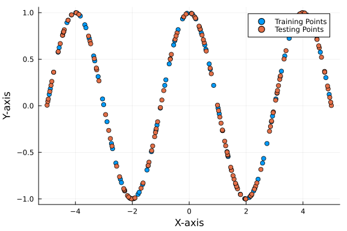
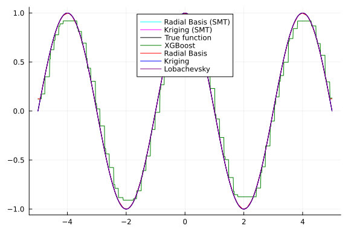

The tensor product function is defined as:

``f(x) =  \prod_{i=1}^{d} \cos(a\pi x_i)``

where:

- \(d\): Represents the dimensionality of the input vector \(x\).
- \(x_i\): Represents the \(i\)-th component of the input vector.
- \(a\): A constant parameter.

## Package Imports

```julia
using Surrogates
using XGBoost
using Plots
using Statistics
using PrettyTables
using BenchmarkTools

## Python SMT
using PythonCall
using CondaPkg
smt = pyimport("smt.surrogate_models")
np = pyimport("numpy")
```

```
Python: <module 'numpy' from '/home/crackauc/github-runners/amdci3-1/_work/
SciMLBenchmarks.jl/SciMLBenchmarks.jl/benchmarks/Surrogates/.CondaPkg/.pixi
/envs/default/lib/python3.13/site-packages/numpy/__init__.py'>
```


## Define the function

```julia
function tensor_product_function(x)
    a = 0.5
    return prod(cos.(a * π * x))
end
```

```
tensor_product_function (generic function with 1 method)
```


## Define parameters for training and test data

```julia
lb = -5.0 # Lower bound of sampling range
ub = 5.0  # Upper bound of sampling range
n_train = 100 # Number of training points
n_test = 150 # Number of testing points
```

```
150
```


## Sample training and test data points

```julia
x_train = sample(n_train, lb, ub, SobolSample())  # Sample training data points
y_train = tensor_product_function.(x_train)  # Calculate corresponding function values
x_test = sample(n_test, lb, ub, RandomSample())  # Sample larger test data set
y_test = tensor_product_function.(x_test)  # Calculate corresponding true function values
```

```
150-element Vector{Float64}:
  0.3228577890898678
  0.6031711762069693
  0.035270457075895566
 -0.8131133588527643
 -0.6993633134415057
 -0.18380714835614795
  0.9414233588125386
 -0.8487428122729299
  0.6552633469010913
 -0.9726341201076522
  ⋮
 -0.15781173540735724
  0.9471544554273277
  0.14867387736719467
 -0.6928115507517415
 -0.2695867957284554
  0.10823286947418409
  0.9690927180786124
 -0.5890654429741988
 -0.7959070533355348
```


## Plot training and test points

```julia
scatter(x_train, y_train, label="Training Points", xlabel="X-axis", ylabel="Y-axis", legend=:topright)
scatter!(x_test, y_test, label="Testing Points")
```




## Fit surrogate models

```julia
# SMT
radial_surrogate_smt = smt.RBF(d0=1.0, poly_degree=1.0, print_global=Py(false))
radial_surrogate_smt.set_training_values(np.array(x_train), np.array(y_train))
radial_surrogate_smt.train()

theta = 0.5 / max(1e-6 * abs(ub - lb), std(x_train))^2.0
kriging_surrogate_smt = smt.KRG(theta0=np.array([theta]), poly="quadratic", print_global=Py(false))
kriging_surrogate_smt.set_training_values(np.array(x_train), np.array(y_train))
kriging_surrogate_smt.train()

# Julia
xgboost_surrogate = XGBoostSurrogate(x_train, y_train, lb, ub, num_round = 10)
radial_surrogate = RadialBasis(x_train, y_train, lb, ub)
kriging_surrogate = Kriging(x_train, y_train, lb, ub)
loba_surrogate = LobachevskySurrogate(x_train, y_train, lb, ub, alpha = 2.0, n = 6)
```

```
(::Surrogates.LobachevskySurrogate{Vector{Float64}, Vector{Float64}, Float6
4, Int64, Float64, Float64, Vector{Float64}, Bool}) (generic function with 
2 methods)
```


## Predictions on training and test data

```julia
## Training data
radial_train_pred_smt = radial_surrogate_smt.predict_values(np.array(x_train))
radial_train_pred_smt = pyconvert(Matrix{Float64}, radial_train_pred_smt)[:, 1]
kriging_train_pred_smt = kriging_surrogate_smt.predict_values(np.array(x_train))
kriging_train_pred_smt = pyconvert(Matrix{Float64}, kriging_train_pred_smt)[:, 1]
xgboost_train_pred = xgboost_surrogate.(x_train)
radial_train_pred = radial_surrogate.(x_train)
kriging_train_pred = kriging_surrogate.(x_train)
loba_train_pred = loba_surrogate.(x_train)

## Test data
radial_test_pred_smt = radial_surrogate_smt.predict_values(np.array(x_test))
radial_test_pred_smt = pyconvert(Matrix{Float64}, radial_test_pred_smt)[:, 1]
kriging_test_pred_smt = kriging_surrogate_smt.predict_values(np.array(x_test))
kriging_test_pred_smt = pyconvert(Matrix{Float64}, kriging_test_pred_smt)[:, 1]
xgboost_test_pred = xgboost_surrogate.(x_test)
radial_test_pred = radial_surrogate.(x_test)
kriging_test_pred = kriging_surrogate.(x_test)
loba_test_pred = loba_surrogate.(x_test)
```

```
150-element Vector{Float64}:
  0.322855557124474
  0.6031835263993189
  0.035280765786769926
 -0.8131170698055126
 -0.6993627056097349
 -0.18379351016534773
  0.9414399782925562
 -0.8487255747561946
  0.6551371650634015
 -0.9726530680133134
  ⋮
 -0.15779566020700278
  0.9471523221322219
  0.1487210902054039
 -0.6928089029322984
 -0.26967568438980827
  0.10829465830972282
  0.9690798469782982
 -0.5890699448059937
 -0.795909606757748
```


## Define the MSE function

```julia
function calculate_mse(predictions, true_values)
    return mean((predictions .- true_values).^2)  # Calculate mean of squared errors
end
```

```
calculate_mse (generic function with 1 method)
```


## Calculate MSE for the models

```julia
## Training MSE
mse_radial_train_smt = calculate_mse(radial_train_pred_smt, y_train)
mse_krig_train_smt = calculate_mse(kriging_train_pred_smt, y_train)
mse_xgb_train = calculate_mse(xgboost_train_pred, y_train)
mse_radial_train = calculate_mse(radial_train_pred, y_train)
mse_krig_train = calculate_mse(kriging_train_pred, y_train)
mse_loba_train = calculate_mse(loba_train_pred, y_train)

## Test MSE
mse_radial_test_smt = calculate_mse(radial_test_pred_smt, y_test)
mse_krig_test_smt = calculate_mse(kriging_test_pred_smt, y_test)
mse_xgb_test = calculate_mse(xgboost_test_pred, y_test)
mse_radial_test = calculate_mse(radial_test_pred, y_test)
mse_krig_test = calculate_mse(kriging_test_pred, y_test)
mse_loba_test = calculate_mse(loba_test_pred, y_test)
```

```
1.572106944843983e-9
```


## Compare MSE

```julia
models = ["XGBoost", "Radial Basis", "Kriging", "Lobachevsky", "Radial Basis (SMT)", "Kriging (SMT)"]
train_mses = [mse_xgb_train, mse_radial_train, mse_krig_train, mse_loba_train, mse_radial_train_smt, mse_krig_train_smt]
test_mses = [mse_xgb_test, mse_radial_test, mse_krig_test, mse_loba_test, mse_radial_test_smt, mse_krig_test_smt]
mses = sort(collect(zip(test_mses, train_mses, models)))
pretty_table(hcat(getindex.(mses, 3), getindex.(mses, 2), getindex.(mses, 1)), column_labels=["Model", "Training MSE", "Test MSE"])
```

```
┌────────────────────┬──────────────┬─────────────┐
│              Model │ Training MSE │    Test MSE │
├────────────────────┼──────────────┼─────────────┤
│      Kriging (SMT) │  3.52227e-18 │ 4.02911e-18 │
│ Radial Basis (SMT) │  2.34051e-14 │ 1.31138e-13 │
│        Lobachevsky │   3.7375e-19 │  1.57211e-9 │
│            Kriging │   1.16824e-5 │  1.19671e-5 │
│       Radial Basis │  1.74579e-30 │  2.39563e-5 │
│            XGBoost │   0.00176894 │  0.00782274 │
└────────────────────┴──────────────┴─────────────┘
```


## Plot predictions

```julia
xs = -5:0.01:5

radial_pred_smt = radial_surrogate_smt.predict_values(np.array(xs))
radial_pred_smt = pyconvert(Matrix{Float64}, radial_pred_smt)[:, 1]
kriging_pred_smt = kriging_surrogate_smt.predict_values(np.array(xs))
kriging_pred_smt = pyconvert(Matrix{Float64}, kriging_pred_smt)[:, 1]

plot(xs, radial_pred_smt, label="Radial Basis (SMT)", legend=:top, color=:cyan)
plot!(xs, kriging_surrogate.(xs), label="Kriging (SMT)", legend=:top, color=:magenta)
plot!(xs, tensor_product_function.(xs), label="True function", legend=:top, color=:black)
plot!(xs, xgboost_surrogate.(xs), label="XGBoost", legend=:top, color=:green)
plot!(xs, radial_surrogate.(xs), label="Radial Basis", legend=:top, color=:red)
plot!(xs, kriging_surrogate.(xs), label="Kriging", legend=:top, color=:blue)
plot!(xs, loba_surrogate.(xs), label="Lobachevsky", legend=:top, color=:purple)
```




## Time evaluation

```julia
time_original = @belapsed tensor_product_function.(x_test)
time_radial_smt = @belapsed radial_surrogate_smt.predict_values(np.array(x_test))
time_krig_smt = @belapsed kriging_surrogate_smt.predict_values(np.array(x_test))
time_xgb = @belapsed xgboost_surrogate.(x_test)
time_radial = @belapsed radial_surrogate.(x_test)
time_krig = @belapsed kriging_surrogate.(x_test)
time_loba = @belapsed loba_surrogate.(x_test)
```

```
0.001479671
```


## Compare time performance

```julia
times = ["XGBoost" => time_xgb, "Radial Basis" => time_radial, "Kriging" => time_krig, "Lobachevsky" => time_loba, "Radial Basis (SMT)" => time_radial_smt, "Kriging (SMT)" => time_krig_smt, "Original Function" => time_original]
sorted_times = sort(times, by=x->x[2])
pretty_table(hcat(first.(sorted_times), last.(sorted_times)), column_labels=["Model", "Time(s)"])
```

```
┌────────────────────┬─────────────┐
│              Model │     Time(s) │
├────────────────────┼─────────────┤
│  Original Function │    1.597e-6 │
│            Kriging │ 0.000342458 │
│ Radial Basis (SMT) │ 0.000414588 │
│      Kriging (SMT) │ 0.000654746 │
│        Lobachevsky │  0.00147967 │
│       Radial Basis │  0.00210461 │
│            XGBoost │   0.0630811 │
└────────────────────┴─────────────┘
```


