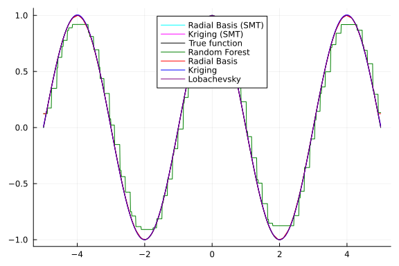

The tensor product function is defined as:

``f(x) =  \prod_{i=1}^{d} \cos(a\pi x_i)``

where:

- \(d\): Represents the dimensionality of the input vector \(x\).
- \(x_i\): Represents the \(i\)-th component of the input vector.
- \(a\): A constant parameter.

## Package Imports

```julia
using Surrogates
using SurrogatesRandomForest
using Plots
using Statistics
using PrettyTables
using BenchmarkTools
```


## Define the function

```julia
function tensor_product_function(x)
    a = 0.5
    return prod(cos.(a * π * x))
end
```

```
tensor_product_function (generic function with 1 method)
```


## Define parameters for training and test data

```julia
lb = -5.0 # Lower bound of sampling range
ub = 5.0  # Upper bound of sampling range
n_train = 100 # Number of training points
n_test = 150 # Number of testing points
```

```
150
```


## Sample training and test data points

```julia
x_train = sample(n_train, lb, ub, SobolSample())  # Sample training data points
y_train = tensor_product_function.(x_train)  # Calculate corresponding function values
x_test = sample(n_test, lb, ub, RandomSample())  # Sample larger test data set
y_test = tensor_product_function.(x_test)  # Calculate corresponding true function values
```

```
150-element Vector{Float64}:
  0.8305752462969131
 -0.033544437159193675
 -0.6619128779610377
  0.5596264328875811
  0.6574597251939587
 -0.399771720540044
  0.9912259665189641
  0.21190087950039685
  0.7587325185446382
 -0.7587946039832388
  ⋮
 -0.754167185436482
 -0.8664366348825658
  0.045572772931094095
  0.9608814440746848
 -0.5818384926539936
 -0.9672703385192788
 -0.4843577936189141
  0.8878177091150425
 -0.889416515883492
```


## Plot training and test points

```julia
scatter(x_train, y_train, label="Training Points", xlabel="X-axis", ylabel="Y-axis", legend=:topright)
scatter!(x_test, y_test, label="Testing Points")
```


## Fit surrogate models

```julia
randomforest_surrogate = RandomForestSurrogate(x_train, y_train, lb, ub, num_round = 10)
radial_surrogate = RadialBasis(x_train, y_train, lb, ub)
kriging_surrogate = Kriging(x_train, y_train, lb, ub)
loba_surrogate = LobachevskySurrogate(x_train, y_train, lb, ub, alpha = 2.0, n = 6)
```

```
(::Surrogates.LobachevskySurrogate{Vector{Float64}, Vector{Float64}, Float6
4, Int64, Float64, Float64, Vector{Float64}, Bool}) (generic function with 
2 methods)
```


## Predictions on training and test data

```julia
## Training data
random_forest_train_pred = randomforest_surrogate.(x_train)
radial_train_pred = radial_surrogate.(x_train)
kriging_train_pred = kriging_surrogate.(x_train)
loba_train_pred = loba_surrogate.(x_train)

## Test data
random_forest_test_pred = randomforest_surrogate.(x_test)
radial_test_pred = radial_surrogate.(x_test)
kriging_test_pred = kriging_surrogate.(x_test)
loba_test_pred = loba_surrogate.(x_test)
```

```
150-element Vector{Float64}:
  0.8305833038315116
 -0.03354607927309772
 -0.6619015721397044
  0.559602172018074
  0.6574632429483609
 -0.3997761523856962
  0.9912460769957562
  0.21193377422749737
  0.7587327137353479
 -0.7587834325444476
  ⋮
 -0.7541566404378912
 -0.8664191088053832
  0.046810492201239576
  0.9608823131447458
 -0.5818435032691411
 -0.9672344657432858
 -0.48438867719886664
  0.8878349713116643
 -0.8894030638020265
```


## Define the MSE function

```julia
function calculate_mse(predictions, true_values)
    return mean((predictions .- true_values).^2)  # Calculate mean of squared errors
end
```

```
calculate_mse (generic function with 1 method)
```


## Calculate MSE for the models

```julia
## Training MSE
mse_rf_train = calculate_mse(random_forest_train_pred, y_train)
mse_radial_train = calculate_mse(radial_train_pred, y_train)
mse_krig_train = calculate_mse(kriging_train_pred, y_train)
mse_loba_train = calculate_mse(loba_train_pred, y_train)

## Test MSE
mse_rf_test = calculate_mse(random_forest_test_pred, y_test)
mse_radial_test = calculate_mse(radial_test_pred, y_test)
mse_krig_test = calculate_mse(kriging_test_pred, y_test)
mse_loba_test = calculate_mse(loba_test_pred, y_test)
```

```
1.7795633469563856e-8
```


## Compare MSE

```julia
models = ["Random Forest", "Radial Basis", "Kriging", "Lobachevsky"]
train_mses = [mse_rf_train, mse_radial_train, mse_krig_train, mse_loba_train]
test_mses = [mse_rf_test, mse_radial_test, mse_krig_test, mse_loba_test]
mses = sort(collect(zip(test_mses, train_mses, models)))
pretty_table(hcat(getindex.(mses, 3), getindex.(mses, 2), getindex.(mses, 1)), header=["Model", "Training MSE", "Test MSE"])
```

```
┌───────────────┬──────────────┬─────────────┐
│         Model │ Training MSE │    Test MSE │
├───────────────┼──────────────┼─────────────┤
│   Lobachevsky │   3.7375e-19 │  1.77956e-8 │
│       Kriging │   1.16824e-5 │  1.38763e-5 │
│  Radial Basis │  1.74579e-30 │ 0.000115666 │
│ Random Forest │   0.00176894 │  0.00834948 │
└───────────────┴──────────────┴─────────────┘
```


## Plot predictions

```julia
xs = -5:0.01:5
plot(xs, tensor_product_function.(xs), label="True function", legend=:top, color=:black)
plot!(xs, randomforest_surrogate.(xs), label="Random Forest", legend=:top, color=:green)
plot!(xs, radial_surrogate.(xs), label="Radial Basis", legend=:top, color=:red)
plot!(xs, kriging_surrogate.(xs), label="Kriging", legend=:top, color=:blue)
plot!(xs, loba_surrogate.(xs), label="Lobachevsky", legend=:top, color=:purple)
```




## Time evaluation

```julia
time_original = @belapsed tensor_product_function.(x_test)
time_rf = @belapsed randomforest_surrogate.(x_test)
time_radial = @belapsed radial_surrogate.(x_test)
time_krig = @belapsed kriging_surrogate.(x_test)
time_loba = @belapsed loba_surrogate.(x_test)
```

```
0.001412517
```


## Compare time performance

```julia
times = ["Random Forest" => time_rf, "Radial Basis" => time_radial, "Kriging" => time_krig, "Lobachevsky" => time_loba, "Original Function" => time_original]
sorted_times = sort(times, by=x->x[2])
pretty_table(hcat(first.(sorted_times), last.(sorted_times)), header=["Model", "Time(s)"])
```

```
┌───────────────────┬─────────────┐
│             Model │     Time(s) │
├───────────────────┼─────────────┤
│ Original Function │     1.49e-6 │
│           Kriging │ 0.000338547 │
│       Lobachevsky │  0.00141252 │
│      Radial Basis │  0.00188718 │
│     Random Forest │  0.00406976 │
└───────────────────┴─────────────┘
```


