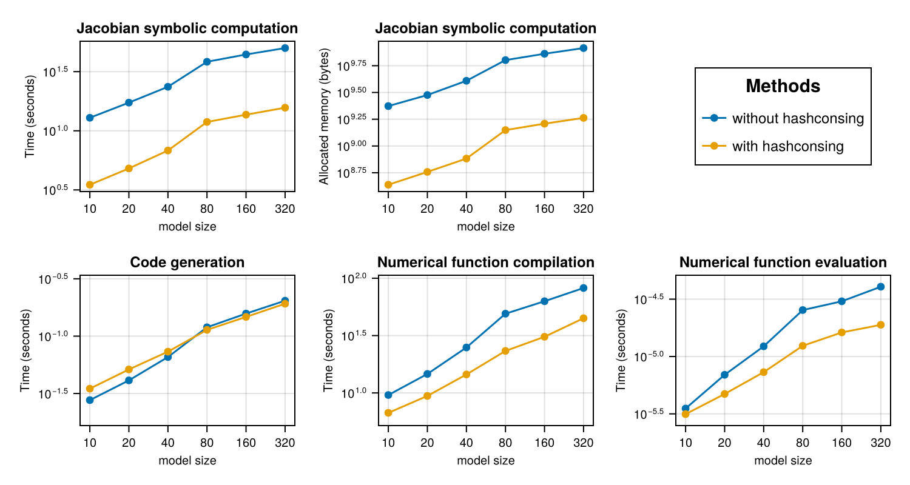

The following benchmark is of 1122 ODEs with 24388 terms that describe a stiff
chemical reaction network modeling the BCR signaling network from [Barua et
al.](https://doi.org/10.4049/jimmunol.1102003). We use
[`ReactionNetworkImporters`](https://github.com/isaacsas/ReactionNetworkImporters.jl)
to load the BioNetGen model files as a
[Catalyst](https://github.com/SciML/Catalyst.jl) model, and then use
[ModelingToolkit](https://github.com/SciML/ModelingToolkit.jl) to convert the
Catalyst network model to ODEs.

The resultant large model is used to benchmark the time taken to compute a symbolic
jacobian, generate a function to calculate it and call the function.


```julia
using Catalyst, ReactionNetworkImporters,
    TimerOutputs, LinearAlgebra, ModelingToolkit, Chairmarks,
    LinearSolve, Symbolics, SymbolicUtils, SymbolicUtils.Code, SparseArrays, CairoMakie,
    PrettyTables
using ModelingToolkit: default_values

datadir  = joinpath(dirname(pathof(ReactionNetworkImporters)),"../data/bcr")
const to = TimerOutput()
tf       = 100000.0

# generate ModelingToolkit ODEs
rn_raw = loadrxnetwork(BNGNetwork(), joinpath(datadir, "bcr.net"))
show(to)
rn    = complete(rn_raw; split = false)
obs = [eq.lhs for eq in observed(rn)]
osys = Catalyst.ode_model(rn)

rhs = [eq.rhs for eq in full_equations(osys)]
vars = unknowns(osys)
pars = parameters(osys)
```

```
Scanning blocks...done
Parsing parameters...done
Creating parameters...done
Parsing species...done
Creating variables...done
Setting up expression evaluation module...done
Parsing groups...done
Parsing functions...done
Parsing and adding reactions...done
────────────────────────────────────────────────────────────────────
                           Time                    Allocations      
                  ───────────────────────   ────────────────────────
Tot / % measured:      41.6s /   0.0%           3.31GiB /   0.0%    

Section   ncalls     time    %tot     avg     alloc    %tot      avg
────────────────────────────────────────────────────────────────────
────────────────────────────────────────────────────────────────────128-ele
ment Vector{SymbolicUtils.BasicSymbolicImpl.var"typeof(BasicSymbolicImpl)"{
SymbolicUtils.SymReal}}:
 p1
 p2
 p3
 p4
 p5
 p6
 p7
 p8
 p9
 p10
 ⋮
 _rateLaw2
 _rateLaw3
 _rateLaw4
 _rateLaw5
 _rateLaw6
 _rateLaw7
 _rateLaw8
 _rateLaw9
 _rateLaw10
```


The `sparsejacobian` function in Symbolics.jl is optimized for hashconsing and caching, and as such
performs very poorly without either of those features. We use the old implementation, optimized without
hashconsing, to benchmark performance without hashconsing and without caching to avoid biasing the results.

```julia
include("old_sparse_jacobian.jl")
```

```
old_executediff (generic function with 2 methods)
```


```julia
SymbolicUtils.ENABLE_HASHCONSING[] = false
@timeit to "Calculate jacobian - without hashconsing" jac_nohc = old_sparsejacobian(rhs, vars);
SymbolicUtils.ENABLE_HASHCONSING[] = true
Symbolics.toggle_derivative_caching!(false)
Symbolics.clear_derivative_caches!()
@timeit to "Calculate jacobian - hashconsing, without caching" jac_hc_nocache = old_sparsejacobian(rhs, vars);
Symbolics.toggle_derivative_caching!(true)
for fn in Symbolics.cached_derivative_functions()
    stats = SymbolicUtils.get_stats(fn)
    @assert stats.hits == stats.misses == 0
end
Symbolics.clear_derivative_caches!()
@timeit to "Calculate jacobian - hashconsing and caching" jac_hc_cache = Symbolics.sparsejacobian(rhs, vars);

@assert isequal(jac_nohc, jac_hc_nocache)

jac = jac_hc_cache
args = (vars, pars, ModelingToolkit.get_iv(osys))
# out of place versions run into an error saying the expression is too large
# due to the `SymbolicUtils.Code.create_array` call. `iip_config` prevents it
# from trying to build the function.
kwargs = (; iip_config = (false, true), expression = Val{true})
@timeit to "Build jacobian - no CSE" _, jac_nocse_iip = build_function(jac, args...; cse = false, kwargs...);
@timeit to "Build jacobian - CSE" _, jac_cse_iip = build_function(jac, args...; cse = true, kwargs...);

jac_nocse_iip = eval(jac_nocse_iip)
jac_cse_iip = eval(jac_cse_iip)

defs = default_values(osys)
u = Float64[Symbolics.value(Symbolics.fixpoint_sub(var, defs)) for var in vars]
buffer_cse = similar(jac, Float64)
buffer_nocse = similar(jac, Float64)
p = Float64[Symbolics.value(Symbolics.fixpoint_sub(par, defs)) for par in pars]
tt = 0.0

@timeit to "Compile jacobian - CSE" jac_cse_iip(buffer_cse, u, p, tt)
@timeit to "Compute jacobian - CSE" jac_cse_iip(buffer_cse, u, p, tt)

@timeit to "Compile jacobian - no CSE" jac_nocse_iip(buffer_nocse, u, p, tt)
@timeit to "Compute jacobian - no CSE" jac_nocse_iip(buffer_nocse, u, p, tt)

@assert isapprox(buffer_cse, buffer_nocse, rtol = 1e-10)

show(to)
```

```
───────────────────────────────────────────────────────────────────────────
───────────────────────────────────
                                                                     Time  
                  Allocations      
                                                            ───────────────
────────   ────────────────────────
                     Tot / % measured:                           4.06h /  9
9.4%           1.19TiB /  99.4%    

Section                                             ncalls     time    %tot
     avg     alloc    %tot      avg
───────────────────────────────────────────────────────────────────────────
───────────────────────────────────
Calculate jacobian - without hashconsing                 1    3.92h   97.2%
   3.92h   1.15TiB   97.6%  1.15TiB
Compile jacobian - no CSE                                1     178s    1.2%
    178s   8.81GiB    0.7%  8.81GiB
Compile jacobian - CSE                                   1    94.3s    0.6%
   94.3s   2.55GiB    0.2%  2.55GiB
Calculate jacobian - hashconsing, without caching        1    92.0s    0.6%
   92.0s   12.4GiB    1.0%  12.4GiB
Calculate jacobian - hashconsing and caching             1    29.2s    0.2%
   29.2s   3.42GiB    0.3%  3.42GiB
Build jacobian - no CSE                                  1    8.18s    0.1%
   8.18s   1.45GiB    0.1%  1.45GiB
Build jacobian - CSE                                     1    512ms    0.0%
   512ms    126MiB    0.0%   126MiB
Compute jacobian - no CSE                                1    109μs    0.0%
   109μs      176B    0.0%     176B
Compute jacobian - CSE                                   1   86.6μs    0.0%
  86.6μs      176B    0.0%     176B
───────────────────────────────────────────────────────────────────────────
───────────────────────────────────
```


We'll also measure scaling.


```julia
function run_and_time_construct!(rhs, vars, pars, iv, N, i, jac_times, jac_allocs, build_times, functions)
    outputs = rhs[1:N]
    SymbolicUtils.ENABLE_HASHCONSING[] = false
    jac_result = @be old_sparsejacobian(outputs, vars)
    jac_times[1][i] = minimum(x -> x.time, jac_result.samples)
    jac_allocs[1][i] = minimum(x -> x.bytes, jac_result.samples)

    SymbolicUtils.ENABLE_HASHCONSING[] = true
    jac_result = @be (Symbolics.clear_derivative_caches!(); Symbolics.sparsejacobian(outputs, vars))
    jac_times[2][i] = minimum(x -> x.time, jac_result.samples)
    jac_allocs[2][i] = minimum(x -> x.bytes, jac_result.samples)

    jac = Symbolics.sparsejacobian(outputs, vars)
    args = (vars, pars, iv)
    kwargs = (; iip_config = (false, true), expression = Val{true})
    
    build_result = @be build_function(jac, args...; cse = false, kwargs...);
    build_times[1][i] = minimum(x -> x.time, build_result.samples)
    jacfn_nocse = eval(build_function(jac, args...; cse = false, kwargs...)[2])

    build_result = @be build_function(jac, args...; cse = true, kwargs...);
    build_times[2][i] = minimum(x -> x.time, build_result.samples)
    jacfn_cse = eval(build_function(jac, args...; cse = true, kwargs...)[2])

    functions[1][i] = let buffer = similar(jac, Float64), fn = jacfn_nocse
        function nocse(u, p, t)
            fn(buffer, u, p, t)
            buffer
        end
    end
    functions[2][i] = let buffer = similar(jac, Float64), fn = jacfn_cse
        function cse(u, p, t)
            fn(buffer, u, p, t)
            buffer
        end
    end

    return nothing
end

function run_and_time_call!(i, u, p, tt, functions, first_call_times, second_call_times)
    jacfn_nocse = functions[1][i]
    jacfn_cse = functions[2][i]

    call_result = @timed jacfn_nocse(u, p, tt)
    first_call_times[1][i] = call_result.time
    call_result = @timed jacfn_cse(u, p, tt)
    first_call_times[2][i] = call_result.time

    call_result = @be jacfn_nocse(u, p, tt)
    second_call_times[1][i] = minimum(x -> x.time, call_result.samples)
    call_result = @be jacfn_cse(u, p, tt)
    second_call_times[2][i] = minimum(x -> x.time, call_result.samples)
end
```

```
run_and_time_call! (generic function with 1 method)
```


# Run benchmark

```julia
Chairmarks.DEFAULTS.seconds = 15.0
N = [10, 20, 40, 80, 160, 320]
jacobian_times = [zeros(Float64, length(N)), zeros(Float64, length(N))]
jacobian_allocs = copy.(jacobian_times)
functions = [Vector{Any}(undef, length(N)), Vector{Any}(undef, length(N))]
# [without_cse_times, with_cse_times]
build_times = copy.(jacobian_times)
first_call_times = copy.(jacobian_times)
second_call_times = copy.(jacobian_times)

iv = ModelingToolkit.get_iv(osys)
run_and_time_construct!(rhs, vars, pars, iv, 10, 1, jacobian_times, jacobian_allocs, build_times, functions)
run_and_time_call!(1, u, p, tt, functions, first_call_times, second_call_times)
for (i, n) in enumerate(N)
    @info i n
    run_and_time_construct!(rhs, vars, pars, iv, n, i, jacobian_times, jacobian_allocs, build_times, functions)
end
for (i, n) in enumerate(N)
    @info i n
    run_and_time_call!(i, u, p, tt, functions, first_call_times, second_call_times)
end
```


# Plot figures

```julia
tabledata = hcat(N, jacobian_times..., jacobian_allocs..., build_times..., first_call_times..., second_call_times...)
header = ["N", "Jacobian time (no hashconsing)", "Jacobian time (hashconsing)", "Jacobian allocated memory (no hashconsing) (B)", "Jacobian allocated memory (hashconsing) (B)", "`build_function` time (no CSE)", "`build_function` time (CSE)", "First call time (no CSE)", "First call time (CSE)", "Second call time (no CSE)", "Second call time (CSE)"]
pretty_table(tabledata; column_labels = header, backend = :html)
```


<table>
  <thead>
    <tr class = "columnLabelRow">
      <th style = "font-weight: bold; text-align: right;">N</th>
      <th style = "font-weight: bold; text-align: right;">Jacobian time (no hashconsing)</th>
      <th style = "font-weight: bold; text-align: right;">Jacobian time (hashconsing)</th>
      <th style = "font-weight: bold; text-align: right;">Jacobian allocated memory (no hashconsing) (B)</th>
      <th style = "font-weight: bold; text-align: right;">Jacobian allocated memory (hashconsing) (B)</th>
      <th style = "font-weight: bold; text-align: right;">`build_function` time (no CSE)</th>
      <th style = "font-weight: bold; text-align: right;">`build_function` time (CSE)</th>
      <th style = "font-weight: bold; text-align: right;">First call time (no CSE)</th>
      <th style = "font-weight: bold; text-align: right;">First call time (CSE)</th>
      <th style = "font-weight: bold; text-align: right;">Second call time (no CSE)</th>
      <th style = "font-weight: bold; text-align: right;">Second call time (CSE)</th>
    </tr>
  </thead>
  <tbody>
    <tr class = "dataRow">
      <td style = "text-align: right;">10.0</td>
      <td style = "text-align: right;">12.8879</td>
      <td style = "text-align: right;">3.49746</td>
      <td style = "text-align: right;">2.35952e9</td>
      <td style = "text-align: right;">4.34216e8</td>
      <td style = "text-align: right;">0.0276946</td>
      <td style = "text-align: right;">0.034851</td>
      <td style = "text-align: right;">9.59047</td>
      <td style = "text-align: right;">6.70625</td>
      <td style = "text-align: right;">3.52113e-6</td>
      <td style = "text-align: right;">3.14667e-6</td>
    </tr>
    <tr class = "dataRow">
      <td style = "text-align: right;">20.0</td>
      <td style = "text-align: right;">17.3092</td>
      <td style = "text-align: right;">4.80565</td>
      <td style = "text-align: right;">2.99358e9</td>
      <td style = "text-align: right;">5.72367e8</td>
      <td style = "text-align: right;">0.0411687</td>
      <td style = "text-align: right;">0.0512693</td>
      <td style = "text-align: right;">14.6376</td>
      <td style = "text-align: right;">9.41456</td>
      <td style = "text-align: right;">6.92725e-6</td>
      <td style = "text-align: right;">4.71483e-6</td>
    </tr>
    <tr class = "dataRow">
      <td style = "text-align: right;">40.0</td>
      <td style = "text-align: right;">23.5627</td>
      <td style = "text-align: right;">6.81349</td>
      <td style = "text-align: right;">4.06703e9</td>
      <td style = "text-align: right;">7.62738e8</td>
      <td style = "text-align: right;">0.065754</td>
      <td style = "text-align: right;">0.0732556</td>
      <td style = "text-align: right;">24.9028</td>
      <td style = "text-align: right;">14.4885</td>
      <td style = "text-align: right;">1.2265e-5</td>
      <td style = "text-align: right;">7.3025e-6</td>
    </tr>
    <tr class = "dataRow">
      <td style = "text-align: right;">80.0</td>
      <td style = "text-align: right;">38.3519</td>
      <td style = "text-align: right;">11.8771</td>
      <td style = "text-align: right;">6.34568e9</td>
      <td style = "text-align: right;">1.40757e9</td>
      <td style = "text-align: right;">0.119484</td>
      <td style = "text-align: right;">0.113438</td>
      <td style = "text-align: right;">49.0655</td>
      <td style = "text-align: right;">23.2443</td>
      <td style = "text-align: right;">2.54e-5</td>
      <td style = "text-align: right;">1.24e-5</td>
    </tr>
    <tr class = "dataRow">
      <td style = "text-align: right;">160.0</td>
      <td style = "text-align: right;">44.2012</td>
      <td style = "text-align: right;">13.6832</td>
      <td style = "text-align: right;">7.27274e9</td>
      <td style = "text-align: right;">1.61607e9</td>
      <td style = "text-align: right;">0.157336</td>
      <td style = "text-align: right;">0.147143</td>
      <td style = "text-align: right;">62.9992</td>
      <td style = "text-align: right;">30.8767</td>
      <td style = "text-align: right;">3.029e-5</td>
      <td style = "text-align: right;">1.621e-5</td>
    </tr>
    <tr class = "dataRow">
      <td style = "text-align: right;">320.0</td>
      <td style = "text-align: right;">50.0859</td>
      <td style = "text-align: right;">15.6805</td>
      <td style = "text-align: right;">8.22337e9</td>
      <td style = "text-align: right;">1.83044e9</td>
      <td style = "text-align: right;">0.203696</td>
      <td style = "text-align: right;">0.191879</td>
      <td style = "text-align: right;">82.1979</td>
      <td style = "text-align: right;">44.7776</td>
      <td style = "text-align: right;">4.059e-5</td>
      <td style = "text-align: right;">1.8889e-5</td>
    </tr>
  </tbody>
</table>


```julia
f = Figure(size = (750, 400))
titles = [
    "Jacobian symbolic computation", "Jacobian symbolic computation", "Code generation",
    "Numerical function compilation", "Numerical function evaluation"]
labels = ["Time (seconds)", "Allocated memory (bytes)",
    "Time (seconds)", "Time (seconds)", "Time (seconds)"]
times = [jacobian_times, jacobian_allocs, build_times, first_call_times, second_call_times]
axes = Axis[]
for i in 1:2
    label = labels[i]
    data = times[i]
    ax = Axis(f[1, i], xscale = log10, yscale = log10, xlabel = "model size",
        xlabelsize = 10, ylabel = label, ylabelsize = 10, xticks = N,
        title = titles[i], titlesize = 12, xticklabelsize = 10, yticklabelsize = 10)
    push!(axes, ax)
    l1 = scatterlines!(ax, N, data[1], label = "without hashconsing")
    l2 = scatterlines!(ax, N, data[2], label = "with hashconsing")
end
Legend(f[1, 3], axes[1], "Methods", tellwidth = false, labelsize = 12, titlesize = 15)
axes2 = Axis[]
# make equal y-axis unit length
mn3, mx3 = extrema(reduce(vcat, times[3]))
xn3 = log10(mx3 / mn3)
mn4, mx4 = extrema(reduce(vcat, times[4]))
xn4 = log10(mx4 / mn4)
mn5, mx5 = extrema(reduce(vcat, times[5]))
xn5 = log10(mx5 / mn5)
xn = max(xn3, xn4, xn5)
xn += 0.2
hxn = xn / 2
hxn3 = (log10(mx3) + log10(mn3)) / 2
hxn4 = (log10(mx4) + log10(mn4)) / 2
hxn5 = (log10(mx5) + log10(mn5)) / 2
ylims = [(exp10(hxn3 - hxn), exp10(hxn3 + hxn)), (exp10(hxn4 - hxn), exp10(hxn4 + hxn)),
    (exp10(hxn5 - hxn), exp10(hxn5 + hxn))]
for i in 1:3
    ir = i + 2
    label = labels[ir]
    data = times[ir]
    ax = Axis(f[2, i], xscale = log10, yscale = log10, xlabel = "model size",
        xlabelsize = 10, ylabel = label, ylabelsize = 10, xticks = N,
        title = titles[ir], titlesize = 12, xticklabelsize = 10, yticklabelsize = 10)
    ylims!(ax, ylims[i]...)
    push!(axes2, ax)
    l1 = scatterlines!(ax, N, data[1], label = "without hashconsing")
    l2 = scatterlines!(ax, N, data[2], label = "with hashconsing")
end
save("bcr.pdf", f)
f
```


