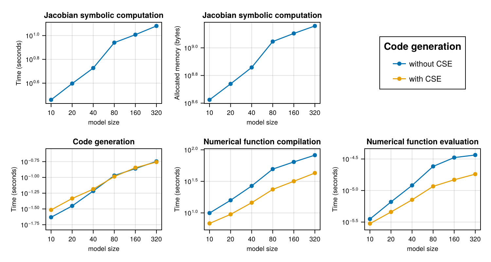

The following benchmark is of 1122 ODEs with 24388 terms that describe a stiff
chemical reaction network modeling the BCR signaling network from [Barua et
al.](https://doi.org/10.4049/jimmunol.1102003). We use
[`ReactionNetworkImporters`](https://github.com/isaacsas/ReactionNetworkImporters.jl)
to load the BioNetGen model files as a
[Catalyst](https://github.com/SciML/Catalyst.jl) model, and then use
[ModelingToolkit](https://github.com/SciML/ModelingToolkit.jl) to convert the
Catalyst network model to ODEs.

The resultant large model is used to benchmark the time taken to compute a symbolic
jacobian, generate a function to calculate it and call the function.

Jacobian construction uses the current `Symbolics.sparsejacobian` implementation, with
derivative caches cleared before each sample. CSE is a `build_function` code-generation
option, so only the code-generation and generated-function measurements compare CSE off
and on.

```julia
using Catalyst, ReactionNetworkImporters,
    TimerOutputs, LinearAlgebra, ModelingToolkit, Chairmarks,
    LinearSolve, Symbolics, SymbolicUtils.Code, SparseArrays, CairoMakie,
    PrettyTables
using SymbolicIndexingInterface: default_values

datadir  = joinpath(dirname(pathof(ReactionNetworkImporters)),"../data/bcr")
const to = TimerOutput()
tf       = 100000.0

# generate ModelingToolkit ODEs
rn_raw = loadrxnetwork(BNGNetwork(), joinpath(datadir, "bcr.net"))
show(to)
rn    = complete(rn_raw; split = false)
obs = [eq.lhs for eq in observed(rn)]
osys = Catalyst.ode_model(rn)

rhs = [eq.rhs for eq in full_equations(osys)]
vars = unknowns(osys)
pars = parameters(osys)
```

```
Scanning blocks...done
Parsing parameters...done
Creating parameters...done
Parsing species...done
Creating variables...done
Setting up expression bindings...done
Parsing groups...done
Parsing functions...done
Parsing and adding reactions...done
────────────────────────────────────────────────────────────────────
                           Time                    Allocations      
                  ───────────────────────   ────────────────────────
Tot / % measured:      33.1s /   0.0%           2.08GiB /   0.0%    

Section   ncalls     time    %tot     avg     alloc    %tot      avg
────────────────────────────────────────────────────────────────────
────────────────────────────────────────────────────────────────────128-ele
ment Vector{SymbolicUtils.BasicSymbolicImpl.var"typeof(BasicSymbolicImpl)"{
SymbolicUtils.SymReal}}:
 p1
 p2
 p3
 p4
 p5
 p6
 p7
 p8
 p9
 p10
 ⋮
 _rateLaw2
 _rateLaw3
 _rateLaw4
 _rateLaw5
 _rateLaw6
 _rateLaw7
 _rateLaw8
 _rateLaw9
 _rateLaw10
```


```julia
Symbolics.clear_derivative_caches!()
@timeit to "Calculate symbolic jacobian" jac = Symbolics.sparsejacobian(rhs, vars);
args = (vars, pars, ModelingToolkit.get_iv(osys))
# out of place versions run into an error saying the expression is too large
# due to the `SymbolicUtils.Code.create_array` call. `iip_config` prevents it
# from trying to build the function.
kwargs = (; iip_config = (false, true), expression = Val{true})
@timeit to "Build jacobian - no CSE" _, jac_nocse_iip = build_function(jac, args...; cse = false, kwargs...);
@timeit to "Build jacobian - CSE" _, jac_cse_iip = build_function(jac, args...; cse = true, kwargs...);

jac_nocse_iip = eval(jac_nocse_iip)
jac_cse_iip = eval(jac_cse_iip)

defs = default_values(osys)
u = Float64[Symbolics.value(Symbolics.fixpoint_sub(var, defs)) for var in vars]
buffer_cse = similar(jac, Float64)
buffer_nocse = similar(jac, Float64)
p = Float64[Symbolics.value(Symbolics.fixpoint_sub(par, defs)) for par in pars]
tt = 0.0

@timeit to "Compile jacobian - CSE" jac_cse_iip(buffer_cse, u, p, tt)
@timeit to "Compute jacobian - CSE" jac_cse_iip(buffer_cse, u, p, tt)

@timeit to "Compile jacobian - no CSE" jac_nocse_iip(buffer_nocse, u, p, tt)
@timeit to "Compute jacobian - no CSE" jac_nocse_iip(buffer_nocse, u, p, tt)

@assert isapprox(buffer_cse, buffer_nocse, rtol = 1e-10)

show(to)
```

```
───────────────────────────────────────────────────────────────────────────
─────────────
                                               Time                    Allo
cations      
                                      ───────────────────────   ───────────
─────────────
          Tot / % measured:                 407s /  76.8%           22.1GiB
 /  72.7%    

Section                       ncalls     time    %tot     avg     alloc    
%tot      avg
───────────────────────────────────────────────────────────────────────────
─────────────
Compile jacobian - no CSE          1     174s   55.8%    174s   8.81GiB   5
4.9%  8.81GiB
Compile jacobian - CSE             1    96.2s   30.8%   96.2s   2.55GiB   1
5.9%  2.55GiB
Calculate symbolic jacobian        1    27.7s    8.9%   27.7s   3.02GiB   1
8.8%  3.02GiB
Build jacobian - no CSE            1    13.4s    4.3%   13.4s   1.53GiB    
9.5%  1.53GiB
Build jacobian - CSE               1    691ms    0.2%   691ms    134MiB    
0.8%   134MiB
Compute jacobian - no CSE          1    104μs    0.0%   104μs      176B    
0.0%     176B
Compute jacobian - CSE             1   65.8μs    0.0%  65.8μs      176B    
0.0%     176B
───────────────────────────────────────────────────────────────────────────
─────────────
```


We'll also measure scaling.


```julia
function run_and_time_construct!(rhs, vars, pars, iv, N, i, jac_times, jac_allocs, build_times, functions)
    outputs = rhs[1:N]
    jac_result = @be (Symbolics.clear_derivative_caches!(); Symbolics.sparsejacobian(outputs, vars))
    jac_times[i] = minimum(x -> x.time, jac_result.samples)
    jac_allocs[i] = minimum(x -> x.bytes, jac_result.samples)

    Symbolics.clear_derivative_caches!()
    jac = Symbolics.sparsejacobian(outputs, vars)
    args = (vars, pars, iv)
    kwargs = (; iip_config = (false, true), expression = Val{true})
    
    build_result = @be build_function(jac, args...; cse = false, kwargs...);
    build_times[1][i] = minimum(x -> x.time, build_result.samples)
    jacfn_nocse = eval(build_function(jac, args...; cse = false, kwargs...)[2])

    build_result = @be build_function(jac, args...; cse = true, kwargs...);
    build_times[2][i] = minimum(x -> x.time, build_result.samples)
    jacfn_cse = eval(build_function(jac, args...; cse = true, kwargs...)[2])

    functions[1][i] = let buffer = similar(jac, Float64), fn = jacfn_nocse
        function nocse(u, p, t)
            fn(buffer, u, p, t)
            buffer
        end
    end
    functions[2][i] = let buffer = similar(jac, Float64), fn = jacfn_cse
        function cse(u, p, t)
            fn(buffer, u, p, t)
            buffer
        end
    end

    return nothing
end

function run_and_time_call!(i, u, p, tt, functions, first_call_times, second_call_times)
    jacfn_nocse = functions[1][i]
    jacfn_cse = functions[2][i]

    call_result = @timed jacfn_nocse(u, p, tt)
    first_call_times[1][i] = call_result.time
    call_result = @timed jacfn_cse(u, p, tt)
    first_call_times[2][i] = call_result.time

    call_result = @be jacfn_nocse(u, p, tt)
    second_call_times[1][i] = minimum(x -> x.time, call_result.samples)
    call_result = @be jacfn_cse(u, p, tt)
    second_call_times[2][i] = minimum(x -> x.time, call_result.samples)
end
```

```
run_and_time_call! (generic function with 1 method)
```


# Run benchmark

```julia
Chairmarks.DEFAULTS.seconds = 15.0
N = [10, 20, 40, 80, 160, 320]
jacobian_times = zeros(Float64, length(N))
jacobian_allocs = similar(jacobian_times)
functions = [Vector{Any}(undef, length(N)), Vector{Any}(undef, length(N))]
# [without_cse_times, with_cse_times]
build_times = [similar(jacobian_times), similar(jacobian_times)]
first_call_times = copy.(build_times)
second_call_times = copy.(build_times)

iv = ModelingToolkit.get_iv(osys)
run_and_time_construct!(rhs, vars, pars, iv, 10, 1, jacobian_times, jacobian_allocs, build_times, functions)
run_and_time_call!(1, u, p, tt, functions, first_call_times, second_call_times)
for (i, n) in enumerate(N)
    @info i n
    run_and_time_construct!(rhs, vars, pars, iv, n, i, jacobian_times, jacobian_allocs, build_times, functions)
end
for (i, n) in enumerate(N)
    @info i n
    run_and_time_call!(i, u, p, tt, functions, first_call_times, second_call_times)
end
```


# Plot figures

```julia
tabledata = hcat(N, jacobian_times, jacobian_allocs, build_times..., first_call_times..., second_call_times...)
header = ["N", "Jacobian time", "Jacobian allocated memory (B)", "`build_function` time (no CSE)", "`build_function` time (CSE)", "First call time (no CSE)", "First call time (CSE)", "Second call time (no CSE)", "Second call time (CSE)"]
pretty_table(tabledata; column_labels = header, backend = :html)
```


<table>
  <thead>
    <tr class = "columnLabelRow">
      <th style = "font-weight: bold; text-align: right;">N</th>
      <th style = "font-weight: bold; text-align: right;">Jacobian time</th>
      <th style = "font-weight: bold; text-align: right;">Jacobian allocated memory (B)</th>
      <th style = "font-weight: bold; text-align: right;">`build_function` time (no CSE)</th>
      <th style = "font-weight: bold; text-align: right;">`build_function` time (CSE)</th>
      <th style = "font-weight: bold; text-align: right;">First call time (no CSE)</th>
      <th style = "font-weight: bold; text-align: right;">First call time (CSE)</th>
      <th style = "font-weight: bold; text-align: right;">Second call time (no CSE)</th>
      <th style = "font-weight: bold; text-align: right;">Second call time (CSE)</th>
    </tr>
  </thead>
  <tbody>
    <tr class = "dataRow">
      <td style = "text-align: right;">10.0</td>
      <td style = "text-align: right;">2.88472</td>
      <td style = "text-align: right;">4.20962e8</td>
      <td style = "text-align: right;">0.0233543</td>
      <td style = "text-align: right;">0.0305684</td>
      <td style = "text-align: right;">9.9438</td>
      <td style = "text-align: right;">6.80973</td>
      <td style = "text-align: right;">3.53e-6</td>
      <td style = "text-align: right;">2.99e-6</td>
    </tr>
    <tr class = "dataRow">
      <td style = "text-align: right;">20.0</td>
      <td style = "text-align: right;">3.95151</td>
      <td style = "text-align: right;">5.48868e8</td>
      <td style = "text-align: right;">0.0353259</td>
      <td style = "text-align: right;">0.0463503</td>
      <td style = "text-align: right;">15.8553</td>
      <td style = "text-align: right;">9.48598</td>
      <td style = "text-align: right;">6.60225e-6</td>
      <td style = "text-align: right;">4.56983e-6</td>
    </tr>
    <tr class = "dataRow">
      <td style = "text-align: right;">40.0</td>
      <td style = "text-align: right;">5.33399</td>
      <td style = "text-align: right;">7.21619e8</td>
      <td style = "text-align: right;">0.0608446</td>
      <td style = "text-align: right;">0.0651817</td>
      <td style = "text-align: right;">26.7584</td>
      <td style = "text-align: right;">14.5056</td>
      <td style = "text-align: right;">1.20595e-5</td>
      <td style = "text-align: right;">7.1275e-6</td>
    </tr>
    <tr class = "dataRow">
      <td style = "text-align: right;">80.0</td>
      <td style = "text-align: right;">8.72166</td>
      <td style = "text-align: right;">1.11144e9</td>
      <td style = "text-align: right;">0.10701</td>
      <td style = "text-align: right;">0.103205</td>
      <td style = "text-align: right;">49.4698</td>
      <td style = "text-align: right;">23.5648</td>
      <td style = "text-align: right;">2.4129e-5</td>
      <td style = "text-align: right;">1.16495e-5</td>
    </tr>
    <tr class = "dataRow">
      <td style = "text-align: right;">160.0</td>
      <td style = "text-align: right;">10.1739</td>
      <td style = "text-align: right;">1.27169e9</td>
      <td style = "text-align: right;">0.137848</td>
      <td style = "text-align: right;">0.142414</td>
      <td style = "text-align: right;">64.2486</td>
      <td style = "text-align: right;">31.7177</td>
      <td style = "text-align: right;">3.329e-5</td>
      <td style = "text-align: right;">1.48e-5</td>
    </tr>
    <tr class = "dataRow">
      <td style = "text-align: right;">320.0</td>
      <td style = "text-align: right;">12.0446</td>
      <td style = "text-align: right;">1.44041e9</td>
      <td style = "text-align: right;">0.179808</td>
      <td style = "text-align: right;">0.175291</td>
      <td style = "text-align: right;">82.2325</td>
      <td style = "text-align: right;">42.853</td>
      <td style = "text-align: right;">3.658e-5</td>
      <td style = "text-align: right;">1.818e-5</td>
    </tr>
  </tbody>
</table>


```julia
f = Figure(size = (750, 400))
titles = [
    "Jacobian symbolic computation", "Jacobian symbolic computation", "Code generation",
    "Numerical function compilation", "Numerical function evaluation"]
labels = ["Time (seconds)", "Allocated memory (bytes)",
    "Time (seconds)", "Time (seconds)", "Time (seconds)"]
times = [jacobian_times, jacobian_allocs, build_times, first_call_times, second_call_times]
axes = Axis[]
for i in 1:2
    label = labels[i]
    data = times[i]
    ax = Axis(f[1, i], xscale = log10, yscale = log10, xlabel = "model size",
        xlabelsize = 10, ylabel = label, ylabelsize = 10, xticks = N,
        title = titles[i], titlesize = 12, xticklabelsize = 10, yticklabelsize = 10)
    push!(axes, ax)
    scatterlines!(ax, N, data)
end
axes2 = Axis[]
# make equal y-axis unit length
mn3, mx3 = extrema(reduce(vcat, times[3]))
xn3 = log10(mx3 / mn3)
mn4, mx4 = extrema(reduce(vcat, times[4]))
xn4 = log10(mx4 / mn4)
mn5, mx5 = extrema(reduce(vcat, times[5]))
xn5 = log10(mx5 / mn5)
xn = max(xn3, xn4, xn5)
xn += 0.2
hxn = xn / 2
hxn3 = (log10(mx3) + log10(mn3)) / 2
hxn4 = (log10(mx4) + log10(mn4)) / 2
hxn5 = (log10(mx5) + log10(mn5)) / 2
ylims = [(exp10(hxn3 - hxn), exp10(hxn3 + hxn)), (exp10(hxn4 - hxn), exp10(hxn4 + hxn)),
    (exp10(hxn5 - hxn), exp10(hxn5 + hxn))]
for i in 1:3
    ir = i + 2
    label = labels[ir]
    data = times[ir]
    ax = Axis(f[2, i], xscale = log10, yscale = log10, xlabel = "model size",
        xlabelsize = 10, ylabel = label, ylabelsize = 10, xticks = N,
        title = titles[ir], titlesize = 12, xticklabelsize = 10, yticklabelsize = 10)
    ylims!(ax, ylims[i]...)
    push!(axes2, ax)
    scatterlines!(ax, N, data[1], label = "without CSE")
    scatterlines!(ax, N, data[2], label = "with CSE")
end
Legend(f[1, 3], axes2[1], "Code generation", tellwidth = false, labelsize = 12, titlesize = 15)
save("bcr.pdf", f)
f
```


