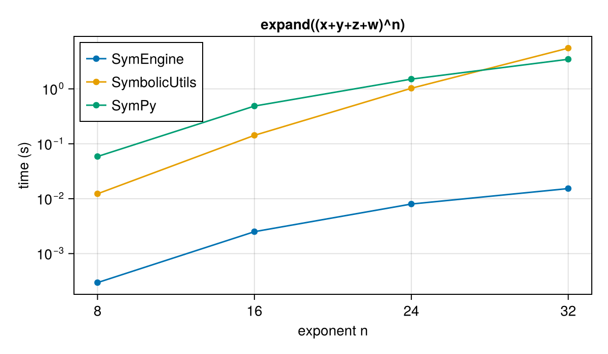
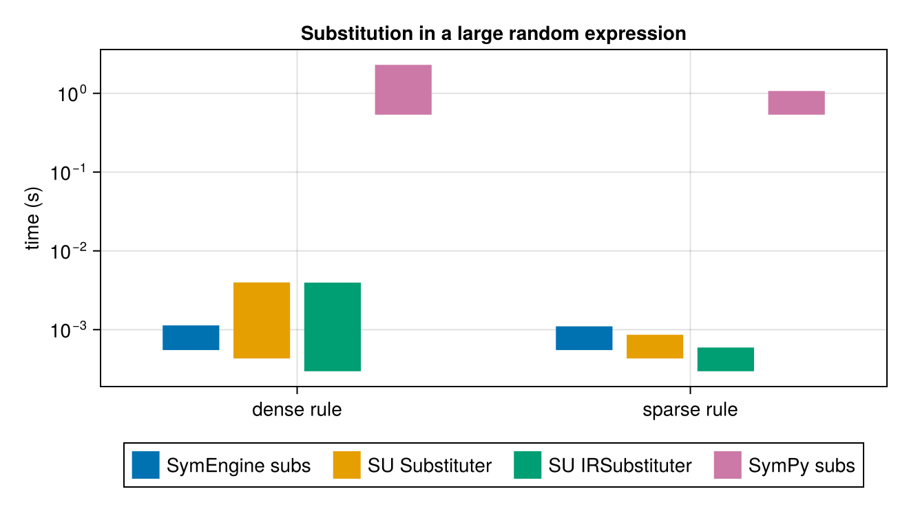
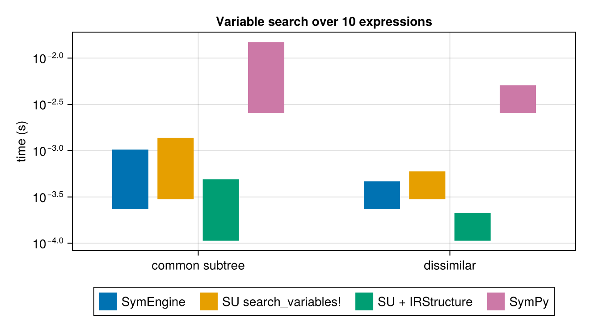
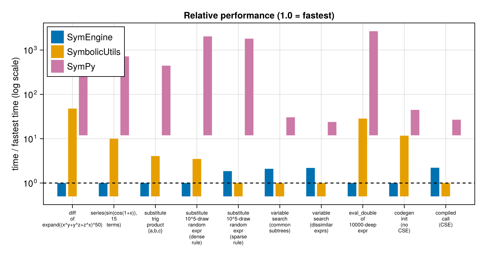

The following benchmarks compare three symbolic-manipulation packages:

* [SymbolicUtils.jl](https://github.com/JuliaSymbolics/SymbolicUtils.jl) (with
  [Symbolics.jl](https://github.com/JuliaSymbolics/Symbolics.jl) for
  differentiation) -- a pure-Julia term-rewriting system. Expressions are
  `BasicSymbolic` trees, manipulated by rewrite rules.
* [SymEngine.jl](https://github.com/symengine/SymEngine.jl) -- Julia wrapper over
  the [symengine](https://github.com/symengine/symengine) C++ library, which
  implements its core operations in compiled C++.
* [SymPy](https://www.sympy.org) -- the pure-Python symbolic mathematics
  library, called here through PythonCall.jl.

The workloads are adapted from symengine's own C++ benchmark suite
(`symengine/benchmarks/`), recreated for all three packages, plus a set of
SymbolicUtils-native workloads taken from SymbolicUtils' own benchmark suite
(substitution with and without its `IRStructure` acceleration structure, and
`search_variables!` expression traversal). The first set plays to SymEngine's
strengths (a compiled symbolic kernel); the second set exercises workloads where
a Julia-native representation is expected to compete.

Each workload uses structurally equivalent expressions on every side: the
random-term generators run the same algorithm over the same atom/function
pools (the RNGs differ across languages, so realized trees differ slightly;
measured node counts are reported below). Where a package lacks a native
operation, the closest practical equivalent is used and noted.

SymPy workloads run in Python via PythonCall.jl and are timed in Python with
`time.perf_counter` (minimum over samples, matching the `Chairmarks`
minimum used for the Julia timings). SymPy caches many results internally,
so its caches are cleared before each timed sample -- the Julia packages do
not memoize these operations.

```julia
using SymEngine, SymbolicUtils, Symbolics, Chairmarks, Random,
      CairoMakie, PrettyTables, OrderedCollections, PythonCall, CondaPkg

const SU = SymbolicUtils
tmin(b) = minimum(s -> s.time, b.samples)

# results collected for the summary table/plot:
# name => (symengine_seconds, symbolicutils_seconds, sympy_seconds)
const RESULTS = OrderedCollections.OrderedDict{String, NTuple{3, Float64}}()
```

```
OrderedCollections.OrderedDict{String, Tuple{Float64, Float64, Float64}}()
```


The SymPy side runs in Python. The block below defines the shared helpers:
a minimum-of-samples timer that clears SymPy's caches first, the
random-term generator, a bottom-up numeric evaluator, and the
atom/function pools. SymPy's `Add`/`Mul` constructors canonicalize and
flatten their arguments, which would collapse the random binary trees;
`evaluate = false` keeps the same tree shape the Julia sides build.

# Setup

The SymbolicUtils side needs a few helpers that SymEngine provides natively:
an iterative numeric evaluator (SymbolicUtils' recursive `evaluate`
stack-overflows on very deep expressions), a Taylor-series routine driven by
`Symbolics.executediff`, and a shared random-expression generator.

```julia
# shared random-expression generator: builds a random binary tree by
# repeatedly pairing off nodes with random binary functions. With the same
# RNG seed and equivalent atom/function pools both packages build
# structurally identical trees.
function random_term(len; atoms, funs, rng, fallback_atom = 1)
    xs = rand(rng, atoms, len)
    while length(xs) > 1
        xs = map(Iterators.partition(xs, 2)) do xy
            x = xy[1]; y = get(xy, 2, fallback_atom)
            rand(rng, funs)(x, y)
        end
    end
    return xs[]
end

# Iterative numeric evaluator over the BasicSymbolic variant tree.
# SymbolicUtils.evaluate recurses and overflows the stack on very deep
# expressions, so this walks the tree with an explicit stack instead.
function su_eval_double(e)
    vals = IdDict{Any,Float64}()
    order = Any[]
    stack = Any[e]
    while !isempty(stack)
        n = pop!(stack)
        push!(order, n)
        u = SU.unwrap(n)
        if SU.isterm(u)
            for a in u.args
                a isa SU.BasicSymbolic && push!(stack, a)
            end
        elseif SU.isaddmul(u)
            for (t, _) in u.dict
                push!(stack, t)
            end
        elseif SU.isdiv(u)
            push!(stack, u.num, u.den)
        end
    end
    for n in Iterators.reverse(order)
        haskey(vals, n) && continue
        u = SU.unwrap(n)
        vals[n] = if SU.isconst(u)
            Float64(u.val)
        elseif SU.isterm(u)
            u.f((a isa SU.BasicSymbolic ? vals[a] : Float64(a) for a in u.args)...)
        elseif SU.isadd(u)
            Float64(u.coeff) + sum(c * vals[t] for (t, c) in u.dict)
        elseif SU.ismul(u)
            foldl(*, (vals[b]^k for (b, k) in u.dict); init = Float64(u.coeff))
        elseif SU.isdiv(u)
            vals[u.num] / vals[u.den]
        else
            error("su_eval_double: unexpected node")
        end
    end
    return vals[e]
end

# Taylor series of `ex` about x = x0 to order n, computed by repeated
# Symbolics.executediff + substitution (mirrors what SymEngine.series does
# internally).
function su_series(ex, x, x0 = 0, n::Integer = 15)
    D = Symbolics.Differential(x)
    fc = SU.substitute(ex, Dict(x => x0); fold = Val(true))
    fp = ex
    for k in 1:n
        fp = Symbolics.executediff(D, fp)
        fc = fc + SU.substitute(fp, Dict(x => x0); fold = Val(true)) *
                  (x - x0)^k / factorial(big(k))
    end
    return fc
end

# IRSubstituter.clear_cache! is only defined on some SymbolicUtils versions.
@static if length(methods(SU.clear_cache!)) < 4
    SU.clear_cache!(sub::SU.IRSubstituter) = empty!(sub.cache)
end
# Substituter/IRSubstituter cache results; clear before each timed call so
# every sample measures a full substitution pass.
function sub_call(subber, ex)
    SU.clear_cache!(subber)
    subber(ex)
end

# SymbolicUtils variables used throughout
@syms s_x s_y s_z s_w s_a s_b s_c s_d s_px
# SymEngine variables used throughout
SymEngine.@vars e_x e_y e_z e_w e_a e_b e_c e_d
const e_px = SymEngine.symbols(:e_px)
const su_const = SU.Const{SU.SymReal}

# node counters for reporting realized tree sizes
function su_nodecount(e)
    u = SU.unwrap(e)
    if SU.isterm(u)
        1 + sum(su_nodecount, u.args; init = 0)
    elseif SU.isaddmul(u)
        1 + sum(su_nodecount, keys(u.dict); init = 0)
    elseif SU.isdiv(u)
        1 + su_nodecount(u.num) + su_nodecount(u.den)
    else
        1
    end
end
se_nodecount(e) = (a = SymEngine.get_args(e); isempty(a) ? 1 : 1 + sum(se_nodecount, a))
```

```
se_nodecount (generic function with 1 method)
```


```julia
# SymPy namespace: helpers and expressions live in one Python dict so
# per-section code below can reference them by name.
const PYNS = pydict()
pyexec("""
import sys, time, random
sys.setrecursionlimit(1000000)
import sympy
import numpy
from sympy.core.cache import clear_cache

numpy.seterr(all = "ignore")

x, y, z, w = sympy.symbols("x y z w")
a, b, c, d, px = sympy.symbols("a b c d px")
hypotf = sympy.Function("hypot")

def bench(f, mintime = 0.4):
    # min-of-samples, matching Chairmarks' reported minimum. SymPy caches
    # results internally (e.g. expand), so clear caches before each sample.
    clear_cache()
    f()
    best = float("inf")
    spent = 0.0
    while spent < mintime:
        clear_cache()
        t0 = time.perf_counter()
        f()
        dt = time.perf_counter() - t0
        best = min(best, dt)
        spent += dt
    return best

def time_once(f):
    # single timed call, for workloads that take too long to sample
    clear_cache()
    t0 = time.perf_counter()
    f()
    return time.perf_counter() - t0

def random_term(length, atoms, funs, rng):
    xs = [rng.choice(atoms) for _ in range(length)]
    while len(xs) > 1:
        new = []
        for i in range(0, len(xs) - 1, 2):
            new.append(rng.choice(funs)(xs[i], xs[i + 1]))
        if len(xs) % 2:
            new.append(rng.choice(funs)(xs[-1], sympy.Integer(1)))
        xs = new
    return xs[0]

# Unevaluated Add/Mul keep the binary-tree shape. Evaluated constructors
# canonicalize + flatten, collapsing the tree to a few percent of its size.
ATOMS = [a, b, c, d, a**2, b**2, a**1.5, sympy.Add(b, c), b**c,
         sympy.Integer(1), sympy.Float(2.0)]
FUNS = [
    lambda u, v: sympy.Add(u, v, evaluate = False),
    lambda u, v: sympy.Mul(u, v, evaluate = False),
    lambda u, v: hypotf(u, v),
    lambda u, v: sympy.Abs(u, evaluate = False),
    lambda u, v: sympy.exp(u, evaluate = False),
]

def eval_double(e):
    # bottom-up evaluator, mirroring su_eval_double: postorder traversal,
    # identity-keyed value map. sympy's expr.func(*float_args) evaluates
    # each node with sympy's own constructors.
    vals = {}
    for n in sympy.postorder_traversal(e):
        if n.is_Number:
            vals[id(n)] = float(n)
        else:
            vals[id(n)] = n.func(*[vals[id(arg)] for arg in n.args])
    return float(vals[id(e)])

def node_count(e):
    return sum(1 for _ in sympy.preorder_traversal(e))
""", PYNS)

# SymPy timings: bench -> min-of-samples seconds, time_once -> one timed call
pytime(f::Py; mintime = 0.4) = pyconvert(Float64, PYNS["bench"](f; mintime))
pytime1(f::Py) = pyconvert(Float64, PYNS["time_once"](f))
```

```
pytime1 (generic function with 1 method)
```


# Polynomial expansion

`expand((x + y + z + w)^n)` -- dense multinomial expansion. This is the
canonical symengine benchmark and plays to the compiled C++ kernel;
SymbolicUtils' `expand` routes through DynamicPolynomials.jl, and SymPy's
through its own pure-Python multinomial expansion.

Caveat: SymbolicUtils' expansion uses `Int64` coefficients, so multinomial
coefficients exceeding `2^63` silently wrap. Term counts and tree shapes stay
correct, so the timing workload is representative, but expanded values are
only exact below the overflow threshold.

```julia
pyexec("""
expand_exprs = {n: (x + y + z + w) ** n for n in (8, 16, 24, 32)}
def sp_expand(n):
    return lambda: sympy.expand(expand_exprs[n])
""", PYNS)

expand_ns = [8, 16, 24, 32]

se_expand_t = [tmin(@be SymEngine.expand($(e_x + e_y + e_z + e_w)^$n)) for n in expand_ns]
su_expand_t = [tmin(@be SU.expand($(s_x + s_y + s_z + s_w)^$n)) for n in expand_ns]
sp_expand_t = [pytime(PYNS["sp_expand"](n)) for n in expand_ns]

pretty_table(hcat(expand_ns, se_expand_t, su_expand_t, sp_expand_t);
    column_labels = ["n", "SymEngine (s)", "SymbolicUtils (s)", "SymPy (s)"],
    backend = :html)
```


<table>
  <thead>
    <tr class = "columnLabelRow">
      <th style = "font-weight: bold; text-align: right;">n</th>
      <th style = "font-weight: bold; text-align: right;">SymEngine (s)</th>
      <th style = "font-weight: bold; text-align: right;">SymbolicUtils (s)</th>
      <th style = "font-weight: bold; text-align: right;">SymPy (s)</th>
    </tr>
  </thead>
  <tbody>
    <tr class = "dataRow">
      <td style = "text-align: right;">8.0</td>
      <td style = "text-align: right;">0.000296388</td>
      <td style = "text-align: right;">0.0122883</td>
      <td style = "text-align: right;">0.0586848</td>
    </tr>
    <tr class = "dataRow">
      <td style = "text-align: right;">16.0</td>
      <td style = "text-align: right;">0.00250846</td>
      <td style = "text-align: right;">0.142657</td>
      <td style = "text-align: right;">0.486796</td>
    </tr>
    <tr class = "dataRow">
      <td style = "text-align: right;">24.0</td>
      <td style = "text-align: right;">0.00799805</td>
      <td style = "text-align: right;">1.02624</td>
      <td style = "text-align: right;">1.5064</td>
    </tr>
    <tr class = "dataRow">
      <td style = "text-align: right;">32.0</td>
      <td style = "text-align: right;">0.0153014</td>
      <td style = "text-align: right;">5.5225</td>
      <td style = "text-align: right;">3.46449</td>
    </tr>
  </tbody>
</table>


```julia
f = Figure(size = (600, 350))
ax = Axis(f[1, 1], xlabel = "exponent n", ylabel = "time (s)",
    title = "expand((x+y+z+w)^n)", xticks = expand_ns, yscale = log10)
scatterlines!(ax, expand_ns, se_expand_t, label = "SymEngine")
scatterlines!(ax, expand_ns, su_expand_t, label = "SymbolicUtils")
scatterlines!(ax, expand_ns, sp_expand_t, label = "SymPy")
axislegend(ax, position = :lt)
f
```




# Symbolic differentiation

`d/dx` of `expand((x^y + y^z + z^x)^50)` (1326 expanded terms). SymEngine calls
its C++ `diff`; SymbolicUtils has no `diff`, so this uses
`Symbolics.executediff`, which differentiates `BasicSymbolic` expressions
directly; SymPy uses `expr.diff`.

```julia
pyexec("""
s3_expr = sympy.expand((x**y + y**z + z**x) ** 50)
def sp_diff():
    return lambda: s3_expr.diff(x)
""", PYNS)

s3_se = SymEngine.expand((e_x^e_y + e_y^e_z + e_z^e_x)^50)
s3_su = SU.expand((s_x^s_y + s_y^s_z + s_z^s_x)^50)

se_diff_t = tmin(@be SymEngine.diff($s3_se, $e_x))
su_diff_t = tmin(@be Symbolics.executediff($(Symbolics.Differential(s_x)), $s3_su))
sp_diff_t = pytime(PYNS["sp_diff"]())
RESULTS["diff of expand((x^y+y^z+z^x)^50)"] = (se_diff_t, su_diff_t, sp_diff_t)

pretty_table(hcat(["d/dx expand((x^y+y^z+z^x)^50)"], se_diff_t, su_diff_t, sp_diff_t);
    column_labels = ["benchmark", "SymEngine (s)", "SymbolicUtils (s)", "SymPy (s)"],
    backend = :html)
```


<table>
  <thead>
    <tr class = "columnLabelRow">
      <th style = "font-weight: bold; text-align: right;">benchmark</th>
      <th style = "font-weight: bold; text-align: right;">SymEngine (s)</th>
      <th style = "font-weight: bold; text-align: right;">SymbolicUtils (s)</th>
      <th style = "font-weight: bold; text-align: right;">SymPy (s)</th>
    </tr>
  </thead>
  <tbody>
    <tr class = "dataRow">
      <td style = "text-align: right;">d/dx expand((x^y+y^z+z^x)^50)</td>
      <td style = "text-align: right;">0.00695691</td>
      <td style = "text-align: right;">0.332787</td>
      <td style = "text-align: right;">6.9837</td>
    </tr>
  </tbody>
</table>


# Taylor series

`series(sin(cos(1 + x)), x, 0, 15)` -- order-15 Taylor expansion about `x = 0`.
SymEngine's `series` does repeated `diff` + `subs` internally; the
SymbolicUtils version does the same with `executediff` + `substitute`
(`su_series` in the setup block). SymPy's `expr.series` is a general series
engine; `.removeO()` strips the `O(x^15)` term to leave the same polynomial.

```julia
pyexec("""
series_expr = sympy.sin(sympy.cos(1 + x))
def sp_series():
    return lambda: series_expr.series(x, 0, 15).removeO()
""", PYNS)

ser_se = sin(cos(1 + e_x))
ser_su = sin(cos(1 + s_x))

se_series_t = tmin(@be SymEngine.series($ser_se, $e_x, 0, 15))
su_series_t = tmin(@be su_series($ser_su, $s_x, 0, 15))
sp_series_t = pytime(PYNS["sp_series"]())
RESULTS["series(sin(cos(1+x)), 15 terms)"] = (se_series_t, su_series_t, sp_series_t)

pretty_table(hcat(["series(sin(cos(1+x)), x=0, 15)"], se_series_t, su_series_t,
                  sp_series_t);
    column_labels = ["benchmark", "SymEngine (s)", "SymbolicUtils (s)", "SymPy (s)"],
    backend = :html)
```


<table>
  <thead>
    <tr class = "columnLabelRow">
      <th style = "font-weight: bold; text-align: right;">benchmark</th>
      <th style = "font-weight: bold; text-align: right;">SymEngine (s)</th>
      <th style = "font-weight: bold; text-align: right;">SymbolicUtils (s)</th>
      <th style = "font-weight: bold; text-align: right;">SymPy (s)</th>
    </tr>
  </thead>
  <tbody>
    <tr class = "dataRow">
      <td style = "text-align: right;">series(sin(cos(1+x)), x=0, 15)</td>
      <td style = "text-align: right;">0.00199123</td>
      <td style = "text-align: right;">0.0198982</td>
      <td style = "text-align: right;">1.43102</td>
    </tr>
  </tbody>
</table>


# Substitution

Two workloads from SymbolicUtils' own benchmark suite. First a small
trigonometric product, substituting `{a, b, c} -> {1, 2, 3}`:

```julia
pyexec("""
trig_expr = ((sympy.sin(a + b) + sympy.cos(b + c)) *
           (sympy.sin(b + c) + sympy.cos(c + a)) *
           (sympy.sin(c + a) + sympy.cos(a + b)))
def sp_trig_subs():
    return lambda: trig_expr.subs({a: 1, b: 2, c: 3})
""", PYNS)

trig_se = (sin(e_a + e_b) + cos(e_b + e_c)) * (sin(e_b + e_c) + cos(e_c + e_a)) *
          (sin(e_c + e_a) + cos(e_a + e_b))
trig_su = (sin(s_a + s_b) + cos(s_b + s_c)) * (sin(s_b + s_c) + cos(s_c + s_a)) *
          (sin(s_c + s_a) + cos(s_a + s_b))

se_trig_t = tmin(@be SymEngine.subs($trig_se, $(Dict(e_a => 1, e_b => 2, e_c => 3))))
su_trig_t = tmin(@be SU.substitute($trig_su, $(Dict(s_a => 1, s_b => 2, s_c => 3))))
sp_trig_t = pytime(PYNS["sp_trig_subs"]())
RESULTS["substitute trig product {a,b,c}"] = (se_trig_t, su_trig_t, sp_trig_t)

pretty_table(hcat(["{a,b,c} -> {1,2,3} in trig product"], se_trig_t, su_trig_t,
                  sp_trig_t);
    column_labels = ["benchmark", "SymEngine (s)", "SymbolicUtils (s)", "SymPy (s)"],
    backend = :html)
```


<table>
  <thead>
    <tr class = "columnLabelRow">
      <th style = "font-weight: bold; text-align: right;">benchmark</th>
      <th style = "font-weight: bold; text-align: right;">SymEngine (s)</th>
      <th style = "font-weight: bold; text-align: right;">SymbolicUtils (s)</th>
      <th style = "font-weight: bold; text-align: right;">SymPy (s)</th>
    </tr>
  </thead>
  <tbody>
    <tr class = "dataRow">
      <td style = "text-align: right;">{a,b,c} -&gt; {1,2,3} in trig product</td>
      <td style = "text-align: right;">1.478e-5</td>
      <td style = "text-align: right;">6.0009e-5</td>
      <td style = "text-align: right;">0.00656879</td>
    </tr>
  </tbody>
</table>


Then substitution in a large random expression: the generator consumes 10^5
random draws, but the unary draws (`abs`, `exp`) discard one subtree, so the
realized tree has a few thousand nodes (exact counts printed below; SymbolicUtils'
canonicalizing constructors fold some nodes too, and the RNGs differ across
languages).
On the SymbolicUtils side there are two drivers: `Substituter` (plain tree
traversal) and `IRSubstituter`, which substitutes through a shared
`IRStructure` so repeated subexpressions are visited once. The **dense**
rule `a -> 2 sin(b)` matches many nodes; the **sparse** rule
`abs(b+c) -> 2 sin(b)` matches almost none -- the case where skipping
subtrees pays off. SymEngine and SymPy have no IRStructure equivalent, so
only `subs` is compared.

```julia
pyexec("""
rng = random.Random(123)
rt_expr = random_term(100000, ATOMS, FUNS, rng)
dense_rule = {a: 2 * sympy.sin(b)}
sparse_rule = {sympy.Abs(b + c): 2 * sympy.sin(b)}
def sp_sub_dense():
    return lambda: rt_expr.subs(dense_rule)
def sp_sub_sparse():
    return lambda: rt_expr.subs(sparse_rule)
rt_nodes = node_count(rt_expr)
""", PYNS)

rng = MersenneTwister(123)
se_atoms = [e_a, e_b, e_c, e_d, e_a^2, e_b^2, e_a^1.5, (e_b + e_c), e_b^e_c,
            SymEngine.Basic(1), SymEngine.Basic(2.0)]
se_funs = [+, *, (x, y) -> SymFunction(:hypot)(x, y), (x, y) -> abs(x),
           (x, y) -> exp(x)]
rt_se = random_term(100000; atoms = se_atoms, funs = se_funs, rng)

rng = MersenneTwister(123)  # same seed -> structurally identical tree
su_atoms = [s_a, s_b, s_c, s_d, s_a^2, s_b^2, s_a^1.5, (s_b + s_c), s_b^s_c, 1, 2.0]
su_funs = [+, *, hypot, (x, y) -> abs(x), (x, y) -> exp(x)]
rt_su = random_term(100000; atoms = su_atoms, funs = su_funs, rng)

dense_se = Dict(e_a => 2 * sin(e_b))
dense_su = Dict(s_a => 2 * sin(s_b))
sparse_se = Dict(abs(e_b + e_c) => 2 * sin(e_b))
sparse_su = Dict(abs(s_b + s_c) => 2 * sin(s_b))

sub_dense_ref = SU.Substituter{false}(dense_su)
sub_dense_ir = SU.IRSubstituter{false}(SU.IRStructure{SU.SymReal}(), dense_su)
sub_sparse_ref = SU.Substituter{false}(sparse_su)
sub_sparse_ir = SU.IRSubstituter{false}(SU.IRStructure{SU.SymReal}(), sparse_su)

se_sub_dense_t = tmin(@be SymEngine.subs($rt_se, $dense_se))
su_sub_dense_ref_t = tmin(@be sub_call($sub_dense_ref, $rt_su))
su_sub_dense_ir_t = tmin(@be sub_call($sub_dense_ir, $rt_su))
sp_sub_dense_t = pytime(PYNS["sp_sub_dense"]())
RESULTS["substitute 10^5-draw random expr (dense rule)"] =
    (se_sub_dense_t, min(su_sub_dense_ref_t, su_sub_dense_ir_t), sp_sub_dense_t)

se_sub_sparse_t = tmin(@be SymEngine.subs($rt_se, $sparse_se))
su_sub_sparse_ref_t = tmin(@be sub_call($sub_sparse_ref, $rt_su))
su_sub_sparse_ir_t = tmin(@be sub_call($sub_sparse_ir, $rt_su))
sp_sub_sparse_t = pytime(PYNS["sp_sub_sparse"]())
RESULTS["substitute 10^5-draw random expr (sparse rule)"] =
    (se_sub_sparse_t, min(su_sub_sparse_ref_t, su_sub_sparse_ir_t), sp_sub_sparse_t)

pretty_table(
    hcat(["SymEngine", "SymbolicUtils", "SymPy"],
         [se_nodecount(rt_se), su_nodecount(rt_su), pyconvert(Int, PYNS["rt_nodes"])]);
    column_labels = ["package", "realized tree nodes"], backend = :html)

pretty_table(
    hcat(["dense rule", "sparse rule"],
         [se_sub_dense_t, se_sub_sparse_t],
         [su_sub_dense_ref_t, su_sub_sparse_ref_t],
         [su_sub_dense_ir_t, su_sub_sparse_ir_t],
         [sp_sub_dense_t, sp_sub_sparse_t]);
    column_labels = ["workload", "SymEngine subs (s)",
                     "SU Substituter (s)", "SU IRSubstituter (s)", "SymPy subs (s)"],
    backend = :html)
```


<table>
  <thead>
    <tr class = "columnLabelRow">
      <th style = "font-weight: bold; text-align: right;">package</th>
      <th style = "font-weight: bold; text-align: right;">realized tree nodes</th>
    </tr>
  </thead>
  <tbody>
    <tr class = "dataRow">
      <td style = "text-align: right;">SymEngine</td>
      <td style = "text-align: right;">3271</td>
    </tr>
    <tr class = "dataRow">
      <td style = "text-align: right;">SymbolicUtils</td>
      <td style = "text-align: right;">2810</td>
    </tr>
    <tr class = "dataRow">
      <td style = "text-align: right;">SymPy</td>
      <td style = "text-align: right;">8498</td>
    </tr>
  </tbody>
</table>

<table>
  <thead>
    <tr class = "columnLabelRow">
      <th style = "font-weight: bold; text-align: right;">workload</th>
      <th style = "font-weight: bold; text-align: right;">SymEngine subs (s)</th>
      <th style = "font-weight: bold; text-align: right;">SU Substituter (s)</th>
      <th style = "font-weight: bold; text-align: right;">SU IRSubstituter (s)</th>
      <th style = "font-weight: bold; text-align: right;">SymPy subs (s)</th>
    </tr>
  </thead>
  <tbody>
    <tr class = "dataRow">
      <td style = "text-align: right;">dense rule</td>
      <td style = "text-align: right;">0.00113195</td>
      <td style = "text-align: right;">0.00397411</td>
      <td style = "text-align: right;">0.00395472</td>
      <td style = "text-align: right;">2.30004</td>
    </tr>
    <tr class = "dataRow">
      <td style = "text-align: right;">sparse rule</td>
      <td style = "text-align: right;">0.00110077</td>
      <td style = "text-align: right;">0.000861063</td>
      <td style = "text-align: right;">0.000592595</td>
      <td style = "text-align: right;">1.07112</td>
    </tr>
  </tbody>
</table>


```julia
colors = Makie.wong_colors()
f = Figure(size = (660, 370))
ax = Axis(f[1, 1], ylabel = "time (s)", yscale = log10,
    title = "Substitution in a large random expression",
    xticks = (1:2, ["dense rule", "sparse rule"]))
w = 0.18
barplot!(ax, [0.73, 1.73], [se_sub_dense_t, se_sub_sparse_t], width = w,
    color = colors[1], label = "SymEngine subs")
barplot!(ax, [0.91, 1.91], [su_sub_dense_ref_t, su_sub_sparse_ref_t], width = w,
    color = colors[2], label = "SU Substituter")
barplot!(ax, [1.09, 2.09], [su_sub_dense_ir_t, su_sub_sparse_ir_t], width = w,
    color = colors[3], label = "SU IRSubstituter")
barplot!(ax, [1.27, 2.27], [sp_sub_dense_t, sp_sub_sparse_t], width = w,
    color = colors[4], label = "SymPy subs")
# autolimits ignore bar width; pad so the last bar isn't clipped
xlims!(ax, 0.5, 2.5)
Legend(f[2, 1], ax, orientation = :horizontal)
f
```




# Searching expressions for variables

`search_variables!` walks an expression collecting the symbolic variables
(here: any node passing the internal variable filter) into a buffer. Given a
populated `IRStructure`, shared subexpressions are visited once. Ten
expressions are searched; the **common** set shares a subtree built from
5000 draws (`hypot` wraps it to prevent AC-flattening eliminating the shared
node), the **dissimilar** set shares nothing. SymEngine's and SymPy's
equivalent is accumulating `free_symbols` into a set.

```julia
pyexec("""
rng = random.Random(123)
base_expr = random_term(5000, ATOMS, FUNS, rng)
common_exprs = [hypotf(base_expr, px + i) for i in range(1, 11)]
dissim_exprs = [random_term(1000, ATOMS, FUNS, rng) for _ in range(10)]

def fs_accum(exprs):
    s = set()
    for e in exprs:
        s |= e.free_symbols
    return s

def sp_sv_common():
    return lambda: fs_accum(common_exprs)
def sp_sv_dissim():
    return lambda: fs_accum(dissim_exprs)
""", PYNS)

rng = MersenneTwister(123)
base_se = random_term(5000; atoms = se_atoms, funs = se_funs, rng)
common_se = [SymFunction(:hypot)(base_se, e_px + i) for i in 1:10]
dissim_se = [random_term(1000; atoms = se_atoms, funs = se_funs, rng) for _ in 1:10]

rng = MersenneTwister(123)
base_su = random_term(5000; atoms = su_atoms, funs = su_funs, rng)
common_su = [hypot(base_su, s_px + i) for i in 1:10]
dissim_su = [random_term(1000; atoms = su_atoms, funs = su_funs, rng) for _ in 1:10]

function se_search!(buf, exprs)
    empty!(buf)
    for e in exprs
        union!(buf, SymEngine.free_symbols(e))
    end
    return buf
end
function su_search_ref!(buf, exprs)
    empty!(buf)
    SU.search_variables!(buf, exprs)
    return buf
end
function su_search_ir!(buf, ir, exprs)
    empty!(buf)
    for e in exprs
        SU.search_variables!(buf, ir, e)
    end
    return buf
end

se_buf = Set{SymEngine.Basic}()
su_buf = Set{SU.BasicSymbolic{SU.SymReal}}()
ir_common = SU.IRStructure{SU.SymReal}()
for e in common_su; SU.populate_ir!(ir_common, e); end
ir_dissim = SU.IRStructure{SU.SymReal}()
for e in dissim_su; SU.populate_ir!(ir_dissim, e); end

se_sv_common_t = tmin(@be se_search!($se_buf, $common_se))
su_sv_common_ref_t = tmin(@be su_search_ref!($su_buf, $common_su))
su_sv_common_ir_t = tmin(@be su_search_ir!($su_buf, $ir_common, $common_su))
sp_sv_common_t = pytime(PYNS["sp_sv_common"]())
RESULTS["variable search (common subtrees)"] =
    (se_sv_common_t, min(su_sv_common_ref_t, su_sv_common_ir_t), sp_sv_common_t)

se_sv_dissim_t = tmin(@be se_search!($se_buf, $dissim_se))
su_sv_dissim_ref_t = tmin(@be su_search_ref!($su_buf, $dissim_su))
su_sv_dissim_ir_t = tmin(@be su_search_ir!($su_buf, $ir_dissim, $dissim_su))
sp_sv_dissim_t = pytime(PYNS["sp_sv_dissim"]())
RESULTS["variable search (dissimilar exprs)"] =
    (se_sv_dissim_t, min(su_sv_dissim_ref_t, su_sv_dissim_ir_t), sp_sv_dissim_t)

pretty_table(
    hcat(["common subtree", "dissimilar"],
         [se_sv_common_t, se_sv_dissim_t],
         [su_sv_common_ref_t, su_sv_dissim_ref_t],
         [su_sv_common_ir_t, su_sv_dissim_ir_t],
         [sp_sv_common_t, sp_sv_dissim_t]);
    column_labels = ["workload", "SymEngine free_symbols (s)",
                     "SU search_variables! (s)", "SU + IRStructure (s)",
                     "SymPy free_symbols (s)"],
    backend = :html)
```


<table>
  <thead>
    <tr class = "columnLabelRow">
      <th style = "font-weight: bold; text-align: right;">workload</th>
      <th style = "font-weight: bold; text-align: right;">SymEngine free_symbols (s)</th>
      <th style = "font-weight: bold; text-align: right;">SU search_variables! (s)</th>
      <th style = "font-weight: bold; text-align: right;">SU + IRStructure (s)</th>
      <th style = "font-weight: bold; text-align: right;">SymPy free_symbols (s)</th>
    </tr>
  </thead>
  <tbody>
    <tr class = "dataRow">
      <td style = "text-align: right;">common subtree</td>
      <td style = "text-align: right;">0.00102663</td>
      <td style = "text-align: right;">0.00137841</td>
      <td style = "text-align: right;">0.000489876</td>
      <td style = "text-align: right;">0.0149025</td>
    </tr>
    <tr class = "dataRow">
      <td style = "text-align: right;">dissimilar</td>
      <td style = "text-align: right;">0.000467036</td>
      <td style = "text-align: right;">0.000597345</td>
      <td style = "text-align: right;">0.000213078</td>
      <td style = "text-align: right;">0.00508373</td>
    </tr>
  </tbody>
</table>


```julia
f = Figure(size = (660, 370))
ax = Axis(f[1, 1], ylabel = "time (s)", yscale = log10,
    title = "Variable search over 10 expressions",
    xticks = (1:2, ["common subtree", "dissimilar"]))
barplot!(ax, [0.73, 1.73], [se_sv_common_t, se_sv_dissim_t], width = w,
    color = colors[1], label = "SymEngine")
barplot!(ax, [0.91, 1.91], [su_sv_common_ref_t, su_sv_dissim_ref_t], width = w,
    color = colors[2], label = "SU search_variables!")
barplot!(ax, [1.09, 2.09], [su_sv_common_ir_t, su_sv_dissim_ir_t], width = w,
    color = colors[3], label = "SU + IRStructure")
barplot!(ax, [1.27, 2.27], [sp_sv_common_t, sp_sv_dissim_t], width = w,
    color = colors[4], label = "SymPy")
xlims!(ax, 0.5, 2.5)
Legend(f[2, 1], ax, orientation = :horizontal)
f
```




# Numeric evaluation

Evaluating a 10000-deep nested expression `((e + 1/8)*3 + 1)^(2/3)` (applied
repeatedly to `sin(1)`) to double precision. SymEngine evaluates the tree in
C++. The other two packages cannot use their built-in evaluators here:
SymbolicUtils' recursive `evaluate` overflows the stack, and SymPy's `evalf`
re-evaluates each `Pow`'s base at increasing working precision, which makes
it exponential in the nesting depth (roughly 4x slower per level on this
expression, measured separately when this benchmark was written). Both
therefore use the
same bottom-up postorder-traversal approach -- `su_eval_double` on the
Julia side, `eval_double` in Python -- so this measures the practical cost
of deep-tree evaluation in each system.

```julia
pyexec("""
deep_expr = sympy.sin(1)
_cc = sympy.Rational(1, 8)
_tt = sympy.Rational(2, 3)
for _ in range(10000):
    deep_expr = sympy.Pow(
        sympy.Add(
            sympy.Mul(sympy.Add(deep_expr, _cc, evaluate = False), 3,
                      evaluate = False),
            1, evaluate = False),
        _tt, evaluate = False)

def sp_eval_timed():
    # one call returns (time, value): ~40 s/sample makes min-of-samples
    # impractical, and the assert below reuses the same evaluation
    clear_cache()
    t0 = time.perf_counter()
    v = eval_double(deep_expr)
    return (time.perf_counter() - t0, v)
""", PYNS)

function se_deep_expr(n)
    e = sin(SymEngine.Basic(1)); c = SymEngine.Basic(2)^(-3); t = SymEngine.Basic(2) / 3
    for _ in 1:n
        e = ((e + c) * 3 + 1)^t
    end
    return e
end
function su_deep_expr(n)
    e = SU.term(sin, 1); c = 1 // 8; t = 2 // 3
    for _ in 1:n
        e = SU.term(^, SU.term(+, SU.term(*, SU.term(+, e, c), 3), 1), t)
    end
    return e
end

deep_se = se_deep_expr(10000)
deep_su = su_deep_expr(10000)

se_eval_t = tmin(@be Float64(SymEngine.evalf($deep_se, 53, true)))
su_eval_t = tmin(@be su_eval_double($deep_su))
_sp_eval = PYNS["sp_eval_timed"]()
sp_eval_t = pyconvert(Float64, _sp_eval[0])
sp_eval_v = pyconvert(Float64, _sp_eval[1])
RESULTS["eval_double of 10000-deep expr"] = (se_eval_t, su_eval_t, sp_eval_t)

# sanity check: all three should evaluate the same expression
@assert isapprox(Float64(SymEngine.evalf(deep_se, 53, true)), su_eval_double(deep_su);
    rtol = 1e-10)
@assert isapprox(su_eval_double(deep_su), sp_eval_v; rtol = 1e-10)

pretty_table(hcat(["eval_double(10000-deep nest)"], se_eval_t, su_eval_t, sp_eval_t);
    column_labels = ["benchmark", "SymEngine (s)", "SymbolicUtils (s)", "SymPy (s)"],
    backend = :html)
```


<table>
  <thead>
    <tr class = "columnLabelRow">
      <th style = "font-weight: bold; text-align: right;">benchmark</th>
      <th style = "font-weight: bold; text-align: right;">SymEngine (s)</th>
      <th style = "font-weight: bold; text-align: right;">SymbolicUtils (s)</th>
      <th style = "font-weight: bold; text-align: right;">SymPy (s)</th>
    </tr>
  </thead>
  <tbody>
    <tr class = "dataRow">
      <td style = "text-align: right;">eval_double(10000-deep nest)</td>
      <td style = "text-align: right;">0.0116745</td>
      <td style = "text-align: right;">0.331982</td>
      <td style = "text-align: right;">31.0648</td>
    </tr>
  </tbody>
</table>


# Compiled function evaluation

All three packages can turn a symbolic expression into a callable. SymEngine
initializes a `LambdaRealDoubleVisitor` (an interpreter over the expression
tree, optionally CSE'd); SymbolicUtils lowers through `Code.Func`/`toexpr` and
`eval`s a native Julia function; SymPy's `lambdify` generates and `exec`s a
Python function (numpy-backed here, so domain errors yield `inf`/`nan` like
the C++ visitors instead of raising). We measure initialization and per-call
cost on a moderately large expression (with and without common-subexpression
elimination).

```julia
pyexec("""
_v = [sympy.log(x), sympy.Abs(x), sympy.tan(x), sympy.sinh(x), sympy.cosh(x),
      sympy.tanh(x), sympy.asinh(y), sympy.acosh(y), sympy.atanh(x),
      sympy.asin(x), sympy.acos(x), sympy.atan(x)]
codegen_expr = (sympy.sin(x) + (y**4 * z * 2 + sympy.sin(x)**2)) * sum(_v)
for _ in range(4):
    codegen_expr = ((2**sympy.E + codegen_expr +
                     x**(sympy.E**sympy.cos(x))) * codegen_expr)

def sp_codegen_init():
    return lambda: sympy.lambdify((x, y, z), codegen_expr, "numpy")
def sp_codegen_init_cse():
    return lambda: sympy.lambdify((x, y, z), codegen_expr, "numpy", cse = True)

sp_fn = sympy.lambdify((x, y, z), codegen_expr, "numpy")
sp_fn_cse = sympy.lambdify((x, y, z), codegen_expr, "numpy", cse = True)
def sp_call():
    return lambda: sp_fn(0.0, 1.732, 3.464)
def sp_call_cse():
    return lambda: sp_fn_cse(0.0, 1.732, 3.464)
""", PYNS)

mutable struct LambdaVisitor
    ptr::Ptr{Cvoid}
    function LambdaVisitor()
        v = new(ccall((:lambda_real_double_visitor_new, SymEngine.libsymengine),
                      Ptr{Cvoid}, ()))
        finalizer(v) do w
            ccall((:lambda_real_double_visitor_free, SymEngine.libsymengine),
                  Cvoid, (Ptr{Cvoid},), w.ptr)
        end
        return v
    end
end
function lambda_init!(v, args, exprs; cse::Bool = false)
    ccall((:lambda_real_double_visitor_init, SymEngine.libsymengine), Cvoid,
          (Ptr{Cvoid}, Ptr{Cvoid}, Ptr{Cvoid}, Cint), v.ptr, args.ptr, exprs.ptr, cse)
    return v
end
function lambda_call!(v, outs::Vector{Cdouble}, inps::Vector{Cdouble})
    ccall((:lambda_real_double_visitor_call, SymEngine.libsymengine), Cvoid,
          (Ptr{Cvoid}, Ptr{Cdouble}, Ptr{Cdouble}), v.ptr, outs, inps)
    return outs
end

function su_codegen(inputs, outputs; cse::Bool)
    body = SU.Code.MakeTuple(outputs)
    cse && (body = SU.Code.cse(body))
    st = SU.Code.LazyState()
    # NaNMath rewrites: return NaN on domain errors like the C++ visitors
    st.rewrites[:nanmath] = true
    return eval(SU.Code.toexpr(SU.Code.Func(collect(inputs), [], body), st))
end

function build_codegen_exprs()
    v_se = [log(e_x), abs(e_x), tan(e_x), sinh(e_x), cosh(e_x), tanh(e_x),
            asinh(e_y), acosh(e_y), atanh(e_x), asin(e_x), acos(e_x), atan(e_x)]
    r_se = (sin(e_x) + (e_y^4 * e_z * 2 + sin(e_x)^2)) * foldl(+, v_se)
    for _ in 1:4
        r_se = (SymEngine.Basic(2)^SymEngine.E + r_se +
                e_x^(SymEngine.E^cos(e_x))) * r_se
    end

    v_su = [log(s_x), abs(s_x), tan(s_x), sinh(s_x), cosh(s_x), tanh(s_x),
            asinh(s_y), acosh(s_y), atanh(s_x), asin(s_x), acos(s_x), atan(s_x)]
    r_su = (sin(s_x) + (s_y^4 * s_z * 2 + sin(s_x)^2)) * foldl(+, v_su)
    # 2^e folded to a Const: a zero-symbol Term in an Add crashes get_degrees
    # during codegen (empty degree list)
    for _ in 1:4
        r_su = (su_const(2^exp(1)) + r_su + s_x^(su_const(exp(1))^cos(s_x))) * r_su
    end
    return r_se, r_su
end
r_se, r_su = build_codegen_exprs()

se_inputs = convert(SymEngine.CVecBasic, SymEngine.Basic[e_x, e_y, e_z])
se_outputs = convert(SymEngine.CVecBasic, SymEngine.Basic[r_se])

se_codegen_t = tmin(@be lambda_init!($LambdaVisitor(), $se_inputs, $se_outputs))
se_codegen_cse_t = tmin(@be lambda_init!($LambdaVisitor(), $se_inputs, $se_outputs; cse = true))
su_codegen_t = tmin(@be su_codegen($[s_x, s_y, s_z], $[r_su]; cse = false))
su_codegen_cse_t = tmin(@be su_codegen($[s_x, s_y, s_z], $[r_su]; cse = true))
sp_codegen_t = pytime(PYNS["sp_codegen_init"]())
sp_codegen_cse_t = pytime(PYNS["sp_codegen_init_cse"]())
RESULTS["codegen init (no CSE)"] = (se_codegen_t, su_codegen_t, sp_codegen_t)

# build the callers
se_vis = lambda_init!(LambdaVisitor(), se_inputs, se_outputs)
se_vis_cse = lambda_init!(LambdaVisitor(), se_inputs, se_outputs; cse = true)
su_fn = su_codegen([s_x, s_y, s_z], [r_su]; cse = false)
su_fn_cse = su_codegen([s_x, s_y, s_z], [r_su]; cse = true)

inps = Cdouble[0.0, 1.732, 3.464]
outs = zeros(Cdouble, 1)
se_call_t = tmin(@be lambda_call!($se_vis, $outs, $(copy(inps))))
se_call_cse_t = tmin(@be lambda_call!($se_vis_cse, $outs, $(copy(inps))))
su_call_t = tmin(@be sum($su_fn($(copy(inps))...)))
su_call_cse_t = tmin(@be sum($su_fn_cse($(copy(inps))...)))
sp_call_t = pytime(PYNS["sp_call"]())
sp_call_cse_t = pytime(PYNS["sp_call_cse"]())
RESULTS["compiled call (CSE)"] = (se_call_cse_t, su_call_cse_t, sp_call_cse_t)

pretty_table(
    hcat(["init (no CSE)", "init (CSE)", "call (no CSE)", "call (CSE)"],
         [se_codegen_t, se_codegen_cse_t, se_call_t, se_call_cse_t],
         [su_codegen_t, su_codegen_cse_t, su_call_t, su_call_cse_t],
         [sp_codegen_t, sp_codegen_cse_t, sp_call_t, sp_call_cse_t]);
    column_labels = ["benchmark", "SymEngine (s)", "SymbolicUtils (s)", "SymPy (s)"],
    backend = :html)
```


<table>
  <thead>
    <tr class = "columnLabelRow">
      <th style = "font-weight: bold; text-align: right;">benchmark</th>
      <th style = "font-weight: bold; text-align: right;">SymEngine (s)</th>
      <th style = "font-weight: bold; text-align: right;">SymbolicUtils (s)</th>
      <th style = "font-weight: bold; text-align: right;">SymPy (s)</th>
    </tr>
  </thead>
  <tbody>
    <tr class = "dataRow">
      <td style = "text-align: right;">init (no CSE)</td>
      <td style = "text-align: right;">0.00115092</td>
      <td style = "text-align: right;">0.0134645</td>
      <td style = "text-align: right;">0.0514297</td>
    </tr>
    <tr class = "dataRow">
      <td style = "text-align: right;">init (CSE)</td>
      <td style = "text-align: right;">0.000166448</td>
      <td style = "text-align: right;">0.00334998</td>
      <td style = "text-align: right;">0.036391</td>
    </tr>
    <tr class = "dataRow">
      <td style = "text-align: right;">call (no CSE)</td>
      <td style = "text-align: right;">1.0665e-5</td>
      <td style = "text-align: right;">2.559e-6</td>
      <td style = "text-align: right;">0.00012234</td>
    </tr>
    <tr class = "dataRow">
      <td style = "text-align: right;">call (CSE)</td>
      <td style = "text-align: right;">6.93256e-7</td>
      <td style = "text-align: right;">3.13135e-7</td>
      <td style = "text-align: right;">8.40798e-6</td>
    </tr>
  </tbody>
</table>


# Summary

For the substitution and search workloads, the SymbolicUtils column reports
the faster of the two measured variants (`Substituter`/`search_variables!`
vs their `IRStructure`-backed counterparts) in this run; the per-variant
times are in the tables above.

```julia
names = collect(keys(RESULTS))
se_t = [RESULTS[n][1] for n in names]
su_t = [RESULTS[n][2] for n in names]
sp_t = [RESULTS[n][3] for n in names]
pretty_table(hcat(names, se_t, su_t, sp_t);
    column_labels = ["benchmark", "SymEngine (s)", "SymbolicUtils (s)",
                     "SymPy (s)"], backend = :html)
```


<table>
  <thead>
    <tr class = "columnLabelRow">
      <th style = "font-weight: bold; text-align: right;">benchmark</th>
      <th style = "font-weight: bold; text-align: right;">SymEngine (s)</th>
      <th style = "font-weight: bold; text-align: right;">SymbolicUtils (s)</th>
      <th style = "font-weight: bold; text-align: right;">SymPy (s)</th>
    </tr>
  </thead>
  <tbody>
    <tr class = "dataRow">
      <td style = "text-align: right;">diff of expand((x^y+y^z+z^x)^50)</td>
      <td style = "text-align: right;">0.00695691</td>
      <td style = "text-align: right;">0.332787</td>
      <td style = "text-align: right;">6.9837</td>
    </tr>
    <tr class = "dataRow">
      <td style = "text-align: right;">series(sin(cos(1+x)), 15 terms)</td>
      <td style = "text-align: right;">0.00199123</td>
      <td style = "text-align: right;">0.0198982</td>
      <td style = "text-align: right;">1.43102</td>
    </tr>
    <tr class = "dataRow">
      <td style = "text-align: right;">substitute trig product {a,b,c}</td>
      <td style = "text-align: right;">1.478e-5</td>
      <td style = "text-align: right;">6.0009e-5</td>
      <td style = "text-align: right;">0.00656879</td>
    </tr>
    <tr class = "dataRow">
      <td style = "text-align: right;">substitute 10^5-draw random expr (dense rule)</td>
      <td style = "text-align: right;">0.00113195</td>
      <td style = "text-align: right;">0.00395472</td>
      <td style = "text-align: right;">2.30004</td>
    </tr>
    <tr class = "dataRow">
      <td style = "text-align: right;">substitute 10^5-draw random expr (sparse rule)</td>
      <td style = "text-align: right;">0.00110077</td>
      <td style = "text-align: right;">0.000592595</td>
      <td style = "text-align: right;">1.07112</td>
    </tr>
    <tr class = "dataRow">
      <td style = "text-align: right;">variable search (common subtrees)</td>
      <td style = "text-align: right;">0.00102663</td>
      <td style = "text-align: right;">0.000489876</td>
      <td style = "text-align: right;">0.0149025</td>
    </tr>
    <tr class = "dataRow">
      <td style = "text-align: right;">variable search (dissimilar exprs)</td>
      <td style = "text-align: right;">0.000467036</td>
      <td style = "text-align: right;">0.000213078</td>
      <td style = "text-align: right;">0.00508373</td>
    </tr>
    <tr class = "dataRow">
      <td style = "text-align: right;">eval_double of 10000-deep expr</td>
      <td style = "text-align: right;">0.0116745</td>
      <td style = "text-align: right;">0.331982</td>
      <td style = "text-align: right;">31.0648</td>
    </tr>
    <tr class = "dataRow">
      <td style = "text-align: right;">codegen init (no CSE)</td>
      <td style = "text-align: right;">0.00115092</td>
      <td style = "text-align: right;">0.0134645</td>
      <td style = "text-align: right;">0.0514297</td>
    </tr>
    <tr class = "dataRow">
      <td style = "text-align: right;">compiled call (CSE)</td>
      <td style = "text-align: right;">6.93256e-7</td>
      <td style = "text-align: right;">3.13135e-7</td>
      <td style = "text-align: right;">8.40798e-6</td>
    </tr>
  </tbody>
</table>


```julia
# each package's time relative to the fastest on that workload
best_t = [min(se_t[i], su_t[i], sp_t[i]) for i in eachindex(names)]
rel_se = se_t ./ best_t
rel_su = su_t ./ best_t
rel_sp = sp_t ./ best_t

f = Figure(size = (760, 400))
ax = Axis(f[1, 1], ylabel = "time / fastest time (log scale)",
    yscale = log10, title = "Relative performance (1.0 = fastest)",
    xticks = (1:length(names), [replace(n, " " => "\n") for n in names]),
    xticklabelsize = 8)
w2 = 0.26
barplot!(ax, (1:length(names)) .- w2, rel_se, width = w2,
    color = colors[1], label = "SymEngine")
barplot!(ax, 1:length(names), rel_su, width = w2,
    color = colors[2], label = "SymbolicUtils")
barplot!(ax, (1:length(names)) .+ w2, rel_sp, width = w2,
    color = colors[4], label = "SymPy")
xlims!(ax, 0.3, length(names) + 0.7)
hlines!(ax, [1.0], color = :black, linestyle = :dash)
axislegend(ax, position = :lt)
f
```




## Appendix

These benchmarks are a part of the SciMLBenchmarks.jl repository, found at: [https://github.com/SciML/SciMLBenchmarks.jl](https://github.com/SciML/SciMLBenchmarks.jl). For more information on high-performance scientific machine learning, check out the SciML Open Source Software Organization [https://sciml.ai](https://sciml.ai).

To locally run this benchmark, do the following commands:
```
using SciMLBenchmarks
SciMLBenchmarks.weave_file("benchmarks/Symbolics","SymEngineComparison.jmd")
```

Computer Information:

```
Julia Version 1.13.0
Commit d1c37793dd2 (2026-09-09 19:00 UTC)
Build Info:
  Official https://julialang.org release
Platform Info:
  OS: Linux (x86_64-linux-gnu)
  CPU: 128 × AMD EPYC 7502 32-Core Processor
  WORD_SIZE: 64
  LLVM: libLLVM-20.1.8 (ORCJIT, znver2)
  GC: Built with stock GC
Threads: 128 default, 1 interactive, 128 GC (on 128 virtual cores)
Environment:
  JULIA_NUM_THREADS = auto
  JULIA_PYTHONCALL_EXE = /julia/github-runners/amdci1-1/_work/SciMLBenchmarks.jl/SciMLBenchmarks.jl/benchmarks/Symbolics/.CondaPkg/.pixi/envs/default/bin/python

```

Package Information:

```
Status `/julia/github-runners/amdci1-1/_work/SciMLBenchmarks.jl/SciMLBenchmarks.jl/benchmarks/Symbolics/Project.toml`
  [6e4b80f9] BenchmarkTools v1.8.0
⌃ [13f3f980] CairoMakie v0.15.14
  [479239e8] Catalyst v16.4.3
  [0ca39b1e] Chairmarks v1.3.1
⌃ [992eb4ea] CondaPkg v0.2.33
  [864edb3b] DataStructures v0.19.6
⌃ [7ed4a6bd] LinearSolve v5.17.3
⌃ [961ee093] ModelingToolkit v11.43.1
⌅ [bac558e1] OrderedCollections v1.8.2 [loaded: v2.0.1]
  [1dea7af3] OrdinaryDiffEq v7.8.1
  [91a5bcdd] Plots v1.41.7
  [f27b6e38] Polynomials v4.1.3
  [08abe8d2] PrettyTables v3.4.8
⌃ [6099a3de] PythonCall v0.9.35
  [b4db0fb7] ReactionNetworkImporters v1.5.0
  [31c91b34] SciMLBenchmarks v0.2.1 [loaded: `/julia/github-runners/amdci1-1/_work/SciMLBenchmarks.jl/SciMLBenchmarks.jl/src/SciMLBenchmarks.jl` (v0.2.1) expected `/home/crackauc/.julia/packages/SciMLBenchmarks/ceJyd/src/SciMLBenchmarks.jl` (v0.2.1)]
  [10745b16] Statistics v1.11.5
  [123dc426] SymEngine v0.13.2
  [2efcf032] SymbolicIndexingInterface v0.3.55
⌃ [d1185830] SymbolicUtils v4.46.6
⌃ [0c5d862f] Symbolics v7.39.2
⌅ [a759f4b9] TimerOutputs v0.5.29
  [95ff35a0] XSteam v0.3.0
  [37e2e46d] LinearAlgebra v1.13.0
  [9a3f8284] Random v1.11.0
  [2f01184e] SparseArrays v1.13.0
Info Packages marked with ⌃ and ⌅ have new versions available. Those with ⌃ may be upgradable, but those with ⌅ are restricted by compatibility constraints from upgrading. To see why use `status --outdated`
```

And the full manifest:

```
Status `/julia/github-runners/amdci1-1/_work/SciMLBenchmarks.jl/SciMLBenchmarks.jl/benchmarks/Symbolics/Manifest.toml`
  [47edcb42] ADTypes v1.24.0
  [14f7f29c] AMD v0.5.4
  [621f4979] AbstractFFTs v1.5.0
  [6e696c72] AbstractPlutoDingetjes v1.4.1
  [1520ce14] AbstractTrees v0.4.5
  [7d9f7c33] Accessors v0.1.45
⌃ [79e6a3ab] Adapt v4.7.0
  [35492f91] AdaptivePredicates v1.2.0
  [66dad0bd] AliasTables v1.1.3
  [27a7e980] Animations v0.4.2
  [ec485272] ArnoldiMethod v0.4.0
⌃ [4fba245c] ArrayInterface v7.30.1
⌃ [4c555306] ArrayLayouts v1.12.2
  [67c07d97] Automa v1.2.0
  [13072b0f] AxisAlgorithms v1.1.0
  [39de3d68] AxisArrays v0.4.8
⌃ [aae01518] BandedMatrices v1.12.0
  [18cc8868] BaseDirs v1.4.0
  [6e4b80f9] BenchmarkTools v1.8.0
  [e2ed5e7c] Bijections v0.2.2
  [b2a6c25c] BinaryHeaps v1.1.0
  [caf10ac8] BipartiteGraphs v0.1.14
  [8e7c35d0] BlockArrays v1.10.0
  [70df07ce] BracketingNonlinearSolve v1.12.7
  [fa961155] CEnum v0.5.0
  [96374032] CRlibm v1.0.2
  [159f3aea] Cairo v1.1.1
⌃ [13f3f980] CairoMakie v0.15.14
  [479239e8] Catalyst v16.4.3
  [d360d2e6] ChainRulesCore v1.26.1
  [0ca39b1e] Chairmarks v1.3.1
  [6b39b394] CodecZstd v0.8.7
  [a2cac450] ColorBrewer v0.4.2
  [35d6a980] ColorSchemes v3.31.0
⌃ [3da002f7] ColorTypes v0.12.1
  [c3611d14] ColorVectorSpace v0.11.0
  [5ae59095] Colors v0.13.1
⌅ [861a8166] Combinatorics v1.0.2
  [38540f10] CommonSolve v0.2.14
  [bbf7d656] CommonSubexpressions v0.3.1
  [f70d9fcc] CommonWorldInvalidations v1.2.2
  [34da2185] Compat v4.18.1
  [b152e2b5] CompositeTypes v0.1.4
  [a33af91c] CompositionsBase v0.1.2
  [95dc2771] ComputePipeline v0.1.8
  [2569d6c7] ConcreteStructs v0.2.8
⌃ [992eb4ea] CondaPkg v0.2.33
  [187b0558] ConstructionBase v1.6.0
  [d38c429a] Contour v0.6.3
  [b7a15901] CoreMath v0.1.0
  [a8cc5b0e] Crayons v4.2.0
  [9a962f9c] DataAPI v1.16.0
  [864edb3b] DataStructures v0.19.6
  [e2d170a0] DataValueInterfaces v1.0.0
  [927a84f5] DelaunayTriangulation v1.6.7
  [8bb1440f] DelimitedFiles v1.9.1
⌃ [2b5f629d] DiffEqBase v7.21.1
  [459566f4] DiffEqCallbacks v4.19.4
  [163ba53b] DiffResults v1.1.0
  [b552c78f] DiffRules v1.16.0
  [a0c0ee7d] DifferentiationInterface v0.7.21
⌃ [8d63f2c5] DispatchDoctor v0.4.28
  [31c24e10] Distributions v0.25.131
  [ffbed154] DocStringExtensions v0.9.5
⌃ [5b8099bc] DomainSets v0.8.1
  [7c1d4256] DynamicPolynomials v0.6.8
  [06fc5a27] DynamicQuantities v1.13.0
  [4e289a0a] EnumX v1.0.7
  [f151be2c] EnzymeCore v0.8.21
  [429591f6] ExactPredicates v2.2.9
  [e2ba6199] ExprTools v0.1.11
  [55351af7] ExproniconLite v0.10.14
  [c87230d0] FFMPEG v0.4.5
  [b86e33f2] FFTA v0.3.1
  [7034ab61] FastBroadcast v1.4.0
  [9aa1b823] FastClosures v0.3.2
  [a4df4552] FastPower v1.5.0
  [5789e2e9] FileIO v1.20.0
  [8fc22ac5] FilePaths v0.9.0
  [48062228] FilePathsBase v0.9.24
  [1a297f60] FillArrays v1.17.0
⌃ [64ca27bc] FindFirstFunctions v3.2.1
  [6a86dc24] FiniteDiff v2.33.0
⌅ [53c48c17] FixedPointNumbers v0.8.6
  [1fa38f19] Format v1.3.7
  [f6369f11] ForwardDiff v1.4.6
  [b38be410] FreeType v4.1.1
  [663a7486] FreeTypeAbstraction v0.10.8
  [a85aefff] FunctionMaps v0.1.2
  [069b7b12] FunctionWrappers v1.1.3
  [77dc65aa] FunctionWrappersWrappers v1.13.0
  [46192b85] GPUArraysCore v0.2.0
  [28b8d3ca] GR v0.73.27
  [a0844989] Gamma v1.2.0
⌃ [5c1252a2] GeometryBasics v0.5.12
  [a2bd30eb] Graphics v1.1.3
  [86223c79] Graphs v1.15.0
  [3955a311] GridLayoutBase v0.11.3
⌅ [eafb193a] Highlights v0.5.3
  [34004b35] HypergeometricFunctions v0.3.30
  [2803e5a7] ImageAxes v0.6.12
  [c817782e] ImageBase v0.1.7
  [a09fc81d] ImageCore v0.10.5
  [82e4d734] ImageIO v0.6.10
  [bc367c6b] ImageMetadata v0.9.10
  [3263718b] ImplicitDiscreteSolve v2.3.0
  [9b13fd28] IndirectArrays v1.0.0
  [d25df0c9] Inflate v0.1.5
  [18e54dd8] IntegerMathUtils v0.1.4
  [a98d9a8b] Interpolations v0.16.3
  [d1acc4aa] IntervalArithmetic v1.0.12
  [8197267c] IntervalSets v0.7.14
  [3587e190] InverseFunctions v0.1.17
  [92d709cd] IrrationalConstants v0.2.6
  [f1662d9f] Isoband v0.1.1
  [c8e1da08] IterTools v1.10.0
  [82899510] IteratorInterfaceExtensions v1.0.0
  [1019f520] JLFzf v0.1.11
  [692b3bcd] JLLWrappers v1.8.0
⌅ [682c06a0] JSON v0.21.4
  [0f8b85d8] JSON3 v1.14.3 [deprecated]
  [ae98c720] Jieko v0.2.1
  [b835a17e] JpegTurbo v0.1.6
⌃ [ccbc3e58] JumpProcesses v9.32.3
  [5ab0869b] KernelDensity v0.6.12
  [ba0b0d4f] Krylov v0.10.10
  [2faa5264] LHLFactorization v2.2.2
  [b964fa9f] LaTeXStrings v1.4.1
  [23fbe1c1] Latexify v0.16.12
  [8cdb02fc] LazyModules v0.3.1
  [87fe0de2] LineSearch v0.1.18
⌃ [7ed4a6bd] LinearSolve v5.17.3
  [2ab3a3ac] LogExpFunctions v1.0.1
  [e6f89c97] LoggingExtras v1.2.0
  [1914dd2f] MacroTools v0.5.16
⌅ [ee78f7c6] Makie v0.24.14
  [dbb5928d] MappedArrays v0.4.3
  [0a4f8689] MathTeXEngine v0.6.9
  [bb5d69b7] MaybeInplace v0.1.8
  [442fdcdd] Measures v0.3.3
  [0b3b1443] MicroMamba v0.1.15
  [e1d29d7a] Missings v1.2.0
⌃ [961ee093] ModelingToolkit v11.43.1
⌃ [7771a370] ModelingToolkitBase v1.70.0
  [6bb917b9] ModelingToolkitTearing v1.20.6
  [e94cdb99] MosaicViews v0.3.4
⌅ [2e0e35c7] Moshi v0.3.9
  [46d2c3a1] MuladdMacro v0.2.7
⌃ [102ac46a] MultivariatePolynomials v0.5.19
  [ffc61752] Mustache v1.0.21
⌃ [d8a4904e] MutableArithmetics v1.8.0
  [77ba4419] NaNMath v1.1.4
  [f09324ee] Netpbm v1.1.1
⌃ [8913a72c] NonlinearSolve v4.30.0
⌃ [be0214bd] NonlinearSolveBase v2.48.0
⌃ [5959db7a] NonlinearSolveFirstOrder v2.6.1
  [9a2c21bd] NonlinearSolveQuasiNewton v1.15.3
  [26075421] NonlinearSolveSpectralMethods v1.8.3
  [510215fc] Observables v0.5.5
  [6fe1bfb0] OffsetArrays v1.17.0
  [52e1d378] OpenEXR v0.3.3
⌅ [bac558e1] OrderedCollections v1.8.2 [loaded: v2.0.1]
  [1dea7af3] OrdinaryDiffEq v7.8.1
⌃ [6ad6398a] OrdinaryDiffEqBDF v2.4.9
⌃ [bbf590c4] OrdinaryDiffEqCore v4.17.2
  [50262376] OrdinaryDiffEqDefault v2.6.2
⌃ [4302a76b] OrdinaryDiffEqDifferentiation v3.12.0
  [127b3ac7] OrdinaryDiffEqNonlinearSolve v2.9.8
⌃ [43230ef6] OrdinaryDiffEqRosenbrock v2.7.3
  [b4bd8bb3] OrdinaryDiffEqRosenbrockTableaus v2.4.2
⌃ [2d112036] OrdinaryDiffEqSDIRK v2.9.4
  [b1df2697] OrdinaryDiffEqTsit5 v2.1.4
  [79d7bb75] OrdinaryDiffEqVerner v2.4.1
  [90014a1f] PDMats v0.11.41
  [f57f5aa1] PNGFiles v0.4.5
  [19eb6ba3] Packing v0.5.1
  [5432bcbf] PaddedViews v0.5.12
  [d96e819e] Parameters v0.13.1
⌅ [69de0a69] Parsers v2.8.8
  [fa939f87] Pidfile v1.3.0
  [eebad327] PkgVersion v0.3.3
  [ccf2f8ad] PlotThemes v3.3.0
⌃ [995b91a9] PlotUtils v1.4.4
  [91a5bcdd] Plots v1.41.7
  [e409e4f3] PoissonRandom v0.4.13
  [647866c9] PolygonOps v0.1.2
  [f27b6e38] Polynomials v4.1.3
  [d236fae5] PreallocationTools v1.7.1
  [aea7be01] PrecompileTools v1.3.4
  [21216c6a] Preferences v1.6.0
  [08abe8d2] PrettyTables v3.4.8
  [27ebfcd6] Primes v0.5.7
  [92933f4c] ProgressMeter v1.11.0
  [43287f4e] PtrArrays v1.4.0
⌃ [0c0d3e7f] PureKLU v1.5.0
⌃ [6099a3de] PythonCall v0.9.35
  [4b34888f] QOI v1.0.2
  [1fd47b50] QuadGK v2.11.3
  [b3c3ace0] RangeArrays v0.3.2
  [c84ed2f1] Ratios v0.4.5
  [b4db0fb7] ReactionNetworkImporters v1.5.0
  [988b38a3] ReadOnlyArrays v0.2.0
  [795d4caa] ReadOnlyDicts v1.0.1
  [3cdcf5f2] RecipesBase v1.3.4
  [01d81517] RecipesPipeline v0.6.12
⌃ [731186ca] RecursiveArrayTools v4.5.1
  [189a3867] Reexport v1.2.2
  [05181044] RelocatableFolders v1.0.1
  [ae029012] Requires v1.3.1
  [9fe22ead] RespecializeParams v1.3.0
  [79098fc4] Rmath v0.9.0
  [f2b01f46] Roots v3.0.8
  [5eaf0fd0] RoundingEmulator v0.2.1
  [7e49a35a] RuntimeGeneratedFunctions v0.5.26
  [9dfe8606] SCCNonlinearSolve v1.15.3
  [fdea26ae] SIMD v3.7.2
⌃ [0bca4576] SciMLBase v3.54.0
  [31c91b34] SciMLBenchmarks v0.2.1 [loaded: `/julia/github-runners/amdci1-1/_work/SciMLBenchmarks.jl/SciMLBenchmarks.jl/src/SciMLBenchmarks.jl` (v0.2.1) expected `/home/crackauc/.julia/packages/SciMLBenchmarks/ceJyd/src/SciMLBenchmarks.jl` (v0.2.1)]
  [19f34311] SciMLJacobianOperators v0.1.19
  [a6db7da4] SciMLLogging v2.1.0
⌃ [c0aeaf25] SciMLOperators v1.30.0
  [431bcebd] SciMLPublic v1.3.0
  [53ae85a6] SciMLStructures v1.10.5
  [6c6a2e73] Scratch v1.3.0
  [efcf1570] Setfield v1.1.2
⌃ [65257c39] ShaderAbstractions v0.5.0
  [992d4aef] Showoff v1.1.1
  [73760f76] SignedDistanceFields v0.4.1
  [727e6d20] SimpleNonlinearSolve v2.14.5
  [699a6c99] SimpleTraits v0.9.6
  [45858cf5] Sixel v0.1.5
  [a2af1166] SortingAlgorithms v1.2.3
  [a57abbd0] SparseColumnPivotedQR v2.1.8
  [0a514795] SparseMatrixColorings v0.4.28
  [276daf66] SpecialFunctions v2.9.0
  [860ef19b] StableRNGs v1.0.4
  [cae243ae] StackViews v0.1.2
  [0c0c59c1] StarAlgebras v0.3.0
  [64909d44] StateSelection v1.11.1
⌃ [90137ffa] StaticArrays v1.9.20
  [1e83bf80] StaticArraysCore v1.4.4
  [10745b16] Statistics v1.11.5
  [82ae8749] StatsAPI v1.8.0
  [2913bbd2] StatsBase v0.34.13
  [4c63d2b9] StatsFuns v2.2.1
  [69024149] StringEncodings v0.3.7
⌅ [892a3eda] StringManipulation v0.5.0
  [09ab397b] StructArrays v0.7.3
  [856f2bd8] StructTypes v1.11.0
  [123dc426] SymEngine v0.13.2
  [2efcf032] SymbolicIndexingInterface v0.3.55
  [19f23fe9] SymbolicLimits v1.2.1
⌃ [d1185830] SymbolicUtils v4.46.6
⌃ [0c5d862f] Symbolics v7.39.2
  [3783bdb8] TableTraits v1.0.1
  [bd369af6] Tables v1.14.0
  [ed4db957] TaskLocalValues v0.1.3
  [62fd8b95] TensorCore v0.1.1
  [8ea1fca8] TermInterface v2.0.0
  [1c621080] TestItems v1.1.0
  [731e570b] TiffImages v0.11.9
⌅ [a759f4b9] TimerOutputs v0.5.29
  [3bb67fe8] TranscodingStreams v0.11.3
  [410a4b4d] Tricks v0.1.13
  [981d1d27] TriplotBase v0.1.0
  [781d530d] TruncatedStacktraces v1.4.0
  [3a884ed6] UnPack v1.0.2
  [1cfade01] UnicodeFun v0.4.1
  [1986cc42] Unitful v1.29.0
  [e17b2a0c] UnsafePointers v1.0.0
  [41fe7b60] Unzip v0.2.0
  [d30d5f5c] WeakCacheSets v0.1.0
  [44d3d7a6] Weave v0.10.12
  [e3aaa7dc] WebP v0.1.3
  [efce3f68] WoodburyMatrices v1.1.0
  [95ff35a0] XSteam v0.3.0
⌃ [ddb6d928] YAML v0.4.16 [loaded: v0.4.17]
  [6e34b625] Bzip2_jll v1.0.9+0
  [4e9b3aee] CRlibm_jll v1.0.1+0
  [83423d85] Cairo_jll v1.18.7+0
  [a38c48d9] CoreMath_jll v0.1.0+0
  [ee1fde0b] Dbus_jll v1.16.2+0
⌅ [5ae413db] EarCut_jll v2.2.4+0
  [2702e6a9] EpollShim_jll v0.0.20230411+1
  [2e619515] Expat_jll v2.8.4+0
⌅ [b22a6f82] FFMPEG_jll v8.1.2+0
  [a3f928ae] Fontconfig_jll v2.17.1+0
  [d7e528f0] FreeType2_jll v2.14.3+1
  [559328eb] FriBidi_jll v1.0.17+0
  [0656b61e] GLFW_jll v3.5.1+0
  [d2c73de3] GR_jll v0.73.27+0
⌅ [b0724c58] GettextRuntime_jll v0.22.4+0
  [61579ee1] Ghostscript_jll v9.55.1+0
⌅ [59f7168a] Giflib_jll v5.2.3+0
  [7746bdde] Glib_jll v2.88.3+0
  [3b182d85] Graphite2_jll v1.3.16+0
  [2e76f6c2] HarfBuzz_jll v100.14004.0+0
  [905a6f67] Imath_jll v3.2.2+0
  [1d5cc7b8] IntelOpenMP_jll v2025.2.0+0
  [aacddb02] JpegTurbo_jll v3.2.0+1
  [c1c5ebd0] LAME_jll v3.100.3+0
  [88015f11] LERC_jll v4.2.0+0
  [1d63c593] LLVMOpenMP_jll v23.1.1+0
⌅ [e9f186c6] Libffi_jll v3.4.7+0
  [7e76a0d4] Libglvnd_jll v1.7.1+1
  [94ce4f54] Libiconv_jll v1.18.0+0
  [4b2f31a3] Libmount_jll v2.42.0+0
  [89763e89] Libtiff_jll v4.7.3+0
  [38a345b3] Libuuid_jll v2.42.0+0
  [856f044c] MKL_jll v2025.2.0+0
  [2ce0c516] MPC_jll v1.4.1+0
  [e7412a2a] Ogg_jll v1.3.6+0
  [6cdc7f73] OpenBLASConsistentFPCSR_jll v0.3.34+0
  [18a262bb] OpenEXR_jll v3.4.15+0
  [efe28fd5] OpenSpecFun_jll v0.5.6+0
  [91d4177d] Opus_jll v1.6.1+0
  [36c8627f] Pango_jll v1.58.2+0
  [30392449] Pixman_jll v0.46.4+0
  [c0090381] Qt6Base_jll v6.10.2+2
  [629bc702] Qt6Declarative_jll v6.10.2+2
  [ce943373] Qt6ShaderTools_jll v6.10.2+1
  [6de9746b] Qt6Svg_jll v6.10.2+0
  [e99dba38] Qt6Wayland_jll v6.10.2+1
  [f50d1b31] Rmath_jll v0.5.2+0
  [3428059b] SymEngine_jll v0.12.0+0
  [a44049a8] Vulkan_Loader_jll v1.3.243+0
  [a2964d1f] Wayland_jll v1.24.0+0
  [ffd25f8a] XZ_jll v5.8.4+0
  [f67eecfb] Xorg_libICE_jll v1.1.2+0
  [c834827a] Xorg_libSM_jll v1.2.6+0
  [4f6342f7] Xorg_libX11_jll v1.8.13+0
  [0c0b7dd1] Xorg_libXau_jll v1.0.13+0
  [935fb764] Xorg_libXcursor_jll v1.2.4+0
  [a3789734] Xorg_libXdmcp_jll v1.1.6+0
  [1082639a] Xorg_libXext_jll v1.3.8+0
  [d091e8ba] Xorg_libXfixes_jll v6.0.2+0
  [a51aa0fd] Xorg_libXi_jll v1.8.4+0
  [d1454406] Xorg_libXinerama_jll v1.1.7+0
  [ec84b674] Xorg_libXrandr_jll v1.5.6+0
  [ea2f1a96] Xorg_libXrender_jll v0.9.12+0
  [a65dc6b1] Xorg_libpciaccess_jll v0.19.0+0
  [c7cfdc94] Xorg_libxcb_jll v1.17.1+0
  [cc61e674] Xorg_libxkbfile_jll v1.2.0+0
  [e920d4aa] Xorg_xcb_util_cursor_jll v0.1.6+0
  [12413925] Xorg_xcb_util_image_jll v0.4.1+0
  [2def613f] Xorg_xcb_util_jll v0.4.1+0
  [975044d2] Xorg_xcb_util_keysyms_jll v0.4.1+0
  [0d47668e] Xorg_xcb_util_renderutil_jll v0.3.10+0
  [c22f9ab0] Xorg_xcb_util_wm_jll v0.4.2+0
  [35661453] Xorg_xkbcomp_jll v1.4.7+0
  [33bec58e] Xorg_xkeyboard_config_jll v2.47.0+2
  [c5fb5394] Xorg_xtrans_jll v1.6.0+0
  [35ca27e7] eudev_jll v3.2.14+0
⌅ [214eeab7] fzf_jll v0.61.1+0
  [9a68df92] isoband_jll v0.2.3+0
  [a4ae2306] libaom_jll v3.14.1+0
  [0ac62f75] libass_jll v0.17.5+0
  [1183f4f0] libdecor_jll v0.2.2+0
  [8e53e030] libdrm_jll v2.4.134+0
  [2db6ffa8] libevdev_jll v1.13.4+0
  [f638f0a6] libfdk_aac_jll v2.0.4+0
  [36db933b] libinput_jll v1.28.1+0
  [b53b4c65] libpng_jll v1.6.58+0
  [075b6546] libsixel_jll v1.10.5+0
  [9a156e7d] libva_jll v2.23.0+0
  [f27f6e37] libvorbis_jll v1.3.8+0
⌃ [c5f90fcd] libwebp_jll v1.6.0+0
  [f8abcde7] micromamba_jll v2.3.1+0
  [009596ad] mtdev_jll v1.1.7+0
  [1317d2d5] oneTBB_jll v2022.3.0+0
  [4d7b5844] pixi_jll v0.76.2+0
⌅ [1270edf5] x264_jll v10164.0.1+0
  [dfaa095f] x265_jll v4.1.0+0
  [d8fb68d0] xkbcommon_jll v1.13.0+0
  [0dad84c5] ArgTools v1.1.2
  [56f22d72] Artifacts v1.11.0
  [2a0f44e3] Base64 v1.11.0
  [8bf52ea8] CRC32c v1.11.0
  [ade2ca70] Dates v1.11.0
  [8ba89e20] Distributed v1.11.0
  [f43a241f] Downloads v1.7.0
  [7b1f6079] FileWatching v1.11.0
  [9fa8497b] Future v1.11.0
  [b77e0a4c] InteractiveUtils v1.11.0
  [ac6e5ff7] JuliaSyntaxHighlighting v1.12.0
  [4af54fe1] LazyArtifacts v1.11.0
  [b27032c2] LibCURL v1.0.0
  [76f85450] LibGit2 v1.11.0
  [8f399da3] Libdl v1.11.0
  [37e2e46d] LinearAlgebra v1.13.0
  [56ddb016] Logging v1.11.0
  [d6f4376e] Markdown v1.11.0
  [a63ad114] Mmap v1.11.0
  [ca575930] NetworkOptions v1.3.0
  [44cfe95a] Pkg v1.13.0
  [de0858da] Printf v1.11.0
  [9abbd945] Profile v1.11.0
  [3fa0cd96] REPL v1.11.0
  [9a3f8284] Random v1.11.0
  [ea8e919c] SHA v1.0.0
  [9e88b42a] Serialization v1.11.0
  [1a1011a3] SharedArrays v1.11.0
  [6462fe0b] Sockets v1.11.0
  [2f01184e] SparseArrays v1.13.0
  [f489334b] StyledStrings v1.11.0
  [4607b0f0] SuiteSparse
  [fa267f1f] TOML v1.0.3
  [a4e569a6] Tar v1.10.0
  [8dfed614] Test v1.11.0
  [cf7118a7] UUIDs v1.11.0
  [4ec0a83e] Unicode v1.11.0
  [e66e0078] CompilerSupportLibraries_jll v1.5.5+2
  [781609d7] GMP_jll v6.3.0+2
  [deac9b47] LibCURL_jll v8.18.0+1
  [e37daf67] LibGit2_jll v1.9.1+0
  [29816b5a] LibSSH2_jll v1.11.103+0
  [3a97d323] MPFR_jll v4.2.2+0
  [14a3606d] MozillaCACerts_jll v2026.8.13
  [4536629a] OpenBLAS_jll v0.3.30+0
  [05823500] OpenLibm_jll v0.8.7+0
  [458c3c95] OpenSSL_jll v3.5.6+0
  [efcefdf7] PCRE2_jll v10.46.0+0
  [bea87d4a] SuiteSparse_jll v7.10.1+0
  [83775a58] Zlib_jll v1.3.1+2
  [3161d3a3] Zstd_jll v1.5.7+1
  [8e850b90] libblastrampoline_jll v5.15.0+0
  [8e850ede] nghttp2_jll v1.67.1+0
  [3f19e933] p7zip_jll v17.8.2+0
Info Packages marked with ⌃ and ⌅ have new versions available. Those with ⌃ may be upgradable, but those with ⌅ are restricted by compatibility constraints from upgrading. To see why use `status --outdated -m`
Info Packages marked with [deprecated] are no longer maintained. Use `status --deprecated -m` to see more information.
```

