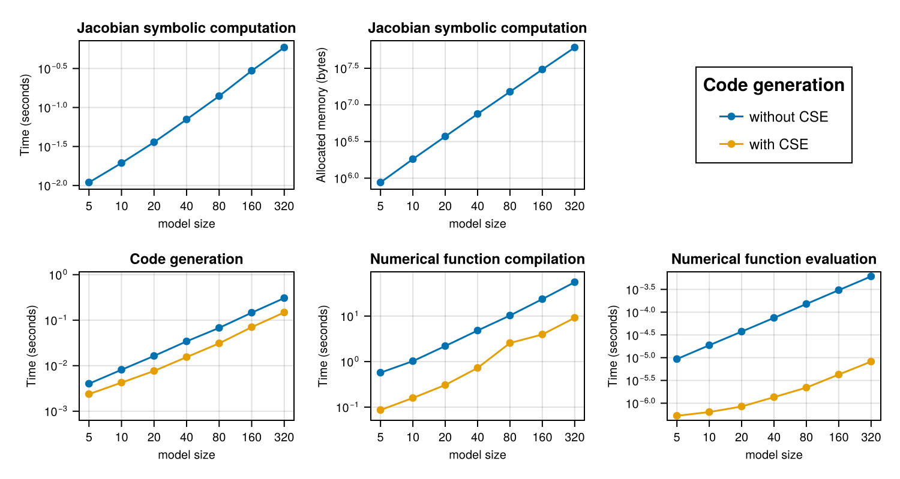

This is a 1D advection-diffusion-source PDE that uses a second order upwind scheme.

Jacobian construction uses the current `Symbolics.sparsejacobian` implementation, with
derivative caches cleared before each sample. CSE is a `build_function` code-generation
option, so only the code-generation and generated-function measurements compare CSE off
and on.

```julia
using Pkg
# Rev fixes precompilation https://github.com/hzgzh/XSteam.jl/pull/2
Pkg.add(Pkg.PackageSpec(;name="XSteam", rev="f2a1c589054cfd6bba307985a3a534b6f5a1863b"))

using ModelingToolkit, Symbolics, XSteam, Polynomials, CairoMakie, PrettyTables
using SparseArrays, Chairmarks, Statistics
using ModelingToolkit: t_nounits as t, D_nounits as D
using SymbolicIndexingInterface: default_values
```


## Setup Julia Code

```julia
#          o  o  o  o  o  o  o < heat capacitors
#          |  |  |  |  |  |  | < heat conductors
#          o  o  o  o  o  o  o
#          |  |  |  |  |  |  |
#Source -> o--o--o--o--o--o--o -> Sink
#       advection diff source PDE

m_flow_source(t) = 2.75
T_source(t) = (t > 12 * 3600) * 56.0 + 12.0
# @register_symbolic m_flow_source(t)
# @register_symbolic T_source(t)

#build polynomial liquid-water property only dependent on Temperature
p_l = 5 #bar
T_vec = collect(1:1:150);
@generated kin_visc_T(t) = :(Base.evalpoly(t, $(fit(T_vec, my_pT.(p_l, T_vec) ./ rho_pT.(p_l, T_vec), 5).coeffs...,)))
@generated lambda_T(t) = :(Base.evalpoly(t, $(fit(T_vec, tc_pT.(p_l, T_vec), 3).coeffs...,)))
@generated Pr_T(t) = :(Base.evalpoly(t, $(fit(T_vec, 1e3 * Cp_pT.(p_l, T_vec) .* my_pT.(p_l, T_vec) ./ tc_pT.(p_l, T_vec), 5).coeffs...,)))
@generated rho_T(t) = :(Base.evalpoly(t, $(fit(T_vec, rho_pT.(p_l, T_vec), 4).coeffs...,)))
@generated rhocp_T(t) = :(Base.evalpoly(t, $(fit(T_vec, 1000 * rho_pT.(p_l, T_vec) .* Cp_pT.(p_l, T_vec), 5).coeffs...,)))
# @register_symbolic kin_visc_T(t)
# @register_symbolic lambda_T(t)
# @register_symbolic Pr_T(t)
# @register_symbolic rho_T(t)
# @register_symbolic rhocp_T(t)

@connector function FluidPort(; name, p=101325.0, m=0.0, T=0.0)
  sts = @variables p(t) = p m(t) = m [connect = Flow] T(t) = T [connect = Stream]
  ODESystem(Equation[], t, sts, []; name=name)
end

@connector function VectorHeatPort(; name, N=100, T0=0.0, Q0=0.0)
  sts = @variables (T(t))[1:N] = fill(T0, N) (Q(t))[1:N] = fill(Q0, N) [connect = Flow]
  ODESystem(Equation[], t, [T; Q], []; name=name)
end

@register_symbolic Dxx_coeff(u, d, T)
#Taylor-aris dispersion model
function Dxx_coeff(u, d, T)
  Re = abs(u) * d / kin_visc_T(T) + 0.1
  if Re < 1000.0
    (d^2 / 4) * u^2 / 48 / 0.14e-6
  else
    d * u * (1.17e9 * Re^(-2.5) + 0.41)
  end
end

@register_symbolic Nusselt(Re, Pr, f)
#Nusselt number model
function Nusselt(Re, Pr, f)
  if Re <= 2300.0
    3.66
  elseif Re <= 3100.0
    3.5239 * (Re / 1000)^4 - 45.158 * (Re / 1000)^3 + 212.13 * (Re / 1000)^2 - 427.45 * (Re / 1000) + 316.08
  else
    f / 8 * ((Re - 1000) * Pr) / (1 + 12.7 * (f / 8)^(1 / 2) * (Pr^(2 / 3) - 1))
  end
end

# @register_symbolic Churchill_f(Re, epsilon, d)
#Darcy weisbach friction factor
function Churchill_f(Re, epsilon, d)
  theta_1 = (-2.457 * log(((7 / Re)^0.9) + (0.27 * (epsilon / d))))^16
  theta_2 = (37530 / Re)^16
  8 * ((((8 / Re)^12) + (1 / ((theta_1 + theta_2)^1.5)))^(1 / 12))
end

function FluidRegion(; name, L=1.0, dn=0.05, N=100, T0=0.0,
  lumped_T=50, diffusion=true, e=1e-4)
  @named inlet = FluidPort()
  @named outlet = FluidPort()
  @named heatport = VectorHeatPort(N=N)

  dx = L / N
  c = [-1 / 8, -3 / 8, -3 / 8] # advection stencil coefficients
  A = pi * dn^2 / 4

  p = @parameters C_shift = 0.0 Rw = 0.0 # stuff for latter
  @variables begin
    (T(t))[1:N] = fill(T0, N)
    Twall(t)[1:N] = fill(T0, N)
    (S(t))[1:N] = fill(T0, N)
    (C(t))[1:N] = fill(1.0, N)
    u(t) = 1e-6
    Re(t) = 1000.0
    Dxx(t) = 0.0
    Pr(t) = 1.0
    alpha(t) = 1.0
    f(t) = 1.0
  end

  sts = vcat(T, Twall, S, C, Num[u], Num[Re], Num[Dxx], Num[Pr], Num[alpha], Num[f])

  eqs = Equation[
    Re ~ 0.1 + dn * abs(u) / kin_visc_T(lumped_T)
    Pr ~ Pr_T(lumped_T)
    f ~ Churchill_f(Re, e, dn) #Darcy-weisbach
    alpha ~ Nusselt(Re, Pr, f) * lambda_T(lumped_T) / dn
    Dxx ~ diffusion * Dxx_coeff(u, dn, lumped_T)
    inlet.m ~ -outlet.m
    inlet.p ~ outlet.p
    inlet.T ~ instream(inlet.T)
    outlet.T ~ T[N]
    u ~ inlet.m / rho_T(inlet.T) / A
    [C[i] ~ dx * A * rhocp_T(T[i]) for i in 1:N]
    [S[i] ~ heatport.Q[i] for i in 1:N]
    [Twall[i] ~ heatport.T[i] for i in 1:N]

    #source term
    [S[i] ~ (1 / (1 / (alpha * dn * pi * dx) + abs(Rw / 1000))) * (Twall[i] - T[i]) for i in 1:N]

    #second order upwind + diffusion + source
    D(T[1]) ~ u / dx * (inlet.T - T[1]) + Dxx * (T[2] - T[1]) / dx^2 + S[1] / (C[1] - C_shift)
    D(T[2]) ~ u / dx * (c[1] * inlet.T - sum(c) * T[1] + c[2] * T[2] + c[3] * T[3]) + Dxx * (T[1] - 2 * T[2] + T[3]) / dx^2 + S[2] / (C[2] - C_shift)
    [D(T[i]) ~ u / dx * (c[1] * T[i-2] - sum(c) * T[i-1] + c[2] * T[i] + c[3] * T[i+1]) + Dxx * (T[i-1] - 2 * T[i] + T[i+1]) / dx^2 + S[i] / (C[i] - C_shift) for i in 3:N-1]
    D(T[N]) ~ u / dx * (T[N-1] - T[N]) + Dxx * (T[N-1] - T[N]) / dx^2 + S[N] / (C[N] - C_shift)
  ]

  ODESystem(eqs, t, sts, p; systems=[inlet, outlet, heatport], name=name)
end

# @register_symbolic Cn_circular_wall_inner(d, D, cp, ρ)
function Cn_circular_wall_inner(d, D, cp, ρ)
  C = pi / 4 * (D^2 - d^2) * cp * ρ
  return C / 2
end

# @register_symbolic Cn_circular_wall_outer(d, D, cp, ρ)
function Cn_circular_wall_outer(d, D, cp, ρ)
  C = pi / 4 * (D^2 - d^2) * cp * ρ
  return C / 2
end

# @register_symbolic Ke_circular_wall(d, D, λ)
function Ke_circular_wall(d, D, λ)
  2 * pi * λ / log(D / d)
end

function CircularWallFEM(; name, L=100, N=10, d=0.05, t_layer=[0.002],
  λ=[50], cp=[500], ρ=[7850], T0=0.0)
  @named inner_heatport = VectorHeatPort(N=N)
  @named outer_heatport = VectorHeatPort(N=N)
  dx = L / N
  Ne = length(t_layer)
  Nn = Ne + 1
  dn = vcat(d, d .+ 2.0 .* cumsum(t_layer))
  Cn = zeros(Nn)
  Cn[1:Ne] += Cn_circular_wall_inner.(dn[1:Ne], dn[2:Nn], cp, ρ) .* dx
  Cn[2:Nn] += Cn_circular_wall_outer.(dn[1:Ne], dn[2:Nn], cp, ρ) .* dx
  p = @parameters C_shift = 0.0
  Ke = Ke_circular_wall.(dn[1:Ne], dn[2:Nn], λ) .* dx
  @variables begin
    (Tn(t))[1:N, 1:Nn] = fill(T0, N, Nn)
    (Qe(t))[1:N, 1:Ne] = fill(T0, N, Ne)
  end
  sts = [vec(Tn); vec(Qe)]
  e0 = Equation[inner_heatport.T[i] ~ Tn[i, 1] for i in 1:N]
  e1 = Equation[outer_heatport.T[i] ~ Tn[i, Nn] for i in 1:N]
  e2 = Equation[Qe[i, j] ~ Ke[j] * (-Tn[i, j+1] + Tn[i, j]) for i in 1:N for j in 1:Ne]
  e3 = Equation[D(Tn[i, 1]) * (Cn[1] + C_shift) ~ inner_heatport.Q[i] - Qe[i, 1] for i in 1:N]
  e4 = Equation[D(Tn[i, j]) * Cn[j] ~ Qe[i, j-1] - Qe[i, j] for i in 1:N for j in 2:Nn-1]
  e5 = Equation[D(Tn[i, Nn]) * Cn[Nn] ~ Qe[i, Ne] + outer_heatport.Q[i] for i in 1:N]
  eqs = vcat(e0, e1, e2, e3, e4, e5)
  ODESystem(eqs, t, sts, p; systems=[inner_heatport, outer_heatport], name=name)
end

function CylindricalSurfaceConvection(; name, L=100, N=100, d=1.0, α=5.0)
  dx = L / N
  S = pi * d * dx
  @named heatport = VectorHeatPort(N=N)
  sts = @variables Tenv(t) = 0.0
  eqs = [
    Tenv ~ 18.0
    [heatport.Q[i] ~ α * S * (heatport.T[i] - Tenv) for i in 1:N]
  ]

  ODESystem(eqs, t, sts, []; systems=[heatport], name=name)
end

function PreinsulatedPipe(; name, L=100.0, N=100.0, dn=0.05, T0=0.0, t_layer=[0.004, 0.013],
  λ=[50, 0.04], cp=[500, 1200], ρ=[7800, 40], α=5.0,
  e=1e-4, lumped_T=50, diffusion=true)
  @named inlet = FluidPort()
  @named outlet = FluidPort()
  @named fluid_region = FluidRegion(L=L, N=N, dn=dn, e=e, lumped_T=lumped_T, diffusion=diffusion)
  @named shell = CircularWallFEM(L=L, N=N, d=dn, t_layer=t_layer, λ=λ, cp=cp, ρ=ρ)
  @named surfconv = CylindricalSurfaceConvection(L=L, N=N, d=dn + 2.0 * sum(t_layer), α=α)
  systems = [fluid_region, shell, inlet, outlet, surfconv]
  eqs = [
    connect(fluid_region.inlet, inlet)
    connect(fluid_region.outlet, outlet)
    connect(fluid_region.heatport, shell.inner_heatport)
    connect(shell.outer_heatport, surfconv.heatport)
  ]
  ODESystem(eqs, t, [], []; systems=systems, name=name)
end

function Source(; name, p_feed=100000)
  @named outlet = FluidPort()
  sts = @variables m_flow(t) = 1e-6
  eqs = [
    m_flow ~ m_flow_source(t)
    outlet.m ~ -m_flow
    outlet.p ~ p_feed
    outlet.T ~ T_source(t)
  ]
  compose(ODESystem(eqs, t, sts, []; name=name), [outlet])
end

function Sink(; name)
  @named inlet = FluidPort()
  eqs = [
    inlet.T ~ instream(inlet.T)
  ]
  compose(ODESystem(eqs, t, [], []; name=name), [inlet])
end

function TestBenchPreinsulated(; name, L=1.0, dn=0.05, t_layer=[0.0056, 0.013], N=100, diffusion=true, lumped_T=20)
  @named pipe = PreinsulatedPipe(L=L, dn=dn, N=N, diffusion=diffusion, t_layer=t_layer, lumped_T=lumped_T)
  @named source = Source()
  @named sink = Sink()
  subs = [source, pipe, sink]
  eqs = [
    connect(source.outlet, pipe.inlet)
    connect(pipe.outlet, sink.inlet)
  ]
  compose(ODESystem(eqs, t, [], []; name=name), subs)
end

function call(fn, args...)
  fn(args...)
end
```

```
call (generic function with 1 method)
```


```julia
function run_and_time_construction!(jacobian_times, jacobian_gctimes, jacobian_allocs, build_times, functions, i, N)
  @mtkbuild sys = TestBenchPreinsulated(L=470, N=N, dn=0.3127, t_layer=[0.0056, 0.058])
  rhs = [eq.rhs for eq in full_equations(sys)]
  dvs = unknowns(sys)

  @info "Built system"
  jac_result = @be (Symbolics.clear_derivative_caches!(); Symbolics.sparsejacobian(rhs, dvs))
  jacobian_times[i] = mean(x -> x.time, jac_result.samples)
  jacobian_gctimes[i] = mean(x -> x.time * x.gc_fraction, jac_result.samples)
  jacobian_allocs[i] = mean(x -> x.bytes, jac_result.samples)
  @info "Jacobian benchmark" jacobian_times[i] jacobian_gctimes[i] jacobian_allocs[i]
  Symbolics.clear_derivative_caches!()
  jac = Symbolics.sparsejacobian(rhs, dvs)

  ps = parameters(sys)
  defs = default_values(sys)
  u0 = Float64[Symbolics.value(Symbolics.fixpoint_sub(v, defs)) for v in dvs]
  p = Float64[Symbolics.value(Symbolics.fixpoint_sub(v, defs)) for v in ps]
  t0 = 0.0
  buffer_nocse = similar(jac, Float64)
  buffer_nocse.nzval .= 0.0
  buffer_cse = similar(jac, Float64)
  buffer_cse.nzval .= 0.0

  f_jac_nocse = eval(build_function(jac, dvs, ps, t; iip_config = (false, true), expression = Val{true}, cse = false)[2])
  functions[1][i] = let buffer_nocse = buffer_nocse, u0 = u0, p = p, t0 = t0, f_jac_nocse = f_jac_nocse
    function nocse()
      f_jac_nocse(buffer_nocse, u0, p, t0)
      buffer_nocse
    end
  end
  @info "No CSE build_function result"
  build_result_nocse = @be build_function(jac, dvs, ps, t; iip_config = (false, true), expression = Val{true}, cse = false)
  @info "No CSE build_function benchmark"
  build_times[1][i] = mean(x -> x.time, build_result_nocse.samples)
  @info "build_function time" build_times[1][i]

  f_jac_cse = eval(build_function(jac, dvs, ps, t; iip_config = (false, true), expression = Val{true}, cse = true)[2])
  functions[2][i] = let buffer_cse = buffer_cse, u0 = u0, p = p, t0 = t0, f_jac_cse = f_jac_cse
    function nocse()
      f_jac_cse(buffer_cse, u0, p, t0)
      buffer_cse
    end
  end
  @info "CSE build_function result"
  build_result_cse = @be build_function(jac, dvs, ps, t; iip_config = (false, true), expression = Val{true}, cse = true)
  @info "CSE build_function benchmark"
  build_times[2][i] = mean(x -> x.time, build_result_cse.samples)
  @info "build_function time" build_times[2][i]

  return nothing
end

function run_and_time_call!(functions, first_call_times, second_call_times, i)
  fnocse = functions[1][i]
  fcse = functions[2][i]
  first_call_result_nocse = @timed fnocse()
  first_call_times[1][i] = first_call_result_nocse.time
  @info "First call time" first_call_times[1][i]
  second_call_result_nocse = @be fnocse()
  second_call_times[1][i] = mean(x -> x.time, second_call_result_nocse.samples)
  @info "Runtime" second_call_times[1][i]

  first_call_result_cse = @timed fcse()
  first_call_times[2][i] = first_call_result_cse.time
  @info "First call time" first_call_times[2][i]
  second_call_result_cse = @be fcse()
  second_call_times[2][i] = mean(x -> x.time, second_call_result_cse.samples)
  @info "Runtime" second_call_times[2][i]
end
```

```
run_and_time_call! (generic function with 1 method)
```


```julia
N = [5, 10, 20, 40, 80, 160, 320];
jacobian_times = zeros(Float64, length(N))
functions = [Vector{Any}(undef, length(N)), Vector{Any}(undef, length(N))]
jacobian_gctimes = similar(jacobian_times)
jacobian_allocs = similar(jacobian_times)
# [without_cse_times, with_cse_times]
build_times = [similar(jacobian_times), similar(jacobian_times)]
first_call_times = copy.(build_times)
second_call_times = copy.(build_times)
```

```
2-element Vector{Vector{Float64}}:
 [6.92835182230646e-310, 6.92835182230804e-310, 6.92835182230963e-310, 6.92
83518223112e-310, 6.9283518223128e-310, 6.92835182231437e-310, 6.9283518223
1595e-310]
 [6.92835182230646e-310, 6.92835182230804e-310, 6.92835182230963e-310, 6.92
83518223112e-310, 6.9283518223128e-310, 6.92835182231437e-310, 6.9283518223
1595e-310]
```


## Timings

```julia
Chairmarks.DEFAULTS.seconds = 15.0
# compile
run_and_time_construction!(jacobian_times, jacobian_gctimes, jacobian_allocs, build_times, functions, 1, 5)
run_and_time_call!(functions, first_call_times, second_call_times, 1)
for (i, n) in enumerate(N)
  @info i n
  @time run_and_time_construction!(jacobian_times, jacobian_gctimes, jacobian_allocs, build_times, functions, i, n)
end

for (i, n) in enumerate(N)
  @info i n
  run_and_time_call!(functions, first_call_times, second_call_times, i)
end
```

```
45.231103 seconds (203.26 M allocations: 6.585 GiB, 2.58% gc time, 0.13% c
ompilation time: 100% of which was recompilation)
 45.453229 seconds (211.15 M allocations: 6.751 GiB, 3.14% gc time, 0.15% c
ompilation time: 100% of which was recompilation)
 45.839694 seconds (220.09 M allocations: 7.138 GiB, 3.96% gc time, 0.16% c
ompilation time: 100% of which was recompilation)
 46.756698 seconds (217.77 M allocations: 6.924 GiB, 2.95% gc time, 0.16% c
ompilation time: 98% of which was recompilation)
 48.519410 seconds (222.90 M allocations: 7.040 GiB, 3.96% gc time, 0.18% c
ompilation time: 81% of which was recompilation)
 52.272713 seconds (212.67 M allocations: 6.754 GiB, 4.83% gc time, 0.21% c
ompilation time: 58% of which was recompilation)
 59.853380 seconds (218.37 M allocations: 6.958 GiB, 5.54% gc time, 0.14% c
ompilation time: 77% of which was recompilation)
```


## Results

```julia
tabledata = hcat(N, jacobian_times, jacobian_gctimes, jacobian_allocs, build_times..., first_call_times..., second_call_times...)
header = ["N", "Jacobian time", "Jacobian GC time", "Jacobian allocated memory (B)", "`build_function` time (no CSE)", "`build_function` time (CSE)", "First call time (no CSE)", "First call time (CSE)", "Second call time (no CSE)", "Second call time (CSE)"]
pretty_table(tabledata; column_labels = header, backend = :html)
```


<table>
  <thead>
    <tr class = "columnLabelRow">
      <th style = "font-weight: bold; text-align: right;">N</th>
      <th style = "font-weight: bold; text-align: right;">Jacobian time</th>
      <th style = "font-weight: bold; text-align: right;">Jacobian GC time</th>
      <th style = "font-weight: bold; text-align: right;">Jacobian allocated memory (B)</th>
      <th style = "font-weight: bold; text-align: right;">`build_function` time (no CSE)</th>
      <th style = "font-weight: bold; text-align: right;">`build_function` time (CSE)</th>
      <th style = "font-weight: bold; text-align: right;">First call time (no CSE)</th>
      <th style = "font-weight: bold; text-align: right;">First call time (CSE)</th>
      <th style = "font-weight: bold; text-align: right;">Second call time (no CSE)</th>
      <th style = "font-weight: bold; text-align: right;">Second call time (CSE)</th>
    </tr>
  </thead>
  <tbody>
    <tr class = "dataRow">
      <td style = "text-align: right;">5.0</td>
      <td style = "text-align: right;">0.0109349</td>
      <td style = "text-align: right;">0.000262055</td>
      <td style = "text-align: right;">8.73628e5</td>
      <td style = "text-align: right;">0.00402182</td>
      <td style = "text-align: right;">0.00237691</td>
      <td style = "text-align: right;">0.571618</td>
      <td style = "text-align: right;">0.0863633</td>
      <td style = "text-align: right;">9.33388e-6</td>
      <td style = "text-align: right;">5.28871e-7</td>
    </tr>
    <tr class = "dataRow">
      <td style = "text-align: right;">10.0</td>
      <td style = "text-align: right;">0.0194138</td>
      <td style = "text-align: right;">0.000856578</td>
      <td style = "text-align: right;">1.82033e6</td>
      <td style = "text-align: right;">0.0081464</td>
      <td style = "text-align: right;">0.00425534</td>
      <td style = "text-align: right;">1.02409</td>
      <td style = "text-align: right;">0.15882</td>
      <td style = "text-align: right;">1.87698e-5</td>
      <td style = "text-align: right;">6.38838e-7</td>
    </tr>
    <tr class = "dataRow">
      <td style = "text-align: right;">20.0</td>
      <td style = "text-align: right;">0.0358756</td>
      <td style = "text-align: right;">0.00215719</td>
      <td style = "text-align: right;">3.71175e6</td>
      <td style = "text-align: right;">0.0163975</td>
      <td style = "text-align: right;">0.00766582</td>
      <td style = "text-align: right;">2.19914</td>
      <td style = "text-align: right;">0.305905</td>
      <td style = "text-align: right;">3.7454e-5</td>
      <td style = "text-align: right;">8.46064e-7</td>
    </tr>
    <tr class = "dataRow">
      <td style = "text-align: right;">40.0</td>
      <td style = "text-align: right;">0.0703216</td>
      <td style = "text-align: right;">0.00212831</td>
      <td style = "text-align: right;">7.53228e6</td>
      <td style = "text-align: right;">0.0342729</td>
      <td style = "text-align: right;">0.0154525</td>
      <td style = "text-align: right;">4.81715</td>
      <td style = "text-align: right;">0.726228</td>
      <td style = "text-align: right;">7.49532e-5</td>
      <td style = "text-align: right;">1.35691e-6</td>
    </tr>
    <tr class = "dataRow">
      <td style = "text-align: right;">80.0</td>
      <td style = "text-align: right;">0.140111</td>
      <td style = "text-align: right;">0.00880595</td>
      <td style = "text-align: right;">1.5118e7</td>
      <td style = "text-align: right;">0.0677967</td>
      <td style = "text-align: right;">0.031004</td>
      <td style = "text-align: right;">10.297</td>
      <td style = "text-align: right;">2.5602</td>
      <td style = "text-align: right;">0.00015144</td>
      <td style = "text-align: right;">2.20118e-6</td>
    </tr>
    <tr class = "dataRow">
      <td style = "text-align: right;">160.0</td>
      <td style = "text-align: right;">0.295958</td>
      <td style = "text-align: right;">0.020103</td>
      <td style = "text-align: right;">3.04712e7</td>
      <td style = "text-align: right;">0.146142</td>
      <td style = "text-align: right;">0.0703415</td>
      <td style = "text-align: right;">23.6005</td>
      <td style = "text-align: right;">3.94802</td>
      <td style = "text-align: right;">0.000304967</td>
      <td style = "text-align: right;">4.26125e-6</td>
    </tr>
    <tr class = "dataRow">
      <td style = "text-align: right;">320.0</td>
      <td style = "text-align: right;">0.588658</td>
      <td style = "text-align: right;">0.0406329</td>
      <td style = "text-align: right;">6.08459e7</td>
      <td style = "text-align: right;">0.306286</td>
      <td style = "text-align: right;">0.148011</td>
      <td style = "text-align: right;">55.6124</td>
      <td style = "text-align: right;">9.16718</td>
      <td style = "text-align: right;">0.000611285</td>
      <td style = "text-align: right;">8.21093e-6</td>
    </tr>
  </tbody>
</table>


```julia
f = Figure(size = (750, 400))
titles = [
    "Jacobian symbolic computation", "Jacobian symbolic computation", "Code generation",
    "Numerical function compilation", "Numerical function evaluation"]
labels = ["Time (seconds)", "Allocated memory (bytes)",
    "Time (seconds)", "Time (seconds)", "Time (seconds)"]
times = [jacobian_times, jacobian_allocs, build_times, first_call_times, second_call_times]
axes = Axis[]
for i in 1:2
    label = labels[i]
    data = times[i]
    ax = Axis(f[1, i], xscale = log10, yscale = log10, xlabel = "model size",
        xlabelsize = 10, ylabel = label, ylabelsize = 10, xticks = N,
        title = titles[i], titlesize = 12, xticklabelsize = 10, yticklabelsize = 10)
    push!(axes, ax)
    scatterlines!(ax, N, data)
end
axes2 = Axis[]
# make equal y-axis unit length
mn3, mx3 = extrema(reduce(vcat, times[3]))
xn3 = log10(mx3 / mn3)
mn4, mx4 = extrema(reduce(vcat, times[4]))
xn4 = log10(mx4 / mn4)
mn5, mx5 = extrema(reduce(vcat, times[5]))
xn5 = log10(mx5 / mn5)
xn = max(xn3, xn4, xn5)
xn += 0.2
hxn = xn / 2
hxn3 = (log10(mx3) + log10(mn3)) / 2
hxn4 = (log10(mx4) + log10(mn4)) / 2
hxn5 = (log10(mx5) + log10(mn5)) / 2
ylims = [(exp10(hxn3 - hxn), exp10(hxn3 + hxn)), (exp10(hxn4 - hxn), exp10(hxn4 + hxn)),
    (exp10(hxn5 - hxn), exp10(hxn5 + hxn))]
for i in 1:3
    ir = i + 2
    label = labels[ir]
    data = times[ir]
    ax = Axis(f[2, i], xscale = log10, yscale = log10, xlabel = "model size",
        xlabelsize = 10, ylabel = label, ylabelsize = 10, xticks = N,
        title = titles[ir], titlesize = 12, xticklabelsize = 10, yticklabelsize = 10)
    ylims!(ax, ylims[i]...)
    push!(axes2, ax)
    scatterlines!(ax, N, data[1], label = "without CSE")
    scatterlines!(ax, N, data[2], label = "with CSE")
end
Legend(f[1, 3], axes2[1], "Code generation", tellwidth = false, labelsize = 12, titlesize = 15)
save("thermal_fluid.pdf", f)
f
```




## Appendix


## Appendix

These benchmarks are a part of the SciMLBenchmarks.jl repository, found at: [https://github.com/SciML/SciMLBenchmarks.jl](https://github.com/SciML/SciMLBenchmarks.jl). For more information on high-performance scientific machine learning, check out the SciML Open Source Software Organization [https://sciml.ai](https://sciml.ai).

To locally run this benchmark, do the following commands:
```
using SciMLBenchmarks
SciMLBenchmarks.weave_file("benchmarks/Symbolics","ThermalFluid.jmd")
```

Computer Information:

```
Julia Version 1.12.7
Commit 6d172b025e4 (2026-08-15 08:05 UTC)
Build Info:
  Official https://julialang.org release
Platform Info:
  OS: Linux (x86_64-linux-gnu)
  CPU: 128 × AMD EPYC 7502 32-Core Processor
  WORD_SIZE: 64
  LLVM: libLLVM-18.1.7 (ORCJIT, znver2)
  GC: Built with stock GC
Threads: 128 default, 1 interactive, 128 GC (on 128 virtual cores)
Environment:
  JULIA_NUM_THREADS = auto

```

Package Information:

```
Status `~/github-runners/amdci3-1/_work/SciMLBenchmarks.jl/SciMLBenchmarks.jl/benchmarks/Symbolics/Project.toml`
  [6e4b80f9] BenchmarkTools v1.8.0
⌃ [13f3f980] CairoMakie v0.15.13
  [479239e8] Catalyst v16.4.0
  [0ca39b1e] Chairmarks v1.3.1
  [864edb3b] DataStructures v0.19.6
⌃ [7ed4a6bd] LinearSolve v5.14.0
⌃ [961ee093] ModelingToolkit v11.40.0
⌅ [bac558e1] OrderedCollections v1.8.2 [loaded: v2.0.1]
  [1dea7af3] OrdinaryDiffEq v7.8.1
  [91a5bcdd] Plots v1.41.7
⌃ [f27b6e38] Polynomials v4.1.1
  [08abe8d2] PrettyTables v3.4.8
  [b4db0fb7] ReactionNetworkImporters v1.5.0
⌃ [31c91b34] SciMLBenchmarks v0.1.3 [loaded: v0.2.0]
⌃ [10745b16] Statistics v1.11.1
  [2efcf032] SymbolicIndexingInterface v0.3.55
⌅ [d1185830] SymbolicUtils v4.45.0
⌃ [0c5d862f] Symbolics v7.38.0
⌅ [a759f4b9] TimerOutputs v0.5.29
  [95ff35a0] XSteam v0.3.0 `https://github.com/hzgzh/XSteam.jl.git#f2a1c58`
  [37e2e46d] LinearAlgebra v1.12.0
  [2f01184e] SparseArrays v1.12.0
Info Packages marked with ⌃ and ⌅ have new versions available. Those with ⌃ may be upgradable, but those with ⌅ are restricted by compatibility constraints from upgrading. To see why use `status --outdated`
```

And the full manifest:

```
Status `~/github-runners/amdci3-1/_work/SciMLBenchmarks.jl/SciMLBenchmarks.jl/benchmarks/Symbolics/Manifest.toml`
  [47edcb42] ADTypes v1.24.0
⌃ [14f7f29c] AMD v0.5.3
  [621f4979] AbstractFFTs v1.5.0
⌃ [6e696c72] AbstractPlutoDingetjes v1.4.0
  [1520ce14] AbstractTrees v0.4.5
  [7d9f7c33] Accessors v0.1.45
  [79e6a3ab] Adapt v4.7.0
  [35492f91] AdaptivePredicates v1.2.0
  [66dad0bd] AliasTables v1.1.3
  [27a7e980] Animations v0.4.2
  [ec485272] ArnoldiMethod v0.4.0
⌃ [4fba245c] ArrayInterface v7.30.0
  [4c555306] ArrayLayouts v1.12.2
  [67c07d97] Automa v1.2.0
  [13072b0f] AxisAlgorithms v1.1.0
  [39de3d68] AxisArrays v0.4.8
  [aae01518] BandedMatrices v1.12.0
  [18cc8868] BaseDirs v1.4.0
  [6e4b80f9] BenchmarkTools v1.8.0
  [e2ed5e7c] Bijections v0.2.2
  [b2a6c25c] BinaryHeaps v1.1.0
⌃ [caf10ac8] BipartiteGraphs v0.1.12
  [8e7c35d0] BlockArrays v1.10.0
  [70df07ce] BracketingNonlinearSolve v1.12.6
  [fa961155] CEnum v0.5.0
  [96374032] CRlibm v1.0.2
  [159f3aea] Cairo v1.1.1
⌃ [13f3f980] CairoMakie v0.15.13
  [479239e8] Catalyst v16.4.0
  [d360d2e6] ChainRulesCore v1.26.1
  [0ca39b1e] Chairmarks v1.3.1
  [6b39b394] CodecZstd v0.8.7
  [a2cac450] ColorBrewer v0.4.2
  [35d6a980] ColorSchemes v3.31.0
  [3da002f7] ColorTypes v0.12.1
  [c3611d14] ColorVectorSpace v0.11.0
  [5ae59095] Colors v0.13.1
⌅ [861a8166] Combinatorics v1.0.2
  [38540f10] CommonSolve v0.2.14
  [bbf7d656] CommonSubexpressions v0.3.1
⌃ [f70d9fcc] CommonWorldInvalidations v1.2.0
  [34da2185] Compat v4.18.1
  [b152e2b5] CompositeTypes v0.1.4
  [a33af91c] CompositionsBase v0.1.2
  [95dc2771] ComputePipeline v0.1.8
  [2569d6c7] ConcreteStructs v0.2.8
  [8f4d0f93] Conda v1.10.3
  [187b0558] ConstructionBase v1.6.0
  [d38c429a] Contour v0.6.3
  [b7a15901] CoreMath v0.1.0
  [a8cc5b0e] Crayons v4.2.0
  [9a962f9c] DataAPI v1.16.0
  [864edb3b] DataStructures v0.19.6
  [e2d170a0] DataValueInterfaces v1.0.0
  [927a84f5] DelaunayTriangulation v1.6.6
  [8bb1440f] DelimitedFiles v1.9.1
⌃ [2b5f629d] DiffEqBase v7.18.2
  [459566f4] DiffEqCallbacks v4.19.3
  [163ba53b] DiffResults v1.1.0
  [b552c78f] DiffRules v1.16.0
  [a0c0ee7d] DifferentiationInterface v0.7.21
  [8d63f2c5] DispatchDoctor v0.4.28
  [31c24e10] Distributions v0.25.131
  [ffbed154] DocStringExtensions v0.9.5
  [5b8099bc] DomainSets v0.8.1
⌃ [7c1d4256] DynamicPolynomials v0.6.7
  [06fc5a27] DynamicQuantities v1.13.0
  [4e289a0a] EnumX v1.0.7
  [f151be2c] EnzymeCore v0.8.21
  [429591f6] ExactPredicates v2.2.9
  [e2ba6199] ExprTools v0.1.11
  [55351af7] ExproniconLite v0.10.14
  [c87230d0] FFMPEG v0.4.5
  [b86e33f2] FFTA v0.3.1
  [7034ab61] FastBroadcast v1.4.0
  [9aa1b823] FastClosures v0.3.2
  [a4df4552] FastPower v1.5.0
  [5789e2e9] FileIO v1.20.0
  [8fc22ac5] FilePaths v0.9.0
  [48062228] FilePathsBase v0.9.24
  [1a297f60] FillArrays v1.17.0
  [64ca27bc] FindFirstFunctions v3.2.1
  [6a86dc24] FiniteDiff v2.33.0
⌅ [53c48c17] FixedPointNumbers v0.8.6
  [1fa38f19] Format v1.3.7
  [f6369f11] ForwardDiff v1.4.5
  [b38be410] FreeType v4.1.1
  [663a7486] FreeTypeAbstraction v0.10.8
  [a85aefff] FunctionMaps v0.1.2
  [069b7b12] FunctionWrappers v1.1.3
  [77dc65aa] FunctionWrappersWrappers v1.13.0
  [46192b85] GPUArraysCore v0.2.0
  [28b8d3ca] GR v0.73.27
  [a0844989] Gamma v1.2.0
⌃ [5c1252a2] GeometryBasics v0.5.11
  [d7ba0133] Git v1.5.0
  [a2bd30eb] Graphics v1.1.3
  [86223c79] Graphs v1.14.0
⌃ [3955a311] GridLayoutBase v0.11.2
  [42e2da0e] Grisu v1.0.2
⌅ [eafb193a] Highlights v0.5.3
  [34004b35] HypergeometricFunctions v0.3.30
  [7073ff75] IJulia v1.34.4
  [2803e5a7] ImageAxes v0.6.12
  [c817782e] ImageBase v0.1.7
  [a09fc81d] ImageCore v0.10.5
⌃ [82e4d734] ImageIO v0.6.9
  [bc367c6b] ImageMetadata v0.9.10
⌃ [3263718b] ImplicitDiscreteSolve v2.2.0
  [9b13fd28] IndirectArrays v1.0.0
  [d25df0c9] Inflate v0.1.5
  [18e54dd8] IntegerMathUtils v0.1.4
  [a98d9a8b] Interpolations v0.16.3
  [d1acc4aa] IntervalArithmetic v1.0.11
  [8197267c] IntervalSets v0.7.14
  [3587e190] InverseFunctions v0.1.17
  [92d709cd] IrrationalConstants v0.2.6
  [f1662d9f] Isoband v0.1.1
  [c8e1da08] IterTools v1.10.0
  [82899510] IteratorInterfaceExtensions v1.0.0
  [1019f520] JLFzf v0.1.11
  [692b3bcd] JLLWrappers v1.8.0
⌅ [682c06a0] JSON v0.21.4
  [ae98c720] Jieko v0.2.1
  [b835a17e] JpegTurbo v0.1.6
⌃ [ccbc3e58] JumpProcesses v9.30.1
  [5ab0869b] KernelDensity v0.6.12
  [ba0b0d4f] Krylov v0.10.9
⌃ [2faa5264] LHLFactorization v2.2.1
  [b964fa9f] LaTeXStrings v1.4.1
  [23fbe1c1] Latexify v0.16.12
  [8cdb02fc] LazyModules v0.3.1
  [87fe0de2] LineSearch v0.1.16
⌃ [7ed4a6bd] LinearSolve v5.14.0
  [2ab3a3ac] LogExpFunctions v1.0.1
  [e6f89c97] LoggingExtras v1.2.0
  [1914dd2f] MacroTools v0.5.16
⌅ [ee78f7c6] Makie v0.24.13
  [dbb5928d] MappedArrays v0.4.3
  [0a4f8689] MathTeXEngine v0.6.9
  [bb5d69b7] MaybeInplace v0.1.8
  [442fdcdd] Measures v0.3.3
  [e1d29d7a] Missings v1.2.0
⌃ [961ee093] ModelingToolkit v11.40.0
⌃ [7771a370] ModelingToolkitBase v1.68.0
⌃ [6bb917b9] ModelingToolkitTearing v1.20.5
  [e94cdb99] MosaicViews v0.3.4
  [2e0e35c7] Moshi v0.3.12
  [46d2c3a1] MuladdMacro v0.2.7
  [102ac46a] MultivariatePolynomials v0.5.19
  [ffc61752] Mustache v1.0.21
  [d8a4904e] MutableArithmetics v1.8.0
  [77ba4419] NaNMath v1.1.4
  [f09324ee] Netpbm v1.1.1
⌃ [8913a72c] NonlinearSolve v4.28.1
⌃ [be0214bd] NonlinearSolveBase v2.48.0
⌃ [5959db7a] NonlinearSolveFirstOrder v2.4.1
⌃ [9a2c21bd] NonlinearSolveQuasiNewton v1.15.2
  [26075421] NonlinearSolveSpectralMethods v1.8.1
  [510215fc] Observables v0.5.5
  [6fe1bfb0] OffsetArrays v1.17.0
  [52e1d378] OpenEXR v0.3.3
⌅ [bac558e1] OrderedCollections v1.8.2 [loaded: v2.0.1]
  [1dea7af3] OrdinaryDiffEq v7.8.1
⌃ [6ad6398a] OrdinaryDiffEqBDF v2.4.5
⌃ [bbf590c4] OrdinaryDiffEqCore v4.15.1
  [50262376] OrdinaryDiffEqDefault v2.6.0
⌃ [4302a76b] OrdinaryDiffEqDifferentiation v3.10.1
⌃ [127b3ac7] OrdinaryDiffEqNonlinearSolve v2.9.1
⌃ [43230ef6] OrdinaryDiffEqRosenbrock v2.7.0
  [b4bd8bb3] OrdinaryDiffEqRosenbrockTableaus v2.4.2
⌃ [2d112036] OrdinaryDiffEqSDIRK v2.9.1
  [b1df2697] OrdinaryDiffEqTsit5 v2.1.4
  [79d7bb75] OrdinaryDiffEqVerner v2.4.1
  [90014a1f] PDMats v0.11.41
  [f57f5aa1] PNGFiles v0.4.5
  [19eb6ba3] Packing v0.5.1
  [5432bcbf] PaddedViews v0.5.12
  [d96e819e] Parameters v0.13.1
⌅ [69de0a69] Parsers v2.8.7 [loaded: v2.8.8]
  [eebad327] PkgVersion v0.3.3
  [ccf2f8ad] PlotThemes v3.3.0
  [995b91a9] PlotUtils v1.4.4
  [91a5bcdd] Plots v1.41.7
  [e409e4f3] PoissonRandom v0.4.13
  [647866c9] PolygonOps v0.1.2
⌃ [f27b6e38] Polynomials v4.1.1
  [d236fae5] PreallocationTools v1.7.1
  [aea7be01] PrecompileTools v1.3.4
  [21216c6a] Preferences v1.5.2
  [08abe8d2] PrettyTables v3.4.8
  [27ebfcd6] Primes v0.5.7
  [92933f4c] ProgressMeter v1.11.0
  [43287f4e] PtrArrays v1.4.0
  [0c0d3e7f] PureKLU v1.4.1
  [4b34888f] QOI v1.0.2
  [1fd47b50] QuadGK v2.11.3
  [b3c3ace0] RangeArrays v0.3.2
  [c84ed2f1] Ratios v0.4.5
  [b4db0fb7] ReactionNetworkImporters v1.5.0
  [988b38a3] ReadOnlyArrays v0.2.0
  [795d4caa] ReadOnlyDicts v1.0.1
  [3cdcf5f2] RecipesBase v1.3.4
  [01d81517] RecipesPipeline v0.6.12
  [731186ca] RecursiveArrayTools v4.5.1
  [189a3867] Reexport v1.2.2
  [05181044] RelocatableFolders v1.0.1
  [ae029012] Requires v1.3.1
  [9fe22ead] RespecializeParams v1.3.0
  [79098fc4] Rmath v0.9.0
⌃ [f2b01f46] Roots v3.0.7
  [5eaf0fd0] RoundingEmulator v0.2.1
  [7e49a35a] RuntimeGeneratedFunctions v0.5.25
⌃ [9dfe8606] SCCNonlinearSolve v1.15.1
  [fdea26ae] SIMD v3.7.2
⌃ [0bca4576] SciMLBase v3.50.0
⌃ [31c91b34] SciMLBenchmarks v0.1.3 [loaded: v0.2.0]
  [19f34311] SciMLJacobianOperators v0.1.18
  [a6db7da4] SciMLLogging v2.1.0
  [c0aeaf25] SciMLOperators v1.30.0
  [431bcebd] SciMLPublic v1.3.0
  [53ae85a6] SciMLStructures v1.10.5
  [6c6a2e73] Scratch v1.3.0
  [efcf1570] Setfield v1.1.2
  [65257c39] ShaderAbstractions v0.5.0
⌃ [992d4aef] Showoff v1.0.3
  [73760f76] SignedDistanceFields v0.4.1
  [727e6d20] SimpleNonlinearSolve v2.14.1
  [699a6c99] SimpleTraits v0.9.6
  [45858cf5] Sixel v0.1.5
  [a2af1166] SortingAlgorithms v1.2.3
⌃ [a57abbd0] SparseColumnPivotedQR v2.1.7
⌃ [0a514795] SparseMatrixColorings v0.4.27
  [276daf66] SpecialFunctions v2.9.0
  [860ef19b] StableRNGs v1.0.4
  [cae243ae] StackViews v0.1.2
  [0c0c59c1] StarAlgebras v0.3.0
⌃ [64909d44] StateSelection v1.11.0
⌃ [90137ffa] StaticArrays v1.9.19
  [1e83bf80] StaticArraysCore v1.4.4
⌃ [10745b16] Statistics v1.11.1
  [82ae8749] StatsAPI v1.8.0
  [2913bbd2] StatsBase v0.34.13
  [4c63d2b9] StatsFuns v2.2.1
  [69024149] StringEncodings v0.3.7
⌅ [892a3eda] StringManipulation v0.5.0
  [09ab397b] StructArrays v0.7.3
  [2efcf032] SymbolicIndexingInterface v0.3.55
⌃ [19f23fe9] SymbolicLimits v1.2.0
⌅ [d1185830] SymbolicUtils v4.45.0
⌃ [0c5d862f] Symbolics v7.38.0
  [3783bdb8] TableTraits v1.0.1
  [bd369af6] Tables v1.14.0
  [ed4db957] TaskLocalValues v0.1.3
  [62fd8b95] TensorCore v0.1.1
  [8ea1fca8] TermInterface v2.0.0
  [1c621080] TestItems v1.1.0
  [731e570b] TiffImages v0.11.9
⌅ [a759f4b9] TimerOutputs v0.5.29
  [3bb67fe8] TranscodingStreams v0.11.3
  [410a4b4d] Tricks v0.1.13
  [981d1d27] TriplotBase v0.1.0
  [781d530d] TruncatedStacktraces v1.4.0
  [3a884ed6] UnPack v1.0.2
  [1cfade01] UnicodeFun v0.4.1
⌃ [1986cc42] Unitful v1.28.0
  [41fe7b60] Unzip v0.2.0
  [81def892] VersionParsing v1.3.0
  [d30d5f5c] WeakCacheSets v0.1.0
  [44d3d7a6] Weave v0.10.12
  [e3aaa7dc] WebP v0.1.3
  [efce3f68] WoodburyMatrices v1.1.0
  [95ff35a0] XSteam v0.3.0 `https://github.com/hzgzh/XSteam.jl.git#f2a1c58`
  [ddb6d928] YAML v0.4.16
  [c2297ded] ZMQ v1.5.1
  [6e34b625] Bzip2_jll v1.0.9+0
  [4e9b3aee] CRlibm_jll v1.0.1+0
  [83423d85] Cairo_jll v1.18.7+0
  [a38c48d9] CoreMath_jll v0.1.0+0
  [ee1fde0b] Dbus_jll v1.16.2+0
⌅ [5ae413db] EarCut_jll v2.2.4+0
  [2702e6a9] EpollShim_jll v0.0.20230411+1
  [2e619515] Expat_jll v2.8.3+0
⌅ [b22a6f82] FFMPEG_jll v8.1.2+0
  [a3f928ae] Fontconfig_jll v2.17.1+0
  [d7e528f0] FreeType2_jll v2.14.3+1
  [559328eb] FriBidi_jll v1.0.17+0
  [0656b61e] GLFW_jll v3.5.1+0
  [d2c73de3] GR_jll v0.73.27+0
⌅ [b0724c58] GettextRuntime_jll v0.22.4+0
  [61579ee1] Ghostscript_jll v9.55.1+0
⌅ [59f7168a] Giflib_jll v5.2.3+0
  [020c3dae] Git_LFS_jll v3.7.1+0
  [f8c6e375] Git_jll v2.55.0+0
  [7746bdde] Glib_jll v2.88.3+0
  [3b182d85] Graphite2_jll v1.3.16+0
  [2e76f6c2] HarfBuzz_jll v100.14003.0+0
  [905a6f67] Imath_jll v3.2.2+0
  [1d5cc7b8] IntelOpenMP_jll v2025.2.0+0
  [aacddb02] JpegTurbo_jll v3.2.0+1
  [c1c5ebd0] LAME_jll v3.100.3+0
  [88015f11] LERC_jll v4.1.0+0
  [1d63c593] LLVMOpenMP_jll v22.1.7+0
⌅ [e9f186c6] Libffi_jll v3.4.7+0
  [7e76a0d4] Libglvnd_jll v1.7.1+1
  [94ce4f54] Libiconv_jll v1.18.0+0
  [4b2f31a3] Libmount_jll v2.42.0+0
  [89763e89] Libtiff_jll v4.7.3+0
  [38a345b3] Libuuid_jll v2.42.0+0
  [856f044c] MKL_jll v2025.2.0+0
  [e7412a2a] Ogg_jll v1.3.6+0
  [6cdc7f73] OpenBLASConsistentFPCSR_jll v0.3.34+0
  [18a262bb] OpenEXR_jll v3.4.14+0
  [9bd350c2] OpenSSH_jll v10.5.1+0
  [efe28fd5] OpenSpecFun_jll v0.5.6+0
  [91d4177d] Opus_jll v1.6.1+0
  [36c8627f] Pango_jll v1.58.2+0
  [30392449] Pixman_jll v0.46.4+0
  [c0090381] Qt6Base_jll v6.10.2+2
  [629bc702] Qt6Declarative_jll v6.10.2+2
  [ce943373] Qt6ShaderTools_jll v6.10.2+1
  [6de9746b] Qt6Svg_jll v6.10.2+0
  [e99dba38] Qt6Wayland_jll v6.10.2+1
  [f50d1b31] Rmath_jll v0.5.2+0
  [a44049a8] Vulkan_Loader_jll v1.3.243+0
  [a2964d1f] Wayland_jll v1.24.0+0
  [ffd25f8a] XZ_jll v5.8.3+0
  [f67eecfb] Xorg_libICE_jll v1.1.2+0
  [c834827a] Xorg_libSM_jll v1.2.6+0
  [4f6342f7] Xorg_libX11_jll v1.8.13+0
  [0c0b7dd1] Xorg_libXau_jll v1.0.13+0
  [935fb764] Xorg_libXcursor_jll v1.2.4+0
  [a3789734] Xorg_libXdmcp_jll v1.1.6+0
  [1082639a] Xorg_libXext_jll v1.3.8+0
  [d091e8ba] Xorg_libXfixes_jll v6.0.2+0
  [a51aa0fd] Xorg_libXi_jll v1.8.4+0
  [d1454406] Xorg_libXinerama_jll v1.1.7+0
  [ec84b674] Xorg_libXrandr_jll v1.5.6+0
  [ea2f1a96] Xorg_libXrender_jll v0.9.12+0
  [a65dc6b1] Xorg_libpciaccess_jll v0.19.0+0
  [c7cfdc94] Xorg_libxcb_jll v1.17.1+0
  [cc61e674] Xorg_libxkbfile_jll v1.2.0+0
  [e920d4aa] Xorg_xcb_util_cursor_jll v0.1.6+0
  [12413925] Xorg_xcb_util_image_jll v0.4.1+0
  [2def613f] Xorg_xcb_util_jll v0.4.1+0
  [975044d2] Xorg_xcb_util_keysyms_jll v0.4.1+0
  [0d47668e] Xorg_xcb_util_renderutil_jll v0.3.10+0
  [c22f9ab0] Xorg_xcb_util_wm_jll v0.4.2+0
  [35661453] Xorg_xkbcomp_jll v1.4.7+0
  [33bec58e] Xorg_xkeyboard_config_jll v2.47.0+2
  [c5fb5394] Xorg_xtrans_jll v1.6.0+0
  [8f1865be] ZeroMQ_jll v4.3.6+0
  [3161d3a3] Zstd_jll v1.5.7+1
  [35ca27e7] eudev_jll v3.2.14+0
⌅ [214eeab7] fzf_jll v0.61.1+0
  [9a68df92] isoband_jll v0.2.3+0
  [a4ae2306] libaom_jll v3.14.1+0
  [0ac62f75] libass_jll v0.17.5+0
  [1183f4f0] libdecor_jll v0.2.2+0
  [8e53e030] libdrm_jll v2.4.134+0
  [2db6ffa8] libevdev_jll v1.13.4+0
  [f638f0a6] libfdk_aac_jll v2.0.4+0
  [36db933b] libinput_jll v1.28.1+0
  [b53b4c65] libpng_jll v1.6.58+0
  [075b6546] libsixel_jll v1.10.5+0
  [a9144af2] libsodium_jll v1.0.21+0
  [9a156e7d] libva_jll v2.23.0+0
  [f27f6e37] libvorbis_jll v1.3.8+0
  [c5f90fcd] libwebp_jll v1.6.0+0
  [009596ad] mtdev_jll v1.1.7+0
  [1317d2d5] oneTBB_jll v2022.3.0+0
⌅ [1270edf5] x264_jll v10164.0.1+0
  [dfaa095f] x265_jll v4.1.0+0
  [d8fb68d0] xkbcommon_jll v1.13.0+0
  [0dad84c5] ArgTools v1.1.2
  [56f22d72] Artifacts v1.11.0
  [2a0f44e3] Base64 v1.11.0
  [8bf52ea8] CRC32c v1.11.0
  [ade2ca70] Dates v1.11.0
  [8ba89e20] Distributed v1.11.0
  [f43a241f] Downloads v1.7.0
  [7b1f6079] FileWatching v1.11.0
  [9fa8497b] Future v1.11.0
  [b77e0a4c] InteractiveUtils v1.11.0
  [ac6e5ff7] JuliaSyntaxHighlighting v1.12.0
  [4af54fe1] LazyArtifacts v1.11.0
  [b27032c2] LibCURL v0.6.4
  [76f85450] LibGit2 v1.11.0
  [8f399da3] Libdl v1.11.0
  [37e2e46d] LinearAlgebra v1.12.0
  [56ddb016] Logging v1.11.0
  [d6f4376e] Markdown v1.11.0
  [a63ad114] Mmap v1.11.0
  [ca575930] NetworkOptions v1.3.0
  [44cfe95a] Pkg v1.12.1
  [de0858da] Printf v1.11.0
  [9abbd945] Profile v1.11.0
  [3fa0cd96] REPL v1.11.0
  [9a3f8284] Random v1.11.0
  [ea8e919c] SHA v0.7.0
  [9e88b42a] Serialization v1.11.0
  [1a1011a3] SharedArrays v1.11.0
  [6462fe0b] Sockets v1.11.0
  [2f01184e] SparseArrays v1.12.0
  [f489334b] StyledStrings v1.11.0
  [4607b0f0] SuiteSparse
  [fa267f1f] TOML v1.0.3
  [a4e569a6] Tar v1.10.0
  [8dfed614] Test v1.11.0
  [cf7118a7] UUIDs v1.11.0
  [4ec0a83e] Unicode v1.11.0
  [e66e0078] CompilerSupportLibraries_jll v1.3.1+2
  [deac9b47] LibCURL_jll v8.15.0+0
  [e37daf67] LibGit2_jll v1.9.0+0
  [29816b5a] LibSSH2_jll v1.11.3+1
  [14a3606d] MozillaCACerts_jll v2025.11.4
  [4536629a] OpenBLAS_jll v0.3.29+0
  [05823500] OpenLibm_jll v0.8.7+0
  [458c3c95] OpenSSL_jll v3.5.6+0
  [efcefdf7] PCRE2_jll v10.44.0+1
  [bea87d4a] SuiteSparse_jll v7.8.3+2
  [83775a58] Zlib_jll v1.3.1+2
  [8e850b90] libblastrampoline_jll v5.15.0+0
  [8e850ede] nghttp2_jll v1.64.0+1
  [3f19e933] p7zip_jll v17.7.0+0
Info Packages marked with ⌃ and ⌅ have new versions available. Those with ⌃ may be upgradable, but those with ⌅ are restricted by compatibility constraints from upgrading. To see why use `status --outdated -m`
```

